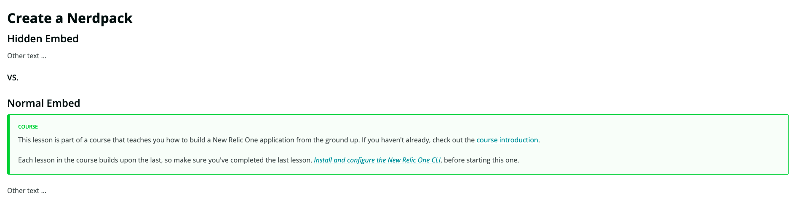

# Component Documentation

## Global Components

Refer to the [New Relic Gatsby Theme](https://github.com/newrelic/gatsby-theme-newrelic/blob/develop/packages/gatsby-theme-newrelic/README.md)
component documentation for details on all the components used on this site.

## Developer Site Components

Below are the components that are unique to the Developer Site. These components support patterns that are specific to the Developer Site and are not used by other sites.

## Intro

The `<Intro />` component provides formatting for the title and introduction of the markdown document.

### Usage

It takes the title provided in the front matter and accepts plain text for the description. An example of front matter that will have a title of **Example Guide**:

```
---
duration: 30
title: 'Example Guide'
template: 'GuideTemplate'
description: 'Example guide page'
---
```

It also accepts a `<Video />` component as a child, which it will place on the left side of the description.

This is a description for the markdown guide.

```html
<Video id="zxunt1u1as" type="youtube"/>
</Intro>
```

If there is a more than plain text and a `<Video />` (such as a code snippet or another component) the content will be posted on the left side below the description.

## Steps

The `<Steps />` is a required container for the individual `<Step />` components and will outnumber from top to bottom.

### Usage

The Steps component accepts `<Step/>` components as its children and will increment by the number of child components.

```md
<Steps>
<Step>

## Step 1

Step 1 description.
</Step>

<Step>

## Step 2

Step 2 description
</Step>

</Steps>
```

If there is markdown content not wrapped by a `<Step />` component, it will still auto-increment for that content, so be sure to wrap all content with the Step component. For example:

```md
<Steps>

<Step>
This will read as Step 1 of 3.
</Step>

This will display as is with no step counter.

<Step>
This will read as Step 3 of 3.
</Step>

</Steps>
```

## Step

### Usage

The `<Step />` component renders a single step in the series of steps. This is
meant to use in conjunction with `<Steps />`, so this component **MUST** be
wrapped by `<Steps />` to work properly. The following example will contain 2
steps:

```md
<Steps>
  <Step>Some information about step 1</Step>
  <Step>Some information about step 2</Step>
</Steps>
```

The previous example will interpret the text inside of the `<Step />` as plain
text. If you would like the `<Step />` component to interpret the text as
markdown content, include a line break after the opening tag:

```md
<Step>

# This is a title for the step.

This is some information about this step.
</Step>
```

You can intersperse code blocks inside of the step. Code snippets will always
render in a right column next to the description.

````md
<Step>

# A code example

Run the following command in your terminal:

```shell
yarn start
```

</Step>
````

You can include multiple code blocks in a single step. Code blocks will always
be rendered to the right of the text that precedes it.

````md
<Step>

# Another code example

Run the following in your terminal:

```shell
npm start
```

When that is running, edit index.js and replace the component with the following
code:

```js
return <div>Hello, {props.name}</div>;
```

</Step>
````

You can also use images in steps.

```md
<Step>

# Image example

A step description


</Step>
```

> Note: keep in mind that a new line is necessary after an `img` tag to ensure proper rendering of subsequent text/markdown.

# Tabs

You can use the `Tabs` component, and related sub-components to construct a tabbed interface. Along with the top-level `<Tab>` component, the following components are available:

* `<Tabs.Bar>` - A wrapper for all of the "tab" elements that the user can click on.
* `<Tabs.BarItem>` - An individual "tab" that the user can click on.
* `<Tabs.Pages>` - A wrapper for all the tab "pages" that the user can view.
* `<Tabs.Page>` - An individual "page" of information that is shown.

## Props

|Component|Prop|Required?|Type|Description|
|-|-|-|-|-|
|`Tabs.BarItem`|`id`|yes|string|A label to associate a tab with a page.|
|`Tabs.BarItem`|`count`|no|number|A numeric badge to display next to the tab.|
|`Tabs.BarItem`|`disabled`|no|boolean|Whether or not a user can interact with the tab.|
|`Tabs.Page`|`id`|yes|string|A label to associate a tab with a page.|

## Usage

```html
<Tabs>
  <Tabs.Bar>
    <Tabs.BarItem id="tacos">Tacos</Tabs.BarItem>
    <Tabs.BarItem id="nachos" count={70}>Nachos</Tabs.BarItem>
    <Tabs.BarItem id="burritos">Burritos</Tabs.BarItem>
    <Tabs.BarItem id="enchiladas" disabled>Enchiladas</Tabs.BarItem>
  </Tabs.Bar>

  <Tabs.Pages>
    <Tabs.Page id="tacos">This is a page talking about tacos</Tabs.Page>
    <Tabs.Page id="nachos">This is a page talking about nachos</Tabs.Page>
    <Tabs.Page id="burritos">This is a page talking about burritos</Tabs.Page>
  </Tab.Pages>
</Tabs>
```

An example of how it could be use

## Tutorial

### Usage

You can use the `Tutorial` component walk a user through changes in code by automatically highlighting the difference between each step.

### Define your starting codebase

First, use a `Project` component to define your starting codebase:

````md
<Tutorial>

<Project>

```jsx fileName=first-file.js
const myCode = "here is my first file"
```

```jsx fileName=second-file.js
const myCode = "here is my second file"
```

</Project>

</Tutorial>
````

In order to use the tutorial component, you must set a `fileName` for your codeblocks so that the parser can find the corresponding codeblocks with changes in them.

Note that you can set up multiple code files in your `Project` component. The parser will track changes in each of the codeblocks throughout the `Tutorial`. Each codeblock is presented in its own tab, which mimics how a user might actually edit these files in their IDE.

### Update code in tutorial steps

Use `Steps` to show changes to your starting files:

````md
<Tutorial>

<Project>

```jsx fileName=first-file.js
const myCode = "here is my first file"
```

```jsx fileName=second-file.js
const myCode = "here is my second file"
```

</Project>

## Here is my tutorial!

<Steps>

<Step>

Update your first file:

```jsx fileName=first-file.js
const myCode = "here is my first file"
const myNewCode = "here is my new code"
```

</Step>

<Step>

Update your second file:

```jsx fileName=second-file.js
const myCode = "here is my second file"
const myNewCode = "here is my new code"
```

</Step>

<Step>

Update your first file again:

```jsx fileName=first-file.js
const myCode = "here is my first file"
const myNewCode = "here is my new code"
const evenMoreNewCode = "here is even more new code"
```

</Step>

</Steps>

</Tutorial>
````

In the first step's rendered codeblock, the second line (`myNewCode`) in _first-file.js_ will be highlighted. In the second step, the second line (`myNewCode`) in _second-file.js_ will be highlighted. In the third step, the third line (`evenMoreNewCode`) in _first-file.js_ will be highlighted.

Even though a single file is highlighted in each step, all files are rendered in tabs for each step on the page. Your reader can then toggle between the files to see what the current state of the whole codebase is.

## Things to keep in mind

Here are some things to keep in mind when using the `Tutorial` component in your developer guides.

### Only change code in one file per step

While every file is shown in a tabulated codeblock in every step, you can only change code in one file per step. This is because when you include a file change in a `Tutorial` step, the file that was changed is presented first in the tabulated codeblock.

`Tutorial` doesn't know how to render a tabulated codeblock when multiple files are changed in the same step:

````md
<Tutorial>

<Project>

```jsx fileName=first-file.js
const myCode = "here is my first file"
```

```jsx fileName=second-file.js
const myCode = "here is my second file"
```

</Project>

## Here is my tutorial!

<Steps>

<Step>

Update your first file and second file in the same step:

```jsx fileName=first-file.js
const myCode = "here is my first file"
const myNewCode = "here is my new code"
```

```jsx fileName=second-file.js
const myCode = "here is my second file"
const myNewCode = "here is my new code"
```

</Step>

</Steps>

</Tutorial>
````

This won't render properly in your guide.

### `Tutorial` doesn't show subtractive changes

Some code diff tools show additive changes (you created a new line) and subtractive changes (you deleted a line). `Tutorial` doesn't call to attention any code deletions.

````md
<Tutorial>

<Project>

```jsx fileName=first-file.js
const myCode = "here is my first file"
const moreCode = "here is more code"
const evenMoreCode = "here is even more code"
```

</Project>

## Here is my tutorial!

<Steps>

<Step>

Delete `moreCode`:

```jsx fileName=first-file.js
const myCode = "here is my first file"
const evenMoreCode = "here is even more code"
```

</Step>

</Steps>

</Tutorial>
````

In this case, `Tutorial` will show _first-file.js_, but it won't indicate that the second constant (`moreCode`) was removed.

## HideWhenEmbedded

### Usage

You can use the `HideWhenEmbedded` component to hide content displayed for an embedded page.

When the page is not embedded, the content is displayed as normal.

You can hide any content with this component, including other components. This allows you to hide things like Callouts, which we will show you in an example below.

### Example

```md
## Hidden Embed
<HideWhenEmbedded>
<Callout variant="course">

This lesson is part of a course that teaches you how to build a New Relic One application from the ground up. If you haven't already, check out the [course introduction](/ab-test).

Each lesson in the course builds upon the last, so make sure you've completed the last lesson, [_Install and configure the New Relic One CLI_](/build-apps/ab-test/install-nr1), before starting this one.

</Callout>
</HideWhenEmbedded>

Other text ...

### VS.

## Normal Embed
<Callout variant="course">

This lesson is part of a course that teaches you how to build a New Relic One application from the ground up. If you haven't already, check out the [course introduction](/ab-test).

Each lesson in the course builds upon the last, so make sure you've completed the last lesson, [_Install and configure the New Relic One CLI_](/build-apps/ab-test/install-nr1), before starting this one.

</Callout>

Other text ...
```

You can see the difference in what is displayed below:



## A/B Experiments

### SuperTilesExperiment

### Usage

The `SuperTilesExperiment` component renders the `IOBanner` (control component) or the `GuidedInstallTile` and `CodeStreamTile` (treatment) components based on a `50% 50%` A/B test.

To include it:

```html
<SuperTilesExperiment />
# Render <IOBanner> for mobile devices
<SuperTilesExperiment isMobile={true} />
```

## Props

|Component|Prop|Required?|Type|Description|
|-|-|-|-|-|
|`SuperTilesExperiment`|`isMobile`|no|boolean|Specifies whether the `IOBanner` child component should be rendered for mobile devices.|

### SuperTile

### Usage

The `SuperTile` component is a wrapper component that can display a primary and secondary tile.

#### Primary

```html
<SuperTile type="primary">
  My content
</SuperTile>
```

#### Secondary

```html
<SuperTile>
  My content
</SuperTile>
```

### GuidedInstallTile

### Usage

The `GuidedInstallTile` component includes custom content relevant to the guided install flow in New Relic.

```html
<GuidedInstallTile />
```

### CodeStreamTile

### Usage

The `CodeStreamTile` component includes custom content relevant to New Relic CodeStream.

```html
<CodeStreamTile />
```
