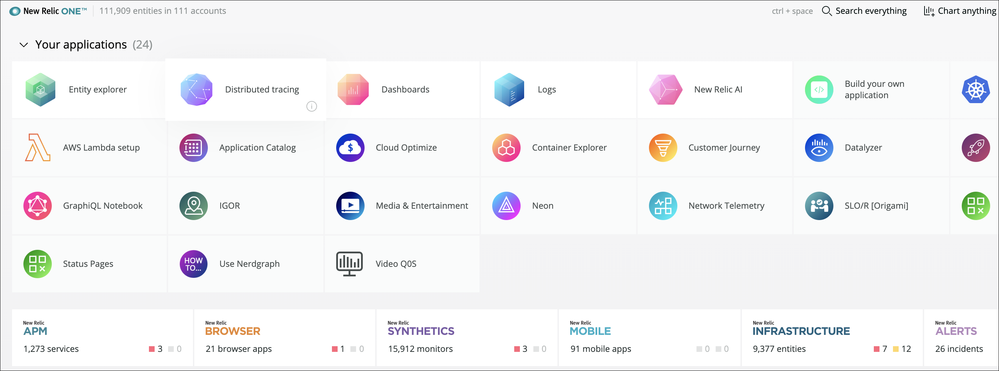
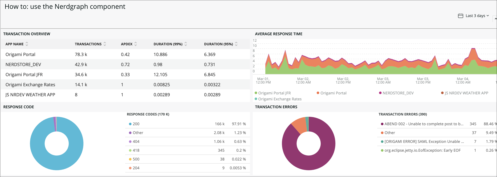
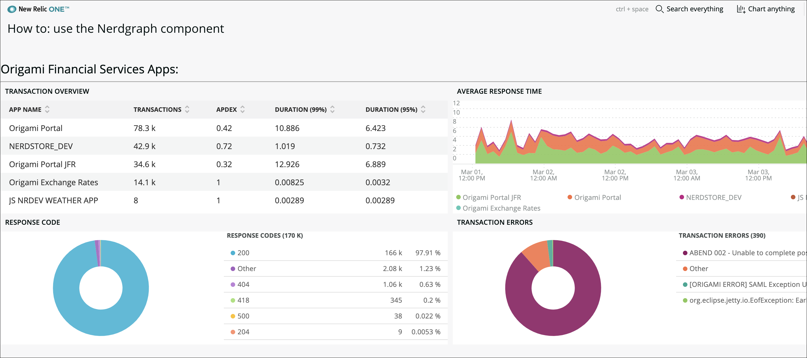
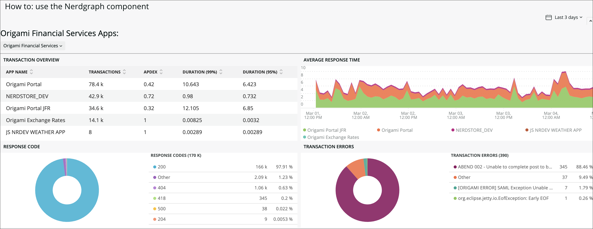

This guide steps you through the process of adding the NerdGraph component to a sample transaction overview application. This allows you to query data from your account and add it to a dropdown menu. 

NerdGraph is New Relic's GraphQl implementation. GraphQL has some key differences when compared to REST. For example, it's the client, not the server, that determines what data will be returned. Also, you can more easily collect data from multiple sources. In the case of New Relic, you can get all of the following in one GraphQL query:

* Account information
* Data about infrastructure
* Issue an NRQL request

| NOTE: To prototype GraphQL queries in New Relic, try our [NerdGraph API explorer](https://api.newrelic.com/graphiql)|
| :------------- |

Here's a 14 minute video of the steps that follow:

<Video id="zxunt1u1as" type="wistia"/>

## Before you begin

These steps require that you have the following:

- A GitHub account
- New Relic developer account
- API Key (the same key you set up in [Quick start](https://one.newrelic.com/launcher/developer-center.launcher?pane=eyJuZXJkbGV0SWQiOiJkZXZlbG9wZXItY2VudGVyLmRldmVsb3Blci1jZW50ZXIifQ==))
- The New Relic One [CLI](https://cli.nr-ext.net/installer.pkg) 


## Prepare the sample code

To get started, complete these steps to update the application UUID and run the sample application locally:

<Steps>

  <Step>

Clone the example applications from our [how-to GitHub repo](https://github.com/newrelic/nr1-how-to).

  </Step>

  <Step>

In your preferred text editor, open `/use-nerdgraphd/nerdlets/use-nerdgraph-nerdlet/index.js`.

  </Step>

  <Step>

Replace `<ADD YOUR ACCOUNT ID>` with your account id:

```js
this.accountId = <ADD YOUR ACCOUNT ID>;
```

| NOTE: Your account ID is viewable in the profile selection menu of the developer center (where you downloaded the New Relic One CLI). |
| :------------- |

</Step>

  <Step>

In the terminal, change to the `/nr1-howto/use-nerdgraph` directory.

```bash
cd /nr1-howto/use-nerdgraph
```
  </Step>

  <Step>

Execute these commands to update the UUID and serve the sample application:

```bash
nr1 nerdpack:uuid -gf
nr1 nerdpack:serve
```
  </Step>

  <Step>

Once the sample application is successfully served, go to the local New Relic One homepage: https://one.newrelic.com/?nerdpacks=local

  </Step>

  <Step>

Click ***Use NerdGraph***.

| NOTE: If you don't see any launchers, click ***Your applications***. |
| :------------- |



  </Step>

</Steps>


After launching the ***Use NerdGraph*** application, you see a dashboard that gives an overview of the transactions in your New Relic account.



## Add the `NerdGraphQuery` component

Now you can create a dropdown menu for changing the account the application is viewing. The first step is to import the `NerdGraphQuery` component into the application's `index.js` file.

| NOTE: If you need more details about our example below, see the APIs and components page on [https://developer.newrelic.com/client-side-sdk/index.html#data-fetching/NerdGraphQuery](https://developer.newrelic.com/client-side-sdk/index.html#data-fetching/NerdGraphQuery) |
| :------------- |

<Steps>
 
  <Step>

Add the `NerdGraphQuery` component into the first `StackItem` inside of the `return` in the `index.js` file:

```js
<NerdGraphQuery query={query} variables={variables}>
    {({loading, error, data}) => {
        console.log({loading, error, data})
        if (loading) {
            return <Spinner />;
        }
        if (error) {
            return 'Error!';
        }
        return null;
    }}
</NerdGraphQuery>
```

  </Step>

  <Step>

The `NerdGraphQuery` component takes query object that states the source you want to access and the data you want returned. 

Add the following code to your `index.js` file in the `render` method:

```js
const query = `
    query($id: Int!) {
        actor {
            account(id: $id) {
                name
            }
        }
    }
`;
```

| NOTE: In the browser console, you can see the data from your query returned in an object that follows the same structure of the object in the initial query. |
| :------------- |


  </Step>

  <Step>

To take the data returned by the NerdGraph query and display it in the application, replace the `return null` in the current `NerdGraphQuery` component with this `return` statement:

```js
return <HeadingText>{data.actor.account.name} Apps:</HeadingText>; 
```
  </Step>

</Steps>

When you go back to the browser and view your application, you see a new headline showing the name of your account returned from NerdGraph.



## How to use `NerdGraphQuery.query`

At this point, you implemented the NerdGraphQuery component with the application's `render` method and displayed the return data within the transaction overview application.

Here's what you need to do next:

* Make it possible to query NerdGraph outside of the `render` method.
* Save the returned data for later usage throughout the New Relic One application. 

To do this, use the `NerdGraphQuery.query` method within the `componentDidMount` react lifecycle method.

<Steps>

  <Step>

The following code takes the response from NerdGraph and makes sure the results are processed, stored into the application state, and logged to the browser console for viewing. 

Add the following code into the `index.js` just under the `constructor`: 

```js
componentDidMount(){
    const accountId = this.state;
    const gql = `{ actor { accounts { id name } } }`;

    const accounts = NerdGraphQuery.query({query: gql}) 
    accounts.then(results => {
        console.log('Nerdgraph Response:', results);
        const accounts = results.data.actor.accounts.map(account => {
            return account;
        });
        const account = accounts.length > 0 && accounts[0];
        this.setState({ selectedAccount: account, accounts });
    }).catch((error) => { console.log('Nerdgraph Error:', error); })
}
```

  </Step>

  <Step>

After the data is stored into state, display a selection so users can change accounts and update the application. 

To do this, add the following code to `index.js` for the second `StackItem` in the `return` statement:

```js
{accounts &&
    <StackItem>
        <Select value={selectedAccount} onChange={(evt, value) => this.selectAccount(value)}>
        {accounts.map(a => {
            return <SelectItem key={a.id} value={a}>
            {a.name}
            </SelectItem>
        })}
        </Select>
    </StackItem>
}
```
  </Step>

</Steps>

After you complete these steps, look at the application in your browser, and note the following:

* The dropdown menu displays the data returned from the `NerdGraphQuery.query` and allows you to select an account. 
* After you select a new account, the application shows data from the new selection.



The final `index.js` file should have code similar to the code below. This completed sample code is in your nerdlet `final.js`.

```js
import React from 'react';
import { PlatformStateContext, NerdGraphQuery, Spinner, HeadingText, Grid, GridItem, Stack, StackItem, Select, SelectItem, AreaChart, TableChart, PieChart } from 'nr1'
import { timeRangeToNrql } from '@newrelic/nr1-community';

// https://docs.newrelic.com/docs/new-relic-programmable-platform-introduction

export default class UseNerdgraphNerdletNerdlet extends React.Component {
    constructor(props){
        super(props)
        this.state = {
            accountId: <YOUR ACCOUNT ID>,
            accounts: null,
            selectedAccount: null,
        }
    }

    componentDidMount(){
        const accountId = this.state;
        const gql = `{ actor { accounts { id name } } }`;

        const accounts =  NerdGraphQuery.query({query: gql})
        accounts.then(results => {
            console.log('Nerdgraph Response:', results);
            const accounts = results.data.actor.accounts.map(account => {
                return account;
            });
            const account = accounts.length > 0 && accounts[0];
            this.setState({ selectedAccount: account, accounts });
        }).catch((error) => { console.log('Nerdgraph Error:', error); })
    }

    selectAccount(option) {
        this.setState({ accountId: option.id,selectedAccount: option });
    }


    render() {
        const { accountId, accounts, selectedAccount  } = this.state;
        console.log({accountId, accounts, selectedAccount});

        const query = `
            query($id: Int!) {
                actor {
                    account(id: $id) {
                        name
                    }
                }
            }
        `;

        const variables = {
        id: accountId,
        };

        const avgResTime = `SELECT average(duration) FROM Transaction FACET appName TIMESERIES AUTO `;
        const trxOverview = `FROM Transaction SELECT count(*) as 'Transactions', apdex(duration) as 'apdex', percentile(duration, 99, 95) FACET appName `;
        const errCount = `FROM TransactionError SELECT count(*) as 'Transaction Errors' FACET error.message `;
        const responseCodes = `SELECT count(*) as 'Response Code' FROM Transaction FACET httpResponseCode `;

        return (
            <Stack
                fullWidth
                horizontalType={Stack.HORIZONTAL_TYPE.FILL}
                gapType={Stack.GAP_TYPE.EXTRA_LOOSE}
                spacingType={[Stack.SPACING_TYPE.MEDIUM]}
                directionType={Stack.DIRECTION_TYPE.VERTICAL}>
                <StackItem>
                    <NerdGraphQuery query={query} variables={variables}>
                        {({loading, error, data}) => {
                            if (loading) {
                                return <Spinner />;
                            }

                            if (error) {
                                return 'Error!';
                            }

                            return <HeadingText>{data.actor.account.name} Apps:</HeadingText>;
                        }}
                    </NerdGraphQuery>
                </StackItem>
                {accounts &&
                    <StackItem>
                        <Select value={selectedAccount} onChange={(evt, value) => this.selectAccount(value)}>
                        {accounts.map(a => {
                            return <SelectItem key={a.id} value={a}>
                            {a.name}
                            </SelectItem>
                        })}
                        </Select>
                    </StackItem>
                }
                <StackItem>
                <hr />
                    <PlatformStateContext.Consumer>
                    {(PlatformState) => {
                        /* Taking a peek at the PlatformState */
                        const since = timeRangeToNrql(PlatformState);
                        return (
                        <>
                            <Grid
                            className="primary-grid"
                            spacingType={[Grid.SPACING_TYPE.NONE, Grid.SPACING_TYPE.NONE]}
                            >
                                <GridItem className="primary-content-container" columnSpan={6}>
                                    <main className="primary-content full-height">
                                    <HeadingText spacingType={[HeadingText.SPACING_TYPE.MEDIUM]} type={HeadingText.TYPE.HEADING_4}>
                                        Transaction Overview
                                    </HeadingText>
                                    <TableChart fullWidth accountId={accountId} query={trxOverview+since} />
                                    </main>
                                </GridItem>
                                <GridItem className="primary-content-container" columnSpan={6}>
                                    <main className="primary-content full-height">
                                    <HeadingText spacingType={[HeadingText.SPACING_TYPE.MEDIUM]} type={HeadingText.TYPE.HEADING_4}>
                                        Average Response Time
                                    </HeadingText>
                                    <AreaChart fullWidth accountId={accountId} query={avgResTime+since} />
                                    </main>
                                </GridItem>
                                <GridItem className="primary-content-container" columnSpan={6}>
                                    <main className="primary-content full-height">
                                    <HeadingText spacingType={[HeadingText.SPACING_TYPE.MEDIUM]} type={HeadingText.TYPE.HEADING_4}>
                                        Response Code
                                    </HeadingText>
                                    <PieChart fullWidth accountId={accountId} query={responseCodes+since} />
                                    </main>
                                </GridItem>
                                <GridItem className="primary-content-container" columnSpan={6}>
                                    <main className="primary-content full-height">
                                    <HeadingText spacingType={[HeadingText.SPACING_TYPE.MEDIUM]} type={HeadingText.TYPE.HEADING_4}>
                                        Transaction Errors
                                    </HeadingText>
                                    <PieChart fullWidth accountId={accountId} query={errCount+since} />
                                    </main>
                                </GridItem>
                            </Grid>
                        </>
                        );
                    }}
                    </PlatformStateContext.Consumer>
                </StackItem>
            </Stack>
        )
    }
}

```

## Summary

If you completed all the steps in this example, you successfully queried data from your account using the `NerdGraphQuery` component. The `NerdGraphQuery.query` method allowed you to separate data queries from visualization. For more experience querying your data with NerdGraph, experiment with New Relic's [NerdGraph API explorer](https://api.newrelic.com/graphiql).

## Related information

- [New Relic documentation](https://docs.newrelic.com)


