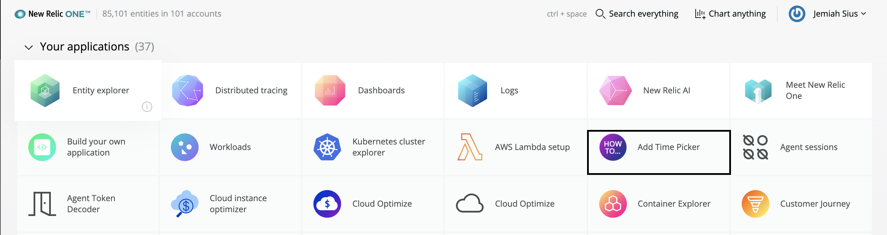
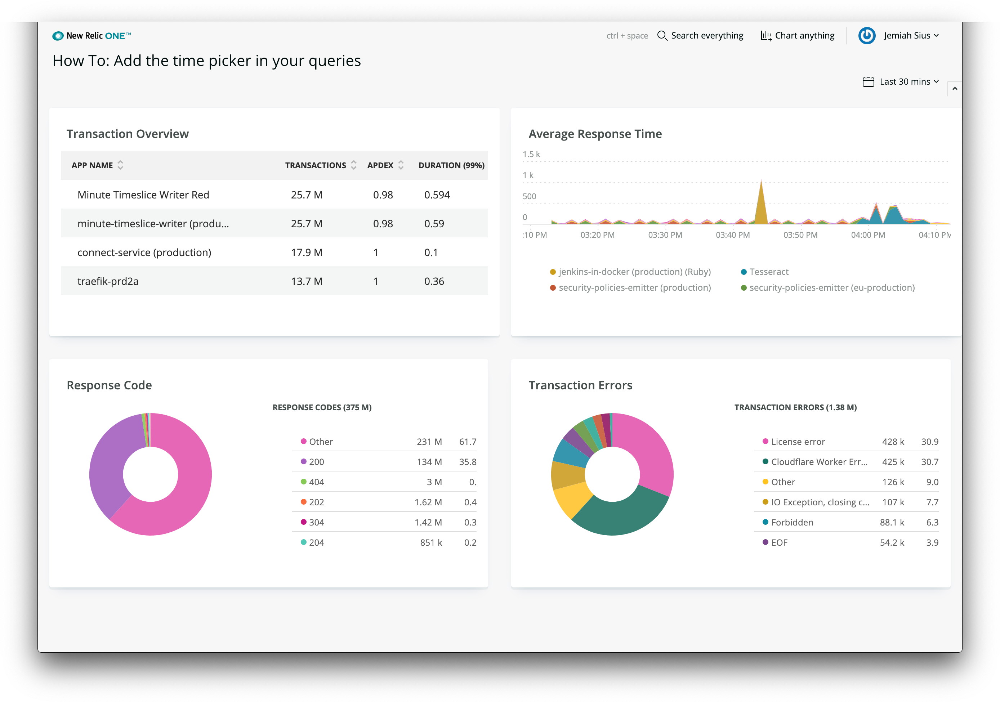
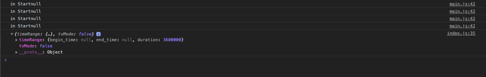

This guide steps you through the process of adding access to the New Relic time picker in the sample transaction overview application. 

The sample application provides an overview of the telemetry data showing your account's transactions by application, average response time, HTTP response codes, and transaction errors. When you enable the time picker, users can specify the time range of data to view.

Here's a short video of the steps that follow:

<Video id="inyshp3m7r" type="wistia"/>

## Before you begin

This guide requires that you have the following:

- A github account
- New Relic developer account
- API Key (The same key you set up in [Quick start](https://one.newrelic.com/launcher/developer-center.launcher?pane=eyJuZXJkbGV0SWQiOiJkZXZlbG9wZXItY2VudGVyLmRldmVsb3Blci1jZW50ZXIifQ==)
- The New Relic One [CLI](https://cli.nr-ext.net/installer.pkg) 

<Steps>


## Prepare the time picker sample code

To get started, complete these steps to update the application UUID and run the sample application locally:

    <Step>

Clone the time picker from our how-to [GitHub](https://github.com/newrelic/nr1-how-to/tree/master/add-time-picker) repository.

</Step>

<Step>

In your preferred text editor, open `/add-time-picker/nerdlets/nr1-howto-add-time-picker-nerdlet/index.js`.

Replace `<ADD YOUR ACCOUNT ID>` with your account id:

```js
this.accountId = <ADD YOUR ACCOUNT ID>;
```

| NOTE: Your account ID is viewable in the profile selection menu of the developer center (where you downloaded the New Relic One CLI). |
| :------------- |

</Step>

<Step>

In your terminal, change to the `add-time-picker` directory:

```
cd /nr1-howto/add-time-picker
```
Execute these commands to update the UUID and serve the sample application.

```
nr1 nerdpack:uuid -gf
nr1 nerdpack:serve
```
</Step>

<Step>

Once the sample application is successfully served, go to the local New Relic One homepage: https://one.newrelic.com/?nerdpacks=local

</Step>

<Step>

Click ***Add Time Picker***:

| NOTE: If you don't see any launchers, click ***Your applications***. |
| :------------- |



</Step>

</Steps>

After launching the **Add Time Picker** application, you see a dashboard that gives an overview of the transactions in your New Relic account:



By default, the application shows your data within the last 60 minutes. If you toggle the time picker, it doesn't update the charts because the transaction overview application isn't connected to the New Relic One platform. It has no access to the data from the time picker. In the following sections, you'll add the time picker to the example application and add the time to the queries.

</Step>

<Steps>

## Import a new component

The first step in adding the time picker is to import the `PlatformStateContext` component. 

| NOTE: If you need more details about our example below, see the APIs and components page on [https://developer.newrelic.com](https://developer.newrelic.com/client-side-sdk/index.html#apis/PlatformStateContext) |
| :------------- |

Here's what the `PlatformStateContext` component does:

* Wraps all of the code within the return statement of the render method
* Makes a function call passing in the New Relic platform state
* Returns all of the code within our current return statement

Complete these steps:

<Step>

In a text editor, open `/add-time-picker/nerdlets/nr1-howto-add-time-picker-nerdlet/index.js`.

</Step>

<Step>

Add the `PlatformStateContext` component to the end of the import statement so it looks like this:

```js
import {
  Grid,
  GridItem,
  HeadingText,
  AreaChart,
  TableChart,
  PieChart,
  PlatformStateContext
} from 'nr1';
```
</Step>

<Step>
    
Just below the current `return` insert this code for the `PlatformStateContext` component:

```js
<PlatformStateContext.Consumer>
    {(platformState) => {
return (
// ADD THE CURRENT RETURN CODE HERE
)
}}
</PlatformStateContext.Consumer>
```

</Step>

Move the current application code so it is under the `return` of the `PlatformState` function call. The `return` statement should now look like this:

```js
return (
    <PlatformStateContext.Consumer>
        {(PlatformState) => {
            return (
            <>
                <Grid
                className="primary-grid"
                spacingType={[Grid.SPACING_TYPE.NONE, Grid.SPACING_TYPE.NONE]}
                >
                    <GridItem className="primary-content-container" columnSpan={6}>
                        <main className="primary-content full-height">
                        <HeadingText spacingType={[HeadingText.SPACING_TYPE.MEDIUM]} type={HeadingText.TYPE.HEADING_4}>
                            Transaction Overview
                        </HeadingText>
                        <TableChart fullWidth accountId={this.accountId} query={trxOverview} />
                        </main>
                    </GridItem>
                    <GridItem className="primary-content-container" columnSpan={6}>
                        <main className="primary-content full-height">
                        <HeadingText spacingType={[HeadingText.SPACING_TYPE.MEDIUM]} type={HeadingText.TYPE.HEADING_4}>
                            Average Response Time
                        </HeadingText>
                        <AreaChart fullWidth accountId={this.accountId} query={avgResTime} />
                        </main>
                    </GridItem>
                    <GridItem className="primary-content-container" columnSpan={6}>
                        <main className="primary-content full-height">
                        <HeadingText spacingType={[HeadingText.SPACING_TYPE.MEDIUM]} type={HeadingText.TYPE.HEADING_4}>
                            Response Code
                        </HeadingText>
                        <PieChart fullWidth accountId={this.accountId} query={responseCodes} />
                        </main>
                    </GridItem>
                    <GridItem className="primary-content-container" columnSpan={6}>
                        <main className="primary-content full-height">
                        <HeadingText spacingType={[HeadingText.SPACING_TYPE.MEDIUM]} type={HeadingText.TYPE.HEADING_4}>
                            Transaction Errors
                        </HeadingText>
                        <PieChart fullWidth accountId={this.accountId} query={errCount} />
                        </main>
                    </GridItem>
                </Grid>
            </>
            );
        }}
    </PlatformStateContext.Consumer>
);
```

</Step>

<Step>
    
Add a `console.log` statement to make sure you are seeing appropriate data. Insert the following code inside the `PlatformState` return statement just before the opening tag for the `<Grid>` component:

```js
/* Taking a peek at the PlatformState */
console.log(PlatformState);
```

</Step>

</Steps>

After you complete these steps, your browser console displays something like this:




<Steps>

## Add the time to the queries

In your console, you should see some data from the New Relic platform state. Now you are ready to add `timeRange` data to update the charts in the transaction overview application.

This step requires you to import the `timeRangeToNrql` utility method from the New Relic One community library.  

| NOTE: You can get more details on the New Relic One community library from our [GitHub repo](https://github.com/newrelic/nr1-community). |
| :------------- |

This helper method takes your `PlatformState.timeRange` duration data, formats it from milliseconds, and returns a formatted `SINCE` statement to add to your `NRQL`. 

<Step>

Import the `timeRangeToNrql` method by inserting this line of code below the other `import` sections:

```js
import { timeRangeToNrql } from '@newrelic/nr1-community';
```
| NOTE: You don't need to include the `AccountDropdown` from the community import example. |
| :------------- |

</Step>

<Step>

Pass the `PlatformState` to the `timeRangeToNrql` helper, and save its output as a `since` statement for later use.

```js
const since = timeRangeToNrql(PlatformState);
```
</Step>

<Step>

After creating the `since` variable, go through the code in the `PlatformStateContext` return statement and concatenate the `since` variable to each of the existing chart component queries. Here's a `TableChart` example:

```js
<TableChart fullWidth accountId={this.accountId} query={trxOverview+since} />
```

</Step>

<Step>
    
After you update all of the chart components, confirm that the final `index.js` file looks similar to this:

| NOTE: This completed sample code is in your `nerdlet final.js`. |
| :------------- |


```js
import React from 'react';
import {
  PlatformStateContext,
  Grid,
  GridItem,
  HeadingText,
  AreaChart,
  TableChart,
  PieChart
} from 'nr1';
import { timeRangeToNrql } from '@newrelic/nr1-community';

// https://docs.newrelic.com/docs/new-relic-programmable-platform-introduction

export default class Nr1HowtoAddTimePicker extends React.Component {
    constructor(props){
        super(props)
        this.accountId = 1;
    }
    render() {
        const avgResTime = `SELECT average(duration) FROM Transaction FACET appName TIMESERIES AUTO `;
        const trxOverview = `FROM Transaction SELECT count(*) as 'Transactions', apdex(duration) as 'apdex', percentile(duration, 99, 95) FACET appName `;
        const errCount = `FROM TransactionError SELECT count(*) as 'Transaction Errors' FACET error.message `;
        const responseCodes = `SELECT count(*) as 'Response Code' FROM Transaction FACET httpResponseCode `;

        return (
            <PlatformStateContext.Consumer>
                {(PlatformState) => {
                    /* Taking a peek at the PlatformState */
                    console.log(PlatformState)

                    const since = timeRangeToNrql(PlatformState);
                    console.log(since);

                    return (
                    <>
                        <Grid
                        className="primary-grid"
                        spacingType={[Grid.SPACING_TYPE.NONE, Grid.SPACING_TYPE.NONE]}
                        >
                            <GridItem className="primary-content-container" columnSpan={6}>
                                <main className="primary-content full-height">
                                <HeadingText spacingType={[HeadingText.SPACING_TYPE.MEDIUM]} type={HeadingText.TYPE.HEADING_4}>
                                    Transaction Overview
                                </HeadingText>
                                <TableChart fullWidth accountId={this.accountId} query={trxOverview+since} />
                                </main>
                            </GridItem>
                            <GridItem className="primary-content-container" columnSpan={6}>
                                <main className="primary-content full-height">
                                <HeadingText spacingType={[HeadingText.SPACING_TYPE.MEDIUM]} type={HeadingText.TYPE.HEADING_4}>
                                    Average Response Time
                                </HeadingText>
                                <AreaChart fullWidth accountId={this.accountId} query={avgResTime+since} />
                                </main>
                            </GridItem>
                            <GridItem className="primary-content-container" columnSpan={6}>
                                <main className="primary-content full-height">
                                <HeadingText spacingType={[HeadingText.SPACING_TYPE.MEDIUM]} type={HeadingText.TYPE.HEADING_4}>
                                    Response Code
                                </HeadingText>
                                <PieChart fullWidth accountId={this.accountId} query={responseCodes+since} />
                                </main>
                            </GridItem>
                            <GridItem className="primary-content-container" columnSpan={6}>
                                <main className="primary-content full-height">
                                <HeadingText spacingType={[HeadingText.SPACING_TYPE.MEDIUM]} type={HeadingText.TYPE.HEADING_4}>
                                    Transaction Errors
                                </HeadingText>
                                <PieChart fullWidth accountId={this.accountId} query={errCount+since} />
                                </main>
                            </GridItem>
                        </Grid>
                    </>
                    );
                }}
            </PlatformStateContext.Consumer>
        );
    }
}
```

</Step>

</Steps>

## Summary

If you completed all the steps in this example, you successfully implemented the time picker into your application by importing the `PlatformStateContext` component and accessing its `timePicker` data object. To continue your learning, take a look at our [self-paced workshop on Github](https://github.com/newrelic/nr1-workshop).

 


### Related info

- [New Relic documentation](https://docs.newrelic.com)
- [Community page for how to add a time picker](https://discuss.newrelic.com/t/how-to-add-the-time-picker-to-nrql-queries/94268)
