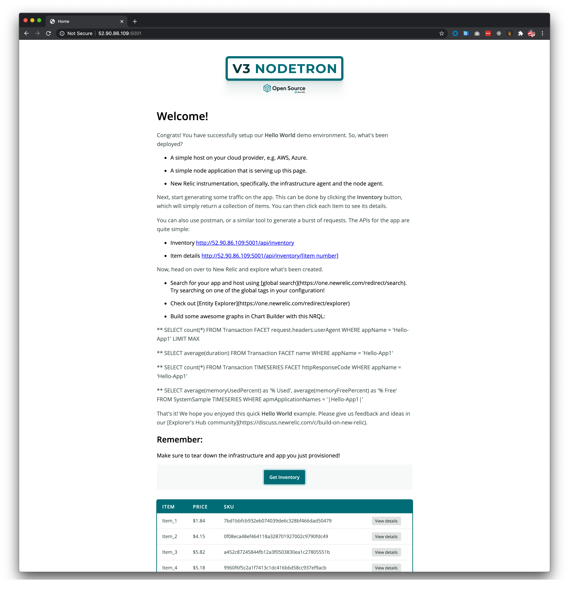
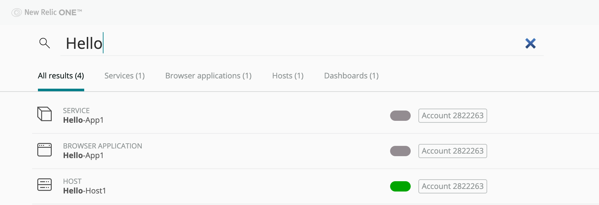
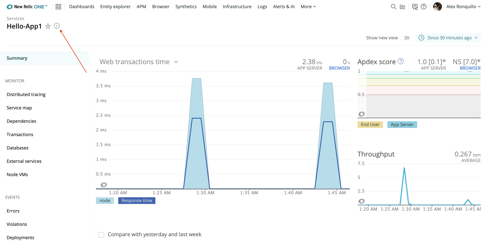
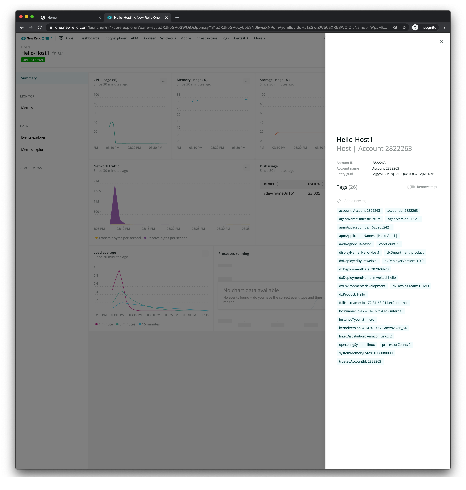

<Intro>

Organizing your services, hosts, and applications in New Relic can be challenging, especially as resources come and go. One strategy to overcome this challenge is to apply [tags](https://docs.newrelic.com/docs/new-relic-one/use-new-relic-one/core-concepts/tagging-use-tags-organize-group-what-you-monitor), consistently, across your stack.

In this guide, you:

- Provision a host on AWS
- Deploy a small Node.js app on that host
- Instrument the host and the application with New Relic agents
- Apply consistent tags across all your [entities](https://docs.newrelic.com/docs/new-relic-one/use-new-relic-one/core-concepts/what-entity-new-relic)
- Tear down everything you make when you're done

The next section introduces you to tools for performing tasks in this guide.

</Intro>

## Before you begin

Throughout this guide, you use three open source projects to automatically set up, instrument, and tear down your infrastructure:

- [Demo Deployer](https://github.com/newrelic/demo-deployer): The engine that drives the automation
- [Demo Nodetron](https://github.com/newrelic/demo-nodetron): A Node.js app that you run on your host. It presents a web page and an API, which you use to generate traffic.
- [Demo New Relic Instrumentation](https://github.com/newrelic/demo-newrelic-instrumentation): A project that instruments your host and application

Each project is distinct, and encapsulates its own behavior. This maintains a separation of concerns and allows you to compose complex scenarios using a modular approach.

<Callout variant="tip" title="Collaborate with us">

The Demo Deployer is currently in development. Because of our commitment to open source, we are working in the open early in the process and invite you to collaborate with us. Drop any thoughts and comments in the [Build on New Relic](https://discuss.newrelic.com/c/build-on-new-relic) support thread, and let us know what you think!

</Callout>

The last thing you need before you get started is to install [Docker](https://docs.docker.com/get-docker/) if you don't have it already.

Now that you have a high-level understanding of the tools you'll use, you can begin by pulling the Demo Deployer!

<Steps>

<Step>

## Pull the deployer locally

Pull the `deployer` Docker image from our GitHub Container Registry:

```shell
docker pull ghcr.io/newrelic/deployer:latest
```

Now, you have a local Docker image, named `deployer`, which you use throughout the rest of this guide.

</Step>

<Step>

## Configure your credentials

In this guide, you provision a host on AWS. The deployer uses a configuration file that contains your credentials for each service it communicates with so that it can invoke the necessary APIs.

You can follow the [User Config documentation](https://github.com/newrelic/demo-deployer/blob/main/documentation/user_config/README.md) in the deployer repository to set up each account and create your configuration file. In the end, you'll have a JSON file that contains credentials for [AWS](https://github.com/newrelic/demo-deployer/blob/main/documentation/user_config/credentials/aws/README.md), [New Relic](https://github.com/newrelic/demo-deployer/blob/main/documentation/user_config/credentials/newrelic/README.md), and [GitHub](https://github.com/newrelic/demo-deployer/blob/main/documentation/user_config/credentials/git/README.md):

```json
{
  "credentials": {
    "aws": {
      "apiKey": "my_aws_api_key",
      "secretKey": "my_aws_secret_key",
      "secretKeyPath": "/path/to/my/secretkey.pem",
      "region": "my_aws_region"
    },
    "newrelic": {
      "licenseKey": "my_new_relic_license_key",
      "accountId": "my_new_relic_account_id"
    },
    "git": {
      "username": "my_git_access_token"
    }
  }
}
```

Name the credentials file `creds.json`, and store it—along with your `[keypair filename].pem` file—in a directory called `$HOME/configs`.

</Step>

<Step>

## Run the application

Now that everything is set up, you can run the deployer application in a Docker container:

```shell
docker run -it\
    -v $HOME/configs/:/mnt/deployer/configs/\
    --entrypoint ruby ghcr.io/newrelic/deployer main.rb -c configs/creds.json -d https://raw.githubusercontent.com/newrelic/demo-catalog/main/catalog/hello/hello.aws.json
```

With this command, you're running the `deployer` Docker container with the following options:

- `-v` mounts the `$HOME/configs` volume (where you stored your configuration files) at `/mnt/deployer/configs/` in the container
- `--entrypoint` sets the default command for Docker to `ruby`

Finally, you pass a list of arguments to the entrypoint, including:

- `-c configs/creds.json`: The user credentials configuration file
- `-d https://raw.githubusercontent.com/newrelic/demo-catalog/main/catalog/hello/hello.aws.json`: The [deployment configuration file](https://github.com/newrelic/demo-deployer/tree/main/documentation/deploy_config)

<Callout variant="tip">

You can specify the log level for the deployer using `-l`. `info` is the default, but you can also use `debug` or `error`. This is a helpful option to use when something goes wrong.

</Callout>

Once you run this command, the deployer will create and instrument some specific resources. This may take a few minutes. In the meantime, read on to learn more about what is actually happening during this process.

#### Locating the user configuration files

Notice, in the Docker command, that `-c` takes `configs/creds.json`. Also, you referenced your `.pem` file from `configs/`, as well.

This is because you mounted `$HOME/configs` to `/mnt/deployer/configs/` and `/mnt/deployer/` is the working directory, according to the [deployer's Dockerfile](https://github.com/newrelic/demo-deployer/blob/main/Dockerfile#L31). So, you can access your user configuration files at `configs/`, which is a relative path from your working directory.

#### Understanding the deployment configuration file

The deployment configuration file, [hello.aws.json](https://raw.githubusercontent.com/newrelic/demo-catalog/main/catalog/hello/hello.aws.json), which drives the deployer, contains four sections:

- `services`
- `global_tags`
- `resources`
- `instrumentations`

These sections describe the actions the deployer executes.

The first section is `services`:

```json
{
  "services": [
    {
      "id": "app1",
      "display_name": "Hello-App1",
      "source_repository": "-b main https://github.com/newrelic/demo-nodetron.git",
      "deploy_script_path": "deploy/linux/roles",
      "port": 5001,
      "destinations": ["host1"],
      "files": [
        {
          "destination_filepath": "engine/data/index.json",
          "content": <some content>
        }
      ]
    }
  ]
}
```

`services` defines one service, `app1`, which lives on `host1` at port `5001`. It uses the Demo Nodetron you learned about earlier in this guide as its source.

<Callout variant="important">

In this example, some HTML has been removed for clarity. To run the deployer, you need to use the real content in `hello.json`.

</Callout>

The second section is `global_tags`:

```json
{
  "global_tags": {
    "dxOwningTeam": "DemoX",
    "dxEnvironment": "development",
    "dxDepartment": "Area51",
    "dxProduct": "Hello"
  }
}
```

`global_tags` defines tags for the deployer to apply to _all_ the resources in your stack. These tags are an important part of organizing your New Relic entities.

The third section is `resources`:

```json
{
  "resources": [
    {
      "id": "host1",
      "display_name": "Hello-Host1",
      "provider": "aws",
      "type": "ec2",
      "size": "t3.micro"
    }
  ]
}
```

`resources` defines one host, `host1`, which is a small EC2 instance on AWS. This host is referred to in the `services` section.

The fourth, and final, section is `instrumentations`:

```json
{
  "instrumentations": {
    "resources": [
      {
        "id": "nr_infra",
        "resource_ids": ["host1"],
        "provider": "newrelic",
        "source_repository": "-b main https://github.com/newrelic/demo-newrelic-instrumentation.git",
        "deploy_script_path": "deploy/linux/roles",
        "version": "1.12.1"
      }
    ],
    "services": [
      {
        "id": "nr_node_agent",
        "service_ids": ["app1"],
        "provider": "newrelic",
        "source_repository": "-b main https://github.com/newrelic/demo-newrelic-instrumentation.git",
        "deploy_script_path": "deploy/node/linux/roles",
        "version": "6.11.0"
      }
    ]
  }
}
```

`instrumentations` configures, as the name implies, New Relic instrumentations for the `host1` infrastructure and the `app1` Node.js application. These definitions use the Demo New Relic Instrumentation project you learned about earlier.

</Step>

<Step>

## Generate some traffic

When deployer has run successfully, you will see a message that describes the resources deployed and services installed during the process:

```shell copyable=false
[output] {muted}[INFO] Executing Deployment
[output] [{green}✔{plain}] Parsing and validating Deployment configuration success
[output] [{green}✔{plain}] Provisioner success
[output] [{green}✔{plain}] Installing On-Host instrumentation success
[output] [{green}✔{plain}] Installing Services and instrumentations success
[output] {muted}[INFO] Deployment successful!
[output]
[output] Deployed Resources:
[output]
[output]   host1 (aws/ec2):
[output]     ip: {blue}52.90.86.109
[output]     services: [{green}"app1"{plain}]
[output]     instrumentation:
[output]        nr_infra: newrelic v1.12.1
[output]
[output] Installed Services:
[output]
[output]   app1:
[output]     url: {blue}http://52.90.86.109:5001
[output]     instrumentation:
[output]        nr_node_agent: newrelic v6.11.0
[output]
[output] Completed at {timestamp}2020-08-20 15:11:14 +0000
```

Visit your application by navigating to the `app1` url in your browser:



From there, you can follow the instructions to send traffic to New Relic.

<Callout variant="important">

Your `app1` url will be different than the url shown in this guide.

</Callout>

</Step>

<Step>

## Check your tags

After you've generated some traffic to your Node.js application, use the New Relic [search redirect](https://one.newrelic.com/redirect/search/Hello) to find the resources you deployed:



Once you have found your resources, select the service you deployed, `Hello-App1`.

Then, click on the 'i' icon next to the name, which opens the _metadata and tags_ modal:



Notice that all the tags in the `global_tags` section of the deployment configuration show up under _Tags_:



If you open the metadata modal for the host, you'll also see the `global_tags`.

</Step>

<Step>

## Tear down your resources

Because you've provisioned resources in your cloud account, you need to decommission them. You can do this with the deployer.

Add the _teardown_ flag, `-t`, to the end of your command:

```shell
docker run -it\
    -v $HOME/configs/:/mnt/deployer/configs/\
    --entrypoint ruby ghcr.io/newrelic/deployer main.rb -c configs/creds.json -d https://raw.githubusercontent.com/newrelic/demo-catalog/main/catalog/hello/hello.aws.json -t
```

When the deployer has finished successfully, you'll see output that is similar to what you saw during deployment:

```shell copyable=false
[output] {muted}[INFO] Executing Teardown
[output] [{green}✔{plain}] Parsing and validating Teardown configuration success
[output] [{green}✔{plain}] Provisioner success
[output] [{green}✔{plain}] Uninstalling On-Host instrumentation success
[output] [{green}✔{plain}] Uninstalling Services and instrumentations success
[output] [{green}✔{plain}] Terminating infrastructure success
[output] {muted}[INFO] Teardown successful!
```

</Step>

</Steps>

## Next steps

Congratulations! Throughout this guide, you used the Demo Deployer to provision and instrument a host and application in AWS and automatically configured those entities with a list of tags.

Next, try creating your own deployment configuration and change the global tags! One cool thing you can do is pass in a configuration file URL to the deployer.

Here's one that uses a gist on GitHub:

```shell
docker run -it\
    -v $HOME/configs/:/mnt/deployer/configs/\
    --entrypoint ruby ghcr.io/newrelic/deployer main.rb -c configs/creds.json -d https://gist.githubusercontent.com/markweitzel/d281fde8ca572ced6346dc25470790a5/raw/373166eb50929a0dd23ba5136abf2fa5caf3d369/MarksHelloDemoConfig.json
```
