<Callout variant="course" title="lab">

This procedure is part of a lab that teaches you how to diagnose common issues using New Relic.

Each procedure in the lab builds upon the last, so make sure you've completed the last procedure, [_Diagnose high response time_](/automate-workflows/diagnose-problems/high-response-times), before starting this one.

</Callout>

In this procedure, you use New Relic to understand why some services are raising alerts.

## Diagnose error alerts in Telco Lite

<Steps>

<Step>

Log in to [New Relic One](https://one.newrelic.com) and select **APM** from the top navigation menu to see an overview of all Telco Lite services including the service names, response times, and throughputs. Notice that **Telco-Login Service** and **Telco-Web Portal** have opened critical violations for high error percentages:

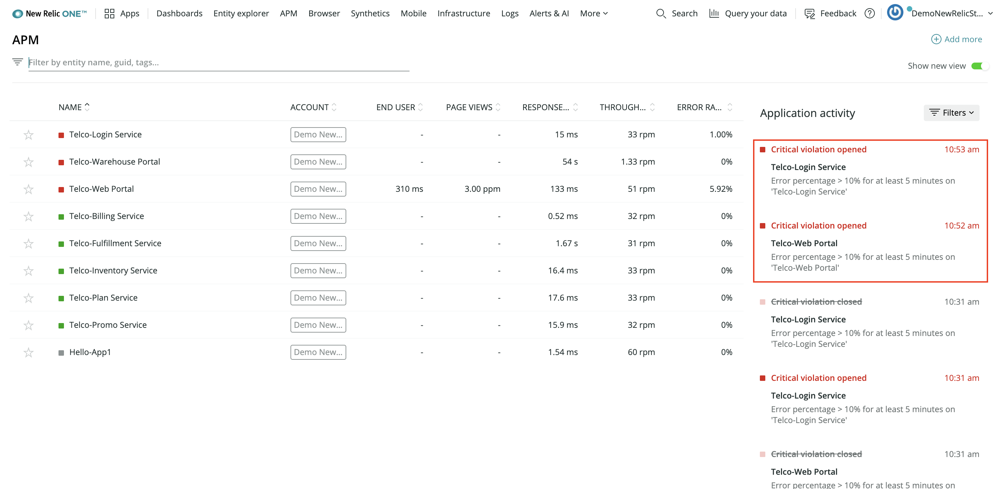

<Callout variant="tip">

If you don't see all the same alerts, don't worry. The simulated issues happen at regular intervals, so you should start seeing these problems in New Relic within 30 minutes to an hour.

</Callout>

The deployment created an alert condition for cases where a service's error percentage rises above 10% for 5 minutes or longer. A critical violation means that the service's conditions violate that threshold.

Begin your investigation by selecting the **Telco-Web Portal** service name.

</Step>

<Step>

Select the **Telco-Web Portal** service name:

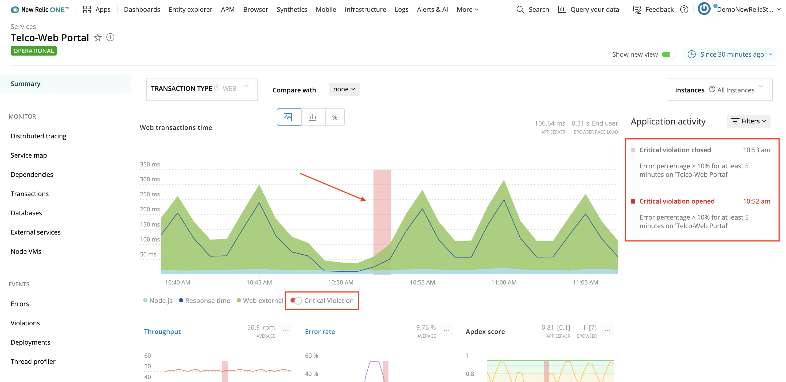

You're now on the web portal's APM summary page. The top graph, **Web transactions time**, shows you the service's response times. By default, it also displays periods of critical violation. On the right-hand side of the view, **Application activity** shows when violations opened and closed.

</Step>

<Step>

From the left-hand navigation, select **Events > Errors**:

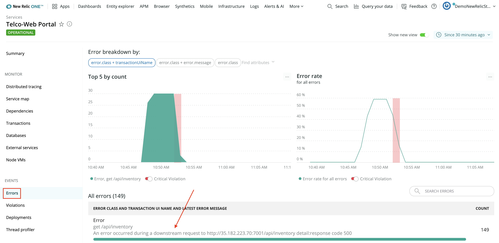

At the bottom of the view, the **Errors** table shows you what errors occurred in the service along with number of times each error occurred.

In this scenario, the only error in the service has the following message:

```shell copyable=false
[output] An error occurred during a downstream request to {blue}http://35.182.223.70:7001/api/inventory{plain} detail:response code {red}500
```

This is a helpful message that explains that the web portal made a request to another service, raised an error, and responded with a response code of 500, indicating an **Internal server error**.

Since this message tells you that the error occurred while the web portal was making an outbound request, use distributed tracing to better understand the issue.

</Step>

<Step>

Select **Monitor > Distributed tracing** from the left-hand navigation.

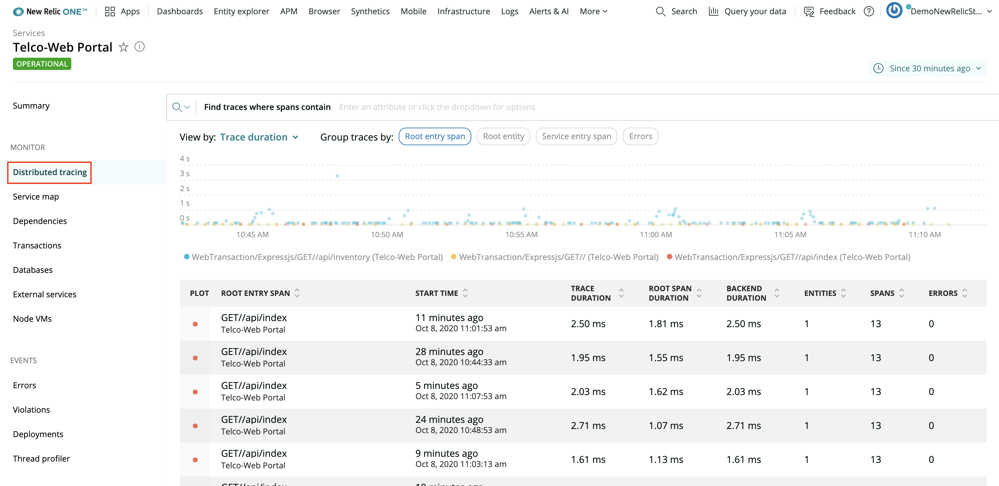

Distributed tracing provides end-to-end information about a request. In this case, you're looking for a request to the web portal that raised an error, so that you better understand what happened during that request.

</Step>

<Step>

Select the **Errors** column header twice to order the table by descending counts:

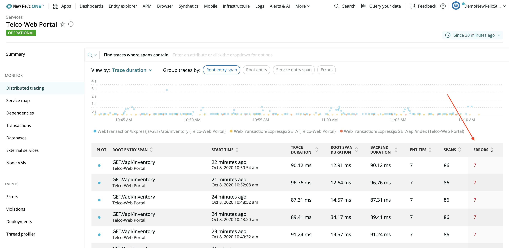

</Step>

<Step>

Select the first row in the table:

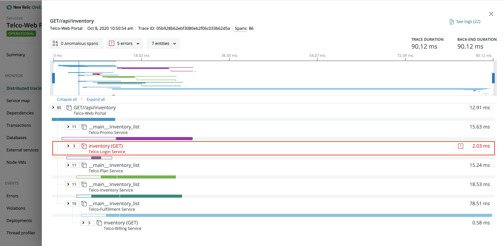

This trace gives a lot of information about what happened with the request once the web portal received it. One of the things that the trace reveals is that the web portal made a `GET` request to **Telco-Login Service** and received an error. The trace indicates an error by coloring the text red.

</Step>

<Step>

Select the row (called a span) to see more information about the request to the login service:

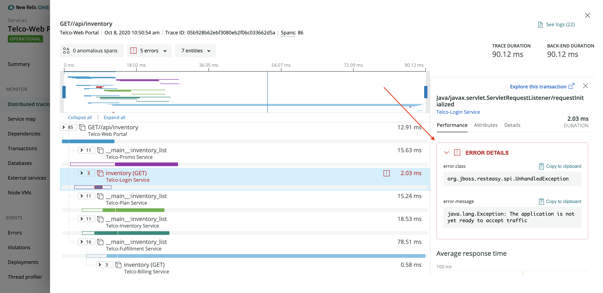

Expand **Error details** to see the error message:

```shell copyable=false
[output] {red}java.lang.Exception:{plain} The application is not yet ready to accept traffic
```

Interesting! This message says that, at the time that the web portal made the `GET` request to the login service, the login service was not ready to accept traffic. Inspect the login service to dive further into the root cause of these cascading errors.

</Step>

<Step>

Return to the **APM** page, and select **Telco-Login Service**:

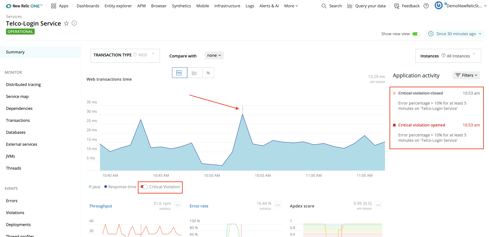

Notice that the APM summary for **Telco-Login Service** has similar red flags to the ones in the web portal: **Web transactions time** has a red error indicator, and **Application activity** shows critical violations. More than that, the times that the errors occurred in both services match up (around 10:53 AM, in this example).

**Web transactions time**, in **APM**, also shows that requests to the login service spend all their time in Java code. Next, explore JVMs to see what's happening.

</Step>

<Step>

Open **Monitor > JVMs** in the left-hand navigation:

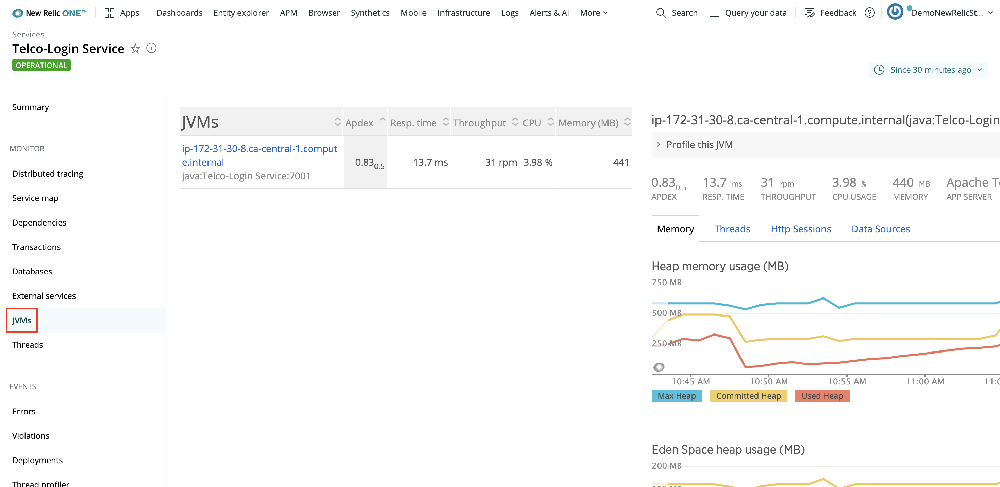

Java Virtual Machines, or JVMs, run Java processes, such as those used by the login service. This view shows resource graphs for each JVM your service uses.

</Step>

<Step>

Change the timeslice to look at data for the last 3 hours:

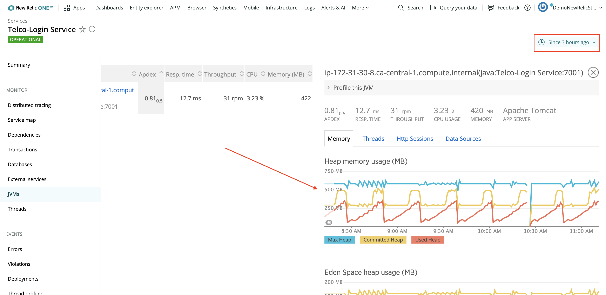

Notice, in **Heap memory usage**, that the line for **Used Heap** rises consistently over 30 minute intervals. About two-thirds of the way through each interval, the line for **Committed Heap** (the amount of JVM heap memory dedicated for use by Java processes) quickly rises to accommodate the increasing memory demands. This graph indicates that the Java process is leaking memory.

The next step is to understand the extent of the leak's impact.

</Step>

<Step>

You need to navigate to the login service's host infrastructure view to dive a little deeper. First, go to the **Telco-Login Service** summary page and turn off **Show new view**:

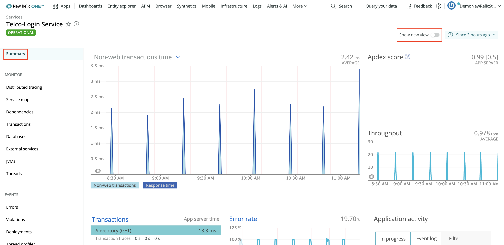

</Step>

<Step>

Then, scroll to the bottom of the page, and select the host's name:

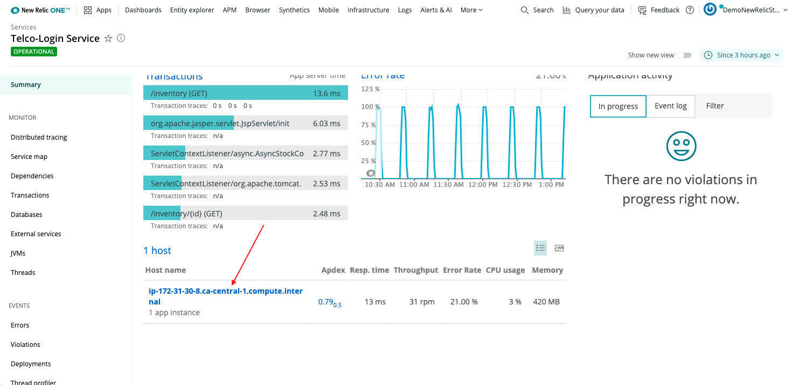

<Callout variant='important'>

Right now, you can only select the host's name from the old version of the UI (we're working on it). So, make sure you toggle off **Show new view**.

</Callout>

In this infrastructure view, **Memory Used %** for **Telco-Authentication-host** consistently climbs from around 60% to around 90% over 30-minute intervals, matching the intervals in the JVM's heap memory usage graph:

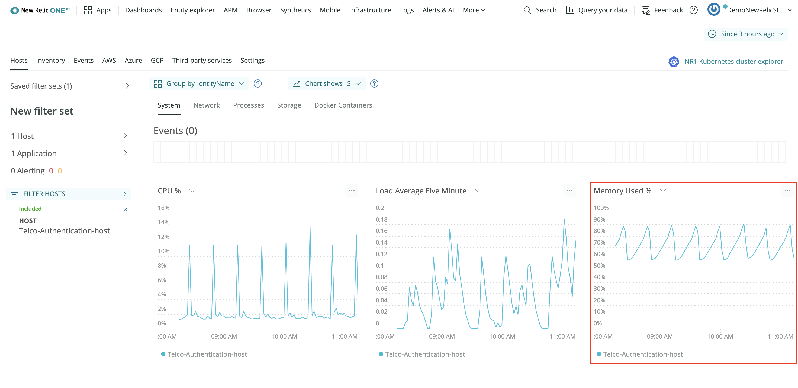

Therefore, the memory leak effects the login service's entire host.

</Step>

<Step>

Click and drag on **Memory Used %** to narrow the timeslice to one of the peaks:

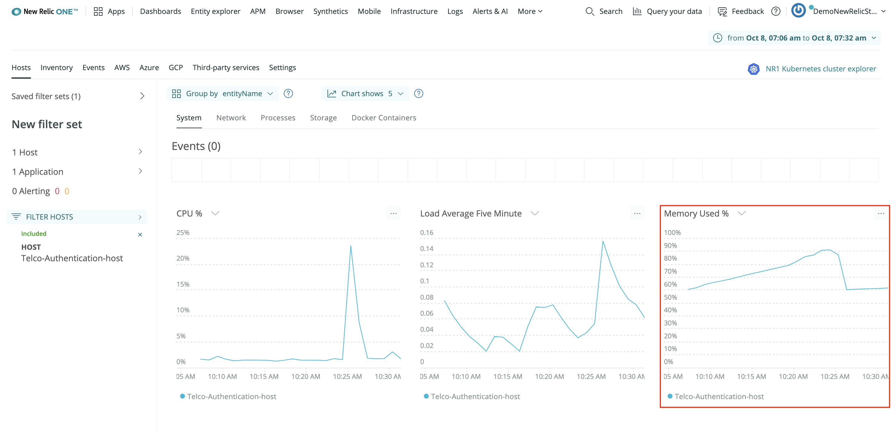

Now, compare this graph with the login service's **Errors** graph to see how they relate.

</Step>

<Step>

Open New Relic in a new tab. From **APM**, select **Telco-Login Service**. Then, navigate to **Events > Errors**.

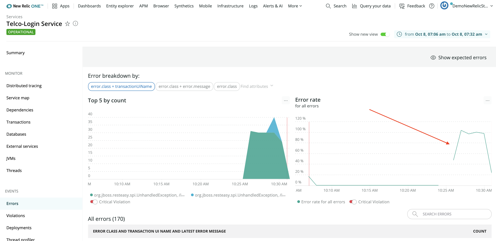

By comparing these graphs, you see that the memory percentage reached its peak at 10:25 AM (in this example) and then dropped off. You also see that errors started occurring in the login service just after that, at 10:26 AM.

The message for those errors is the same one you saw earlier:

```shell copyable=false
[output] {red}java.lang.Exception:{plain} The application is not yet ready to accept traffic
```

This suggests that the memory leaks cause the application to fail for a time.

</Step>

<Step>

To understand the error a bit more, select the error class from the table at the bottom of the view:

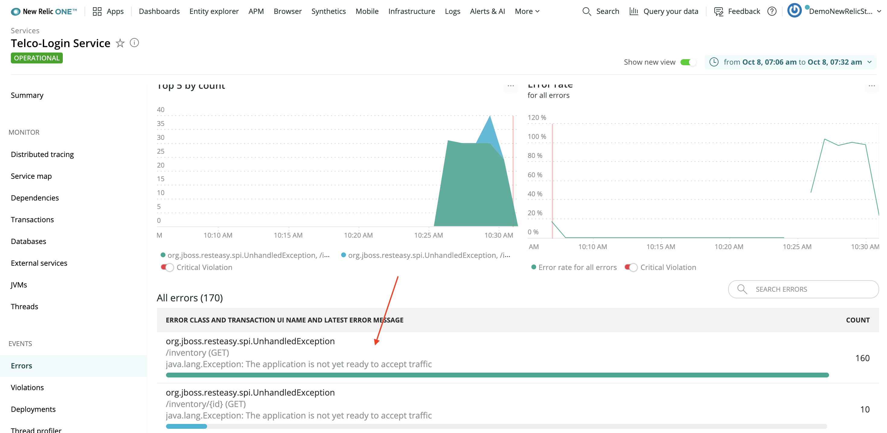

The stack trace shows that the service raised an `UnhandledException` from a function called `EnsureAppIsStarted`:

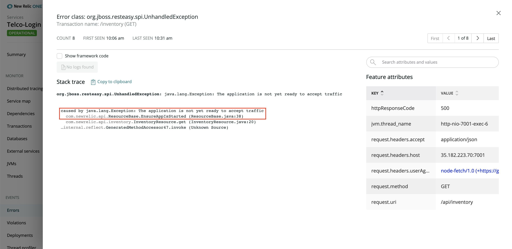

With the information you've collected so far, you can conclude that **Telco-Login Service's** Java code has a memory leak. Also, the login service restarts the application when it runs out of memory, and it raises an `UnhandledException` when it receives requests while the app is restarting.

You also know the login service is affecting the web portal, because that is what introduced you to this problem, but does the issue effect any other services?

</Step>

<Step>

Visualize service dependencies using service maps.

First, navigate back to **APM**, and from **Telco-Login Service**, select **Monitor > Service map**:

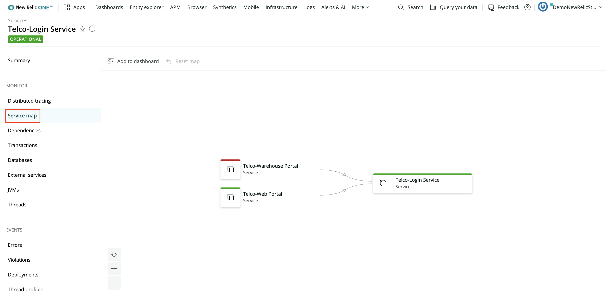

Both **Telco-Web Portal** and **Telco-Warehouse Portal** depend on **Telco-Login Service**. So, when the login service goes down, you start seeing errors in both portals.

<Callout variant="tip" title="Extra Credit">

Use the same steps you used to investigate issues in the web portal to confirm there are issues in the warehouse portal.

</Callout>

</Step>

</Steps>

## Conclusion

At the end of your investigation, you discovered:

- **Telco-Login Service** and **Telco-Web Portal** raise critical violation alerts
- The login service's Java processes leak memory
- When the login service's host, **Telco-Authentication-host**, runs out of memory, it restarts the login application
- While the login application is restarting, it raises an `UnhandledException` when it receives requests
- When the web portal and the warehouse portal make requests to the login service while it's restarting, they receive errors and raise errors of their own

Now, as a Telco Lite developer, you have enough information to debug the issue causing the memory leak. Congratulations!

<Callout variant="course" title="lab">

This procedure is part of a lab that teaches you how to diagnose common issues using New Relic. Now that you've diagnosed all the issues affecting Telco Lite, [tear down your services](/automate-workflows/diagnose-problems/tear-down).

</Callout>

