<Callout variant="course" title="lab">

This procedure is part of a lab that teaches you how to diagnose common issues using New Relic.

Each procedure in the lab builds upon the last, so make sure you've completed the last procedure, [_View your services_](/automate-workflows/diagnose-problems/view-your-services), before starting this one.

</Callout>

In this procedure, you use New Relic to understand why **Telco-Warehouse Portal** has slower-than-normal response times.

## Diagnose high response times in Telco Lite

<Steps>

<Step>

Log in to [New Relic One](https://one.newrelic.com) and select **APM** from the top navigation menu. Here, you see an overview of all eight Telco Lite services:

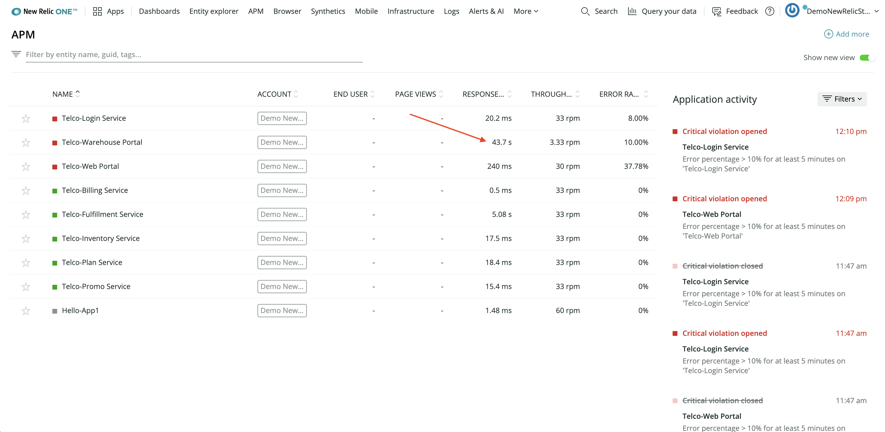

The overview includes the service names, response times, and throughputs. Notice that the response time for **Telco-Warehouse Portal** is 43 seconds, much higher than the response times in other services.

</Step>

<Step>

On the **APM** page, select the **Telco-Warehouse Portal** service name to see a summary of that service. The top graph in the summary view shows **Web transactions time**:

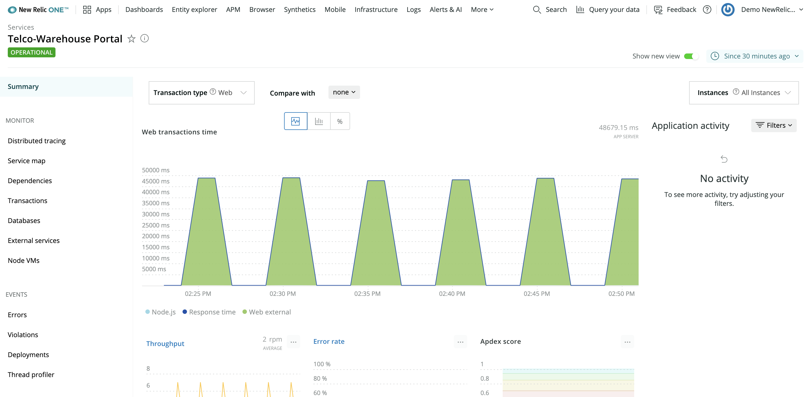

You see several peaks, reaching almost 50,000 milliseconds—or 50 seconds! From this graph, you can actually gain a little more insight by toggling the colored components beneath the graph. For example, select **Node.js**:

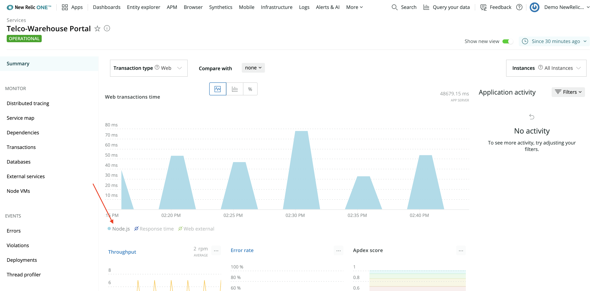

The graph changes to show only what the Node.js component contributes to the overall response time—less than 100 ms, in this example. Now, select **Web external** and deselect **Node.js**:

Here, you see that **Web external** is the culprit of the high response times, but it's hard to tell why.

External web traffic is all the requests made from your service to other services. This means you should look into what external requests the warehouse portal makes to try to understand exactly what external service is the bottleneck.

</Step>

<Step>

From the left-hand navigation, select **Monitor > Distributed tracing**:

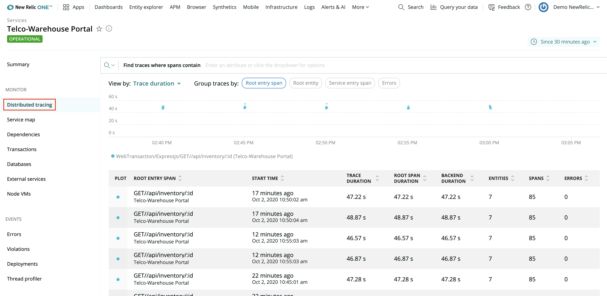

This view shows you requests to the warehouse portal.

</Step>

<Step>

Select a request from the table at the bottom of the view to see a trace through that request:

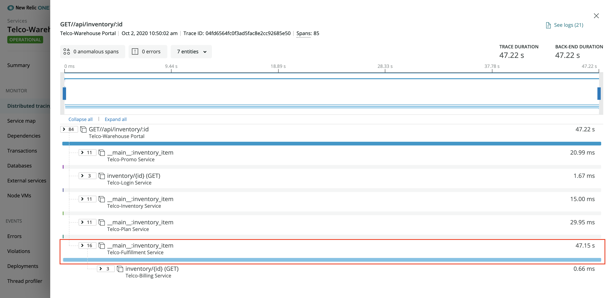

This trace shows that one external request contributes almost all of the total trace duration. Specifically, an external request to the **Telco-Fulfillment Service** contributes over 99% of the overall response time.

Next, drill into the fulfillment service for even more information.

</Step>

<Step>

Select the offending row (called a span), and then select **Explore this transaction**:

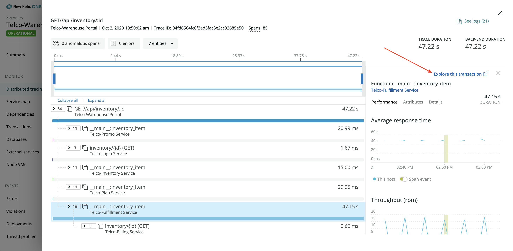

You're now looking at the **__main__:inventory_item** transaction overview. Because you know that some part of this transaction is slow, you use this overview to narrow your focus even further. Similar to how you modified the warehouse portal APM graph, you look specifically at the components of this transaction to understand where the root cause of the slowness is.

Another way to view this information is to scroll down to the **Breakdown table** in that same view:

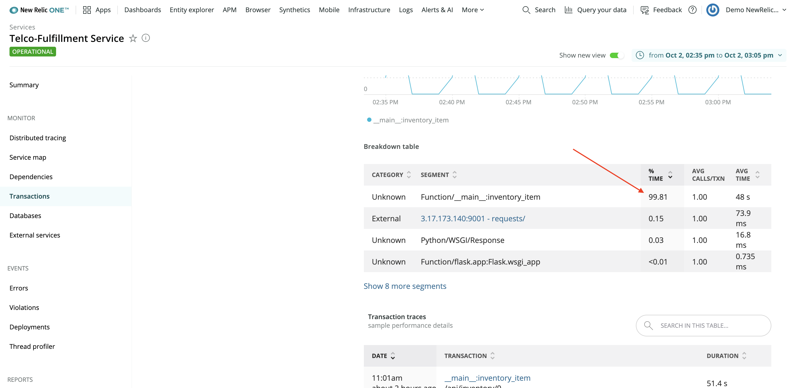

`Function/__main__:inventory_item`, a Python function, contributes over 99% of the overall response time.

At this point, you know that **Telco-Warehouse Portal** is slow because it makes an external request to **Telco-Fulfillment Service**, which is slow. You also know that the issue in the fulfillment service is local because over 99% of the request is spent in Python code, not external services.

</Step>

<Step>

Navigate to the fulfillment service's summary page to look at the service as a whole:

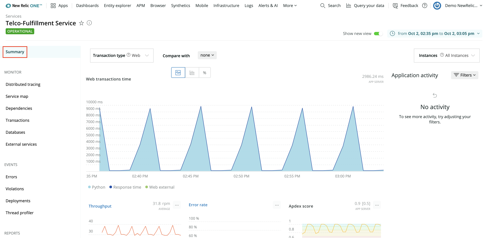

Scroll down on this view to familiarize yourself with the graphs and tables it shows, such as **Throughput**, **Error rate**, and **Hosts**. Next, look at the host to see what's happening.

</Step>

<Step>

First, switch to the old UI. Toggle **Show new view** to off and select the host link:

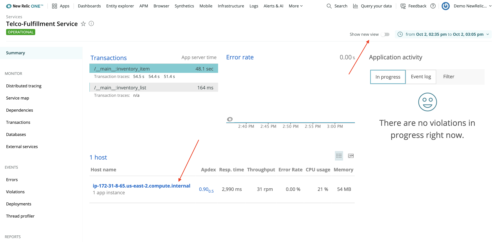

Now, you're looking at graphs in the infrastructure view for that service's host. Notice that **CPU %** has a lot of high spikes.

</Step>

<Step>

Click and drag on the graph from the start of a spike to the end of it to narrow the timeslice to the period when CPU utilization goes up:

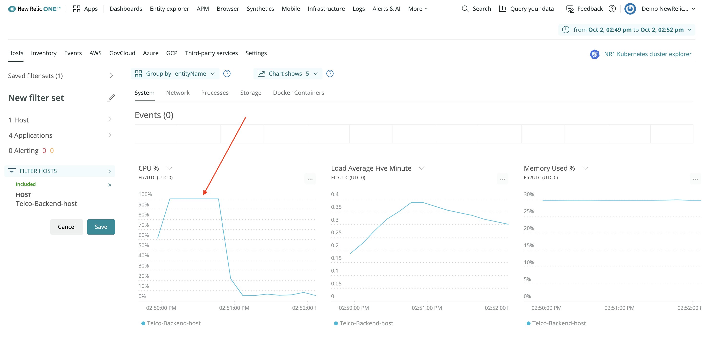

If you compare this graph to the fulfillment service's transaction graph you looked at earlier, you'll see that soon after `__main__:inventory_item` begins executing, the CPU utilization of the host sharply rises to 100%!

Now, you understand the problem causing slow response times in the warehouse portal, but you don't know the extent of the issue. Using service maps, you can see all your services that depend on the fullfillment service.

</Step>

<Step>

Navigate to the service map under **APM > Telco-Fulfillment Service**:

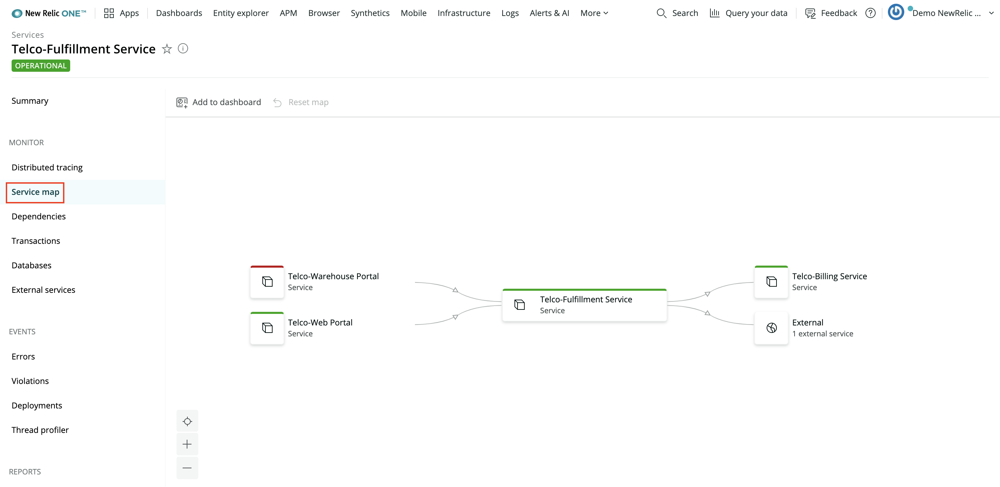

This map shows you the fulfillment service's incoming and outgoing dependencies. Not only is **Telco-Warehouse Portal** dependent on the fullfillment service, but so is **Telco-Web Portal**!

</Step>

<Step>

Select the web portal node to see that the fulfillment service also affects the web portal's response times:

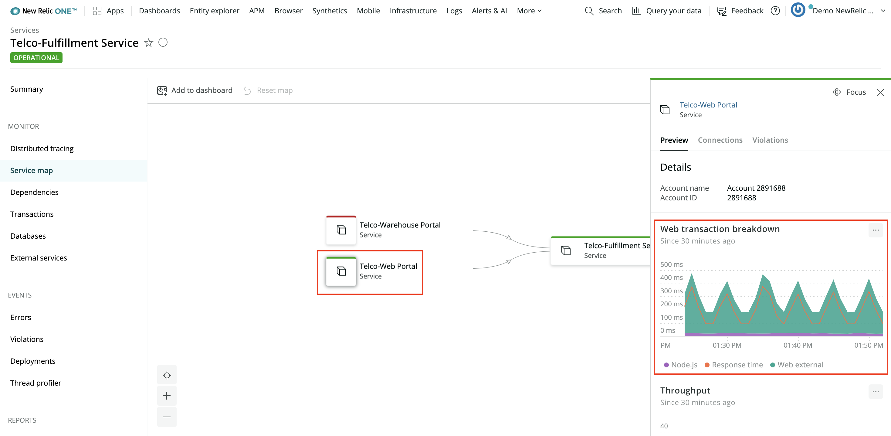

</Step>

</Steps>

## Conclusion

At the end of your investigation, you discovered:

- **Telco-Warehouse Portal** is slow because it makes an external request to **Telco-Fulfillment Service**, which is slow
- The fulfillment service's Python function contributes over 99% of the response time
- Soon after the Python function starts executing, the host's CPU utilization spikes up to 100%
- The fulfillment service also affects **Telco-Web Portal** response times

Now, as the developer behind the fulfillment service, you have enough information to debug the issue causing the CPU spikes. Congratulations!

<Callout variant="course" title="lab">

This procedure is part of a lab that teaches you how to diagnose common issues using New Relic. Continue on to the next procedure: [_Diagnose error alerts_](/automate-workflows/diagnose-problems/error-alerts).

</Callout>