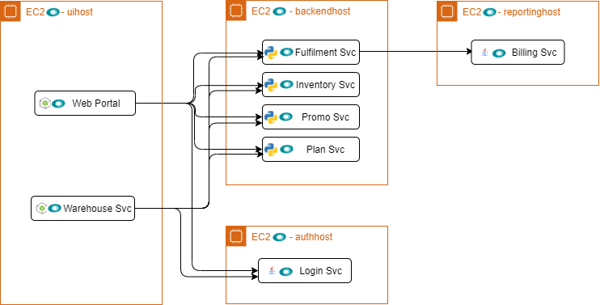

<Callout variant="course" title="lab">

This procedure is part of a lab that teaches you how to diagnose common issues using New Relic. If you haven't already, check out the [lab introduction](/automate-workflows/diagnose-problems).

</Callout>

The Telco Lite architecture has eight, interconnected microservices:



In this procedure, you use our [`demo-deployer`](https://github.com/newrelic/demo-deployer) to spin up this infrastructure.

## Set up your environment

Before you begin, follow the [Prerequisites guide](https://github.com/newrelic/demo-catalog/blob/main/GETTING_STARTED.md#prerequisites) from the deployer's GitHub repository for a detailed walkthrough of how to set up your environment. You can choose between Amazon Web Services (AWS), Microsoft Azure, or Google Cloud Platform (GCP) to host your deployment.

To summarize:

- Install Docker & pull the demo-deployer image locally
- Create a user config file containing credentials for New Relic and your cloud provider
- Download a .pem key file (if your cloud provider is AWS)

Once you're all set up, deploy Acme Telco Lite.

## Deploy Telco Lite

It's time to deploy and instrument the Telco Lite services using `demo-deployer`. Copy the url for the demo that corresponds to the cloud provider you chose when you set up your environment:

- [AWS Telco Lite Demo](https://raw.githubusercontent.com/newrelic/demo-catalog/main/catalog/telco_lite/telcolite.aws.json)
- [Azure Telco Lite Demo](https://raw.githubusercontent.com/newrelic/demo-catalog/main/catalog/telco_lite/telcolite.azure.json)
- [GCP Telco Lite Demo](https://raw.githubusercontent.com/newrelic/demo-catalog/main/catalog/telco_lite/telcolite.gcp.json)

Follow the [Deployment guide](https://github.com/newrelic/demo-catalog/blob/main/GETTING_STARTED.md#deploy-your-services) in the Demo Catalog repository for a thorough explanation of how to use the deployer in a local Docker environment. When you run the deployment script, make sure to pass the url you copied for `<demo-url>`.

<Callout variant="tip">

Since Telco Lite contains several services, the deployment can take over half an hour.

</Callout>

When the deloyer is finished, you should see some output stating that the deployment was successful:

```shell copyable=false
[output] {muted}[INFO] Executing Deployment
[output] [{green}✔{plain}] Parsing and validating Deployment configuration {green}success
[output] [{green}✔{plain}] Provisioner {green}success
[output] [{green}✔{plain}] Installing On-Host instrumentation {green}success
[output] [{green}✔{plain}] Installing Services and instrumentations {green}success
[output]
[output] {muted}[INFO] Deployment successful!
[output]
[output] Deployed Resources:
[output]
[output]  simuhost (aws/ec2):
[output]    ip: {blue}34.201.60.23
[output]    services: ["simulator"]
[output]
[output]  uihost (aws/ec2):
[output]    ip: {blue}18.233.97.28
[output]    services: ["webportal", "fluentd"]
[output]    instrumentation:
[output]       nr_infra: newrelic v1.12.1
[output]
[output]  backendhost (aws/ec2):
[output]    ip: {blue}35.170.192.236
[output]    services: ["promo", "login", "inventory", "plan", "fulfillment", "warehouse", "fluentd"]
[output]    instrumentation:
[output]       nr_infra: newrelic v1.12.1
[output]
[output]  reportinghost (aws/ec2):
[output]    ip: {blue}54.152.82.127
[output]    services: ["billing", "fluentd"]
[output]    instrumentation:
[output]       nr_infra: newrelic v1.12.1
[output]
[output] Installed Services:
[output]
[output]  simulator:
[output]    url: {blue}http://34.201.60.23:5000
[output]
[output]  webportal:
[output]    url: {blue}http://18.233.97.28:5001
[output]    instrumentation:
[output]       nr_node_agent: newrelic v6.11.0
[output]       nr_logging_in_context: newrelic
[output]
[output]  promo:
[output]    url: {blue}http://35.170.192.236:8001
[output]    instrumentation:
[output]       nr_python_agent: newrelic v5.14.1.144
[output]       nr_logging_in_context: newrelic
[output]
[output]  login:
[output]    url: {blue}http://35.170.192.236:8002
[output]    instrumentation:
[output]       nr_python_agent: newrelic v5.14.1.144
[output]       nr_logging_in_context: newrelic
[output]
[output]  inventory:
[output]    url: {blue}http://35.170.192.236:8003
[output]    instrumentation:
[output]       nr_python_agent: newrelic v5.14.1.144
[output]       nr_logging_in_context: newrelic
[output]
[output]  plan:
[output]    url: {blue}http://35.170.192.236:8004
[output]    instrumentation:
[output]       nr_python_agent: newrelic v5.14.1.144
[output]       nr_logging_in_context: newrelic
[output]
[output]  fulfillment:
[output]    url: {blue}http://35.170.192.236:8005
[output]    instrumentation:
[output]       nr_python_agent: newrelic v5.14.1.144
[output]       nr_logging_in_context: newrelic
[output]
[output]  billing:
[output]    url: {blue}http://54.152.82.127:9001
[output]    instrumentation:
[output]       nr_java_agent: newrelic v5.14.0
[output]       nr_logging_in_context: newrelic
[output]       nr_logging: newrelic
[output]
[output]  warehouse:
[output]    url: {blue}http://35.170.192.236:9002
[output]    instrumentation:
[output]       nr_python_agent: newrelic v5.14.1.144
[output]       nr_logging_in_context: newrelic
[output]
[output]  fluentd:
[output]    url: {blue}http://18.233.97.28:9999
[output]    url: {blue}http://35.170.192.236:9999
[output]    url: {blue}http://54.152.82.127:9999
[output]
[output] Completed at 2020-08-11 11:27:00 -0700
[output]
[output] {muted}[INFO] This deployment summary can also be found in:
[output] {muted}[INFO]   /tmp/telcolite/deploy_summary.txt
```

<br />

After configuring your environment, you only needed two commands (and a bit of patience) to spin up all the Telco Lite services!

<Callout variant="course" title="lab">

This procedure is part of a lab that teaches you how to diagnose common issues using New Relic. Now that you've set up your environment, [view your services](/automate-workflows/diagnose-problems/view-your-services).

</Callout>
