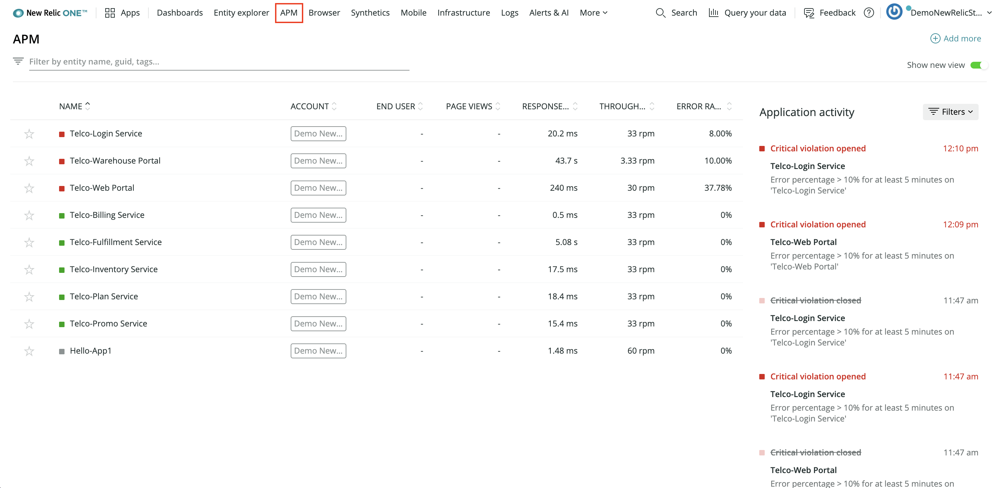

<Callout variant="course" title="lab">

This procedure is part of a lab that teaches you how to diagnose common issues using New Relic.

Each procedure in the lab builds upon the last, so make sure you've completed the last procedure, [_Spin up Acme Telco Lite architecture_](/automate-workflows/diagnose-problems/spin-up-acme), before starting this one.

</Callout>

You can monitor your applications in New Relic and get real-time performance related data to see what's happening at a particular point of time. This allows you to quickly diagnose and debug any issues that might result in bad user experience.

In this procedure, you view your services in New Relic.

## View your services

With your services running in the cloud, log in to New Relic and select **APM** from the top navigation to see how your services are holding up:

Yikes! The alerts, high response times, and red-colored indicators suggest things aren't well. There are two main issues which seem to be affecting your services:

- The Warehouse Portal has abnormally high response times
- Multiple services are raising error alerts

The next step is to diagnose these issues.

<Callout variant="course" title="lab">

This procedure is part of a lab that teaches you how to diagnose common issues using New Relic. Continue on to next procedure: [_Diagnose high response time_](/automate-workflows/diagnose-problems/high-response-times).

</Callout>
