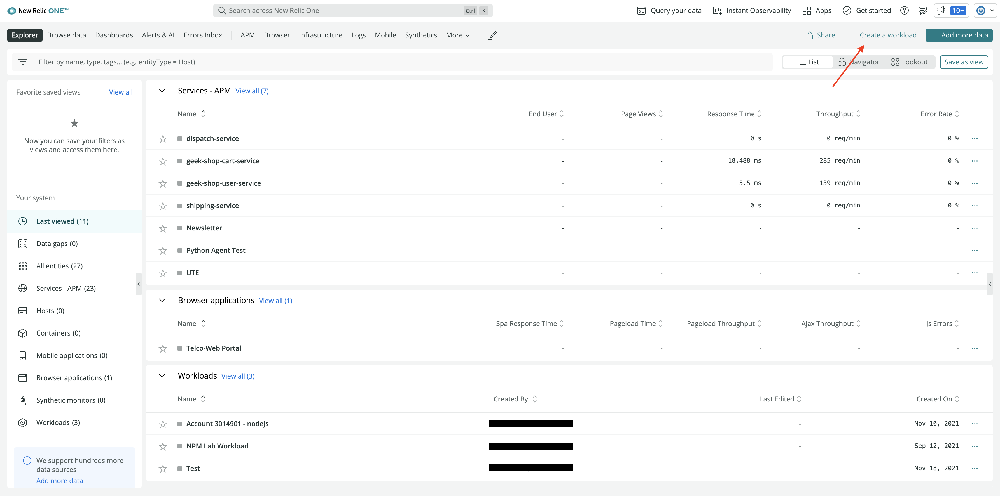
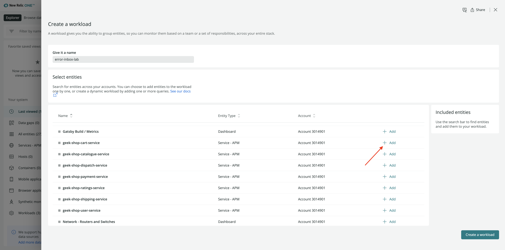
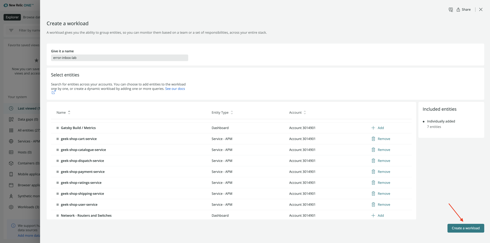

<Callout variant="course" title="lab">

This procedure is part of a lab that teaches you how to track full stack errors using Error Inbox. 

Each procedure in the lab builds upon the last, so make sure you've [set your lab environment](/automate-workflows/error-inbox/spin-up-geek-movie), before starting this one.

</Callout>
 
You can group specific apps and services that you want to monitor in a workload. This allows you to get an aggregated view of health and activity of the entities in the workload. You can also use workloads with error inbox to detect issues and track errors across your entire stack. 

In this procedure, you create a workload with all the geek movie shop services. 
                                                                                                                                                                                                                                                                                                                                                                                                                                                                                                                                                                                                                                                                                                                                                                                                                                                                                                                                                                                                                                                                                                                                                                                                                                                                                                                                                                                                                                                                                                                                                                                                                                                                                                                                                                                                                                                                                                                                                                                                                                                                                                                                                                                                                                                                                                                                                                                                                                                                                                                                                                                                                                                                                                                                                                                                                                                                                                                                                                                                                                                                                                                                                                                                                                                                                                                                                                                                                                                                                                                                                                                                                                                                                                                                                                                                                                                                                                                                                                                                                                                                                                                                                                                                                                                                                                                                                                                                                                                                                                                                                                                                                                                                                                                                                                                                                                                                                                                                                                                                                                                                                                                                                                                                                                                                                                                                                                                                                                                                                                                                                                                                                                                                                                                                                                                                                                                                                                                                                                                                                                                                                                                                                                                                                                                                                                                                                                                                                                                                                                                                                                                                                                                                                                                                                                                                                      
# Create a workload

<Steps>
<Step>

Navigate to [New Relic One](one.newrelic.com) and sign in with your account. 
</Step>
<Step>

Click **+ Create a workload** in top right hand corner.

</Step>
<Step>

Name your workload as _error-inbox-lab_. Under **Select entities**, scroll down to the geek shop services and click **+ Add** against each service to add it to workload. 

</Step>
<Step>

Click **Create a workload** once you've added all the services.

</Step>
</Steps>

This creates a workload with all the geek-movie services for you and automatically redirects you to view the workload in New Relic. 

Now that you have created workload, you can set up error inbox. 

<Callout variant="course" title="lab">

This procedure is part of a lab that teaches you how to track full stack errors using Error Inbox. Now that you've created a workload, continue on to next procedure [Track and triage errors in error inbox](/automate-workflows/error-inbox/set-up-error-inbox).

</Callout>