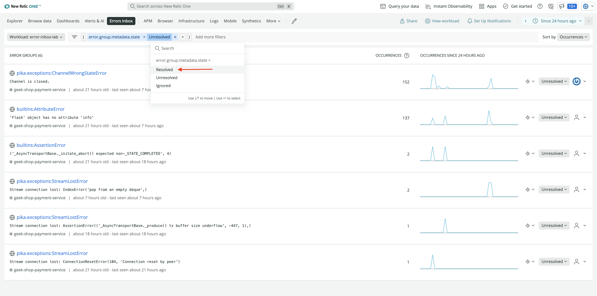
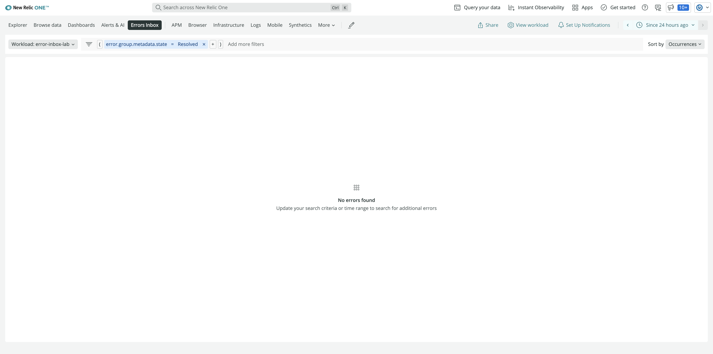

<Callout variant="course" title="lab">

This procedure is part of a lab that teaches you how to manage errors using Errors Inbox.

Each procedure in the lab builds upon the last, so make sure you've [triaged your errors](/automate-workflows/error-inbox/triage-errors) before starting this one.

</Callout>

You're now observing Geek's Movie Shop's errors in Errors Inbox, and you're trying to debug your application before pushing your site live. With your errors triaged, you can track their progress, look at who's working on a bug, or even create tasks in Jira to resolve them.

## View triaged errors

Change the filter in Errors Inbox to view your triaged errors

<Steps>

<Step>

In Errors Inbox, find the filter pane below the top navigation bar.

</Step>

<Step>

Click **Unresolved** to change the filter value.

Here, you see three options in the dropdown:

- **Resolved**
- **Unresolved**
- **Ignored**

</Step>

<Step>

Select **Resolved**.

Errors Inbox now shows you all your resolved error groups.

If you only resolved `pika.exceptions:ChannelWrongStateError`, you don't see any resolved errors here because Errors Inbox unresolved that one when it saw another occurrence.

<Callout variant='tip'>

If you want to observe your ignored error groups instead of resolved ones, filter by **Ignored**.

</Callout>

</Step>

</Steps>

## **Optional:** Integrate Errors Inbox with Slack, Jira, and CodeStream

Being able to view resolved and ignored errors is useful, but you're trying to squash the bugs in your application before you deploy it to production. To help you manage this, connect your inbox to [Slack](https://docs.newrelic.com/docs/errors-inbox/errors-inbox/#slack), [Jira](https://docs.newrelic.com/docs/errors-inbox/errors-inbox/#jira), and [CodeStream](https://docs.newrelic.com/docs/errors-inbox/errors-inbox/#connect-errors-inbox-to-codestream).

## Summary

In this lab, you set up Errors Inbox to proactively observe and catch errors from across your stack. You analyzed the errors in full context and triaged them before they could affect your customers. You also managed your errors in Errors Inbox and integrated your inbox with Jira, CodeStream, and Slack to help you collaborate and resolve errors faster.

Once you resolve your high priority errors, you'll be more confident in your production release. But Errors Inbox is helpful even when you're in production, because you'll be able to see, triage, and manage errors that come from your customers as well.

## Homework

Now that you know how to track and triage errors using Errors Inbox, here are some other resources you can use to familiarize yourself even more with Errors Inbox.

- Read our documentation on [Errors Inbox](https://docs.newrelic.com/docs/errors-inbox/errors-inbox/)
- Read our blog [Collaborate and fix errors quickly with Errors Inbox and workloads](https://newrelic.com/blog/how-to-relic/track-errors-errors-inbox)
- Read our blog [Error Tracking Across Your Entire Stack with New Relic Errors Inbox](https://newrelic.com/blog/how-to-relic/error-tracking-with-errors-inbox)