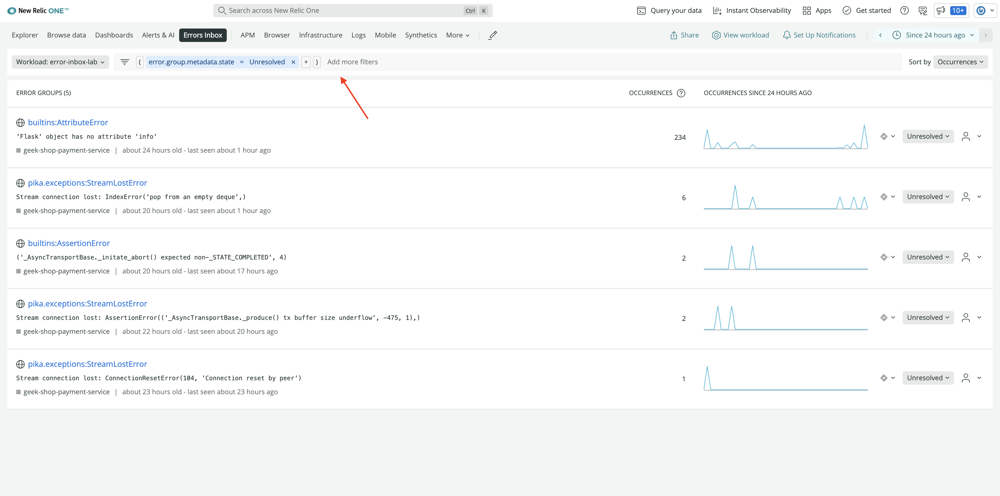
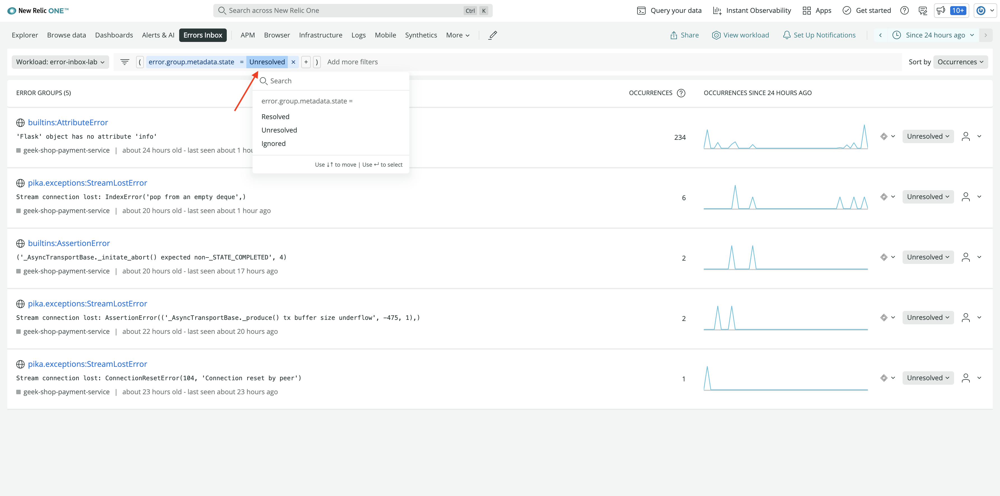
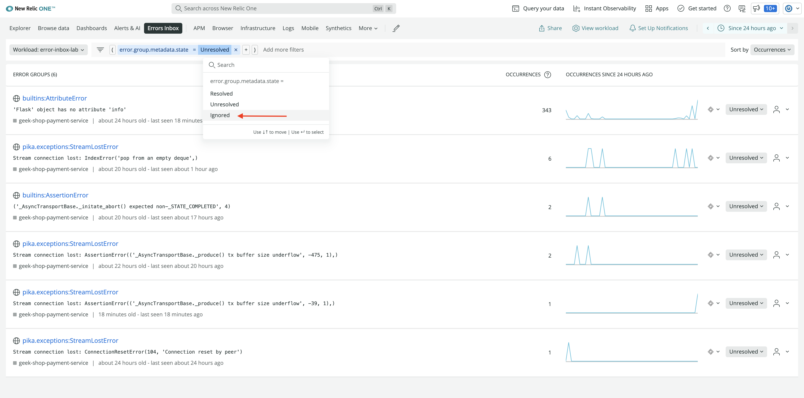
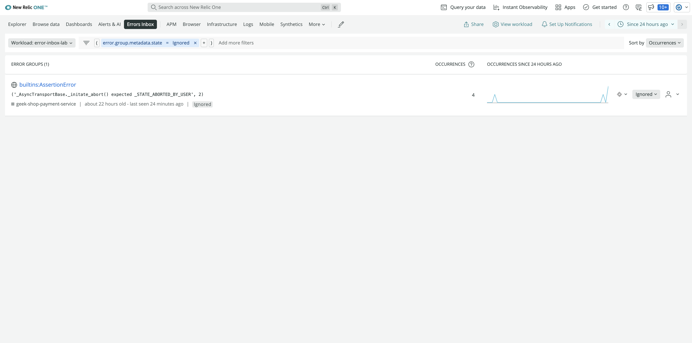
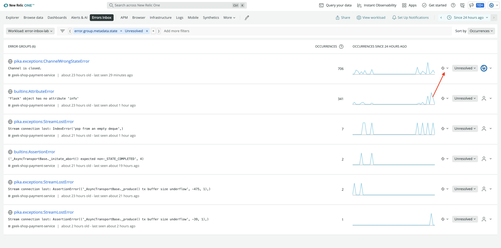
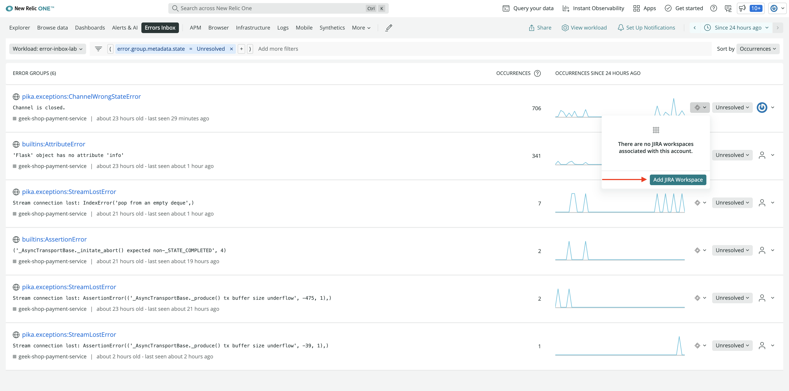
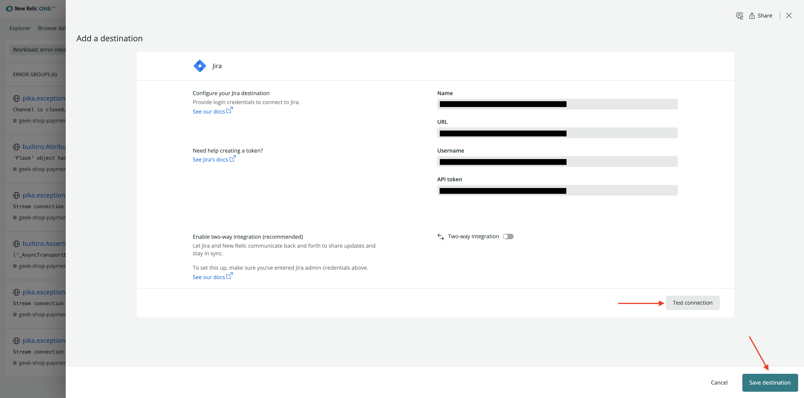
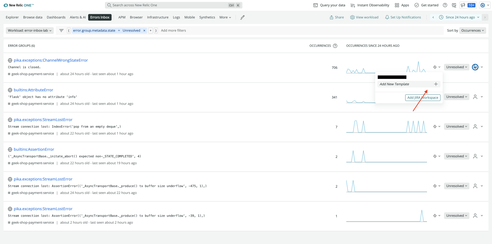
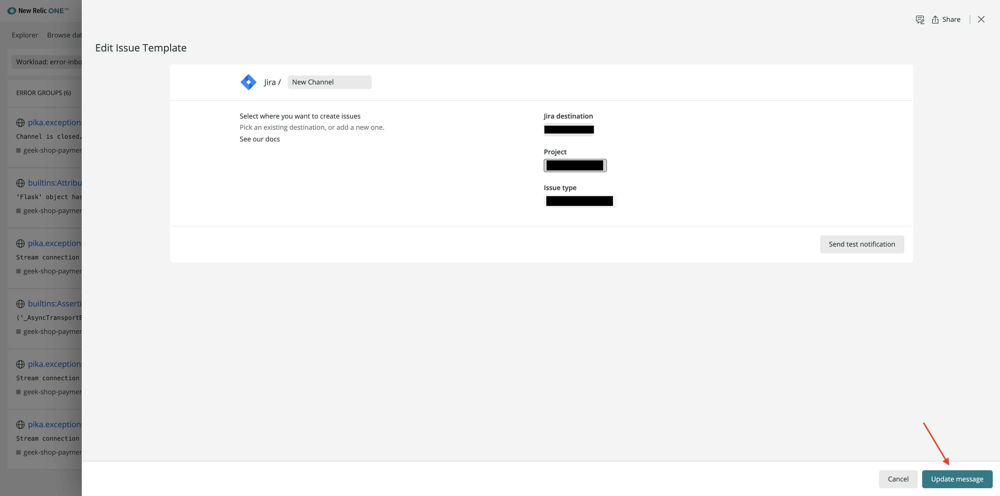

<Callout variant="course" title="lab">

This procedure is part of a lab that teaches you how to track full stack errors using errors inbox. 

Each procedure in the lab builds upon the last, so make sure you've completed the last procedure, [Triage your errors](/automate-workflows/error-inbox/triage-errors), before starting this one.

</Callout>

## Change filter
By default, errors inbox show all the unresolved errors on the main screen. Once the error status is updated to resolved or ignored, you no longer see the error on the main screen. However, you can change the filter to view these errors.

The main screen of errors inbox has a filter pane right below the top nav.

Click **Unresolved** to change the filter value.

Here, you see three options in the dropdown. Select **Ignored**.

Your errors inbox now show all the ignored error groups, if any.

## Optional

### Connect errors inbox to Jira
Connect errors inbox to jira to qucikly and easily create tickets containing error details and link to the stack trace. It allows you to collaborate and resolve errors faster.

Connect your errors inbox to jira:
<Steps>
<Step>

Click on the Jira integration icon on the far right side of the error group you want to connect to Jira.

</Step>
<Step>

Click **Add JIRA Workspace** from the dropdown.

</Step>
<Step>

Fill in the fields on the next page and click **Test connection** to ensure that your details are correct. Then, click **Save destination**.

</Step>
<Step>

Next, set up a template. Click the jira integration icon against the error group and select **Add New Template +**.

</Step>
<Step>

Add **Jira destination**, **Project**, and **Issue type** on the next page and click **Update message** to save the template. 

<Callout variant='tip'>

Here, you can also click **Send test notification** to preview the ticket in your jira board before saving the template. Note that a test notification will create a jira ticket in your workspace.
</Callout>
</Step>
</Steps>

Now you can create jira ticket by clicking the jira integration icon on the far right side of the error group and selecting a template. 

<Callout variant='tip'>

You can also connect errors inbox with Slack and CodeStream. Read [our docs](https://docs.newrelic.com/docs/errors-inbox/errors-inbox/) to learn more about the supported integrations.

</Callout>

# Summary:
In this lab, you set up errors inbox to track and triage errors in your application. You also managed triaged errors in errors inbox and integrated your errors inbox with jira to help you effectively collaborate and resolve errors faster from across your stack. 

# Homework
Now that you know how to track and triage errors using errors inbox, here are some other things to familiarize yourself even more with errors inbox.
- Read our documentation on [errors inbox](https://docs.newrelic.com/docs/errors-inbox/errors-inbox/)
- Read our blog [Collaborate and fix errors quickly with Errors Inbox and workloads](https://newrelic.com/blog/how-to-relic/track-errors-errors-inbox)
- Read our blog [Error Tracking Across Your Entire Stack with New Relic Errors Inbox](https://newrelic.com/blog/how-to-relic/error-tracking-with-errors-inbox)