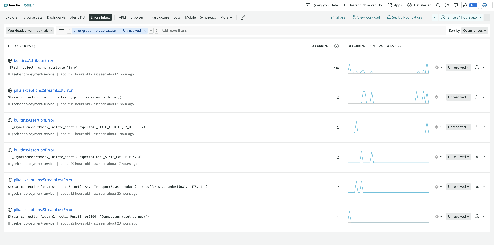
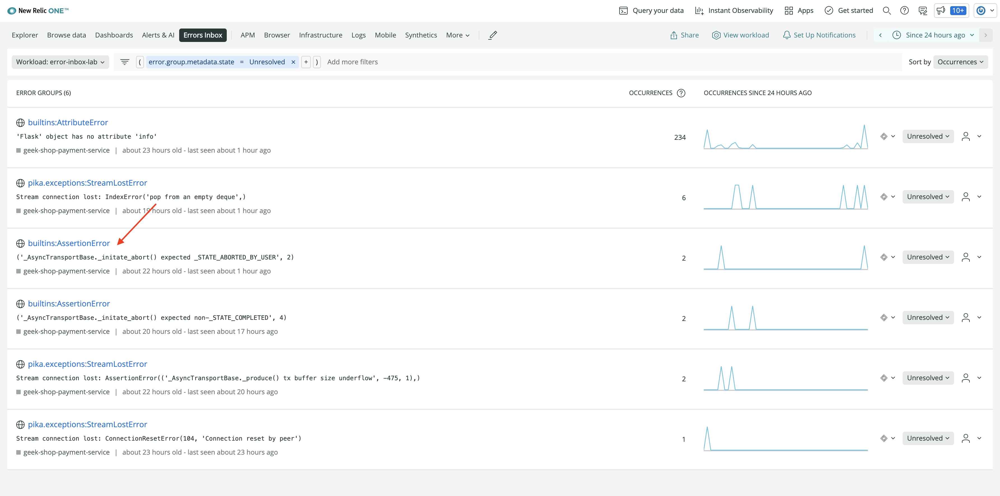
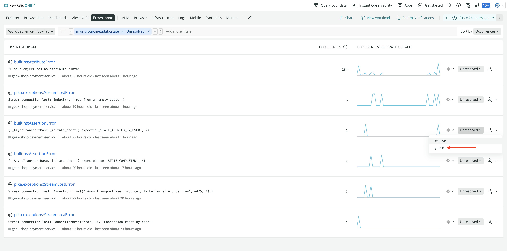

<Callout variant="course" title="lab">

This procedure is part of a lab that teaches you how to track full stack errors using Error Inbox. 

Each procedure in the lab builds upon the last, so make sure you've completed the last procedure, [Create a workload](/automate-workflows/error-inbox/create-a-workload), before starting this one.

</Callout>

Error inbox provides a unified error tracking to detect and triage errors from across your stack. You analyze the errors in context of the full stack and resolve them with precision. 

In this procedure, you track and triage errors across your stack using error inbox. 

<Callout variant='important'>

Errors inbox is not available in the EU region.

</Callout>

# Set up error inbox

Before you start tracking error in errors inbox, you need to set it up. 

Enable error inbox as follow:
<Steps>
<Step>

From [New Relic One](one.newrelic.com), select **Errors Inbox** from the top nav.

</Step>
<Step>

Click **Select Workload** and select **error-inbox-lab** workload from the drop down.

</Step>
<Step>

You see the error groups across your workload here.

</Step>
</Steps>

Your error inbox is now set and you can start proactively monitoring errors across your stack.

# Triage errors

You can triage error groups directly from the main screen. Triaging helps removing the noise from your error inbox so you focus on the high impact errors.  

## Error details

By default, errors inbox shows all your unresolved errors on one screen. To understand the root cause of these errors, you need more details. For instance:

Click on **pika.exceptions:ChannelWrongStateError** error.

This takes you to error details page. You find full context of the issue here including **Occurances**, **Stack Trace** and others.

Stack trace is especially important since it helps you narrow down the cause of the problem. 
Under **Stack Trace**, click **Show all** in bottom right corner.

This shows you the full stack trace. 

By taking a closer look at the above trace, you know for sure that something is wrong in your payment service. Now you can fix it before pushing the changes to production.

<Callout variant='tip'>

You can also integrate [CodeStream](https://newrelic.com/codestream) with your errors inbox. This allows you to explore the stack trace in your IDE on a click of a single button. Once you've configured CodeStream, click ** Open in IDE** button to navigate to your IDE and explore the error.

</Callout>

## Change the error status

Each error in errors inbox has **unresolved** status by defulat. But you can set your error status as resolved, or ignored and filter your inbox by status. 

### Set the error status as 'Resolved'
Once you fixed the issue, you come back to errors inbox and change its status to resolved. 

Navigate to **Errors inbox** in New Relic One.

You were told that another developer on your team has fixed **pika.exceptions:ChannelWrongStateError** but the errors inbox still has this issue marked as unresolved. Change it's status:

Click **Unresolved** against the error.

You see two options in the dropdown here. Select **Resolve**.

Once the status is updated, you no longer see the error on the main screen. However, if the error still persists, then it'll automatically be marked as unresolved.

### Set the error status as 'Ignored'
Some errors are expected and part of the system as it operates. Set those errors as ignored:

Navigate to **Errors inbox** in New Relic One.

Take a quick scan of the errors here. There's one **builtins:AssertionError**.

This error is expected since the payment was aborted by the user and there's nothing you can do about it. Ignore this error:

Click **Unresolved** against the error and then select **Ignore** from the dropdown.

Once the status is updated, you no longer see the error on the main screen until you stop ignoring or change the filter to include ignored error groups. 

## Change filter
By default, errors inbox show all the unresolved errors on the main screen. Once the error status is updated to resolved or ignored, you no longer see the error on the main screen. However, you can change the filter to view these errors.

The main screen of errors inbox has a filter pane right below the top nav.

Click **Unresolved** to change the filter value.

Here, you see three options in the dropdown. Select **Ignored**.

Your errors inbox now show all the ignored error groups.

## Assign errors
Change the errors inbox filter to show all the unresolved errors.

Oops! you were told that somebody fixed **pika.exceptions:ChannelWrongStateError** error but you still see it under unresolved errors. You don't know who fixed this error previously and there's no way for you to find that out. To avoid such situation in future, assign the error from inside errors inbox.

Click the human icon on the far right side of the error group.

Enter the email address of the person you want to assign error to, and click **+**. 

The error is now assigned and its now easier for you to keep a track of who worked on the error.

<Callout variant='important'>

Currently assigning an error group to a user does not send a notification. Notifications of assignment and changes to error groups will be coming soon.
</Callout>

## Connect an inbox to Jira
Connect errors inbox to jira to qucikly and easily create tickets containing error details and link to the stack trace. It allows you to collaborate and resolve errors faster.

Connect your errors inbox to jira:
<Steps>
<Step>

Click on the Jira integration icon on the far right side of the error group you want to connect to Jira.

</Step>
<Step>

Click **Add JIRA Workspace** from the dropdown.

</Step>
<Step>

Fill in the fields on the next page and click **Test connection** to ensure that your details are correct. Then, click **Save destination**.

</Step>
<Step>

Next, set up a template. Click the jira integration icon against the error group and select **Add New Template +**.

</Step>
<Step>

Add **Jira destination**, **Project**, and **Issue type** on the next page and click **Update message** to save the template. 

<Callout variant='tip'>

Here, you can also click **Send test notification** to preview the ticket in your jira board before saving the template. Note that a test notification will create a jira ticket in your workspace.
</Callout>
</Step>
</Steps>

Now you can create jira ticket by clicking the jira integration icon on the far right side of the error group and selecting a template.

# Summary:
In this lab, you set up errors inbox to track and triage errors in your application. You also integrated your errors inbox with jira to help you effectively collaborate and resolve errors faster from across your stack.
For more help

# Homework
Now that you know how to track and triage errors using errors inbox, here are some other things to familiarize yourself even more with errors inbox.
- Read our documentation on [errors inbox](https://docs.newrelic.com/docs/errors-inbox/errors-inbox/)
- Read our blog [Collaborate and fix errors quickly with Errors Inbox and workloads](https://newrelic.com/blog/how-to-relic/track-errors-errors-inbox)
- Read our blog [Error Tracking Across Your Entire Stack with New Relic Errors Inbox](https://newrelic.com/blog/how-to-relic/error-tracking-with-errors-inbox)