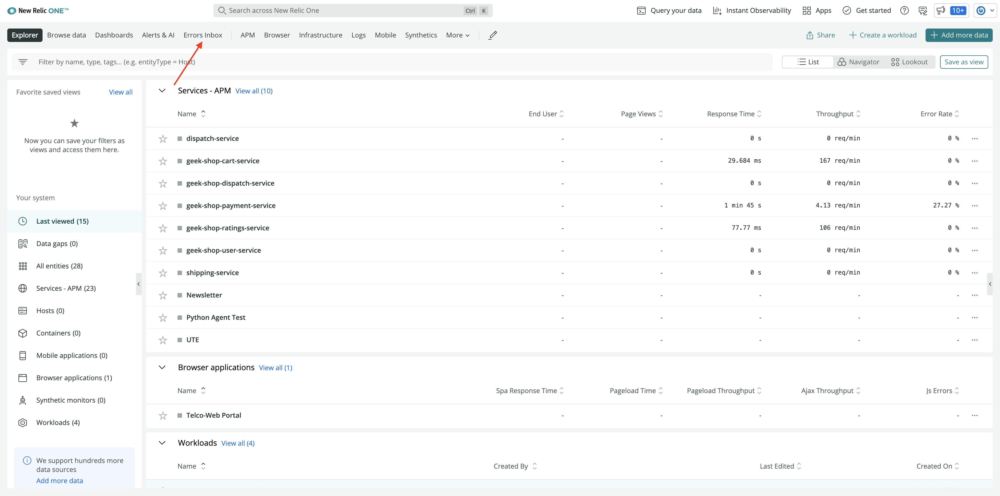
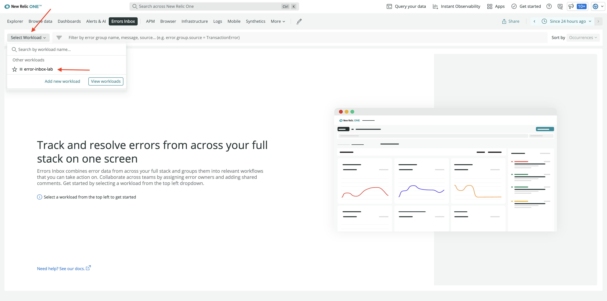
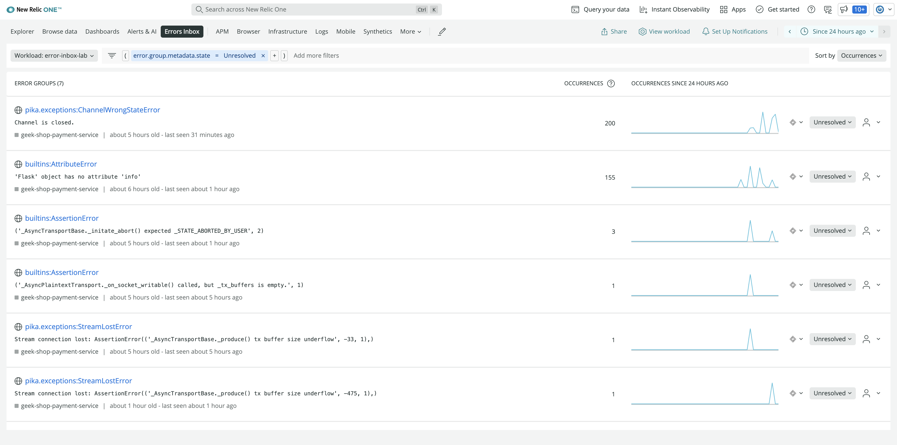

<Callout variant="course" title="lab">

This procedure is part of a lab that teaches you how to track full stack errors using errors inbox. 

Each procedure in the lab builds upon the last, so make sure you've [set your lab environment](/automate-workflows/error-inbox/spin-up-geek-movie) before starting this one.

</Callout>
Your app is now running in a development environment and your goal is to use errors inbox to proactively debug your application before deploying it to production. To observe your application in errors inbox, you first create a workload.

A workload groups specific apps and services that you want to monitor and provides an aggregated view of the health and activities of the entities in the workload.

In this procedure, you create a workload with all the geek movie shop services and observe this workload in errors inbox. 
                                                                                                                                                                                                                                                                                                                                                                                                                                                                                                                                                                                                                                                                                                                                                                                                                                                                                                                                                                                                                                                                                                                                                                                                                                                                                                                                                                                                                                                                                                                                                                                                                                                                                                                                                                                                                                                                                                                                                                                                                                                                                                                                                                                                                                                                                                                                                                                                                                                                                                                                                                                                                                                                                                                                                                                                                                                                                                                                                                                                                                                                                                                                                                                                                                                                                                                                                                                                                                                                                                                                                                                                                                                                                                                                                                                                                                                                                                                                                                                                                                                                                                                                                                                                                                                                                                                                                                                                                                                                                                                                                                                                                                                                                                                                                                                                                                                                                                                                                                                                                                                                                                                                                                                                                                                                                                                                                                                                                                                                                                                                                                                                                                                                                                                                                                                                                                                                                                                                                                                                                                                                                                                                                                                                                                                                                                                                                                                                                                                                                                                                                                                                                                                                                                                                                                                                                      
## Create a workload

Before you observe your application in errors inbox, you need to create a workload.
<Steps>
<Step>

Navigate to [New Relic One](one.newrelic.com) and sign in with your account. 
</Step>
<Step>

Click **+ Create a workload** in top right hand corner.

</Step>
<Step>

Name your workload as _error-inbox-lab_. Under **Select entities**, click **+ Add** for each of the following geek shop services to include it in the workload.

- geek-shop-cart-service
- geek-shop-catalogue-service
- geek-shop-dispatch-service
- geek-shop-payment-service
- geek-shop-ratings-service
- geek-shop-shipping-service
- geek-shop-user-service

</Step>
<Step>

Click **Create a workload** once you've added all the services.

</Step>
</Steps>

This creates a workload with all the geek-movie services for you and automatically redirects you to view the workload in New Relic. 

Read more about workloads in [our docs](https://docs.newrelic.com/docs/new-relic-one/use-new-relic-one/workloads/workloads-isolate-resolve-incidents-faster/).

Now that you have created workload, you can set up errors inbox. 

## Set up errors inbox
Set up errors inbox to start tracking errors across your workload.

<Steps>
<Step>

From [New Relic One](one.newrelic.com), select **Errors Inbox** from the top nav.

</Step>
<Step>

Click **Select Workload** and select **error-inbox-lab** workload from the drop down.

</Step>
<Step>

You see the error groups across your workload here.

</Step>
</Steps>

Your errors inbox is now set and you can start proactively monitoring errors across your stack.

<Callout variant="course" title="lab">

This procedure is part of a lab that teaches you how to track full stack errors using errors inbox. Now that you've set up errors inbox, continue on to next procedure, [Triage your errors](/automate-workflows/error-inbox/triage-errors).

</Callout>