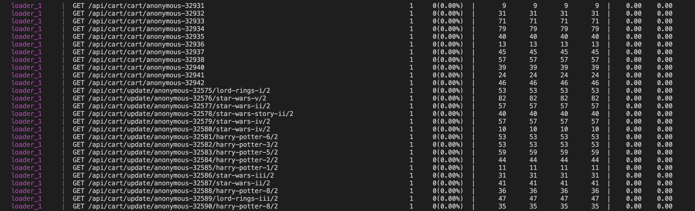

<Callout variant="course" title="lab">

This procedure is part of a lab that teaches you how to track full stack errors using errors inbox. If you haven't already, check out the [lab introduction](/automate-workflows/error-inbox).

</Callout>

Geek's Movie Shop is a web application that consists of several interconnected microservices like cart, catalogue, payment, user, and more. These services are instrumented with New Relic for performance monitoring and full visibility across all layers. 
The application is currently running in development environment and you're trying to catch any errors that you can before pushing the site to production. To test your application services, you're also generating load with a special service running in your docker network.
In this lab, you use New Relic's Errors Inbox to track and triage errors across your stack.

## Set up your environment

Before you begin with the lab, set up your development environment. 
<Steps>
<Step>
Clone the lab repository:

```bash
git clone https://github.com/newrelic-experimental/error-inbox-lab-material.git
```

</Step>
<Step>

Open the cloned repo in your IDE and edit the _.env_ file to set these variables:

```
DOCKERHUB_USER=username
TAG=latest
CLUSTER_NAME=local
PUBLIC_URL=http://docker-for-desktop:8888

NEW_RELIC_LICENSE_KEY=<YOUR_LISCENCE_KEY>
```

Here, NEW_RELIC_LICENSE_KEY is your liscence key for New Relic account. Your application uses this key to write telemetry data to New Relic. [You can find your New Relic license key in your account settings](https://docs.newrelic.com/docs/apis/intro-apis/new-relic-api-keys/).
</Step>
<Step>

Navigate to the root directory of your application and export these variables:

```bash
source .env
```

This sets all the environment variables needed to run your application. 
</Step>
<Step>
Build and run the application:

```bash animate
docker compose build
docker compose up
[output] {blue} [+] Building 96.1s (103/103) FINISHED 
[output] {blue}=> [username/rs-shipping:latest internal] load build definition from Dockerfile                        0.0s
[output] {blue}=> => transferring dockerfile: 784B                                                                    0.0s
[output] {blue}=> [username/rs-mongodb:latest internal] load build definition from Dockerfile                         0.0s
[output] {blue}=> => transferring dockerfile: 95B                                                                     0.0s
[output] {blue}=> [username/rs-ratings:latest internal] load build definition from Dockerfile                         0.0s
[output] {blue}=> => transferring dockerfile: 1.11kB                                                                  0.0s
[output] {blue}=> [username/rs-dispatch:latest internal] load build definition from Dockerfile                        0.0s
[output] {blue}=> => transferring dockerfile: 398B                                                                    0.0s
[output] {blue}=> [username/rs-catalogue:latest internal] load build definition from Dockerfile                       0.0s
[output] {blue}=> => transferring dockerfile: 187B                                                                    0.0s
[output] {blue}=> [username/rs-web:latest internal] load build definition from Dockerfile                             0.0s
[output] {blue}=> => transferring dockerfile: 234B                                                                    0.0s
[output] {blue}=> [username/rs-cart:latest internal] load build definition from Dockerfile                            0.0s
[output] {blue}=> => transferring dockerfile: 187B                                                                    0.0s
[output] {blue}=> [username/rs-payment:latest internal] load build definition from Dockerfile                         0.0s
[output] {blue}=> => transferring dockerfile: 227B                                                                    0.0s
[output] {blue}=> [username/rs-mysql:latest internal] load build definition from Dockerfile                           0.0s
[output] {blue}=> => transferring dockerfile: 422B                                                                    0.0s
[output] {blue}=> [username/rs-user:latest internal] load build definition from Dockerfile                            0.0s
[output] {blue}=> => transferring dockerfile: 187B                                                                    0.0s
[output] {blue}=> [username/rs-loader:latest internal] load build definition from Dockerfile                          0.0s
[output] {blue}=> => transferring dockerfile: 187B                                                                    0.0s
```
Once your application is up and running, you'll see loader generating the traffic:



Leave the application running so you could see the telemetry data in New Relic.
</Step>
</Steps>

<Callout variant="course" title="lab">

This procedure is part of a lab that teaches you how to track full stack errors using errors inbox. Now that you've set up your lab environment, continue on to next procedure, [Set up errors inbox](/automate-workflows/error-inbox/set-up-errors-inbox).

</Callout>
