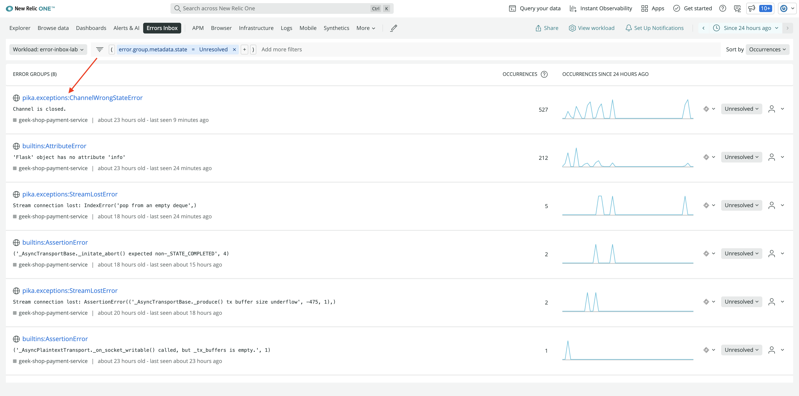
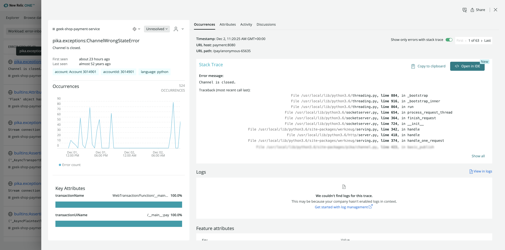
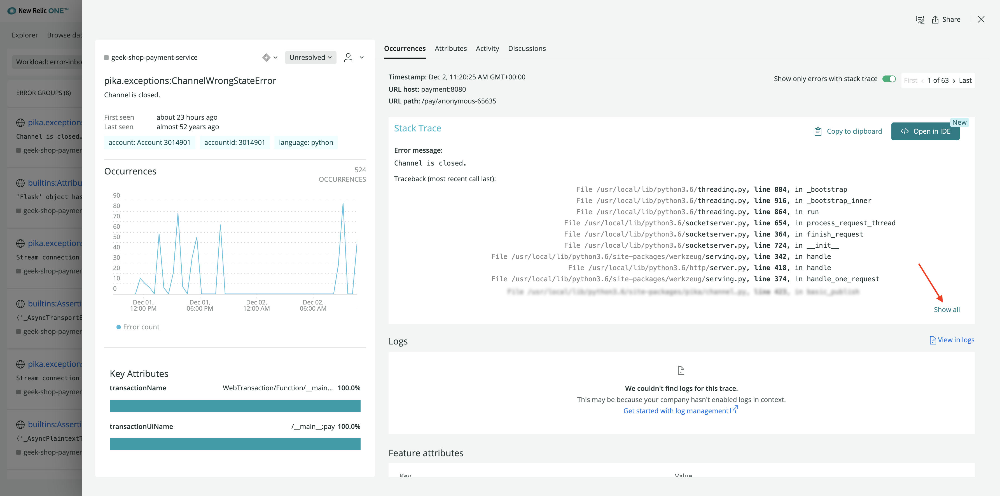
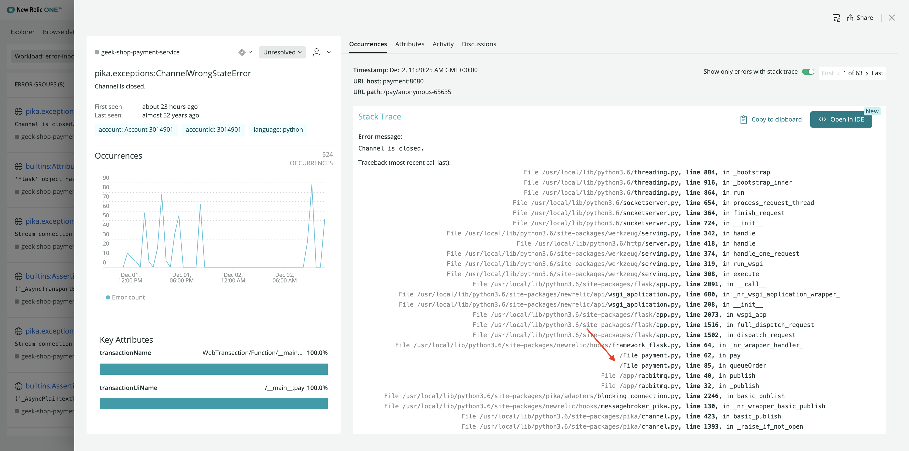
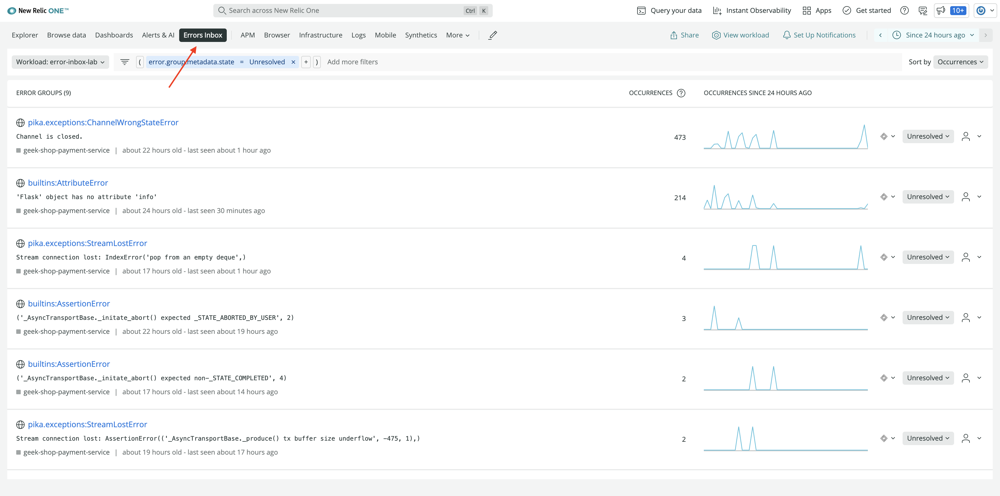
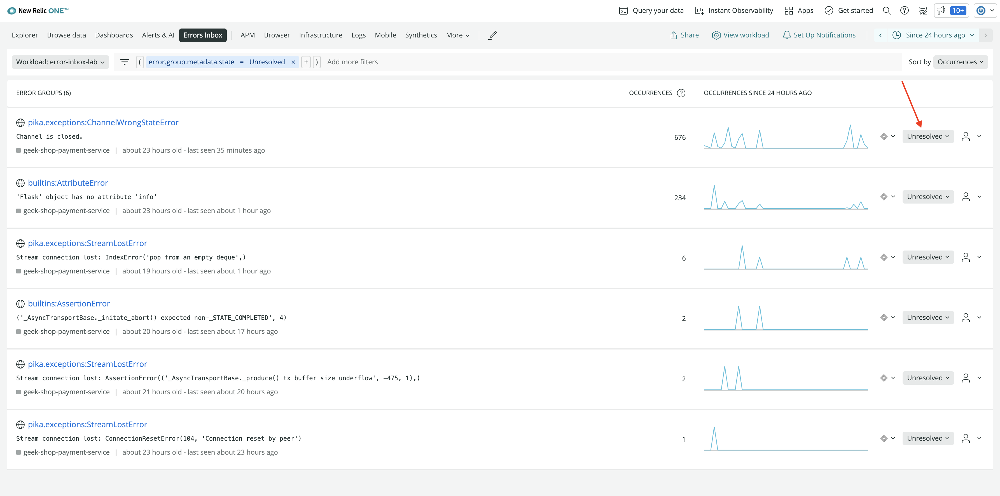
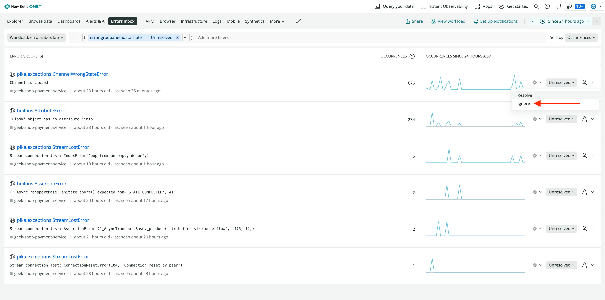
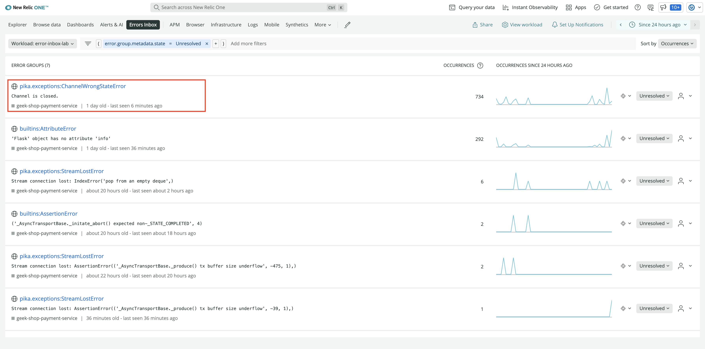
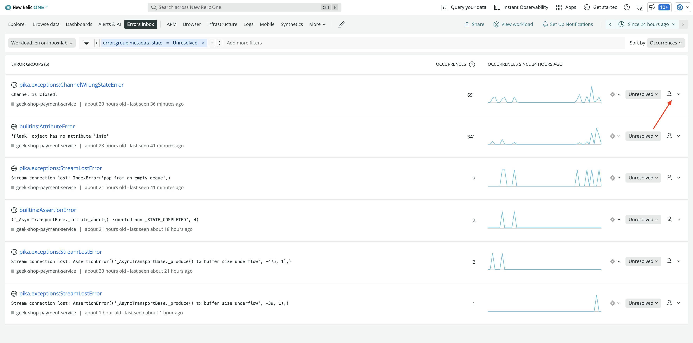
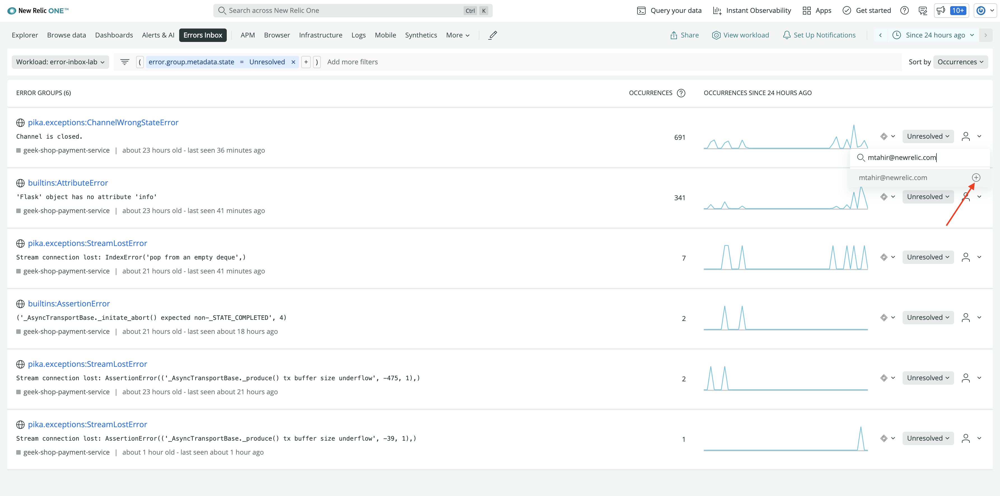

<Callout variant="course" title="lab">

This procedure is part of a lab that teaches you how to manage errors using Errors Inbox.

Each procedure in the lab builds upon the last, so make sure you've [set up Errors Inbox](/automate-workflows/error-inbox/set-up-errors-inbox) before starting this one.

</Callout>

Geek's Movie Shop is running in your development environment, and you're able to see its errors in Errors Inbox. Because you want to ensure a smooth experience for your customers, you need to analyze and triage these errors.

By triaging your errors, you reduce the noise in your inbox. This helps you focus on the errors that impact your application the most.

## View error details

In Errors Inbox, you see all unresolved errors across your application by default. Sometimes you need to learn more about an error before you can decide what to do with it.

<Steps>

<Step>

Click the `pika.exceptions:ChannelWrongStateError`.

This takes you to its details page.

Here, you see the error's full context, including its stack trace and the number of times it occurred. The stack trace is especially important since it helps you narrow down the cause of the problem.

</Step>

<Step>

In the bottom right corner of **Stack Trace**, click **Show all**.

The full trace tells you that something is wrong in your payment service.

If this were a real-world application, you could use this stack trace and other details from this view to fix the issue. However, in this lab you're focused on using Errors Inbox, so skip this step.

<Callout variant='tip'>

You can also integrate [CodeStream](https://newrelic.com/codestream) with your Errors Inbox. This allows you to jump to the relevant code in your IDE with the click of a button.

Once you've configured CodeStream, click ** Open in IDE**.

</Callout>

</Step>

</Steps>

## Set an error's status

Each error in Errors Inbox is **Unresolved** by default. But if you fix a bug or decide it isn't worth fixing, you can change its status to reflect that.

Another developer on your team said they fixed this `pika.exceptions:ChannelWrongStateError`, so update its status to **Resolved**.

<Steps>

<Step>

In New Relic, navigate to **Errors Inbox**.

</Step>

<Step>

On the error's row, click the status dropdown.

You see two options in the dropdown:

- **Resolve**
- **Ignore**

</Step>

<Step>

Select **Resolve**.

When you resolve an error, it no longer appears on the main screen. However, if the error occurs again, Errors Inbox automatically unresolves it.

<Callout variant='tip'>

If you want to ignore an error instead of resolving it, you can do that here as well.

When you ignore an error, it no longer appears on the main screen. To see it again, either change the filter to include ignored error groups or stop ignoring the error.

</Callout>

</Step>

</Steps>

## Assign an error

Refresh the page. Oops! You resolved `pika.exceptions:ChannelWrongStateError`, but it's back in your **Unresolved** error groups.

Apparently the bug wasn't fixed after all. You've decided to fix the error yourself.

<Steps>

<Step>

On the far right side of the error group, click the user icon.

</Step>

<Step>

Enter and submit your email address.

This tells your team that you're responsible for resolving the error.

<Callout variant='tip'>

Currently, when you assign an error group to a user, they don't receive a notification. Notifications are coming soon.

</Callout>

</Step>

</Steps>

You've triaged the `pika.exceptions:ChannelWrongStateError`. You can do the same for a few others as well. After ignoring, resolving, and assigning errors, your inbox is looking a lot cleaner than when you first saw it. Next, you filter your inbox and integrate it with other services so you can find, prioritize, and fix the errors that need fixing before you release your new app version to the world.

<Callout variant="course" title="lab">

This procedure is part of a lab that teaches you how to track full stack errors using Errors Inbox. Now that you've triaged your errors, it's time to [manage them](/automate-workflows/error-inbox/manage-errors).

</Callout>