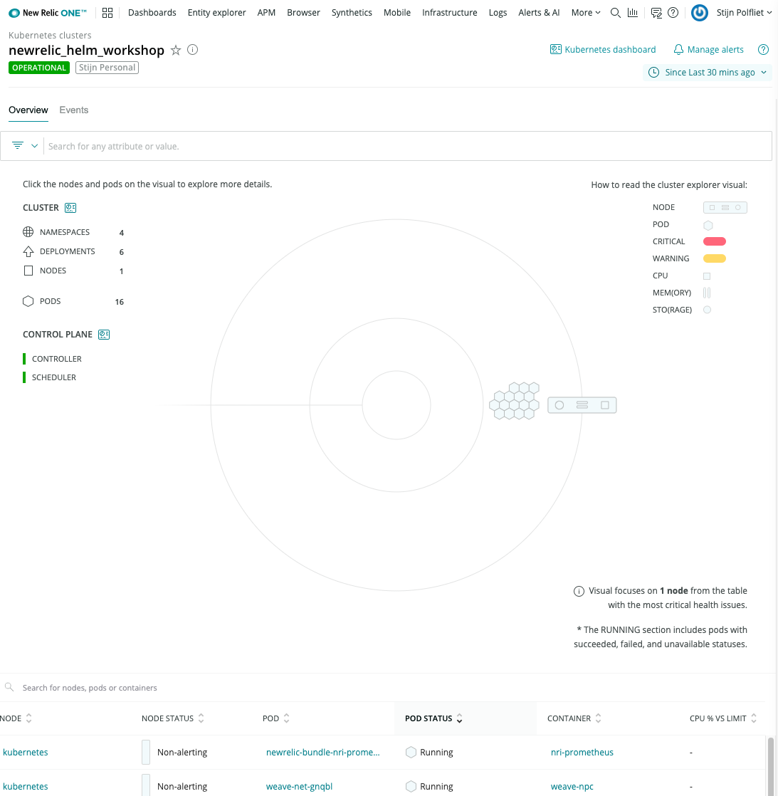

<Intro>

[Helm](https://helm.sh/) is like a package manager for Kubernetes. Helm charts help define, install and upgrade your Kubernetes applications.

In this guide you'll learn how to set up New Relic with the official [New Relic Helm charts](https://github.com/newrelic/helm-charts).
The Helm charts will deploy everything you need to get full observability of your Kubernetes environment.

</Intro>

## Before you begin

This walk through assumes you’ve already deployed a Kubernetes cluster. Or you can simply use our test environment, by following the interactive tutorial at the bottom of this page.

To use this guide, you should have some basic knowledge of both New Relic and Kubernetes. To complete the full exercise, you’ll need to:

- [Get your New Relic license key](https://docs.newrelic.com/docs/accounts/accounts-billing/account-setup/new-relic-license-key)
- Install [Helm 3](https://helm.sh/docs/intro/install/)

<Steps>
<Step>

## Adding the New Relic Helm repository

First, add the official [New Relic Helm repository](https://github.com/newrelic/helm-charts)

```bash
helm repo add newrelic https://helm-charts.newrelic.com
```

You should see something similar to the following:

```bash copyable=false
[output] "newrelic" has been added to your repositories
```

</Step>
<Step>

## Install the New Relic Helm chart

Follow the instructions to [get your New Relic license key](https://docs.newrelic.com/docs/accounts/accounts-billing/account-setup/new-relic-license-key)

Replace `YOUR_NEW_RELIC_LICENSE_KEY` and `CLUSTER_NAME` before running the following command:

```bash
helm install newrelic-bundle newrelic/nri-bundle \
 --set global.licenseKey=YOUR_NEW_RELIC_LICENSE_KEY \
 --set global.cluster=CLUSTER_NAME \
 --namespace=default \
 --set newrelic-infrastructure.privileged=true \
 --set ksm.enabled=true \
 --set prometheus.enabled=true \
 --set kubeEvents.enabled=true \
 --set logging.enabled=true
```

You should see something similar to the following:

```bash copyable=false
[output] NAME: newrelic-bundle
[output] LAST DEPLOYED: Wed Aug 19 09:04:52 2020
[output] NAMESPACE: default
[output] STATUS: deployed
[output] REVISION: 1
[output] TEST SUITE: None
```

Check if the New Relic agents have been deployed:

```bash
kubectl get daemonsets,pods
```

This should look similar to:

```bash copyable=false
[output] NAME                                                     DESIRED   CURRENT   READY   UP-TO-DATE   AVAILABLE   NODE SELECTOR   AGE
[output] daemonset.apps/newrelic-bundle-newrelic-infrastructure   1         1         1       1            1           <none>          2m53s
[output] daemonset.apps/newrelic-bundle-newrelic-logging          1         1         1       1            1           <none>          2m53s
[output] NAME                                                          READY   STATUS      RESTARTS   AGE
[output] pod/newrelic-bundle-kube-state-metrics-69ff8cfb74-rgjc5       1/1     Running     0          2m53s
[output] pod/newrelic-bundle-newrelic-infrastructure-z8ddb             1/1     Running     0          2m53s
[output] pod/newrelic-bundle-newrelic-logging-wp22p                    1/1     Running     0          2m53s
[output] pod/newrelic-bundle-nri-kube-events-f9d5bb944-kcxxf           2/2     Running     0          2m53s
[output] pod/newrelic-bundle-nri-metadata-injection-66d76c868b-xrcq8   1/1     Running     0          2m53s
[output] pod/newrelic-bundle-nri-metadata-injection-job-rszw5          0/1     Completed   0          2m53s
[output] pod/newrelic-bundle-nri-prometheus-569689b7cb-pnddg           1/1     Running     0          2m53s
```

</Step>
<Step>

## Use the New Relic Kubernetes cluster explorer

Open the [Kubernetes cluster explorer in New Relic One](https://one.newrelic.com/launcher/k8s-cluster-explorer-nerdlet.cluster-explorer-launcher?pane=eyJuZXJkbGV0SWQiOiJrOHMtY2x1c3Rlci1leHBsb3Jlci1uZXJkbGV0Lms4cy1jbHVzdGVyLWxpc3QifQ==)

You should see something like:



Want to know more? [Learn how to navigate the Kubernetes cluster explorer](https://docs.newrelic.com/docs/integrations/kubernetes-integration/understand-use-data/kubernetes-cluster-explorer)

</Step>
</Steps>

## Try it out now

We can have a Kubernetes test cluster ready for you in a few minutes. By following this on-line tutorial, you will learn how to deploy the New Relic Helm charts.

### Some tips to use the on-line tutorial window:

- Accept the cookies, so you can see the menu bar.
- Click anywhere in the tutorial window to start. It will take a few minutes for your environment to be ready.
- Press CTRL-l or type `clear` to clear the terminal window
- Click on the finish flag icon in the bottom menu to hide or show the instructions

Good luck!

<Callout variant="important">

Some browsers automatically disable the use of iframes. If the module isn't loading
please check your browser settings.

</Callout>

<iframe
  title="Instruct K8s Helm Module"
  width="1000"
  height="1000"
  sandbox="allow-same-origin allow-scripts allow-popups allow-forms"
  src="https://play.instruqt.com/embed/newrelic/nr-k8s-helm"
  style="border: 0;"
>
  <p>Your browser does not support iframes.</p>
</iframe>

## What’s next?

Nice work — now you can easily deploy New Relic with the official New Relic Helm charts and you can start using the Kubernetes cluster explorer.
The Kubernetes cluster explorer brings full observability to your k8s environment, so you can troubleshoot faster by correlating logs, metrics, events and traces all within the same user experience.
