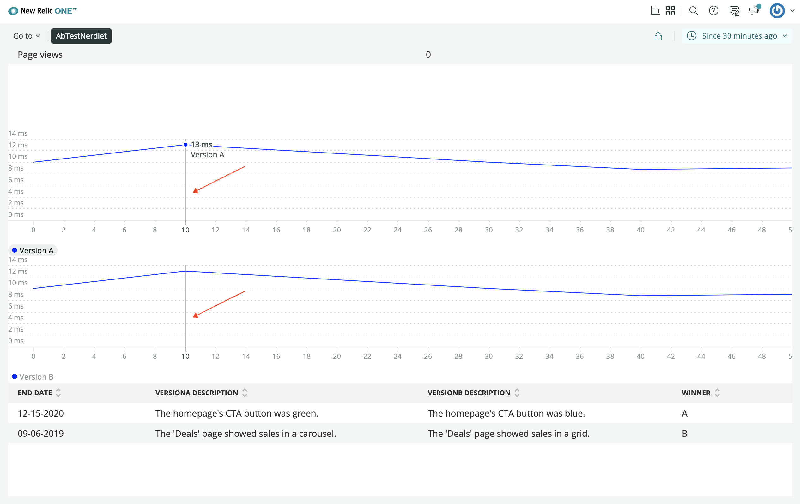

<HideWhenEmbedded>

<Callout variant="course">

This lesson is part of a course that teaches you how to build a New Relic application from the ground up. If you haven't already, check out the [course introduction](/ab-test).

Each lesson in the course builds upon the last, so make sure you've completed the last lesson, [_Add tables_](/build-apps/ab-test/table-charts), before starting this one.

</Callout>

</HideWhenEmbedded>

In previous lessons, you added a variety of charts to your A/B test application. These charts presented different facets of information about your A/B test, and they behaved independently from one other. In this lesson, you’ll create a new pair of line charts and learn how to synchronize their behaviors. Before you write any new code, consult your design guide to understand the role that these new charts will play in your application:


In the design guide, there is a line graph under each of the tables you created in the last lesson. These line graphs show the version-specific response times for newsletter signup requests. Now, you’ll build two more line charts, but this time, you’ll group them with a `ChartGroup` and specify that their values are measured in milliseconds.

<Steps>

<Step>

Change to the _add-a-chart-group/ab-test_ directory of the [coursework repository](https://github.com/newrelic-experimental/nru-programmability-course):

<>

```sh
cd nru-programmability-course/add-a-chart-group/ab-test
```
</>

</Step>

<Step>

In _nerdlets/ab-test-nerdlet_, add a new Javascript file named _page-views.js_:

<>

```sh
touch page-views.js
```
</>

</Step>

<Step>

In this new file, create a component called `VersionPageViews` to hold a `LineChart`, which shows the number of times a page is viewed:

<>

```js fileName=nerdlets/ab-test-nerdlet/page-views.js
import React from 'react';
import { LineChart } from 'nr1';

export default class VersionPageViews extends React.Component {
    render() {
        const versionPageViews = {
            metadata: {
                id: `page-views-${this.props.version}`,
                name: `Version ${this.props.version.toUpperCase()}`,
                viz: 'main',
                color: 'blue',
                units_data: {
                    y: 'MS'
                }
            },
            data: [
                { x: 0, y: 10 },
                { x: 10, y: 13 },
                { x: 20, y: 11.5 },
                { x: 30, y: 10 },
                { x: 40, y: 8.75 },
                { x: 50, y: 9 },
            ],
        }
        return <LineChart data={[versionPageViews]} fullWidth />
    }
}
```
</>

Notice the new attribute in the series' `metadata` fields: `units_data`. This attribute describes the unit type for a specified data axis. In this case, you set the unit type for the y axis to `'MS'`, which stands for milliseconds. Other options for unit types, include: `'PERCENTAGE'`, `'TIMESTAMP'`, and `'BYTES_PER_SECOND'`.

</Step>

<Step>

In your Nerdlet's _index.js_ file, import your new component and update your Nerdlet's `render()` method:

<>

```js fileName=nerdlets/ab-test-nerdlet/index.js lineHighlight=6,17-18
import React from 'react';
import NewsletterSignups from './newsletter-signups';
import PastTests from './past-tests';
import TotalCancellations from './total-cancellations';
import TotalSubscriptions from './total-subscriptions';
import VersionPageViews from './page-views';
import VersionTotals from './totals';

export default class AbTestNerdletNerdlet extends React.Component {
    render() {
        return <div>
            <NewsletterSignups />
            <TotalSubscriptions />
            <TotalCancellations />
            <VersionTotals version='a' />
            <VersionTotals version='b' />
            <VersionPageViews version='a' />
            <VersionPageViews version='b' />
            <PastTests />
        </div>
    }
}

```
</>

</Step>

<Step>

In _index.js_, import `ChartGroup` from `nr1` and group your `VersionPageViews`:

<>

```js fileName=nerdlets/ab-test-nerdlet/index.js lineHighlight=2,18-21
import React from 'react';
import { ChartGroup } from 'nr1';
import NewsletterSignups from './newsletter-signups';
import PastTests from './past-tests';
import TotalCancellations from './total-cancellations';
import TotalSubscriptions from './total-subscriptions';
import VersionPageViews from './page-views';
import VersionTotals from './totals';

export default class AbTestNerdletNerdlet extends React.Component {
    render() {
        return <div>
            <NewsletterSignups />
            <TotalSubscriptions />
            <TotalCancellations />
            <VersionTotals version='a' />
            <VersionTotals version='b' />
            <ChartGroup>
                <VersionPageViews version='a' />
                <VersionPageViews version='b' />
            </ChartGroup>
            <PastTests />
        </div>
    }
}

```
</>

Because the tables are conceptually related, as they show contrasting performance metrics over the same timeslice, it makes sense to group them in a `ChartGroup`. This means that the two charts behave synchronously. For example, when you hover over one chart, the other chart shows a hover indicator at the same x coordinate.

</Step>

<Step>

Navigate to the root of your Nerdpack at `nru-programmability-course/add-a-chart-group/ab-test`.

</Step>

<Step>

Generate a new UUID for your Nerdpack:

<>

```sh
nr1 nerdpack:uuid -gf
```
</>

Because you cloned the coursework repository that contained an existing Nerdpack, you need to generate your own unique identifier. This UUID maps your Nerdpack to your New Relic account.

</Step>

<Step>

[Serve your application locally](/build-apps/publish-deploy/serve):

<>

```sh
nr1 nerdpack:serve
```
</>

</Step>

<Step>

View your changes in [New Relic](https://one.newrelic.com?nerdpacks=local):



Here, you see the `LineChart` components synchronized in your application.

When you're finished, stop serving your New Relic application by pressing `CTRL+C` in your local server's terminal window.

<Callout variant="tip">

Each of the chart component types you've used in this lesson have had different series configurations. Most chart components share the same `metadata` attributes, like `LineChart` and `PieChart`, but differ in their `data` formats.

It's helpful to be aware of the different `data` formats, for when you create your own charts. You can read more about the `data` formats in the [chart component documentation](https://developer.newrelic.com/components/charts#data).

</Callout>

</Step>

</Steps>

Now your application is filled with charts, but it doesn't look great. The charts are stacked on top of one another in an unhelpful way. In the next lesson, you'll learn about the user interface components from the SDK and how you can use them to organize your charts.

<HideWhenEmbedded>

<Callout variant="course">

This lesson is part of a course that teaches you how to build a New Relic application from the ground up. When you're ready, continue on to the next lesson: [_Add user interface components to your application_](/build-apps/ab-test/add-ui).

</Callout>

</HideWhenEmbedded>
