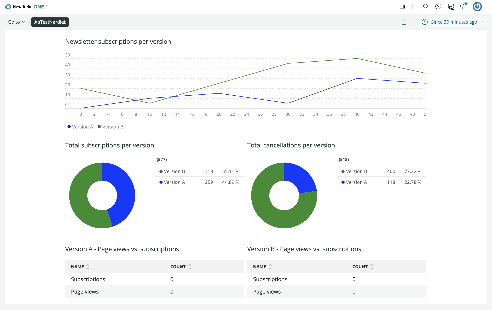

<HideWhenEmbedded>

<Callout variant="course">

This lesson is part of a course that teaches you how to build a New Relic One application from the ground up. If you haven't already, check out the [course introduction](/ab-test).

Each lesson in the course builds upon the last, so make sure you've completed the last lesson, [_Add a grid_](/build-apps/ab-test/grid), before starting this one.

</Callout>

</HideWhenEmbedded>

Organizing charts is one way to clarify the information you're trying to convey to your users. Headings are another. Since you have several charts on the same page, use headings to describe the information they show. To remember what data each chart presents, consult your design guide:


The design guide details what data each chart shows. Use those details to craft useful headings for your charts.

<Steps>

<Step>

Change to the _add-chart-headings/ab-test_ directory of the [coursework repository](https://github.com/newrelic-experimental/nru-programmability-course):

```sh
cd nru-programmability-course/add-chart-headings/ab-test
```

</Step>

<Step>

In _newsletter-signups.js_, _page-views.js_, _past-tests.js_, _total-cancellations.js_, _total-subscriptions.js_, and _totals.js_, import `HeadingText` and add a descriptive heading above the chart in each of your custom components:

<>

```js fileName=nerdlets/ab-test-nerdlet/newsletter-signups.js lineHighlight=2,38-43
import React from 'react';
import { HeadingText, LineChart } from 'nr1';

export default class NewsletterSignups extends React.Component {
    render() {
        const versionASignups = {
            metadata: {
                id: 'version-a-newsletter-signups',
                name: 'Version A',
                viz: 'main',
                color: 'blue',
            },
            data: [
                { x: 0, y: 0 },
                { x: 10, y: 10 },
                { x: 20, y: 15 },
                { x: 30, y: 5 },
                { x: 40, y: 30 },
                { x: 50, y: 25 },
            ],
        }
        const versionBSignups = {
            metadata: {
                id: 'version-b-newsletter-signups',
                name: 'Version B',
                viz: 'main',
                color: 'green',
            },
            data: [
                { x: 0, y: 20 },
                { x: 10, y: 5 },
                { x: 20, y: 25 },
                { x: 30, y: 45 },
                { x: 40, y: 50 },
                { x: 50, y: 35 },
            ],
        }
        return <div>
            <HeadingText className="chartHeader">
                Newsletter subscriptions per version
            </HeadingText>
            <LineChart data={[versionASignups, versionBSignups]} fullWidth />
        </div>
    }
}
```

```js fileName=nerdlets/ab-test-nerdlet/page-views.js lineHighlight=2,25-30
import React from 'react';
import { HeadingText, LineChart } from 'nr1';

export default class VersionPageViews extends React.Component {
    render() {
        const versionPageViews = {
            metadata: {
                id: `page-views-${this.props.version}`,
                name: `Version ${this.props.version.toUpperCase()}`,
                viz: 'main',
                color: 'blue',
                units_data: {
                    y: 'MS'
                }
            },
            data: [
                { x: 0, y: 10 },
                { x: 10, y: 13 },
                { x: 20, y: 11.5 },
                { x: 30, y: 10 },
                { x: 40, y: 8.75 },
                { x: 50, y: 9 },
            ],
        }
        return <div>
            <HeadingText className="chartHeader">
                Version {this.props.version.toUpperCase()} - Page views
            </HeadingText>
            <LineChart data={[versionPageViews]} fullWidth />
        </div>
    }
}
```

```js fileName=nerdlets/ab-test-nerdlet/past-tests.js lineHighlight=2,28-33
import React from 'react';
import { HeadingText, TableChart } from 'nr1';

export default class PastTests extends React.Component {
    render() {
        const historicalData = {
            metadata: {
                id: 'past-tests',
                name: 'Past tests',
                columns: ['endDate', 'versionADescription', 'versionBDescription', 'winner'],
            },
            data: [
                {
                    "endDate": "12-15-2020",
                    "versionADescription": "The homepage's CTA button was green.",
                    "versionBDescription": "The homepage's CTA button was blue.",
                    "winner": "A"
                },
                {
                    "endDate": "09-06-2019",
                    "versionADescription": "The 'Deals' page showed sales in a carousel.",
                    "versionBDescription": "The 'Deals' page showed sales in a grid.",
                    "winner": "B"
                }
            ],
        }

        return <div>
            <HeadingText className="chartHeader">
                Past tests
            </HeadingText>
            <TableChart data={[historicalData]} fullWidth />
        </div>
    }
}
```

```js fileName=nerdlets/ab-test-nerdlet/total-cancellations.js lineHighlight=2,28-33
import React from 'react';
import { HeadingText, PieChart } from 'nr1';

export default class TotalCancellations extends React.Component {
    render() {
        const cancellationsA = {
            metadata: {
                id: 'cancellations-A',
                name: 'Version A',
                viz: 'main',
                color: 'blue',
            },
            data: [
                { y: 118 },
            ],
        }
        const cancellationsB = {
            metadata: {
                id: 'cancellations-B',
                name: 'Version B',
                viz: 'main',
                color: 'green',
            },
            data: [
                { y: 400 },
            ],
        }
        return <div>
            <HeadingText className="chartHeader">
                Total cancellations per version
            </HeadingText>
            <PieChart data={[cancellationsA, cancellationsB]} fullWidth />
        </div>
    }
}
```

```js fileName=nerdlets/ab-test-nerdlet/total-subscriptions.js lineHighlight=2,28-33
import React from 'react';
import { HeadingText, PieChart } from 'nr1';

export default class TotalSubscriptions extends React.Component {
    render() {
        const subscriptionsA = {
            metadata: {
                id: 'subscriptions-A',
                name: 'Version A',
                viz: 'main',
                color: 'blue',
            },
            data: [
                { y: 259 },
            ],
        }
        const subscriptionsB = {
            metadata: {
                id: 'subscriptions-B',
                name: 'Version B',
                viz: 'main',
                color: 'green',
            },
            data: [
                { y: 318 },
            ],
        }
        return <div>
            <HeadingText className="chartHeader">
                Total subscriptions per version
            </HeadingText>
            <PieChart data={[subscriptionsA, subscriptionsB]} fullWidth />
        </div>
    }
}
```

```js fileName=nerdlets/ab-test-nerdlet/totals.js lineHighlight=2,27-32
import React from 'react';
import { HeadingText, TableChart } from 'nr1';

export default class VersionTotals extends React.Component {
    constructor(props) {
        super(props);
    }

    render() {
        const versionATotals = {
            metadata: {
                id: `totals-${this.props.version}`,
                name: `Version ${this.props.version}`,
                columns: ['name', 'count'],
            },
            data: [
                {
                    name: 'Subscriptions',
                    count: 0
                },
                {
                    name: 'Page views',
                    count: 0
                },
            ],
        }
        return <div>
            <HeadingText className="chartHeader">
                Version {this.props.version.toUpperCase()} - Page views vs. subscriptions
            </HeadingText>
            <TableChart data={[versionATotals]} fullWidth />
        </div>
    }
}
```

Notice the new `<div>` tag in each `render()`, which allows you to return multiple elements at once. Also, remember that we provided you a CSS stylesheet that styles the `chartHeader` class. You can look at `nerdlets/ab-test-nerdlet/styles.scss` to see more.

You don't need to modify your Nerdlet's `render()` method in _index.js_ because your components encapsulate the new code.

</>

</Step>

<Step>

Navigate to the root of your Nerdpack at `nru-programmability-course/add-a-grid/ab-test`.

</Step>

<Step>

Generate a new UUID for your Nerdpack:

```sh
nr1 nerdpack:uuid -gf
```

Because you cloned the coursework repository that contained an existing Nerdpack, you need to generate your own unique identifier. This UUID maps your Nerdpack to your New Relic account.

</Step>

<Step>

[Serve your application locally](/build-apps/publish-deploy/serve):

```sh
nr1 nerdpack:serve
```

</Step>

<Step>

View your changes in [New Relic](https://one.newrelic.com?nerdpacks=local):



Here, you see that your charts have descriptive headings.

When you're finished, stop serving your New Relic One application by pressing `CTRL+C` in your local server's terminal window.

</Step>

</Steps>

Well done! You've created all the charts that are laid out in your design guide. You’ve also organized them into a neat grid and added headings so that the charts are intelligible. While chart headings helps you understand what each chart shows, it'd be nice to add descriptions to help you remember what each version in your A/B test represents. In the next lesson, you'll add a description for each design version.

<HideWhenEmbedded>

<Callout variant="course">

This lesson is part of a course that teaches you how to build a New Relic One application from the ground up. Continue on to the next lesson: [_Add version descriptions_](/build-apps/ab-test/version-descriptions).

</Callout>

</HideWhenEmbedded>
