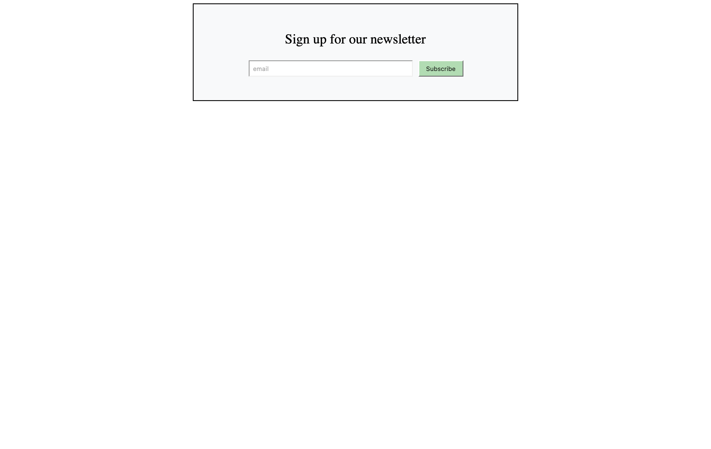
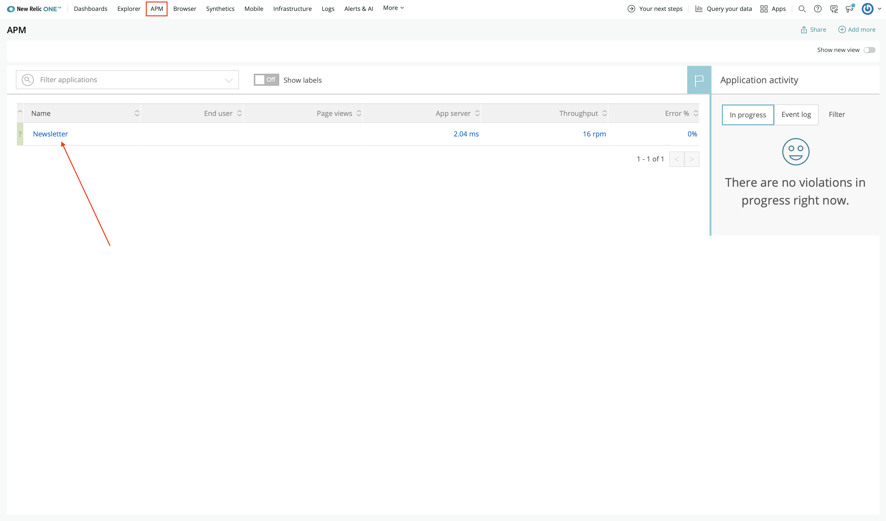
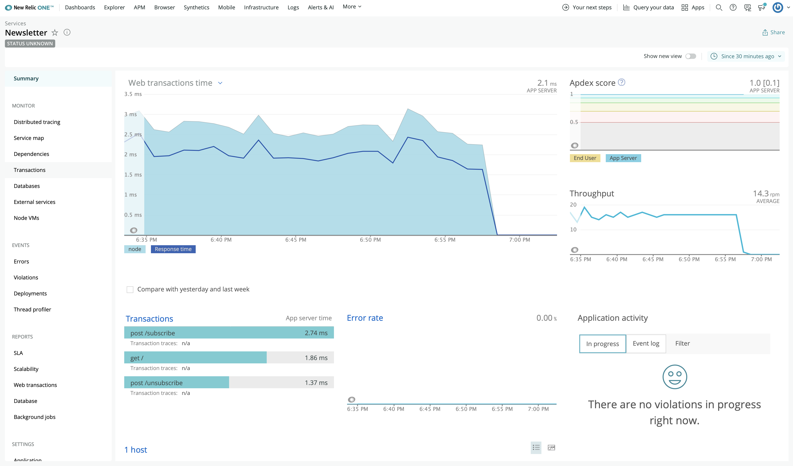

<HideWhenEmbedded>

<Callout variant="course">

This lesson is part of a course that teaches you how to build a New Relic One application from the ground up. If you haven't already, check out the [course introduction](/ab-test).

</Callout>

</HideWhenEmbedded>

Before you build your New Relic One application, you need to spin up your demo services. This coursework depends on two important services:

- A web service that shows a newsletter signup form. The form's heading text alternates between two versions because you're performing an A/B test to determine which text leads to more high-quality subscriptions.
- A simulator service that sends steady traffic to the website so that you don't have to manually generate data

To spin up your demo services, you first need to install [Docker](https://docs.docker.com/get-docker/) and [Docker compose](https://docs.docker.com/compose/install/).

## Spin up your demo services

<Steps>

<Step>

Clone the [coursework repository](https://github.com/newrelic-experimental/nru-programmability-course) from GitHub:

```sh
git clone https://github.com/newrelic-experimental/nru-programmability-course
```

This repository contains code for creating NodeJS New Relic automations. It also contains a an app code directory for each lesson in the course. You'll use these directories to follow along with the course content.

</Step>

<Step>

Change to the demo directory, called `ab-test-app`:

```sh
cd nru-programmability-course/ab-test-app
```

This directory contains configuration files and READMEs for using the demo.

</Step>

<Step>

Build and run the web service and simulator containers, using `docker-compose`:

```sh
NEW_RELIC_LICENSE_KEY=<your New Relic license key> docker-compose up -d
```

<Callout variant="important">

Make sure you replace `<your New Relic license key>` with your actual [license key](https://docs.newrelic.com/docs/accounts/accounts-billing/account-setup/new-relic-license-key/).

</Callout>

Once it's finished, view the website at localhost:3001:



</Step>

<Step>

Visit [New Relic](https://one.newrelic.com), and navigate to **APM** in the top navigation menu. Select **Newsletter** from the list of instrumented services:



You may have to wait a minute or two for New Relic to receive data from your demo services. Once it's ready, you'll see transaction data, such as performance, throughput, and an Apdex score:



</Step>

<Step>

To spin down your demo services, run `docker-compose down` from your `ab-test-app` directory:

```sh
docker-compose down
```

</Step>

</Steps>

Now you're ready to build your New Relic One application!

<HideWhenEmbedded>

<Callout variant="course">

This lesson is part of a course that teaches you how to build a New Relic One application from the ground up. Continue on to the next lesson: [_Install and configure the New Relic One CLI_](/build-apps/ab-test/install-nr1).

</Callout>

</HideWhenEmbedded>
