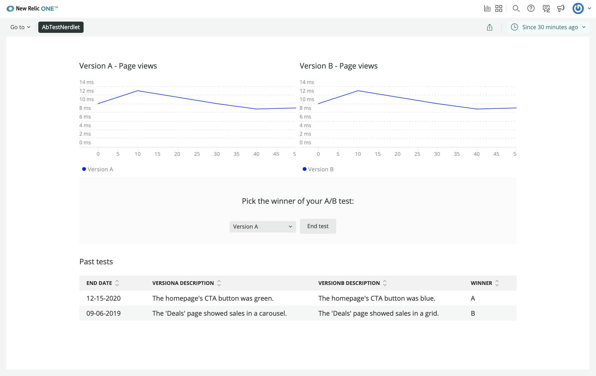

<HideWhenEmbedded>

<Callout variant="course">

This lesson is part of a course that teaches you how to build a New Relic application from the ground up. If you haven't already, check out the [course introduction](/ab-test).

Each lesson in the course builds upon the last, so make sure you've completed the last lesson, [_Add version descriptions_](/build-apps/ab-test/version-descriptions), before starting this one.

</Callout>

</HideWhenEmbedded>

In this course, you're building an A/B test application in New Relic. The application presents a lot of data, through its charts, about the effectiveness of each design version you're testing on your demo website. Ultimately, you'll be able to use that data to decide which design is most effective and show that design to every user who visits your site. In this lesson, you'll build a form into your application that lets you choose which design you want to show to every user of your site. Before writing any code, look at your design guide to review the section you're going to build:


This new section has three main components:

- A heading with instructional copy: "Pick a version to end the test"
- A component that you use to crown the winning version of the A/B test
- A button to confirm the winner that you selected

<Steps>

<Step>

Change to the _add-end-test-section/ab-test_ directory of the [coursework repository](https://github.com/newrelic-experimental/nru-programmability-course):

<>

```sh
cd nru-programmability-course/add-end-test-section/ab-test
```
</>

</Step>

<Step>

In _nerdlets/ab-test-nerdlet_, add a new Javascript file named _end-test.js_:

<>

```sh
touch end-test.js
```
</>

</Step>

<Step>

In this new file, create a `VersionSelector` component to encapsulate a `Select` and its `SelectItem` child components:

<>

```js fileName=nerdlets/ab-test-nerdlet/end-test.js
import React from 'react';
import { Select, SelectItem } from 'nr1';

class VersionSelector extends React.Component {
    render() {
        return <Select>
            <SelectItem value={'A'}>Version A</SelectItem>
            <SelectItem value={'B'}>Version B</SelectItem>
        </Select>
    }
}
```
</>

`VersionSelector` renders a `Select` component with two choices. In each `SelectItem`, you specify a `value` prop. In this case, you use `'A'` to represent version A and `'B'` to represent version B.

</Step>

<Step>

Create another component for a `Button` you'll use to make your test as ended:

<>

```js fileName=nerdlets/ab-test-nerdlet/end-test.js lineHighlight=2,13-19
import React from 'react';
import { Button, Select, SelectItem } from 'nr1';

class VersionSelector extends React.Component {
    render() {
        return <Select>
            <SelectItem value={'A'}>Version A</SelectItem>
            <SelectItem value={'B'}>Version B</SelectItem>
        </Select>
    }
}

class EndTestButton extends React.Component {
    render() {
        return <div>
            <Button>End test</Button>
        </div>
    }
}
```

</>

This looks trivial, but it will encapsulate button logic as you iterate on your app code.

</Step>

<Step>

Create a final component for the entire section you'll use to mark the end of your test:

<>

```js fileName=nerdlets/ab-test-nerdlet/end-test.js lineHighlight=4-6,28-44
import React from 'react';
import {
    Button,
    Grid,
    GridItem,
    HeadingText,
    Select,
    SelectItem,
} from 'nr1';

class VersionSelector extends React.Component {
    render() {
        return <Select>
            <SelectItem value={'A'}>Version A</SelectItem>
            <SelectItem value={'B'}>Version B</SelectItem>
        </Select>
    }
}

class EndTestButton extends React.Component {
    render() {
        return <div>
            <Button>End test</Button>
        </div>
    }
}

export default class EndTestSection extends React.Component {
    render() {
        return <Grid className="endTestSection">
            <GridItem columnSpan={12}>
                <HeadingText className="endTestHeader">
                    Pick the winner of your A/B test:
                </HeadingText>
            </GridItem>
            <GridItem columnStart={5} columnEnd={6} className="versionSelector">
                <VersionSelector />
            </GridItem>
            <GridItem columnStart={7} columnEnd={8}>
                <EndTestButton>End test</EndTestButton>
            </GridItem>
        </Grid>
    }
}
```

</>

Here, you create a `Grid` with three items. First, you create a `GridItem` that contains a `HeadingText` and spans all 12 columns. In the next row, you have two items:

- The `VersionSelector` component you created in the previous step
- A `Button` which reads "End test"

These items each span one column, but instead of using `columnSpan`, they use a combination of `columnStart` and `columnEnd` to specify which columns they cover.

</Step>

<Step>

In your Nerdlet's _index.js_ file, add `EndTestSection` to your Nerdlet:

<>

```js fileName=nerdlets/ab-test-nerdlet/index.js lineHighlight=3,45
import React from 'react';
import { ChartGroup, Grid, GridItem } from 'nr1';
import EndTestSection from './end-test';
import NewsletterSignups from './newsletter-signups';
import PastTests from './past-tests';
import TotalCancellations from './total-cancellations';
import TotalSubscriptions from './total-subscriptions';
import VersionDescription from './description';
import VersionPageViews from './page-views';
import VersionTotals from './totals';

const VERSION_A_DESCRIPTION = 'The newsletter signup message says, "Sign up for our newsletter"'
const VERSION_B_DESCRIPTION = 'The newsletter signup message says, "Sign up for our newsletter and get a free shirt!"'

export default class AbTestNerdletNerdlet extends React.Component {
    render() {
        return <div>
            <Grid className="wrapper">
                <GridItem columnSpan={6}>
                    <VersionDescription
                        description={VERSION_A_DESCRIPTION}
                        version="A"
                    />
                </GridItem>
                <GridItem columnSpan={6}>
                    <VersionDescription
                        description={VERSION_B_DESCRIPTION}
                        version="B"
                    />
                </GridItem>
                <GridItem columnSpan={12}><hr /></GridItem>
                <GridItem columnSpan={12}><NewsletterSignups /></GridItem>
                <GridItem columnSpan={6}><TotalSubscriptions /></GridItem>
                <GridItem columnSpan={6}><TotalCancellations /></GridItem>
                <GridItem columnSpan={6}><VersionTotals version='a' /></GridItem>
                <GridItem columnSpan={6}><VersionTotals version='b' /></GridItem>
                <ChartGroup>
                    <GridItem columnSpan={6}>
                        <VersionPageViews version='a' />
                    </GridItem>
                    <GridItem columnSpan={6}>
                        <VersionPageViews version='b' />
                    </GridItem>
                </ChartGroup>
                <GridItem columnSpan={12}><EndTestSection /></GridItem>
                <GridItem columnSpan={12}><PastTests /></GridItem>
            </Grid>
        </div>
    }
}
```
</>

</Step>

<Step>

Navigate to the root of your Nerdpack at `nru-programmability-course/add-end-test-section/ab-test`.

</Step>

<Step>

Generate a new UUID for your Nerdpack:

<>

```sh
nr1 nerdpack:uuid -gf
```
</>

Because you cloned the coursework repository that contained an existing Nerdpack, you need to generate your own unique identifier. This UUID maps your Nerdpack to your New Relic account.

</Step>

<Step>

[Serve your application locally](/build-apps/publish-deploy/serve):

<>

```sh
nr1 nerdpack:serve
```
</>

</Step>

<Step>

Go to [https://one.newrelic.com?nerdpacks=local](https://one.newrelic.com?nerdpacks=local), and view your application under **Apps > Your apps**:



When you're finished, stop serving your New Relic application by pressing `CTRL+C` in your local server's terminal window.

</Step>

</Steps>

However, you need to make a few improvements to this code. When you select a version, the selected value in the component doesn't change. You must control the value that `Select` displays using its `value` prop and `onChange` event handler. In the next lesson, you’ll update your code to persist your version choice in the `Select` component.

<HideWhenEmbedded>

<Callout variant="course">

This lesson is part of a course that teaches you how to build a New Relic application from the ground up. Continue on to the next lesson: [_Persist the selected version_](/build-apps/ab-test/persist-version).

</Callout>

</HideWhenEmbedded>
