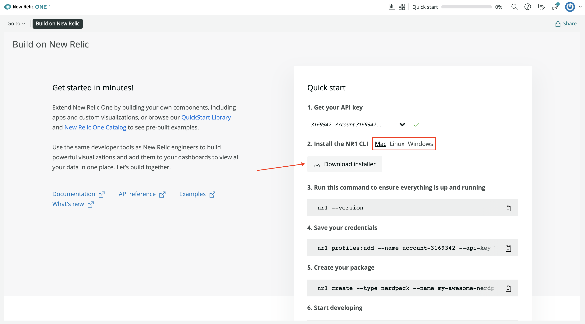
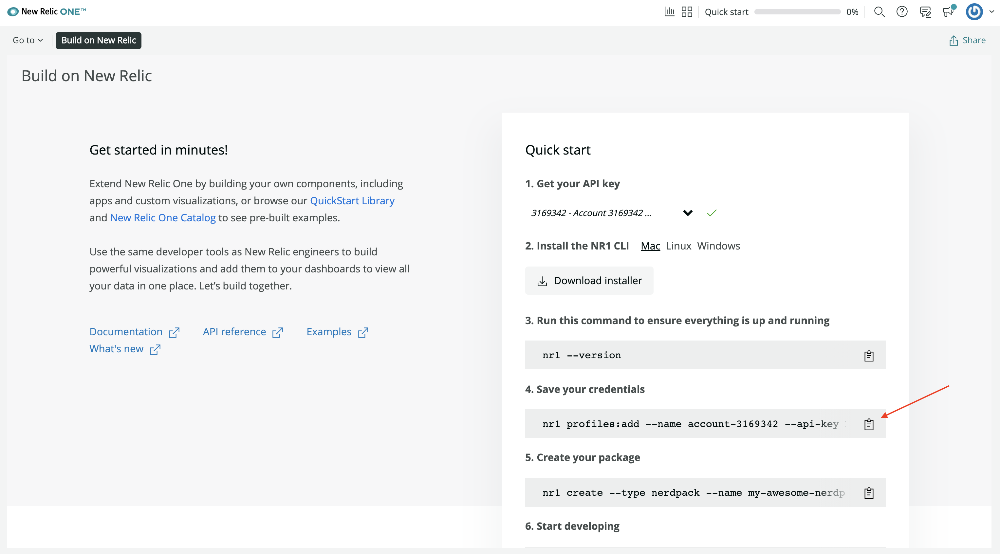

<HideWhenEmbedded>

<Callout variant="course">

This lesson is part of a course that teaches you how to build a New Relic One application from the ground up. If you haven't already, check out the [course introduction](/ab-test).

Each lesson in the course builds upon the last, so make sure you've completed the last lesson, [_Spin up your demo services_](/build-apps/ab-test/demo-setup), before starting this one.

</Callout>

</HideWhenEmbedded>

One of the primary elements of the New Relic One SDK is the command line interface (CLI). To create a Nerdpack , you'll need to install the SDK, configure the CLI to work with your New Relic account, and then utilize its `create` command.

# Install and configure the CLI

<Steps>

<Step>

Go to the [**Build on New Relic**](https://one.newrelic.com/launcher/developer-center.launcher?pane=eyJuZXJkbGV0SWQiOiJkZXZlbG9wZXItY2VudGVyLmRldmVsb3Blci1jZW50ZXIifQ==) quick start.

</Step>

<Step>

Get your API key:


Once you install the CLI, you'll use this key to create a user profile that's associated with your account. The CLI uses this profile to manage entities within your account.

</Step>

<Step>

Read and accept the New Relic developer terms and conditions:


Even if you install the CLI, you won't be able to use it without first accepting these terms and conditions.

</Step>

<Step>

Choose your operating system and click **Download installer**:



Once you've installed the SDK, you'll have access to the `nr1` CLI. Verify this by checking your SDK version:

```sh
nr1 --version
```

If you already had the CLI, update it:

```sh
nr1 update
```

<Callout variant="tip">

It’s important to distinguish between the `newrelic` CLI and the `nr1` CLI. `newrelic` is for managing entities in your New Relic account. `nr1` is for managing New Relic One applications.

</Callout>

</Step>

<Step>

Copy the command to save your credentials:



This command has a profile name, your region, and your API key baked in.

Run the command in your terminal:

```sh
nr1 profiles:add --name <profile name> --api-key <User key> --region <region>
```

Profiles let you select which New Relic account you want to run commands against. If you have multiple accounts, you can view them with `profiles:list`:

```sh
nr1 profiles:list
```

Notice that one profile is your default profile. This is the account your commands will run against, unless you specify another. To specify a profile for a particular command, use the `--profile` option:

```sh
nr1 create --profile <your profile>
```

If this is your first time using the CLI, then the profile you just added is your default profile. If you have other profiles, you need to set your default to the one you'd like to use for this course:

```sh
nr1 profiles:default
```

<Callout variant="tip">

If you forget these commands, you can look them up in the profiles help menu:

```sh
nr1 profiles --help
```

</Callout>

</Step>

</Steps>

Now, you can exit the **Build on New Relic** quick start. You’re ready to build an application with the New Relic One CLI!

<HideWhenEmbedded>

<Callout variant="course">

This lesson is part of a course that teaches you how to build a New Relic One application from the ground up. Continue on to the next lesson: [_Create a Nerdpack_](/build-apps/ab-test/create-nerdpack).

</Callout>

</HideWhenEmbedded>
