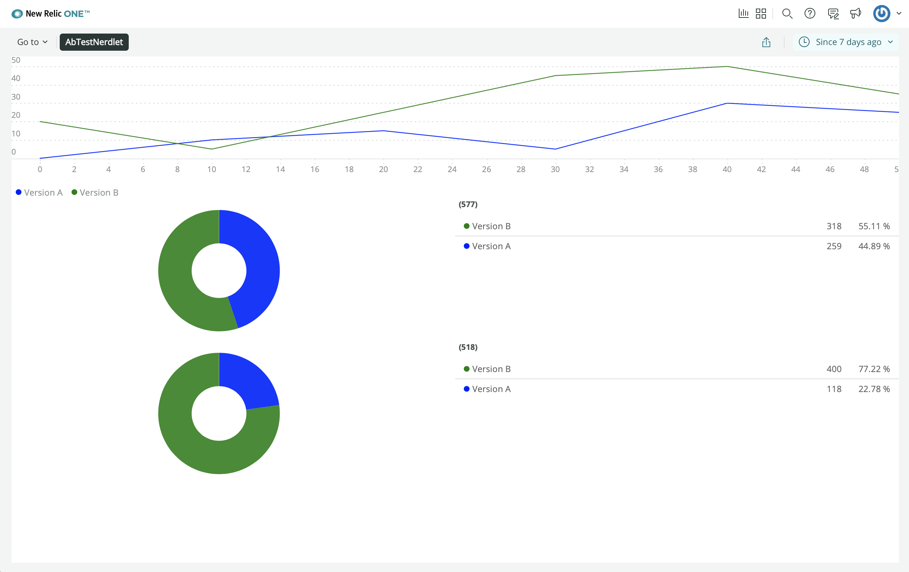

<HideWhenEmbedded>

<Callout variant="course">

This lesson is part of a course that teaches you how to build a New Relic One application from the ground up. If you haven't already, check out the [course introduction](/ab-test).

Each lesson in the course builds upon the last, so make sure you've completed the last lesson, [_Add your first chart_](/build-apps/ab-test/first-chart), before starting this one.

</Callout>

</HideWhenEmbedded>

You’ve begun building your A/B test application. So far, it consists of a single line chart, which represents the number of subscriptions your newsletter receives from each version of your website. To understand what you’ll build in this lesson, review the design guide to remember what charts come next:


In the design, there are two pie charts beneath the line chart that you’ve already created. One represents the distribution of users who receive version A and version B. The other represents the distribution of successful requests from users who got version A and version B.

<Steps>

<Step>

Change to the _add-pie-charts/ab-test_ directory of the [coursework repository](https://github.com/newrelic-experimental/nru-programmability-course):

```sh
cd nru-programmability-course/add-pie-charts/ab-test
```

This directory contains the code that we expect your application to have at this point in the course. By navigating to the correct directory at the start of each lesson, you leave your custom code behind, thereby protecting yourself from carrying incorrect code from one lesson to the next.

</Step>

<Step>

In _nerdlets/ab-test-nerdlet_, add two new Javascript files:

- _total-subscriptions.js_
- _total-cancellations.js_

```sh
touch total-subscriptions.js total-cancellations.js
```

</Step>

<Step>

In _total-subscriptions.js_, create a component, called `TotalSubscriptions`, which renders mocked subscription data:

```js fileName=nerdlets/ab-test-nerdlet/total-subscriptions.js
import React from 'react';
import { PieChart } from 'nr1';

export default class TotalSubscriptions extends React.Component {
    render() {
        const subscriptionsA = {
            metadata: {
                id: 'subscriptions-A',
                name: 'Version A',
                viz: 'main',
                color: 'blue',
            },
            data: [
                { y: 259 },
            ],
        }
        const subscriptionsB = {
            metadata: {
                id: 'subscriptions-B',
                name: 'Version B',
                viz: 'main',
                color: 'green',
            },
            data: [
                { y: 318 },
            ],
        }
        return <PieChart data={[subscriptionsA, subscriptionsB]} fullWidth />
    }
}
```

Notice that the series `data` is formatted differently for `PieChart` than it was for `LineChart`. Because `PieChart` uses unidimensional data, its series only take y-values.

</Step>

<Step>

In _total-cancellations.js_, create a component, called `TotalCancellations`, which renders mocked cancellation data:

```js fileName=nerdlets/ab-test-nerdlet/total-subscriptions.js
import React from 'react';
import { PieChart } from 'nr1';

export default class TotalCancellations extends React.Component {
    render() {
        const cancellationsA = {
            metadata: {
                id: 'cancellations-A',
                name: 'Version A',
                viz: 'main',
                color: 'blue',
            },
            data: [
                { y: 118 },
            ],
        }
        const cancellationsB = {
            metadata: {
                id: 'cancellations-B',
                name: 'Version B',
                viz: 'main',
                color: 'green',
            },
            data: [
                { y: 400 },
            ],
        }
        return <PieChart data={[cancellationsA, cancellationsB]} fullWidth />
    }
}
```

</Step>

<Step>

In your Nerdlet's _index.js_ file, import your new components and update your Nerdlet's `render()` method:

```js fileName=nerdlets/ab-test-nerdlet/index.js lineHighlight=3-4,10-11
import React from 'react';
import NewsletterSignups from './newsletter-signups';
import TotalCancellations from './total-cancellations';
import TotalSubscriptions from './total-subscriptions';

export default class AbTestNerdletNerdlet extends React.Component {
    render() {
        return <div>
            <NewsletterSignups />
            <TotalSubscriptions />
            <TotalCancellations />
        </div>
    }
}
```

</Step>

<Step>

Navigate to the root of your Nerdpack at _nru-programmability-course/add-pie-charts/ab-test_.

</Step>

<Step>

Generate a new UUID for your Nerdpack:

```sh
nr1 nerdpack:uuid -gf
```

Because you cloned the coursework repository that contained an existing Nerdpack, you need to generate your own unique identifier. This UUID maps your Nerdpack to your New Relic account.

</Step>

<Step>

[Serve your application locally](/build-apps/publish-deploy/serve):

```sh
nr1 nerdpack:serve
```

</Step>

<Step>

View your changes in [New Relic](https://one.newrelic.com?nerdpacks=local):



Here, you see the `PieChart` components displayed in your application.

When you're finished, stop serving your New Relic One application by pressing `CTRL+C` in your local server's terminal window.

</Step>

</Steps>

Your application is starting to take shape. You’ve created a line chart and two pie charts. For now, these charts use mocked data, but you’ll provide them real data in a later lesson. Before you focus on the data in your charts, however, you’ll learn how to add a table to your application so you can visualize data in a new way.

<HideWhenEmbedded>

<Callout variant="course">

This lesson is part of a course that teaches you how to build a New Relic One application from the ground up. When you're ready, continue on to the next lesson: [_Add tables_](/build-apps/ab-test/table-charts).

</Callout>

</HideWhenEmbedded>
