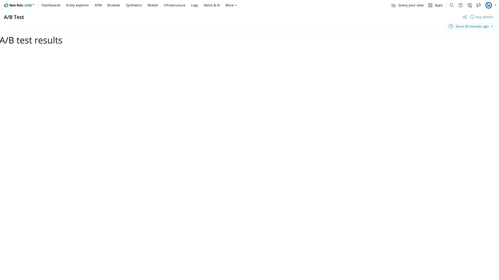

<HideWhenEmbedded>

<Callout variant="course">

This lesson is part of a course that teaches you how to build a New Relic application from the ground up. If you haven't already, check out the [course introduction](/ab-test).

Each lesson in the course builds upon the last, so make sure you've completed the last lesson, [_Create a Nerdpack_](/build-apps/ab-test/create-nerdpack), before starting this one.

</Callout>

</HideWhenEmbedded>

When you build a New Relic application, it's valuable to view it on the platform. This helps you design, implement, and debug your application in the environment it will eventually be published to. With `nr1`, you can launch a development server that hosts your application so that New Relic can present it to you.

<Steps>

<Step>

From inside the Nerdpack's root directory, serve your Nerdpack:

<>

```bash
nr1 nerdpack:serve
```
</>

When the Nerdpack has succeeded building and your application is ready to view, you'll see a message with a link to New Relic:

<>

```bash copyable=false
[output] {green}✔{plain}  Server ready! Test it at: {purple}https://one.newrelic.com/?nerdpacks=local
[output] {blue}↩{plain}  Server will reload automatically if you modify any file!
```
</>

Notice the appended query parameter `nerdpacks=local`. This query parameter tells New Relic to show locally served Nerdpacks.

<Callout variant="tip">

If you don't see your application on the New Relic platform, make sure you've included `nerdpacks=local` in your querystring!

</Callout>

</Step>

<Step>

Navigate to the provided url. From the home page, select **Apps** to view New Relic applications:


</Step>

<Step>

Under the **Your apps** section, find your launcher, called "A/B Test Launcher":


</Step>

<Step>

Select your launcher to see your root Nerdlet and its default welcome message:


<Callout variant="tip">

Here, you've seen how to access your Nerdlet from a launcher. If you want your Nerdlet closer to your data, you can also [attach your Nerdlet to New Relic entities](/build-apps/attach-nerdlet-to-entities#attach-your-nerdlet-to-entities).

</Callout>

</Step>

</Steps>

Congratulations, you've served your first New Relic application!

Notice, in the command's output, that the server reloads when you change files in your Nerdpack. Give it a try by updating _nerdlets/ab-test-nerdlet/index.js_:

```js fileName=nerdlets/ab-test-nerdlet/index.js lineHighlight=5
import React from 'react';

export default class AbTestNerdletNerdlet extends React.Component {
    render() {
        return <h1>A/B test results</h1>;
    }
}
```

Your app automatically refreshes to show the new heading:



<HideWhenEmbedded>

<Callout variant="course">

This lesson is part of a course that teaches you how to build a New Relic application from the ground up. Continue on to the next lesson: [_Add chart components to your A/B test application_](/build-apps/ab-test/add-charts).

</Callout>

</HideWhenEmbedded>
