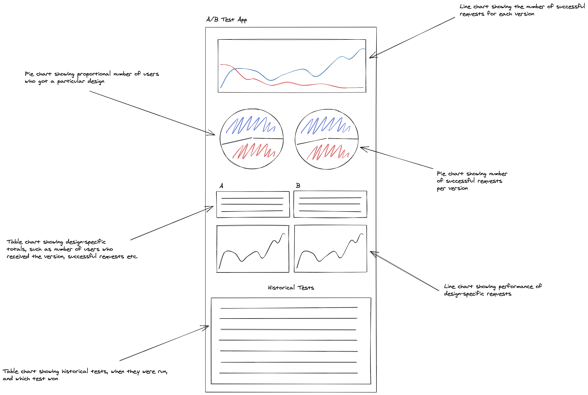
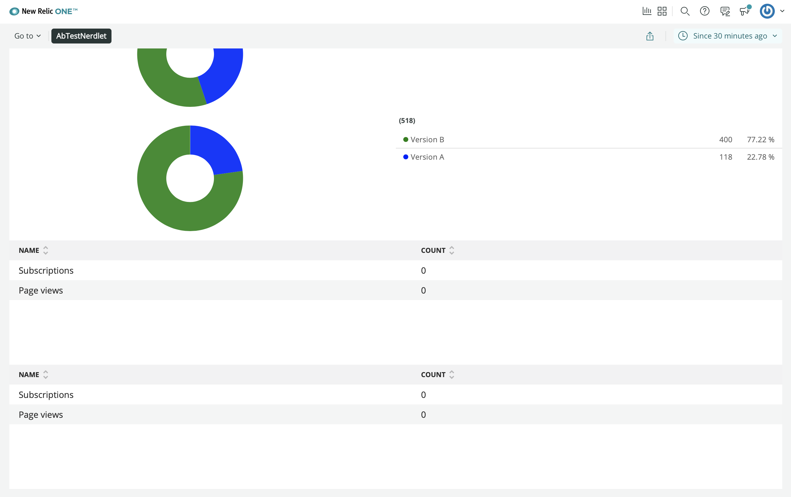

<HideWhenEmbedded>

<Callout variant="course">

This lesson is part of a course that teaches you how to build a New Relic One application from the ground up. If you haven't already, check out the [course introduction](/ab-test).

Each lesson in the course builds upon the last, so make sure you've completed the last lesson, [_Add pie charts_](/build-apps/ab-test/pie-charts), before starting this one.

</Callout>

</HideWhenEmbedded>

In each hands-on lesson in this course, you have been adding something new to your A/B test application. You’ve spun up a new launcher and added multiple chart components to your Nerdlet. In this lesson, you’ll create two new `TableChart` components that display information about each version of your website, such as the ratio of customers who subscribe to those who unsubscribe. Review your design guide to understand where these tables will fit into your application:



In this design guide, the `TableChart` components come after the pie charts you created in the last lesson.

<Steps>

<Step>

Change to the _add-tables/ab-test_ directory of the [coursework repository](https://github.com/newrelic-experimental/nru-programmability-course):

```sh
cd nru-programmability-course/add-tables/ab-test
```

This directory contains the code that we expect your application to have at this point in the course. By navigating to the correct directory at the start of each lesson, you leave your custom code behind, thereby protecting yourself from carrying incorrect code from one lesson to the next.

</Step>

<Step>

In _nerdlets/ab-test-nerdlet_, add a new Javascript file named _totals.js_:

```sh
touch totals.js
```

</Step>

<Step>

In this new file, create a component called `VersionTotals` to hold your first `TableChart` and some mock data:

```js fileName=nerdlets/ab-test-nerdlet/totals.js
import React from 'react';
import { TableChart } from 'nr1';

export default class VersionTotals extends React.Component {
    constructor(props) {
        super(props);
    }

    render() {
        const versionATotals = {
            metadata: {
                id: `totals-${this.props.version}`,
                name: `Version ${this.props.version}`,
                columns: ['name', 'count'],
            },
            data: [
                {
                    name: 'Subscriptions',
                    count: 0
                },
                {
                    name: 'Page views',
                    count: 0
                },
            ],
        }
        return <TableChart data={[versionATotals]} fullWidth />
    }
}
```

`TableChart` is different from `PieChart` and `LineChart` in three big ways. First of all, there are no `color` or `viz` metadata attributes in its series. `TableChart` has a standard visualization, so it ignores things like `color`, which don't apply. Second, the `TableChart` series have `columns` metadata attributes. `columns` determines the names of the columns on the table. Finally, `TableChart` series data use neither x nor y values. Instead, they use keys that match the table column and values that determine what goes into the row.

Notice that `VersionTotals` takes a `version` prop and supplies it to the chart metadata's `id` and `name` fields. This allows you to use this same component to create a table for version A and B and eliminate duplicate code.

</Step>

<Step>

In your Nerdlet's _index.js_ file, import your new component and update your Nerdlet's `render()` method:

```js fileName=nerdlets/ab-test-nerdlet/index.js lineHighlight=5,13-14
import React from 'react';
import NewsletterSignups from './newsletter-signups';
import TotalCancellations from './total-cancellations';
import TotalSubscriptions from './total-subscriptions';
import VersionTotals from './totals';

export default class AbTestNerdletNerdlet extends React.Component {
    render() {
        return <div>
            <NewsletterSignups />
            <TotalSubscriptions />
            <TotalCancellations />
            <VersionTotals version='a' />
            <VersionTotals version='b' />
        </div>
    }
}
```

</Step>

<Step>

Navigate to the root of your Nerdpack at _nru-programmability-course/add-tables/ab-test_.

</Step>

<Step>

Generate a new UUID for your Nerdpack:

```sh
nr1 nerdpack:uuid -gf
```

Because you cloned the coursework repository that contained an existing Nerdpack, you need to generate your own unique identifier. This UUID maps your Nerdpack to your New Relic account.

</Step>

<Step>

[Serve your application locally](/build-apps/publish-deploy/serve):

```sh
nr1 nerdpack:serve
```

</Step>

<Step>

View your changes in [New Relic](https://one.newrelic.com?nerdpacks=local):



Here, you see the `TableChart` components displayed in your application.

When you're finished, stop serving your New Relic One application by pressing `CTRL+C` in your local server's terminal window.

</Step>

</Steps>

<Callout variant="tip" title="Extra credit">

There is one more table in the design guide that records past tests. The columns for this table are:

- **End Date:** The end date for the test
- **Version A Description:** A description for version A
- **Version B Description:** A description for version B
- **Winner:** The version selected as the final design

Try to build this table in your application with these column names and some fake data, without looking at a code sample. This practice will reinforce what you've learned in this lesson.

If you need help, review the `add-a-chart-group` directory of the [coursework repository](https://github.com/newrelic-experimental/nru-programmability-course), which corresponds to the next lesson in this course. This has the code for the `PastTests` component.

</Callout>

Each chart you’ll add to your application throughout this course is unique in its type or in the data it presents. So far, you’ve created tables, pie charts, and a line chart, and they all function independently of one another. In the next lesson, you’ll create a couple more line charts, but this time they’ll function together.

<HideWhenEmbedded>

<Callout variant="course">

This lesson is part of a course that teaches you how to build a New Relic One application from the ground up. When you're ready, continue on to the next lesson: [_Add a chart group_](/build-apps/ab-test/chart-group).

</Callout>

</HideWhenEmbedded>
