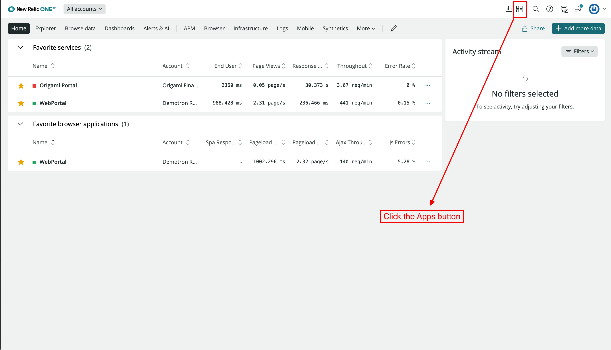
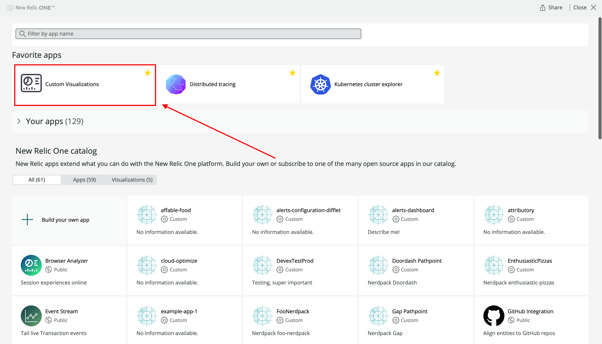
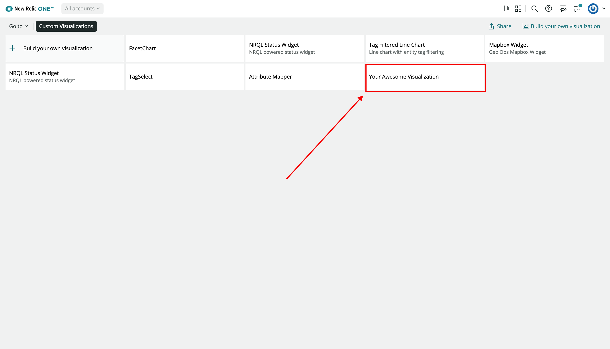
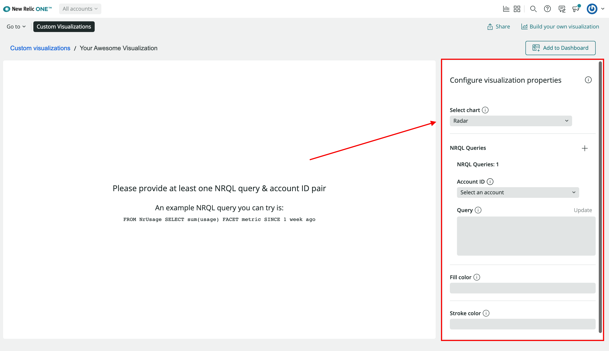
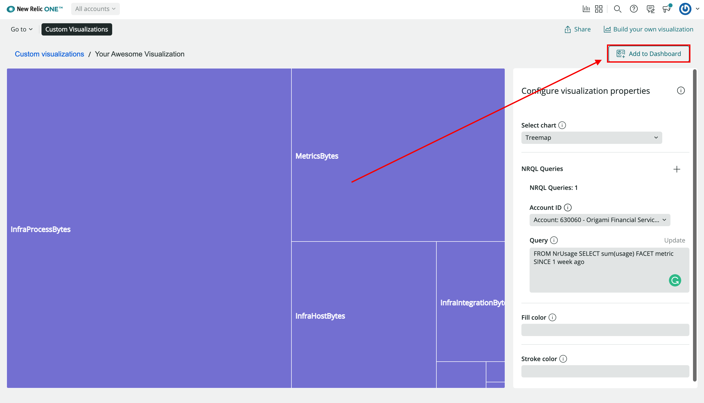
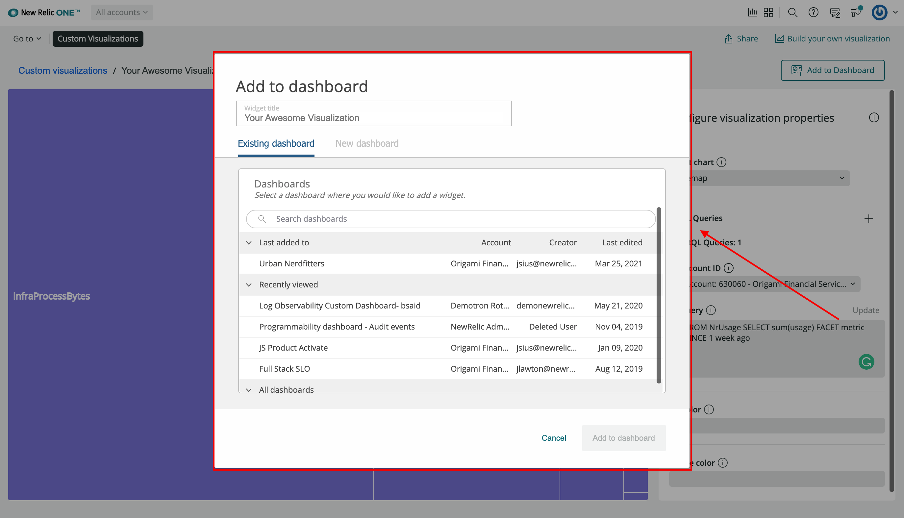
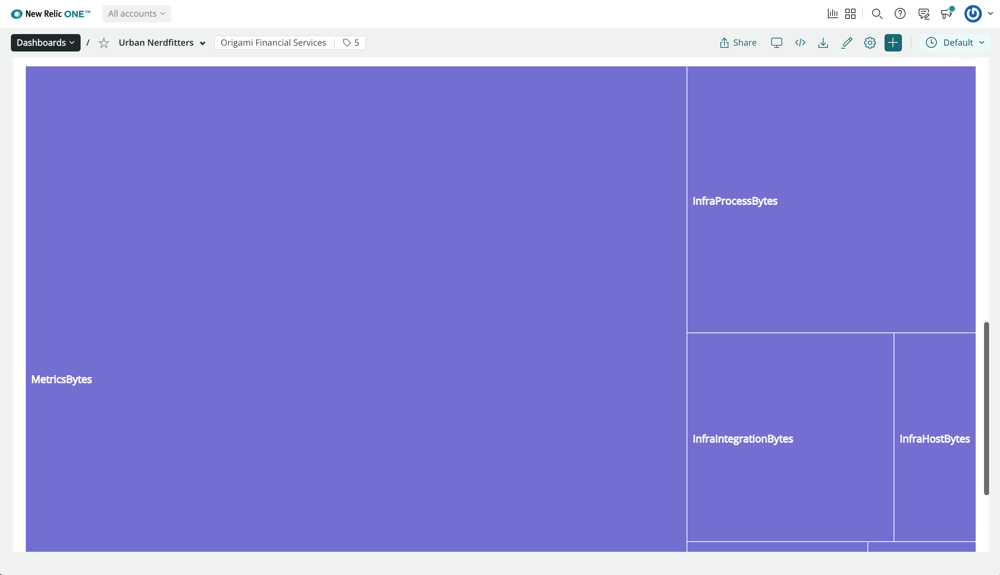

<Intro>

This guide builds off of the previous [Customize visualizations with configuration](build-apps/customize-visualizations-with-configuration) guide. If you haven't followed that guide, please start there as this guide assumes you have the code you built there to get started.

If you don't have a visualization to follow the examples in this gude, a accompanying example visualization is available on [GitHub](https://github.com/newrelic/nru-custom-visualization-course)

Following the previous guide, you reconfigured your visualization to use the platform configurations panel removing the unneeded `SegmentedControl` component. Now that you can customize your visualization using nr1.json configuration, in the following steps, you will configure and add your custom visualization to a New Relic dashboard.

</Intro>

## Before you begin

To get started, make sure you follow the [Customize visualizations with configuration](/build-apps/customize-visualizations-with-configuration) guide. You will need to publish your Nerdpack and subscribe it to your New Relic account.

The steps to publish and subscribe your custom visualization are the same steps as publishing a New Relic application learned in the previous course section. To review the process for publishing Nerdpacks, you follow the [subscribe to the Nerdpack via the CLI](/build-apps/publish-deploy) guide.

<Callout variant="tip">

Note: To publish a Nerdpack you must be a Full user and granted the Nerdpacks “modify” privilege (which is granted by default).

Read our documentation to learn more about [Nerdpacks privileges](https://developer.newrelic.com/build-apps/permission-manage-apps/).

</Callout>

## Add your custom visualization to a dashboard

Once you've published your custom visualization to your account, in the following steps you will configure your visualization and add it to a dashboard. You can add a visualization to a new or existing dashboard within your New Relic account.

<Steps>

  <Step>
  To find the <strong>My Awesome Visualization</strong> that you have deployed, you need to look for your visualization in the app catalog. From the <a href="https://one.newrelic.com">New Relic One homepage</a>, select the <strong>Apps</strong> button in the top right navigation bar.  

   

  Once on the <strong>Apps</strong> page, click the <strong>Custom Visualizations</strong> launcher. 

   

  <Callout variant="tip">

  Note: if you don't see the <strong>Custom Visualizations</strong> tile, use the search to locate it.

  </Callout>

  </Step>

  <Step>
  In <strong>Custom Visualizations</strong>, you will see all of the visualization that have been deployed to your account and any visualizations you are serving locally.  

  Select the <strong>My Awesome Visualization</strong> to add to a dashboard and then enable it.  

  

  </Step>

  <Step>

  In the previous guide, you reconfigured your visualization to use the platform configurations panel. Use the configuration options to select your desired chart, select your account, insert a NRQL query, and any other configurations you desire.

  As you make your selections, the visualization will update with your changes.  

  

  </Step>

  <Step>
  Click <strong>Add to dashboard</strong> and then select a dashboard from the list of available dashboards, or select <strong>New dashboard</strong>.  

   

  If you decide to create a new dashboard, select the account where you want to run the dashboard, and give the dashboard a name. 

  

  </Step>

  <Step>
  Click <strong>Add to dashboard</strong>, then click the link to your dashboard to see the custom visualization.  

  

  </Step>

</Steps>

## Manage your dashboard visualizations
<strong>Deleting:</strong> To remove a visualization from a dashboard, click the ellipses button in the right-hand corner of the visualization and click delete.  

<strong>Editing:</strong> If your visualization needs some tweaking, delete the visualization, then follow the steps above to re-add the visualization, making any updates in Custom Visualizations.

## Summary

Congratulations on completing this final guide and adding your custom visualization to a New Relic dashboard. In the previous lessons, you've used the tools in the New Relic SDK to create a new custom visualization, configured the visualization using the SDK and using the platform configuration panel.

## Additional resources

- New Relic Quick Tips video: [Dashboards and Custom Visualizations](https://www.youtube.com/watch?v=_F61mxtKfGA) (6 minutes)
- New Relic NerdBytes video: [Configuring custom visualizations for dashboards](https://www.youtube.com/watch?v=sFpG_iG7Xa8) (7 minutes)
- New Relic Nerdlog live stream: [Custom Data Visualizations on New Relic](https://www.youtube.com/watch?v=HuR0EdHGz24) (30 minutes)
- New Relic One SDK components: <Link to="explore-docs/intro-to-sdk">Intro to New Relic One SDK Component library</Link>

