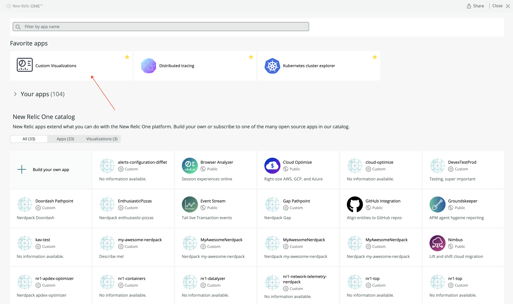
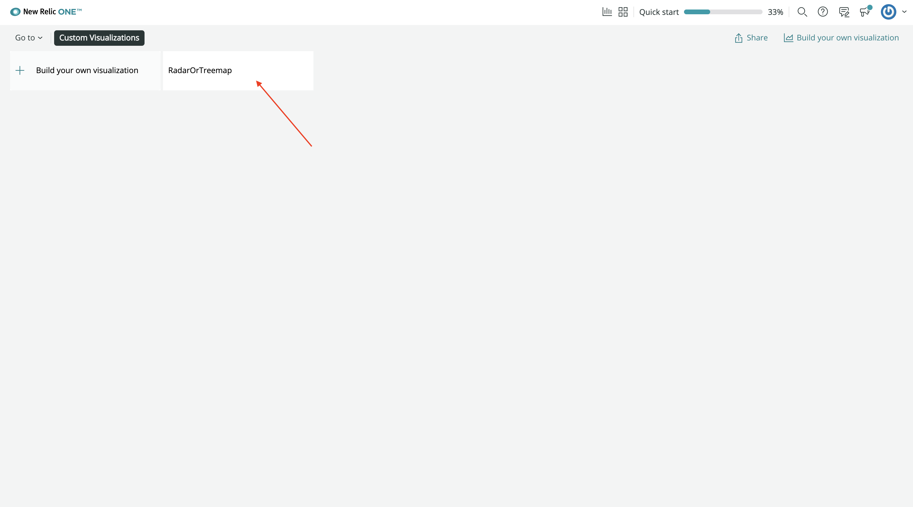
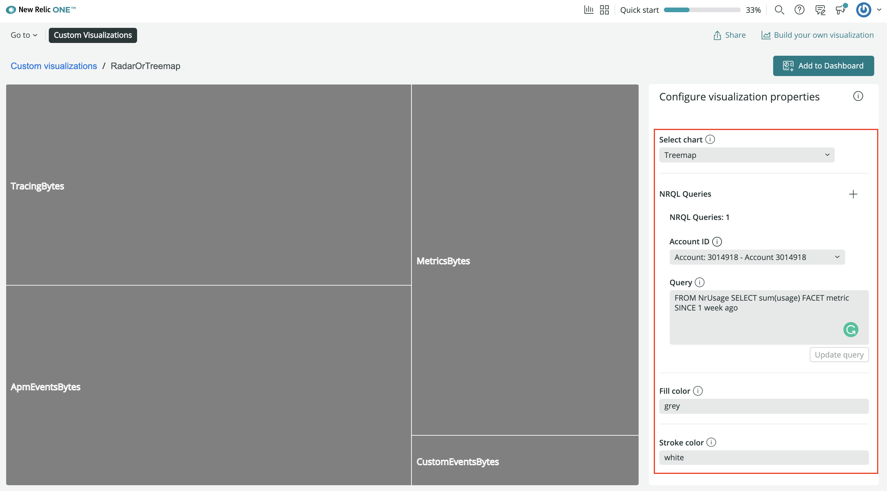
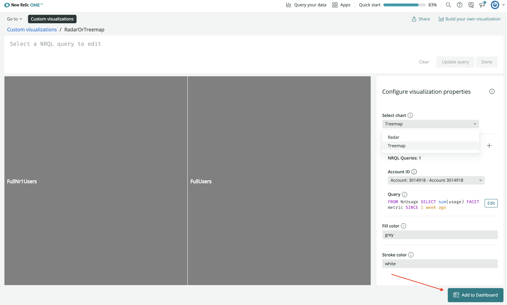
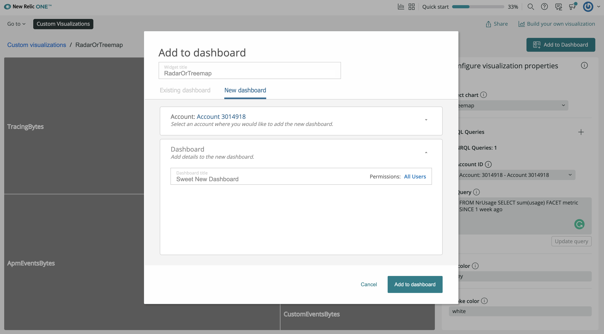
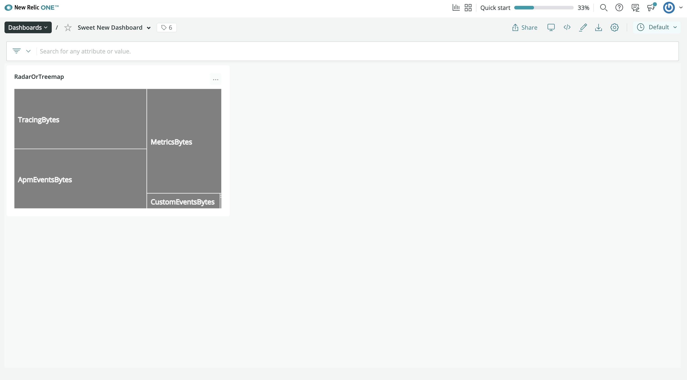
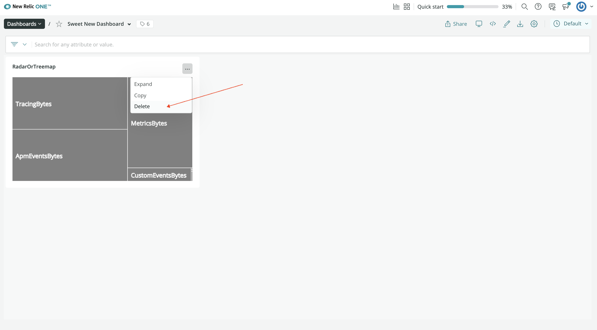
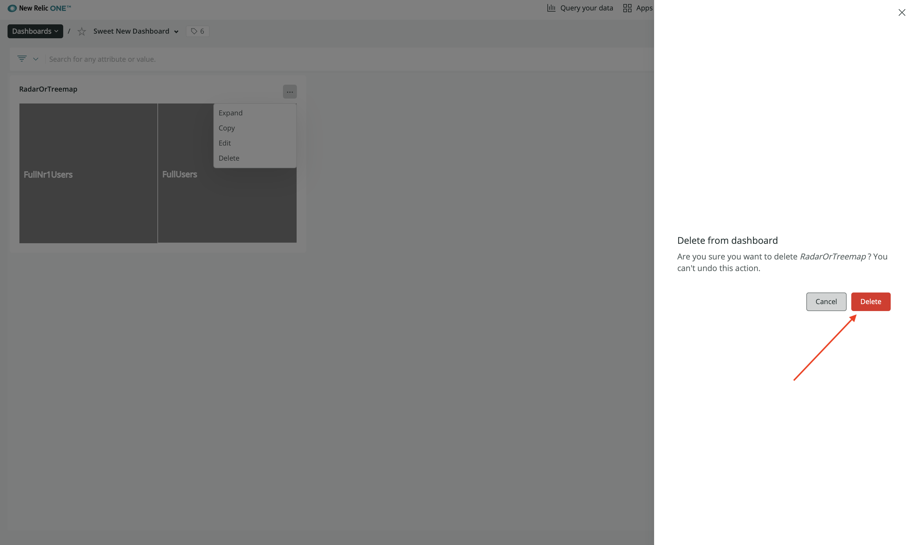

<HideWhenEmbedded>

<Callout variant="course">

This lesson is part of a course that teaches you how to build a custom visualization on the New Relic platform.

Each lesson in the course builds upon the last, so make sure you've completed the last lesson, [_Customize visualizations with configuration_](/build-apps/customize-visualizations-with-configuration), before starting this one.

</Callout>

</HideWhenEmbedded>

<Intro>

In the previous lesson, you added a configuration option to your visualization that allows you to choose how you want to represent your data. This was different from the previous version of your code because, while you can still choose your chart type, you can now only do it before you create an instance of your visualization. But what does it mean to create an instance of your visualization? How do you use a visualization once you've configured it?

In this lesson, you'll learn how to create an instance of your visualization and add that instance to dashboard.

<Callout variant="tip">

If you got lost in the previous steps and would like to see what your files should look like to start this lesson, check out the [course project](https://github.com/newrelic/nru-custom-visualization-course) on Github.

</Callout>

</Intro>

## Add your custom visualization to a dashboard

<Steps>

<Step>

From the root directory of your Nerdpack, [publish and subscribe](/build-apps/publish-deploy) to your visualization:

```sh
nr1 nerdpack:publish
nr1 nerdpack:subscribe
```

<Callout variant="important">

To publish a Nerdpack you must be a Full user with the Nerdpacks “modify” privilege (this is granted by default).

Read our [Nerdpacks privileges](/build-apps/permission-manage-apps/) documentation to learn more.

</Callout>

Next, find your published visualization in the New Relic Apps overlay.

</Step>

<Step>

From the [New Relic homepage](https://one.newrelic.com), select the **Apps** button in the top right navigation bar:


</Step>

<Step>

From the **Apps** page, click the **Custom Visualizations** launcher:



</Step>

<Step>

Select **RadarOrTreemap**:



</Step>

<Step>

In the previous lesson, you changed your visualization to use the platform configurations panel for selecting a chart type. Use this panel to configure your chart:



</Step>

<Step>

Click **Add to dashboard**. Then, select a dashboard from the list of available dashboards, or select **New dashboard**:



If you decide to create a new dashboard, select an account and a name:



Click **Add to dashboard**.

</Step>

<Step>

Go to your dashboard to see your custom visualization:



Note that you can create another version of the visualization with the other chart type and add it to the same dashboard. That's why we call these instances of your visualization.

</Step>

</Steps>

## Delete your visualization

Once you've added your visualization to a dashboard, you can't edit it. You can't change the underyling query, account ID, chart type, or any other previously configurable option. So, if you're not happy with your visualization, delete it from your dashboard and walk through the steps in this guide again to add a new instance.

<Steps>

<Step>

Click the ellipses button in the right-hand corner of the visualization, and click **Delete**:



</Step>

<Step>

Confirm that you want to delete your visualization:



</Step>

</Steps>

## Summary

Now you know how to:

- Create new custom visualizations with the New Relic app SDK
- Configure your visualizations using the SDK and configuration options
- Add your visualizations to a dashboards

To learn more about custom visualizations, check out the following resources:

- New Relic Quick Tips video: [Dashboards and Custom Visualizations](https://www.youtube.com/watch?v=_F61mxtKfGA) (6 minutes)
- New Relic NerdBytes video: [Configuring custom visualizations for dashboards](https://www.youtube.com/watch?v=sFpG_iG7Xa8) (7 minutes)
- New Relic changelog live stream: [Custom Data Visualizations on New Relic](https://www.youtube.com/watch?v=HuR0EdHGz24) (30 minutes)
- New Relic app SDK components: <Link to="explore-docs/intro-to-sdk">Intro to New Relic app SDK component library</Link>

Or, to learn more about other cool things you can build with the New Relic app SDK, check out our [apps course](/ab-test)!

<HideWhenEmbedded>

<Callout variant="course">

This lesson is part of a course that teaches you how to build a custom visualization on the New Relic platform. Congratulations on making it to the end!

</Callout>

</HideWhenEmbedded>
