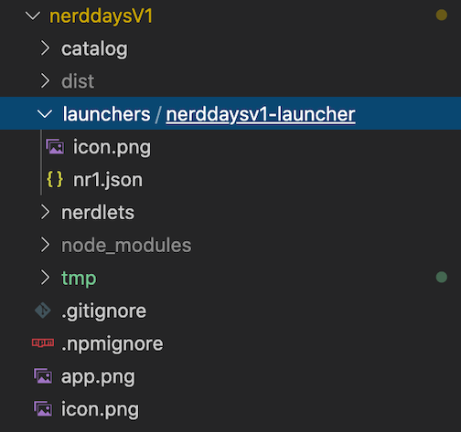
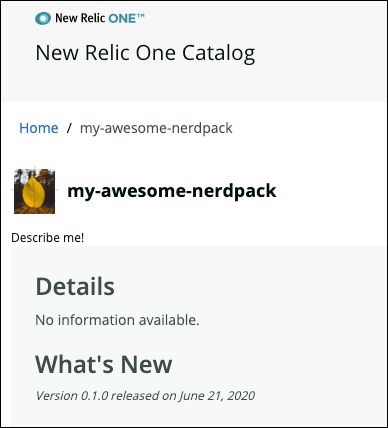

<Intro>

Here's how you can quickly build a "Hello, World!" application in New Relic One. In these steps, you create a local version of the New Relic One site where you can prototype your application. Then, when you're ready to share the application with others, you can publish it to New Relic One.

</Intro>

## Before you begin

Developing applications requires a New Relic account and the New Relic One CLI (`nr1`).

If you haven't already:

- [Sign up](https://newrelic.com/signup/) for a New Relic account
- Install [Node.js](https://nodejs.org/en/download/)
- Complete the [CLI quick start](https://one.newrelic.com/launcher/developer-center.launcher?pane=eyJuZXJkbGV0SWQiOiJkZXZlbG9wZXItY2VudGVyLmRldmVsb3Blci1jZW50ZXIifQ==)

Finally, make sure your `nr1` is up-to-date:

```sh
nr1 update
```

For additional details about setting up your environment, see [Set up your development environment](/build-apps/set-up-dev-env) and [Enable advanced configurations for your Nerdpack](/build-apps/advanced-config).

<Callout variant="tip">

Use the [New Relic One VSCode extension](https://marketplace.visualstudio.com/items?itemName=new-relic.nr1)
or the [New Relic VSCode extension pack](https://marketplace.visualstudio.com/items?itemName=new-relic.new-relic-extension-pack) to build your apps.

</Callout>

## Create a local version of the "Hello, World!" application

The CLI allows you to run a local version of New Relic One. You can develop your application locally before you publish it in New Relic One.

If you followed all the steps in the CLI quick start, you now have files under a new directory named after your nerdpack project. Here's how you edit those files to create a "Hello, World!" project:

<Steps>

<Step>

Open a code editor and point it to the new directory named after your nerdpack project (for example, `my-awesome-nerdpack`).

Your code editor displays two Nerdpack items:

- `launchers` containing the homepage tile
- `nerdlets` containing your application code

</Step>

  <Step>

Expand `nerdlets` in your code editor, and open `index.js`.

  </Step>

  <Step>

Change the default `return` message to `"Hello, World!"`:

```js
import React from 'react';

// https://docs.newrelic.com/docs/new-relic-programmable-platform-introduction

export default class MyAwesomeNerdpackNerdletNerdlet extends React.Component {
  render() {
    return <h1>"Hello, World!"</h1>;
  }
}
```

  </Step>

  <Step>

As an optional step, you can add a custom launcher icon using any image file named `icon.png`. Replace the default `icon.png` file under `launcher` by dragging in your new image file:



  </Step>

 <Callout variant="tip">

You will need an icon.png in 2 places for it to be representing properly in Instant Observability, To set a launcher icon place an icon.png file in the the launcher directory. To set the icon for the app details page place an icon in the root directory of the project.

</Callout>

  <Step>

To change the name of the launcher to something meaningful, in your code editor under `launchers`, open `nr1.json`.

  </Step>

  <Step>

Change the value for `displayName` to anything you want as the launcher label, and save the file:

```json
{
  "schemaType": "LAUNCHER",
  "id": "my-awesome-nerdpack-launcher",
  "description": "Describe me",
  "displayName": "INSERT_YOUR_TILE_LABEL_HERE",
  "rootNerdletId": "my-awesome-nerdpack-nerdlet"
}
```

  </Step>

  <Step>

To see your new changes locally, start the Node server with this command in your terminal:

```bash
npm start
```

  </Step>

  <Step>

Open a browser and go to [https://one.newrelic.com/?nerdpacks=local](https://one.newrelic.com/?nerdpacks=local) (this url is also shown in the terminal).

  </Step>

  <Step>

When the browser opens, click **Apps**, and then in the **Your apps** section, click the new launcher for your application. Here's an example where we inserted a leaf icon:


After you click the new launcher, your "Hello, World!" appears:


  </Step>

  </Steps>

## Publish your application to New Relic

Your colleagues can't see your local application, so when you are ready to share it, publish it to Instant Observability. Instant Observability is where you can find any pre-existing custom applications, as well as any applications you create in your own organization.

<Steps>

  <Step>

Execute the following in your terminal:

```bash
nr1 nerdpack:publish
```

  </Step>

  <Step>

Close your local New Relic One development tab, and open [New Relic One](https://one.newrelic.com).

  </Step>

  <Step>

Click the **Instant Observability** launcher.


  </Step>

  <Step>

Click the launcher for your new application.

  </Step>

</Steps>

When your new application opens, notice that it doesn't display any helpful descriptive information. The next section shows you how to add descriptive metadata.



## Add details to describe your project

Now that your new application is in Instant Observability, you can add details that help users understand what your application does and how to use it.

<Steps>

  <Step>

Go to your project in the terminal and execute the following:

```bash
nr1 create
```

  </Step>

  <Step>

Select **catalog**, which creates a stub in your project under the _catalog_ directory in the root directory and any launcher, Nerdlet, or visualization directory. Here's how the results might look in your code editor:


  </Step>

  <Step>

In the root `catalog` directory of your project, add screenshots or various types of metadata to describe your project. You can also add screenshots in the catalog directories of your launcher or Nerdlet. For details about what you can add, see [Update your Nerdpack's catalog metadata](https://developer.newrelic.com/build-apps/publish-deploy/catalog/#update-your-nerdpacks-catalog-metadata)

  </Step>

  <Step>

After you add the screenshots and descriptions you want, execute the following to save your metadata to the Instant Observability catalog:

```bash
nr1 catalog:submit
```

  </Step>

  <Step>

Return to Instant Observability and refresh the page to see your new screenshots and metadata describing your project.


And if you added screenshots to your launcher or Nerdlet, you can see them under What's inside:


  </Step>

</Steps>

## Subscribe accounts to your application

To make sure other users see your application in Instant Observability, you need to subscribe accounts to the application. Any user with the NerdPack manager or admin role can subscribe to an application from accounts that they have permission to manage.

<Steps>

  <Step>

If you're not already displaying your application's description page in the browser, click the launcher for the application in the catalog under **Your company applications**.

  </Step>

  <Step>

On your application's description page, click **Add this app**.

  </Step>

  <Step>

Select the accounts you want to subscribe to the application, and then click **Update accounts** to save your selections.

  </Step>

</Steps>

When you return to the Apps page, you'll see the launcher for your new application.

<Callout variant="tip" title="Advanced configurations">

If you're interested in advanced configurations for your Nerdpack, read [Enable advanced configurations for your Nerdpack](/build-apps/advanced-config).

</Callout>

## Summary

Now that you've completed the steps in this example, you learned the basic steps to:

- Create a local application.
- Publish the application to Instant Observability so you can share it with your colleagues.
- Add details to the project in the catalog so users understand how to use it.
- Subscribe accounts to your application so other users can use it.
