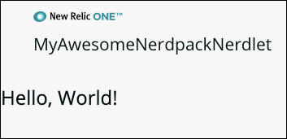

<Intro>

Here's how you can quickly build a "Hello, World!" application in New Relic One. In these steps, we'll show you how to create a local version of the New Relic One site where you can prototype your application. Then, when you're ready to share the application with others, you can publish it to New Relic One.

We also have a 5-minute video that covers the steps below.

<Video id="ZagZfNQYJEU" type="youtube"/>


</Intro>

## Before you begin

To get started, make sure you have accounts in GitHub and [New Relic](https://newrelic.com/signup/).

To develop projects, you need our New Relic One CLI (command line interface). 

If you haven't already installed it, do the following:

* Install [Node.js](https://nodejs.org/en/download/).
* Complete all the steps in our [CLI wizard](https://one.newrelic.com/launcher/developer-center.launcher?pane=eyJuZXJkbGV0SWQiOiJkZXZlbG9wZXItY2VudGVyLmRldmVsb3Blci1jZW50ZXIifQ==).

For additional details about setting up your environment, see [Set up your development environment](set-up-dev-env).

## Create a local version of the "Hello, World!" application

The CLI allows you to run a local version of New Relic One. You can develop your application locally before you publish it in New Relic One. 

If you followed all the steps in the CLI wizard, you now have files under a new directory named after your nerdpack project. Here's how you edit those files to create a "Hello, World!" project:

<Steps>

  <Step>

  Open a code editor and point it to the new directory named after your nerdpack project (for example, `my-awesome-nerdpack`).

  Your code editor displays two artifacts:
  - `launchers` containing the homepage tile 
  - `nerdlets` containing your application code
 
  

  </Step>

  <Step>

  Expand `nerdlets` in your code editor, and open `index.js`.

  </Step>

  <Step>

  Change the default `return` message to `"Hello, World!"`:

  ```js
  import React from 'react';
  
  // https://docs.newrelic.com/docs/new-relic-programmable-platform-introduction

  export default class MyAwesomeNerdpackNerdletNerdlet extends React.Component {
      render() {
          return <h1>"Hello, World!"</h1>;
      }
  }
  ```

  </Step>

  <Step>

  As an optional step, you can add a custom launcher icon using any image file named `icon.png`. Replace the default `icon.png` file under `launcher` by dragging in your new image file:

  

  </Step>

  <Step>

  To change the name of the launcher to something meaningful, in your code editor under `launchers`, open `nr1.json`.

  </Step>  
    
  <Step>

  Change the value for `displayName` to anything you want as the launcher label, and save the file:  

  ```json
  {
    "schemaType": "LAUNCHER",
    "id": "my-awesome-nerdpack-launcher",
    "description": "Describe me",
    "displayName": "INSERT_YOUR_TILE_LABEL_HERE",
    "rootNerdletId": "my-awesome-nerdpack-nerdlet"
}
```

  </Step>

  <Step>

  To see your new changes locally, start the Node server with this command in your terminal:

  ```
  npm start
  ```
  </Step>

  <Step>

  Open a browser and go to [https://one.newrelic.com/?nerdpacks=local](https://one.newrelic.com/?nerdpacks=local) (this url is also shown in the terminal).

  </Step>

  <Step>

  When the browser opens, click the new launcher for your application. Here's an example where we inserted a leaf icon:

  

  
  After you click the new launcher, your "Hello, World!" appears:

  

  </Step>

  </Steps>

  

## Publish your application to New Relic

Your colleagues can't see your local application, so when you are ready to share it, publish it to the New Relic One catalog. The catalog is where you can find any pre-existing custom applications, as well as any applications you create in your own organization. 

<Steps>

  <Step>

  Execute the following in your terminal:

  ```
  nr1 nerdpack:publish
  ```
  </Step>
  
  <Step>

  Close your local New Relic One development tab, and open [New Relic One](https://one.newrelic.com).
  
  </Step>

  <Step>

  Click the **New Relic One Catalog** launcher.

  </Step>

  <Step>

  Under **Your company applications**, click the launcher for your new application.

  </Step>

</Steps>

  When your new application opens, notice that it doesn't display any helpful descriptive information. The next section shows you how to add descriptive metadata.

  

## Add details to describe your project

Now that your new application is in the New Relic One catalog, you can add details that help users understand what your application does and how to use it.

<Steps>

  <Step>

  Go to your project in the terminal and execute the following:  

  ```
  nr1 create
  ```

  </Step>

  <Step>

  Select **catalog**, which creates a stub in your project under the `catalog` directory. Here's how the results might look in your code editor:

  

  </Step>

  <Step>

  In the `catalog` directory of your project, add screenshots or various types of metadata to describe your project. For details about what you can add, see [Add catalog metadata and screenshots](https://docs.newrelic.com/docs/new-relic-one/use-new-relic-one/build-new-relic-one/discover-manage-applications-new-relic-one-catalog#clamshell-2).

  </Step>

  <Step>

  After you add the screenshots and descriptions you want, execute the following to save your metadata to the catalog:

  ```
  nr1 catalog:submit
  ```

  </Step>

  <Step>

  Return to the catalog and refresh the page to see your new screenshots and metadata describing your project.

  </Step>

</Steps>


## Subscribe accounts to your application

To make sure other users see your application on the New Relic One homepage, you need to subscribe accounts to the application. Any user with the NerdPack Manager role can subscribe accounts to an application.

<Steps>
  
  <Step>

  If you're not already displaying your application's description page in the browser, click the launcher for the application in the catalog under **Your company applications**.

  </Step>

  <Step>

  On your application's description page, click **Add this app**.

  </Step>

  <Step>

  Select the accounts you want to subscribe to the application, and then click **Update access** to save your selections.

  </Step>

</Steps>

When you return to the New Relic One homepage, you'll see the launcher for your new application.

## Summary

Now that you've completed the steps in this example, you learned the basic steps to create a custom application: 

* Create a local application.
* Publish the application to the New Relic One catalog so you can share it with your colleagues.
* Add details to the project in the catalog so users understand how to use it.
* Subscribe accounts to your application so other users can see it directly on their homepage.

## Related information

- [New Relic documentation](https://docs.newrelic.com/docs/new-relic-one/use-new-relic-one/build-new-relic-one/new-relic-one-build-your-own-custom-new-relic-one-application)
- [New Relic's Explorer Hub](https://discuss.newrelic.com/)
