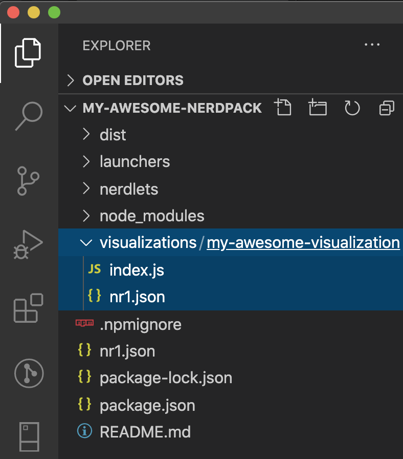
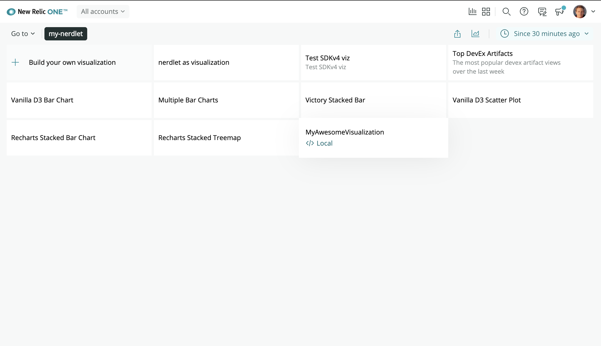
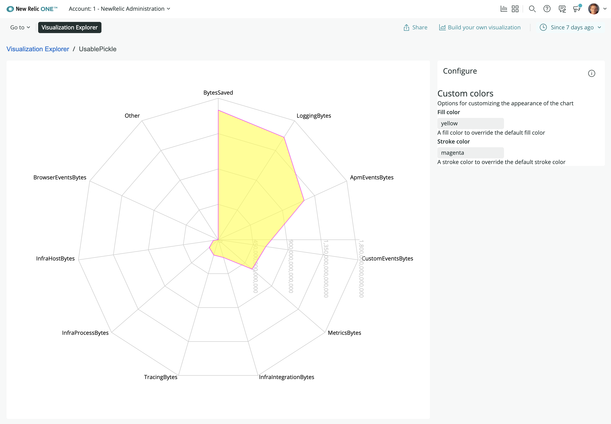

<Intro>

Building your own visualizations for New Relic dashboards enables you and your organization to query data from any source and display it on your dashboard. In this guide, you'll learn how to use the CLI to generate a visualization file structure, run the visualization locally in New Relic One's Visualization Explorer where you can quickly test and iterate, and deploy the visualization for you and others to use on dashboards.

</Intro>

## Before you begin

To get started, make sure you have a [New Relic](https://newrelic.com/signup/) account.

To develop projects, you need the New Relic One CLI (command line interface). If you haven't already installed it, do the following:

- Install [Node.js](https://nodejs.org/en/download/).
- Complete all the steps in the [CLI quick start](https://one.newrelic.com/launcher/developer-center.launcher?pane=eyJuZXJkbGV0SWQiOiJkZXZlbG9wZXItY2VudGVyLmRldmVsb3Blci1jZW50ZXIifQ==).

## Create a new visualization

In this first set of steps you use the CLI to quickly generate the boilerplate for a new visualization.

<Steps>

  <Step>

Ensure you're working with the latest version of the New Relic One CLI:

```bash
nr1 update
```

  </Step>

  <Step>

Start with a new Nerdpack. If you just installed the New Relic One CLI, then you have a new Nerdpack project directory (called something like, `my-awesome-nerdpack`). If you need to create one, run `nr1 create` and select the `nerdpack` option.

```bash
nr1 create --type visualization --name my-awesome-nerdpack
```

  </Step>

  <Step>

Navigate to the root of your Nerdpack project, and then run the `create` command.

```bash
cd my-awesome-nerdpack
nr1 create --type visualization --name my-awesome-visualization
```

As a result, you have a new visualization directory matching the name you gave your visualization. It is located in the `visualizations` directory in the root of your nerdpack project. 

  </Step>

</Steps>

## Render the visualization in local development

Now you run the generated visualization locally, and view it in Custom Visualizations, where you can quickly test changes to your code.

<Steps>
  <Step>

Start the local node server for your Nerdpack.

```bash
nr1 nerdpack:serve
```

  </Step>

  <Step>

In a browser, open [https://one.newrelic.com/?nerdpacks=local](https://one.newrelic.com/?nerdpacks=local). This url is also shown in the terminal when the node server starts. The `nerdpacks=local` query string will direct the UI to load your new visulization artifact from the local node server.

<Callout variant="tip" title={`Advanced nerdpack configuration`}>

See the [advanced nerdpack
configuration](build-apps/build-hello-world-app/#advance-configurations)
section for detailed information about how your local node server is proxied
to the browser and how you can override webpack configuration if needed.

</Callout>

  </Step>

  <Step>

Open the **Apps** page, and navigate to the **Custom Visualizations**, which you will find favorited by default.


  </Step>

  <Step>

In the **Custom Visualizations** listing, find and click on the tile for your visualization. If the tile is not showing up or it is not indicating that it is running locally, restart the node server and refresh the browser.



When you select your locally running visualization, the visualization hosted by your local node server is rendered with prop configuration inputs. Here you can take advantage of the features outlined in the following steps.

  </Step>

  <Step>

You can set prop values and see the visualization update automatically. The **Visualization Builder** lists the props as defined in the prop definitions located in the `nr1.json` file in the visualization folder (for example `./visualizations/your-visualization/nr1.json`). Fill in values for the props and see the visualization update automatically. As you change props in the sidebar, a render cycle of your visualization's React component is triggered. While you look at the example visualization generated for you, you can enter any CSS color value (name, hex, rgba) in the fill color, or stroke-color prop inputs and see the plotted data color change.



  </Step>

  <Step>

Modify the visualization's Javascript code and see the result automatically update in the UI. For example, you can change the value for `fillOpacity` on the Radar component in `index.js`. Upon save, you will see the page automatically update.

```js fileName=visualizations/your-visuzalization/index.js
  fillOpacity={1.0}
```

  </Step>

  <Step>

To add more props, you must update the `configuration` field in the `nr1.json` file for your visualization, and restart the local node server. For an example of what is possible, check out the `nr1.json` file of the example visualization.

The props you define in the `configuration` field allow New Relic One to cleanly display a props editing UI for those using the visualization.

  </Step>

</Steps>

## Deploy and use your visualization

When your visualization is ready to be added to dashboards by you and your colleagues, follow these steps.

<Steps>

  <Step>

Open and follow the guide to [publish and deploy the nerdpack to New Relic One and subscribe accounts to it](/build-apps/publish-deploy).

  </Step>

  <Step>

Then you can [add your visualization to a dashboard](https://docs.newrelic.com/docs/query-your-data/explore-query-data/dashboards/add-custom-visualizations-your-dashboards).

  </Step>

</Steps>

## Summary

Now that you've completed the steps in this example, you learned the steps to:

- Create a visualization and run it locally
- Quickly test and iterate on visualization code changes in Custom Visualizations
- Deploy a visualization
- Add a custom visualization to a dashboard
