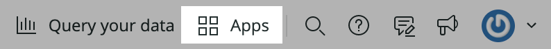

<Intro>

Query data from any source and display it on your New Relic dashboard with [custom visualizations](/explore-docs/custom-viz).

In this guide, you learn how to:

- Use the `nr1` CLI to generate a default visualization
- Run your visualization locally where you can quickly test and iterate
- Publish your visualization to the New Relic One catalog
- Add your visualization to a dashboard

</Intro>

## Before you begin

If you haven't already:

- Sign up for a [New Relic account](https://newrelic.com/signup?utm_source=developer-site)
- Install [Node.js](https://nodejs.org/en/download/)
- Complete the steps in the [`nr1` quick start](https://one.newrelic.com/launcher/developer-center.launcher?pane=eyJuZXJkbGV0SWQiOiJkZXZlbG9wZXItY2VudGVyLmRldmVsb3Blci1jZW50ZXIifQ==) to install and configure the CLI

## Create a new visualization

Use `nr1` to generate the boilerplate for a new visualization.

<Steps>

<Step>

Ensure you're working with the latest version of the New Relic One CLI:

```bash
nr1 update
```

</Step>

<Step>

Create a Nerdpack:

```bash
nr1 create --type nerdpack --name my-awesome-nerdpack
```

<Callout variant="tip">

If you only want to build a visualization in your Nerdpack, you can remove the Nerdpack's _nerdlets_ and _launchers_ directories.

</Callout>

If you receive a `RequestError` for a self-signed certificate when you run `nr1 create`, you may need to add a certificate to Node's certificate chain. Read more about this and other advanced configurations in [Enable advanced configurations for your Nerdpack](/build-apps/advanced-config).

</Step>

<Step>

From the root of your Nerdpack, create a visualization:

```bash
cd my-awesome-nerdpack
nr1 create --type visualization --name my-awesome-visualization
```

As a result, you have a new `visualizations/my-awesome-visualization` directory:

```bash
ls visualizations/my-awesome-visualization
[output] index.js    nr1.json    styles.scss
```

The top-level `visualizations` directory holds all of your Nerdpack's visualizations. The visualization you created is called `my-awesome-visualization`, and it has its own directory. The files in this directory provide an example visualization—a [`RadarChart`](https://recharts.org/en-US/api/RadarChart) populated by a basic [NRQL](https://docs.newrelic.com/docs/query-your-data/nrql-new-relic-query-language/get-started/introduction-nrql-new-relics-query-language/) query.

**Files**

- _nr1.json_ provides metadata for your visualization. The `configuration` key in this metadata defines the prop-input fields to be shown in the UI. To learn more about the options available under the `configuration` key, check out the [Configure your custom visualization](/explore-docs/custom-viz/configuration-options) article.
- _index.js_ defines the React component that receives the props defined in _nr1.json_ and renders your visualization. You can install and import any JavaScript libraries you find useful. The example component imports [Recharts](https://recharts.org), a library that wraps [D3](https://d3js.org) submodules for easy-to-compose visualizations.
- _styles.scss_ defines the [Sass](https://sass-lang.com) styles for your visualization

</Step>

</Steps>

## Serve your visualization locally

[Serve your visualization locally](), and view it in **Apps > Custom Visualizations**. There, you can quickly test changes to your code.

<Steps>
<Step>

From the root directory of your Nerdpack, start a local Node server:

```bash
nr1 nerdpack:serve
```

While it's running, your local server recognizes changes to certain files, such as _index.js_ and automatically refreshes your visualization. However, it doesn't recognize changes to _nr1.json_ or _styles.scss_. Therefore, some changes, such as those to the definition of the `configuration` field in _nr1.json_, won't be reflected in your visualization until you restart your server. To see changes to those files, stop the server, with `CTRL+C`, and start it back up with `nr1 nerdpack:serve`.

</Step>

<Step>

In a browser, open [https://one.newrelic.com/?nerdpacks=local](https://one.newrelic.com/?nerdpacks=local). This url is also shown in the terminal when the Node server starts. The `nerdpacks=local` query string will direct the UI to load your new visualization artifact from the local Node server.

<Callout variant="tip" title={`Advanced nerdpack configuration`}>

See the [advanced nerdpack
configuration](/build-apps/build-hello-world-app/#advance-configurations)
section for detailed information about how your local Node server is proxied
to the browser and how you can override webpack configuration if needed.

</Callout>

</Step>

<Step>

Open the **Apps** page, and navigate to **Custom Visualizations**, which you will find favorited by default.



</Step>

<Step>

In the **Custom Visualizations** listing, find and click on the tile for your visualization. If the tile is not showing up or it is not indicating that it is running locally, restart the Node server and refresh the browser.

When you select your locally running visualization, the visualization hosted by your local Node server is rendered with prop-configuration inputs. Here you can take advantage of the features outlined in the following steps.

</Step>

<Step>

You can set prop values and see the visualization update automatically. The prop inputs are listed as defined in the prop definitions located in the `nr1.json` file in the visualization folder (for example `./visualizations/my-awesome-visualization/nr1.json`). Fill in values for the props and see the visualization update automatically. As you change props in the sidebar, a render cycle of your visualization's React component is triggered.


</Step>

<Step>

Modify the visualization's Javascript code and see the result automatically update in the UI. For example, you can change the value for `fillOpacity` on the Radar component in `index.js`. Upon save, you will see the page automatically update.

```js fileName=visualizations/your-visualization/index.js
  fillOpacity={1.0}
```

</Step>

<Step>

To add more props, you must update the `configuration` field in the `nr1.json` file for your visualization and restart the local Node server. The props you define in the `configuration` field allow New Relic One to cleanly display a prop-editing UI for users interacting with your visualization. See above for more information about the `configuration` field.

</Step>

</Steps>

## Publish and use your visualization

When your visualization is ready to be added to a dashboard, just follow these steps.

<Steps>

<Step>

Open and follow the guide to [publish and deploy the Nerdpack to New Relic One and subscribe accounts to it](/build-apps/publish-deploy).

</Step>

<Step>

Then you can [add your visualization to a dashboard](https://docs.newrelic.com/docs/query-your-data/explore-query-data/dashboards/add-custom-visualizations-your-dashboards).

</Step>

</Steps>

## Summary

Congratulations on completing the steps in this example! You've learned how to:

- Create a visualization and run it locally
- Quickly test and iterate on visualization code changes in Custom Visualizations
- Deploy a visualization
- Add a custom visualization to a dashboard

## Additional resources

- New Relic Quick Tips video: [Dashboards and Custom Visualizations](https://www.youtube.com/watch?v=_F61mxtKfGA) (6 minutes)
- New Relic NerdBytes video: [Configuring custom visualizations for dashboards](https://www.youtube.com/watch?v=sFpG_iG7Xa8) (7 minutes)
- New Relic Nerdlog live stream: [Custom Data Visualizations on New Relic](https://www.youtube.com/watch?v=HuR0EdHGz24) (30 minutes)
