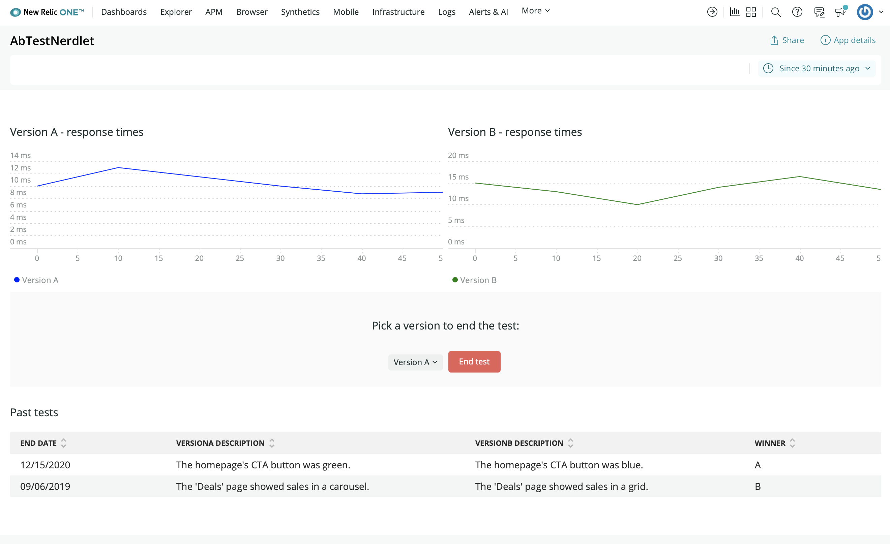
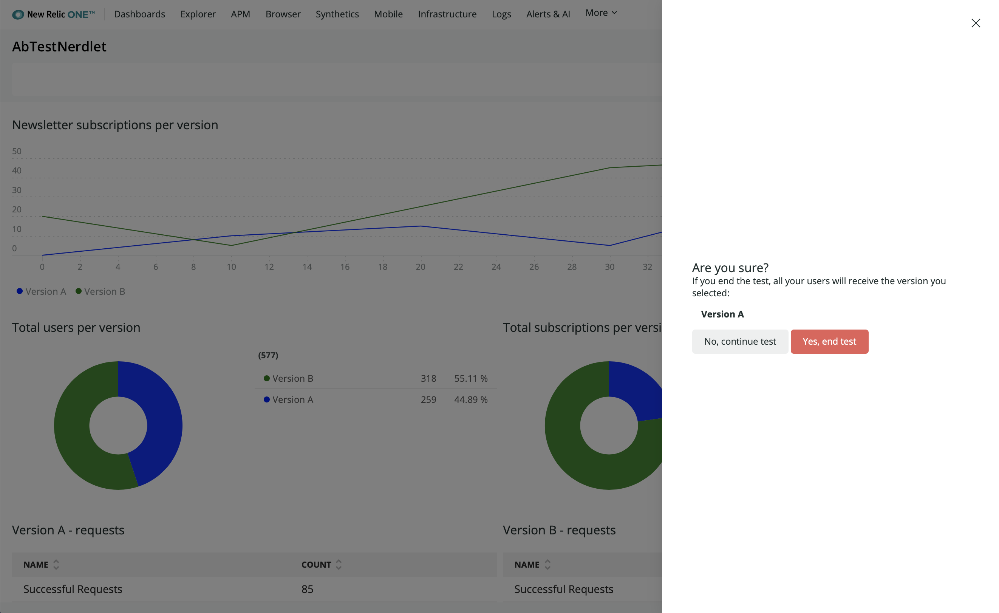
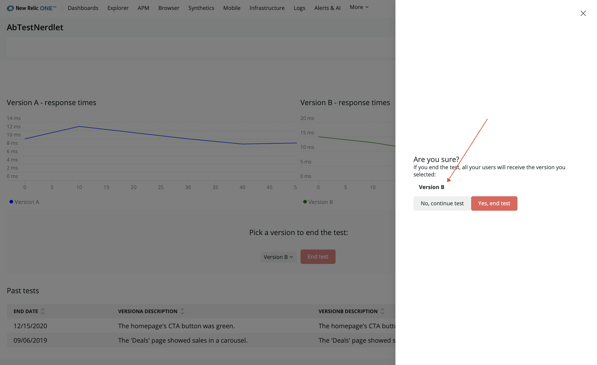

In this tutorial, you're building an A/B test application. The application surfaces data about an ongoing A/B test on your website, which you then use to decide which page design version is most effective at engaging users. As part of that overarching goal, you're building a section which allows you to end the test by deciding a winner of the experiment:


Unfortunately, there are a few issues with the code and design for this section. By the end of this course, pressing _End test_ will tell your website's backend server that every customer should see the version selected here. This is destructive behavior because it makes an irreversible change to your website. To account for the desctructiveness of pressing _End test_, you need to modify some features of your application:

- Make the button look important to catch your eye
- Prompt yourself with a confirmation message before ending the test to ensure you don't end it prematurely

<Steps>

<Step>

Change to the `present-confirmation-modal` directory of the course repository:

```sh
cd nru-programmability-course/present-confirmation-modal
```

This directory contains the code your application should have at this point in the course. By navigating to the correct directory at the start of each lesson, you leave your custom code behind, thereby protecting yourself from carrying incorrect code from one lesson to the next.

</Step>

<Step>

Open your Nerdlet's _index.js_ file. All code you write in this lesson belongs in this file.

</Step>

<Step>

Update the `Button` to use the `DESTRUCTIVE` styling:

```js fileName=nerdlets/ab-test-nerdlet/index.js lineHighlight=278
import React from 'react';
import { Button, ChartGroup, Grid, GridItem, HeadingText, LineChart, PieChart, Select, SelectItem, TableChart } from 'nr1';

class NewsletterSignups extends React.Component {
    render() {
        const versionASignups = {
            metadata: {
                id: 'version-a-newsletter-signups',
                name: 'Version A',
                viz: 'main',
                color: 'blue',
            },
            data: [
                { x: 0, y: 0 },
                { x: 10, y: 10 },
                { x: 20, y: 15 },
                { x: 30, y: 5 },
                { x: 40, y: 30 },
                { x: 50, y: 25 },
            ],
        }
        const versionBSignups = {
            metadata: {
                id: 'version-b-newsletter-signups',
                name: 'Version B',
                viz: 'main',
                color: 'green',
            },
            data: [
                { x: 0, y: 20 },
                { x: 10, y: 5 },
                { x: 20, y: 25 },
                { x: 30, y: 45 },
                { x: 40, y: 50 },
                { x: 50, y: 35 },
            ],
        }
        return <React.Fragment>
            <HeadingText style={{ marginTop: '20px', marginBottom: '20px' }}>
                Newsletter subscriptions per version
            </HeadingText>
            <LineChart data={[versionASignups, versionBSignups]} fullWidth />
        </React.Fragment>
    }
}

class TestDistributions extends React.Component {
    render() {
        const distributionA = {
            metadata: {
                id: 'distributions-A',
                name: 'Version A',
                viz: 'main',
                color: 'blue',
            },
            data: [
                { y: 259 },
            ],
        }
        const distributionB = {
            metadata: {
                id: 'distributions-B',
                name: 'Version B',
                viz: 'main',
                color: 'green',
            },
            data: [
                { y: 318 },
            ],
        }
        return <React.Fragment>
            <HeadingText style={{ marginTop: '20px', marginBottom: '20px' }}>
                Total users per version
            </HeadingText>
            <PieChart data={[distributionA, distributionB]} fullWidth />
        </React.Fragment>
    }
}

class SuccessfulRequests extends React.Component {
    render() {
        const successesA = {
            metadata: {
                id: 'successes-A',
                name: 'Version A',
                viz: 'main',
                color: 'blue',
            },
            data: [
                { y: 118 },
            ],
        }
        const successesB = {
            metadata: {
                id: 'successes-B',
                name: 'Version B',
                viz: 'main',
                color: 'green',
            },
            data: [
                { y: 400 },
            ],
        }
        return <React.Fragment>
            <HeadingText style={{ marginTop: '20px', marginBottom: '20px' }}>
                Total subscriptions per version
            </HeadingText>
            <PieChart data={[successesA, successesB]} fullWidth />
        </React.Fragment>
    }
}

class VersionATotals extends React.Component {
    render() {
        const versionATotals = {
            metadata: {
                id: 'totals-A',
                name: 'Version A',
                columns: ['name', 'count'],
            },
            data: [
                {
                    name: 'Successful Requests',
                    count: 85
                },
                {
                    name: 'Failed Requests',
                    count: 2
                },
            ],
        }
        return <React.Fragment>
            <HeadingText style={{ marginTop: '20px', marginBottom: '20px' }}>
                Version A - requests
            </HeadingText>
            <TableChart data={[versionATotals]} fullWidth />
        </React.Fragment>
    }
}

class VersionBTotals extends React.Component {
    render() {
        const versionBTotals = {
            metadata: {
                id: 'totals-B',
                name: 'Version B',
                columns: ['name', 'count'],
            },
            data: [
                {
                    name: 'Successful Requests',
                    count: 180
                },
                {
                    name: 'Failed Requests',
                    count: 30
                },
            ],
        }
        return <React.Fragment>
            <HeadingText style={{ marginTop: '20px', marginBottom: '20px' }}>
                Version B - requests
            </HeadingText>
            <TableChart data={[versionBTotals]} fullWidth />
        </React.Fragment>
    }
}

class VersionAResponseTimes extends React.Component {
    render() {
        const versionAResponseTimes = {
            metadata: {
                id: 'response-times-A',
                name: 'Version A',
                viz: 'main',
                color: 'blue',
                units_data: {
                    y: 'MS'
                }
            },
            data: [
                { x: 0, y: 10 },
                { x: 10, y: 13 },
                { x: 20, y: 11.5 },
                { x: 30, y: 10 },
                { x: 40, y: 8.75 },
                { x: 50, y: 9 },
            ],
        }
        return <React.Fragment>
            <HeadingText style={{ marginTop: '20px', marginBottom: '20px' }}>
                Version A - response times
            </HeadingText>
            <LineChart data={[versionAResponseTimes]} fullWidth />
        </React.Fragment>
    }
}

class VersionBResponseTimes extends React.Component {
    render() {
        const versionBResponseTimes = {
            metadata: {
                id: 'response-times-B',
                name: 'Version B',
                viz: 'main',
                color: 'green',
                units_data: {
                    y: 'MS'
                }
            },
            data: [
                { x: 0, y: 15 },
                { x: 10, y: 13 },
                { x: 20, y: 10 },
                { x: 30, y: 14 },
                { x: 40, y: 16.5 },
                { x: 50, y: 13.5 },
            ],
        }
        return <React.Fragment>
            <HeadingText style={{ marginTop: '20px', marginBottom: '20px' }}>
                Version B - response times
            </HeadingText>
            <LineChart data={[versionBResponseTimes]} fullWidth />
        </React.Fragment>
    }
}

class HistoricalTests extends React.Component {
    render() {
        var historicalData = {
            metadata: {
                id: 'totals-B',
                name: 'Version B',
                columns: ['endDate', 'versionADescription', 'versionBDescription', 'winner'],
            },
            data: [
                {
                    "endDate": "12/15/2020",
                    "versionADescription": "The homepage's CTA button was green.",
                    "versionBDescription": "The homepage's CTA button was blue.",
                    "winner": "A"
                },
                {
                    "endDate": "09/06/2019",
                    "versionADescription": "The 'Deals' page showed sales in a carousel.",
                    "versionBDescription": "The 'Deals' page showed sales in a grid.",
                    "winner": "B"
                }
            ],
        }

        return <React.Fragment>
            <HeadingText style={{ marginTop: '20px', marginBottom: '20px' }}>
                Past tests
            </HeadingText>
            <TableChart data={[historicalData]} fullWidth />
        </React.Fragment>
    }
}

class VersionSelector extends React.Component {
    constructor(props) {
        super(props);
    }

    render() {
        return <Select onChange={this.props.selectVersion} value={this.props.selectedVersion}>
            <SelectItem value={'A'}>Version A</SelectItem>
            <SelectItem value={'B'}>Version B</SelectItem>
        </Select>
    }
}

class EndTestButton extends React.Component {
    render() {
        return <React.Fragment>
            <Button type={Button.TYPE.DESTRUCTIVE}>End test</Button>
        </React.Fragment>
    }
}

class EndTestSection extends React.Component {
    constructor() {
        super(...arguments);

        this.state = {
            selectedVersion: 'A',
        };

        this.selectVersion = this.selectVersion.bind(this);
    }

    selectVersion(event, value) {
        this.setState({selectedVersion: value});
    }

    render() {
        return <Grid style={{ margin: 'auto', backgroundColor: '#fafafa', padding: '20px' }}>
            <GridItem columnSpan={12}>
                <HeadingText style={{ marginLeft: 'auto', marginRight: 'auto', marginTop: '20px', marginBottom: '20px', textAlign: 'center'}}>
                    Pick a version to end the test:
                </HeadingText>
            </GridItem>
            <GridItem columnStart={5} columnEnd={6} style={{textAlign: 'right', paddingTop: '5px'}}>
                <VersionSelector
                    selectedVersion={this.state.selectedVersion}
                    selectVersion={this.selectVersion}
                />
            </GridItem>
            <GridItem columnStart={7} columnEnd={8}>
                <EndTestButton>End test</EndTestButton>
            </GridItem>
        </Grid>
    }
}

export default class AbTestNerdletNerdlet extends React.Component {
    render() {
        return (
            <Grid>
                <GridItem columnSpan={12}><NewsletterSignups /></GridItem>
                <GridItem columnSpan={6}><TestDistributions /></GridItem>
                <GridItem columnSpan={6}><SuccessfulRequests /></GridItem>
                <GridItem columnSpan={6}><VersionATotals /></GridItem>
                <GridItem columnSpan={6}><VersionBTotals /></GridItem>
                <ChartGroup>
                    <GridItem columnSpan={6}><VersionAResponseTimes /></GridItem>
                    <GridItem columnSpan={6}><VersionBResponseTimes /></GridItem>
                </ChartGroup>
                <GridItem columnSpan={12}><EndTestSection /></GridItem>
                <GridItem columnSpan={12}><HistoricalTests /></GridItem>
            </Grid>
        )
    }
}
```

<Callout variant="tip">

Read more about `Button` and its props on the [New Relic developer site](https://developer.newrelic.com/components/button).

</Callout>

</Step>

<Step>

From the root of your Nerdpack at `nru-programmability-course/present-confirmation-modal/ab-test`, serve your application locally:

```sh
nr1 nerdpack:serve
```

</Step>

<Step>

[View your application](https://one.newrelic.com?nerdpacks=local):



Now you've styled your button to convey its destructive consequences, but that's not enough to prevent you from accidentally clicking it. Next, you create a shield for your website's backend. This extra layer of protection requires you to confirm that you intend to end the test before actually doing so.

</Step>

<Step>

Import `Modal` and `BlockText`, which you use to format your message:

```js fileName=nerdlets/ab-test-nerdlet/index.js lineHighlight=2
import React from 'react';
import { BlockText, Button, ChartGroup, Grid, GridItem, HeadingText, LineChart, Modal, PieChart, Select, SelectItem, TableChart } from 'nr1';

class NewsletterSignups extends React.Component {
    render() {
        const versionASignups = {
            metadata: {
                id: 'version-a-newsletter-signups',
                name: 'Version A',
                viz: 'main',
                color: 'blue',
            },
            data: [
                { x: 0, y: 0 },
                { x: 10, y: 10 },
                { x: 20, y: 15 },
                { x: 30, y: 5 },
                { x: 40, y: 30 },
                { x: 50, y: 25 },
            ],
        }
        const versionBSignups = {
            metadata: {
                id: 'version-b-newsletter-signups',
                name: 'Version B',
                viz: 'main',
                color: 'green',
            },
            data: [
                { x: 0, y: 20 },
                { x: 10, y: 5 },
                { x: 20, y: 25 },
                { x: 30, y: 45 },
                { x: 40, y: 50 },
                { x: 50, y: 35 },
            ],
        }
        return <React.Fragment>
            <HeadingText style={{ marginTop: '20px', marginBottom: '20px' }}>
                Newsletter subscriptions per version
            </HeadingText>
            <LineChart data={[versionASignups, versionBSignups]} fullWidth />
        </React.Fragment>
    }
}

class TestDistributions extends React.Component {
    render() {
        const distributionA = {
            metadata: {
                id: 'distributions-A',
                name: 'Version A',
                viz: 'main',
                color: 'blue',
            },
            data: [
                { y: 259 },
            ],
        }
        const distributionB = {
            metadata: {
                id: 'distributions-B',
                name: 'Version B',
                viz: 'main',
                color: 'green',
            },
            data: [
                { y: 318 },
            ],
        }
        return <React.Fragment>
            <HeadingText style={{ marginTop: '20px', marginBottom: '20px' }}>
                Total users per version
            </HeadingText>
            <PieChart data={[distributionA, distributionB]} fullWidth />
        </React.Fragment>
    }
}

class SuccessfulRequests extends React.Component {
    render() {
        const successesA = {
            metadata: {
                id: 'successes-A',
                name: 'Version A',
                viz: 'main',
                color: 'blue',
            },
            data: [
                { y: 118 },
            ],
        }
        const successesB = {
            metadata: {
                id: 'successes-B',
                name: 'Version B',
                viz: 'main',
                color: 'green',
            },
            data: [
                { y: 400 },
            ],
        }
        return <React.Fragment>
            <HeadingText style={{ marginTop: '20px', marginBottom: '20px' }}>
                Total subscriptions per version
            </HeadingText>
            <PieChart data={[successesA, successesB]} fullWidth />
        </React.Fragment>
    }
}

class VersionATotals extends React.Component {
    render() {
        const versionATotals = {
            metadata: {
                id: 'totals-A',
                name: 'Version A',
                columns: ['name', 'count'],
            },
            data: [
                {
                    name: 'Successful Requests',
                    count: 85
                },
                {
                    name: 'Failed Requests',
                    count: 2
                },
            ],
        }
        return <React.Fragment>
            <HeadingText style={{ marginTop: '20px', marginBottom: '20px' }}>
                Version A - requests
            </HeadingText>
            <TableChart data={[versionATotals]} fullWidth />
        </React.Fragment>
    }
}

class VersionBTotals extends React.Component {
    render() {
        const versionBTotals = {
            metadata: {
                id: 'totals-B',
                name: 'Version B',
                columns: ['name', 'count'],
            },
            data: [
                {
                    name: 'Successful Requests',
                    count: 180
                },
                {
                    name: 'Failed Requests',
                    count: 30
                },
            ],
        }
        return <React.Fragment>
            <HeadingText style={{ marginTop: '20px', marginBottom: '20px' }}>
                Version B - requests
            </HeadingText>
            <TableChart data={[versionBTotals]} fullWidth />
        </React.Fragment>
    }
}

class VersionAResponseTimes extends React.Component {
    render() {
        const versionAResponseTimes = {
            metadata: {
                id: 'response-times-A',
                name: 'Version A',
                viz: 'main',
                color: 'blue',
                units_data: {
                    y: 'MS'
                }
            },
            data: [
                { x: 0, y: 10 },
                { x: 10, y: 13 },
                { x: 20, y: 11.5 },
                { x: 30, y: 10 },
                { x: 40, y: 8.75 },
                { x: 50, y: 9 },
            ],
        }
        return <React.Fragment>
            <HeadingText style={{ marginTop: '20px', marginBottom: '20px' }}>
                Version A - response times
            </HeadingText>
            <LineChart data={[versionAResponseTimes]} fullWidth />
        </React.Fragment>
    }
}

class VersionBResponseTimes extends React.Component {
    render() {
        const versionBResponseTimes = {
            metadata: {
                id: 'response-times-B',
                name: 'Version B',
                viz: 'main',
                color: 'green',
                units_data: {
                    y: 'MS'
                }
            },
            data: [
                { x: 0, y: 15 },
                { x: 10, y: 13 },
                { x: 20, y: 10 },
                { x: 30, y: 14 },
                { x: 40, y: 16.5 },
                { x: 50, y: 13.5 },
            ],
        }
        return <React.Fragment>
            <HeadingText style={{ marginTop: '20px', marginBottom: '20px' }}>
                Version B - response times
            </HeadingText>
            <LineChart data={[versionBResponseTimes]} fullWidth />
        </React.Fragment>
    }
}

class HistoricalTests extends React.Component {
    render() {
        var historicalData = {
            metadata: {
                id: 'totals-B',
                name: 'Version B',
                columns: ['endDate', 'versionADescription', 'versionBDescription', 'winner'],
            },
            data: [
                {
                    "endDate": "12/15/2020",
                    "versionADescription": "The homepage's CTA button was green.",
                    "versionBDescription": "The homepage's CTA button was blue.",
                    "winner": "A"
                },
                {
                    "endDate": "09/06/2019",
                    "versionADescription": "The 'Deals' page showed sales in a carousel.",
                    "versionBDescription": "The 'Deals' page showed sales in a grid.",
                    "winner": "B"
                }
            ],
        }

        return <React.Fragment>
            <HeadingText style={{ marginTop: '20px', marginBottom: '20px' }}>
                Past tests
            </HeadingText>
            <TableChart data={[historicalData]} fullWidth />
        </React.Fragment>
    }
}

class VersionSelector extends React.Component {
    constructor(props) {
        super(props);
    }

    render() {
        return <Select onChange={this.props.selectVersion} value={this.props.selectedVersion}>
            <SelectItem value={'A'}>Version A</SelectItem>
            <SelectItem value={'B'}>Version B</SelectItem>
        </Select>
    }
}

class EndTestButton extends React.Component {
    render() {
        return <React.Fragment>
            <Button type={Button.TYPE.DESTRUCTIVE}>End test</Button>
        </React.Fragment>
    }
}

class EndTestSection extends React.Component {
    constructor() {
        super(...arguments);

        this.state = {
            selectedVersion: 'A',
        };

        this.selectVersion = this.selectVersion.bind(this);
    }

    selectVersion(event, value) {
        this.setState({selectedVersion: value});
    }

    render() {
        return <Grid style={{ margin: 'auto', backgroundColor: '#fafafa', padding: '20px' }}>
            <GridItem columnSpan={12}>
                <HeadingText style={{ marginLeft: 'auto', marginRight: 'auto', marginTop: '20px', marginBottom: '20px', textAlign: 'center'}}>
                    Pick a version to end the test:
                </HeadingText>
            </GridItem>
            <GridItem columnStart={5} columnEnd={6} style={{textAlign: 'right', paddingTop: '5px'}}>
                <VersionSelector
                    selectedVersion={this.state.selectedVersion}
                    selectVersion={this.selectVersion}
                />
            </GridItem>
            <GridItem columnStart={7} columnEnd={8}>
                <EndTestButton>End test</EndTestButton>
            </GridItem>
        </Grid>
    }
}

export default class AbTestNerdletNerdlet extends React.Component {
    render() {
        return (
            <Grid>
                <GridItem columnSpan={12}><NewsletterSignups /></GridItem>
                <GridItem columnSpan={6}><TestDistributions /></GridItem>
                <GridItem columnSpan={6}><SuccessfulRequests /></GridItem>
                <GridItem columnSpan={6}><VersionATotals /></GridItem>
                <GridItem columnSpan={6}><VersionBTotals /></GridItem>
                <ChartGroup>
                    <GridItem columnSpan={6}><VersionAResponseTimes /></GridItem>
                    <GridItem columnSpan={6}><VersionBResponseTimes /></GridItem>
                </ChartGroup>
                <GridItem columnSpan={12}><EndTestSection /></GridItem>
                <GridItem columnSpan={12}><HistoricalTests /></GridItem>
            </Grid>
        )
    }
}
```

</Step>

<Step>

Add a `Modal` to `EndTestButton`:

```js fileName=nerdlets/ab-test-nerdlet/index.js lineHighlight=280-291
import React from 'react';
import { BlockText, Button, ChartGroup, Grid, GridItem, HeadingText, LineChart, Modal, PieChart, Select, SelectItem, TableChart } from 'nr1';

class NewsletterSignups extends React.Component {
    render() {
        const versionASignups = {
            metadata: {
                id: 'version-a-newsletter-signups',
                name: 'Version A',
                viz: 'main',
                color: 'blue',
            },
            data: [
                { x: 0, y: 0 },
                { x: 10, y: 10 },
                { x: 20, y: 15 },
                { x: 30, y: 5 },
                { x: 40, y: 30 },
                { x: 50, y: 25 },
            ],
        }
        const versionBSignups = {
            metadata: {
                id: 'version-b-newsletter-signups',
                name: 'Version B',
                viz: 'main',
                color: 'green',
            },
            data: [
                { x: 0, y: 20 },
                { x: 10, y: 5 },
                { x: 20, y: 25 },
                { x: 30, y: 45 },
                { x: 40, y: 50 },
                { x: 50, y: 35 },
            ],
        }
        return <React.Fragment>
            <HeadingText style={{ marginTop: '20px', marginBottom: '20px' }}>
                Newsletter subscriptions per version
            </HeadingText>
            <LineChart data={[versionASignups, versionBSignups]} fullWidth />
        </React.Fragment>
    }
}

class TestDistributions extends React.Component {
    render() {
        const distributionA = {
            metadata: {
                id: 'distributions-A',
                name: 'Version A',
                viz: 'main',
                color: 'blue',
            },
            data: [
                { y: 259 },
            ],
        }
        const distributionB = {
            metadata: {
                id: 'distributions-B',
                name: 'Version B',
                viz: 'main',
                color: 'green',
            },
            data: [
                { y: 318 },
            ],
        }
        return <React.Fragment>
            <HeadingText style={{ marginTop: '20px', marginBottom: '20px' }}>
                Total users per version
            </HeadingText>
            <PieChart data={[distributionA, distributionB]} fullWidth />
        </React.Fragment>
    }
}

class SuccessfulRequests extends React.Component {
    render() {
        const successesA = {
            metadata: {
                id: 'successes-A',
                name: 'Version A',
                viz: 'main',
                color: 'blue',
            },
            data: [
                { y: 118 },
            ],
        }
        const successesB = {
            metadata: {
                id: 'successes-B',
                name: 'Version B',
                viz: 'main',
                color: 'green',
            },
            data: [
                { y: 400 },
            ],
        }
        return <React.Fragment>
            <HeadingText style={{ marginTop: '20px', marginBottom: '20px' }}>
                Total subscriptions per version
            </HeadingText>
            <PieChart data={[successesA, successesB]} fullWidth />
        </React.Fragment>
    }
}

class VersionATotals extends React.Component {
    render() {
        const versionATotals = {
            metadata: {
                id: 'totals-A',
                name: 'Version A',
                columns: ['name', 'count'],
            },
            data: [
                {
                    name: 'Successful Requests',
                    count: 85
                },
                {
                    name: 'Failed Requests',
                    count: 2
                },
            ],
        }
        return <React.Fragment>
            <HeadingText style={{ marginTop: '20px', marginBottom: '20px' }}>
                Version A - requests
            </HeadingText>
            <TableChart data={[versionATotals]} fullWidth />
        </React.Fragment>
    }
}

class VersionBTotals extends React.Component {
    render() {
        const versionBTotals = {
            metadata: {
                id: 'totals-B',
                name: 'Version B',
                columns: ['name', 'count'],
            },
            data: [
                {
                    name: 'Successful Requests',
                    count: 180
                },
                {
                    name: 'Failed Requests',
                    count: 30
                },
            ],
        }
        return <React.Fragment>
            <HeadingText style={{ marginTop: '20px', marginBottom: '20px' }}>
                Version B - requests
            </HeadingText>
            <TableChart data={[versionBTotals]} fullWidth />
        </React.Fragment>
    }
}

class VersionAResponseTimes extends React.Component {
    render() {
        const versionAResponseTimes = {
            metadata: {
                id: 'response-times-A',
                name: 'Version A',
                viz: 'main',
                color: 'blue',
                units_data: {
                    y: 'MS'
                }
            },
            data: [
                { x: 0, y: 10 },
                { x: 10, y: 13 },
                { x: 20, y: 11.5 },
                { x: 30, y: 10 },
                { x: 40, y: 8.75 },
                { x: 50, y: 9 },
            ],
        }
        return <React.Fragment>
            <HeadingText style={{ marginTop: '20px', marginBottom: '20px' }}>
                Version A - response times
            </HeadingText>
            <LineChart data={[versionAResponseTimes]} fullWidth />
        </React.Fragment>
    }
}

class VersionBResponseTimes extends React.Component {
    render() {
        const versionBResponseTimes = {
            metadata: {
                id: 'response-times-B',
                name: 'Version B',
                viz: 'main',
                color: 'green',
                units_data: {
                    y: 'MS'
                }
            },
            data: [
                { x: 0, y: 15 },
                { x: 10, y: 13 },
                { x: 20, y: 10 },
                { x: 30, y: 14 },
                { x: 40, y: 16.5 },
                { x: 50, y: 13.5 },
            ],
        }
        return <React.Fragment>
            <HeadingText style={{ marginTop: '20px', marginBottom: '20px' }}>
                Version B - response times
            </HeadingText>
            <LineChart data={[versionBResponseTimes]} fullWidth />
        </React.Fragment>
    }
}

class HistoricalTests extends React.Component {
    render() {
        var historicalData = {
            metadata: {
                id: 'totals-B',
                name: 'Version B',
                columns: ['endDate', 'versionADescription', 'versionBDescription', 'winner'],
            },
            data: [
                {
                    "endDate": "12/15/2020",
                    "versionADescription": "The homepage's CTA button was green.",
                    "versionBDescription": "The homepage's CTA button was blue.",
                    "winner": "A"
                },
                {
                    "endDate": "09/06/2019",
                    "versionADescription": "The 'Deals' page showed sales in a carousel.",
                    "versionBDescription": "The 'Deals' page showed sales in a grid.",
                    "winner": "B"
                }
            ],
        }

        return <React.Fragment>
            <HeadingText style={{ marginTop: '20px', marginBottom: '20px' }}>
                Past tests
            </HeadingText>
            <TableChart data={[historicalData]} fullWidth />
        </React.Fragment>
    }
}

class VersionSelector extends React.Component {
    constructor(props) {
        super(props);
    }

    render() {
        return <Select onChange={this.props.selectVersion} value={this.props.selectedVersion}>
            <SelectItem value={'A'}>Version A</SelectItem>
            <SelectItem value={'B'}>Version B</SelectItem>
        </Select>
    }
}

class EndTestButton extends React.Component {
    render() {
        return <React.Fragment>
            <Button type={Button.TYPE.DESTRUCTIVE}>End test</Button>

            <Modal>
                <HeadingText>Are you sure?</HeadingText>
                <BlockText>
                If you end the test, all your users will receive the version you selected:
                </BlockText>

                <BlockText spacingType={[BlockText.SPACING_TYPE.LARGE]}>
                    <b>Version A</b>
                </BlockText>

                <Button>No, continue test</Button> <Button type={Button.TYPE.DESTRUCTIVE}>Yes, end test</Button>
            </Modal>
        </React.Fragment>
    }
}

class EndTestSection extends React.Component {
    constructor() {
        super(...arguments);

        this.state = {
            selectedVersion: 'A',
        };

        this.selectVersion = this.selectVersion.bind(this);
    }

    selectVersion(event, value) {
        this.setState({selectedVersion: value});
    }

    render() {
        return <Grid style={{ margin: 'auto', backgroundColor: '#fafafa', padding: '20px' }}>
            <GridItem columnSpan={12}>
                <HeadingText style={{ marginLeft: 'auto', marginRight: 'auto', marginTop: '20px', marginBottom: '20px', textAlign: 'center'}}>
                    Pick a version to end the test:
                </HeadingText>
            </GridItem>
            <GridItem columnStart={5} columnEnd={6} style={{textAlign: 'right', paddingTop: '5px'}}>
                <VersionSelector
                    selectedVersion={this.state.selectedVersion}
                    selectVersion={this.selectVersion}
                />
            </GridItem>
            <GridItem columnStart={7} columnEnd={8}>
                <EndTestButton>End test</EndTestButton>
            </GridItem>
        </Grid>
    }
}

export default class AbTestNerdletNerdlet extends React.Component {
    render() {
        return (
            <Grid>
                <GridItem columnSpan={12}><NewsletterSignups /></GridItem>
                <GridItem columnSpan={6}><TestDistributions /></GridItem>
                <GridItem columnSpan={6}><SuccessfulRequests /></GridItem>
                <GridItem columnSpan={6}><VersionATotals /></GridItem>
                <GridItem columnSpan={6}><VersionBTotals /></GridItem>
                <ChartGroup>
                    <GridItem columnSpan={6}><VersionAResponseTimes /></GridItem>
                    <GridItem columnSpan={6}><VersionBResponseTimes /></GridItem>
                </ChartGroup>
                <GridItem columnSpan={12}><EndTestSection /></GridItem>
                <GridItem columnSpan={12}><HistoricalTests /></GridItem>
            </Grid>
        )
    }
}
```

[Visit your application](https://one.newrelic.com?nerdpacks=local) and see the modal you added:



The modal looks great, but it has three issues:

- It was present before you clicked _End test_
- You can't dismiss it
- It always says you selected "Version A", even if you didn't

In the following steps, you'll correct all three of these issues.

</Step>

<Step>

Store a value, `modalHidden`, in `EndTestSection.state`:

```js fileName=nerdlets/ab-test-nerdlet/index.js lineHighlight=302
import React from 'react';
import { BlockText, Button, ChartGroup, Grid, GridItem, HeadingText, LineChart, Modal, PieChart, Select, SelectItem, TableChart } from 'nr1';

class NewsletterSignups extends React.Component {
    render() {
        const versionASignups = {
            metadata: {
                id: 'version-a-newsletter-signups',
                name: 'Version A',
                viz: 'main',
                color: 'blue',
            },
            data: [
                { x: 0, y: 0 },
                { x: 10, y: 10 },
                { x: 20, y: 15 },
                { x: 30, y: 5 },
                { x: 40, y: 30 },
                { x: 50, y: 25 },
            ],
        }
        const versionBSignups = {
            metadata: {
                id: 'version-b-newsletter-signups',
                name: 'Version B',
                viz: 'main',
                color: 'green',
            },
            data: [
                { x: 0, y: 20 },
                { x: 10, y: 5 },
                { x: 20, y: 25 },
                { x: 30, y: 45 },
                { x: 40, y: 50 },
                { x: 50, y: 35 },
            ],
        }
        return <React.Fragment>
            <HeadingText style={{ marginTop: '20px', marginBottom: '20px' }}>
                Newsletter subscriptions per version
            </HeadingText>
            <LineChart data={[versionASignups, versionBSignups]} fullWidth />
        </React.Fragment>
    }
}

class TestDistributions extends React.Component {
    render() {
        const distributionA = {
            metadata: {
                id: 'distributions-A',
                name: 'Version A',
                viz: 'main',
                color: 'blue',
            },
            data: [
                { y: 259 },
            ],
        }
        const distributionB = {
            metadata: {
                id: 'distributions-B',
                name: 'Version B',
                viz: 'main',
                color: 'green',
            },
            data: [
                { y: 318 },
            ],
        }
        return <React.Fragment>
            <HeadingText style={{ marginTop: '20px', marginBottom: '20px' }}>
                Total users per version
            </HeadingText>
            <PieChart data={[distributionA, distributionB]} fullWidth />
        </React.Fragment>
    }
}

class SuccessfulRequests extends React.Component {
    render() {
        const successesA = {
            metadata: {
                id: 'successes-A',
                name: 'Version A',
                viz: 'main',
                color: 'blue',
            },
            data: [
                { y: 118 },
            ],
        }
        const successesB = {
            metadata: {
                id: 'successes-B',
                name: 'Version B',
                viz: 'main',
                color: 'green',
            },
            data: [
                { y: 400 },
            ],
        }
        return <React.Fragment>
            <HeadingText style={{ marginTop: '20px', marginBottom: '20px' }}>
                Total subscriptions per version
            </HeadingText>
            <PieChart data={[successesA, successesB]} fullWidth />
        </React.Fragment>
    }
}

class VersionATotals extends React.Component {
    render() {
        const versionATotals = {
            metadata: {
                id: 'totals-A',
                name: 'Version A',
                columns: ['name', 'count'],
            },
            data: [
                {
                    name: 'Successful Requests',
                    count: 85
                },
                {
                    name: 'Failed Requests',
                    count: 2
                },
            ],
        }
        return <React.Fragment>
            <HeadingText style={{ marginTop: '20px', marginBottom: '20px' }}>
                Version A - requests
            </HeadingText>
            <TableChart data={[versionATotals]} fullWidth />
        </React.Fragment>
    }
}

class VersionBTotals extends React.Component {
    render() {
        const versionBTotals = {
            metadata: {
                id: 'totals-B',
                name: 'Version B',
                columns: ['name', 'count'],
            },
            data: [
                {
                    name: 'Successful Requests',
                    count: 180
                },
                {
                    name: 'Failed Requests',
                    count: 30
                },
            ],
        }
        return <React.Fragment>
            <HeadingText style={{ marginTop: '20px', marginBottom: '20px' }}>
                Version B - requests
            </HeadingText>
            <TableChart data={[versionBTotals]} fullWidth />
        </React.Fragment>
    }
}

class VersionAResponseTimes extends React.Component {
    render() {
        const versionAResponseTimes = {
            metadata: {
                id: 'response-times-A',
                name: 'Version A',
                viz: 'main',
                color: 'blue',
                units_data: {
                    y: 'MS'
                }
            },
            data: [
                { x: 0, y: 10 },
                { x: 10, y: 13 },
                { x: 20, y: 11.5 },
                { x: 30, y: 10 },
                { x: 40, y: 8.75 },
                { x: 50, y: 9 },
            ],
        }
        return <React.Fragment>
            <HeadingText style={{ marginTop: '20px', marginBottom: '20px' }}>
                Version A - response times
            </HeadingText>
            <LineChart data={[versionAResponseTimes]} fullWidth />
        </React.Fragment>
    }
}

class VersionBResponseTimes extends React.Component {
    render() {
        const versionBResponseTimes = {
            metadata: {
                id: 'response-times-B',
                name: 'Version B',
                viz: 'main',
                color: 'green',
                units_data: {
                    y: 'MS'
                }
            },
            data: [
                { x: 0, y: 15 },
                { x: 10, y: 13 },
                { x: 20, y: 10 },
                { x: 30, y: 14 },
                { x: 40, y: 16.5 },
                { x: 50, y: 13.5 },
            ],
        }
        return <React.Fragment>
            <HeadingText style={{ marginTop: '20px', marginBottom: '20px' }}>
                Version B - response times
            </HeadingText>
            <LineChart data={[versionBResponseTimes]} fullWidth />
        </React.Fragment>
    }
}

class HistoricalTests extends React.Component {
    render() {
        var historicalData = {
            metadata: {
                id: 'totals-B',
                name: 'Version B',
                columns: ['endDate', 'versionADescription', 'versionBDescription', 'winner'],
            },
            data: [
                {
                    "endDate": "12/15/2020",
                    "versionADescription": "The homepage's CTA button was green.",
                    "versionBDescription": "The homepage's CTA button was blue.",
                    "winner": "A"
                },
                {
                    "endDate": "09/06/2019",
                    "versionADescription": "The 'Deals' page showed sales in a carousel.",
                    "versionBDescription": "The 'Deals' page showed sales in a grid.",
                    "winner": "B"
                }
            ],
        }

        return <React.Fragment>
            <HeadingText style={{ marginTop: '20px', marginBottom: '20px' }}>
                Past tests
            </HeadingText>
            <TableChart data={[historicalData]} fullWidth />
        </React.Fragment>
    }
}

class VersionSelector extends React.Component {
    constructor(props) {
        super(props);
    }

    render() {
        return <Select onChange={this.props.selectVersion} value={this.props.selectedVersion}>
            <SelectItem value={'A'}>Version A</SelectItem>
            <SelectItem value={'B'}>Version B</SelectItem>
        </Select>
    }
}

class EndTestButton extends React.Component {
    render() {
        return <React.Fragment>
            <Button type={Button.TYPE.DESTRUCTIVE}>End test</Button>

            <Modal>
                <HeadingText>Are you sure?</HeadingText>
                <BlockText>
                If you end the test, all your users will receive the version you selected:
                </BlockText>

                <BlockText spacingType={[BlockText.SPACING_TYPE.LARGE]}>
                    <b>Version A</b>
                </BlockText>

                <Button>No, continue test</Button> <Button type={Button.TYPE.DESTRUCTIVE}>Yes, end test</Button>
            </Modal>
        </React.Fragment>
    }
}

class EndTestSection extends React.Component {
    constructor() {
        super(...arguments);

        this.state = {
            selectedVersion: 'A',
            modalHidden: true,
        };

        this.selectVersion = this.selectVersion.bind(this);
    }

    selectVersion(event, value) {
        this.setState({selectedVersion: value});
    }

    render() {
        return <Grid style={{ margin: 'auto', backgroundColor: '#fafafa', padding: '20px' }}>
            <GridItem columnSpan={12}>
                <HeadingText style={{ marginLeft: 'auto', marginRight: 'auto', marginTop: '20px', marginBottom: '20px', textAlign: 'center'}}>
                    Pick a version to end the test:
                </HeadingText>
            </GridItem>
            <GridItem columnStart={5} columnEnd={6} style={{textAlign: 'right', paddingTop: '5px'}}>
                <VersionSelector
                    selectedVersion={this.state.selectedVersion}
                    selectVersion={this.selectVersion}
                />
            </GridItem>
            <GridItem columnStart={7} columnEnd={8}>
                <EndTestButton>End test</EndTestButton>
            </GridItem>
        </Grid>
    }
}

export default class AbTestNerdletNerdlet extends React.Component {
    render() {
        return (
            <Grid>
                <GridItem columnSpan={12}><NewsletterSignups /></GridItem>
                <GridItem columnSpan={6}><TestDistributions /></GridItem>
                <GridItem columnSpan={6}><SuccessfulRequests /></GridItem>
                <GridItem columnSpan={6}><VersionATotals /></GridItem>
                <GridItem columnSpan={6}><VersionBTotals /></GridItem>
                <ChartGroup>
                    <GridItem columnSpan={6}><VersionAResponseTimes /></GridItem>
                    <GridItem columnSpan={6}><VersionBResponseTimes /></GridItem>
                </ChartGroup>
                <GridItem columnSpan={12}><EndTestSection /></GridItem>
                <GridItem columnSpan={12}><HistoricalTests /></GridItem>
            </Grid>
        )
    }
}
```

`modalHidden` determines whether or not to hide the modal. The default value of `modalHidden` is `true` because you only want to show the modal when you select _End test_.

</Step>

<Step>

Pass `modalHidden` to `EndTestButton`:

```js fileName=nerdlets/ab-test-nerdlet/index.js lineHighlight=326
import React from 'react';
import { BlockText, Button, ChartGroup, Grid, GridItem, HeadingText, LineChart, Modal, PieChart, Select, SelectItem, TableChart } from 'nr1';

class NewsletterSignups extends React.Component {
    render() {
        const versionASignups = {
            metadata: {
                id: 'version-a-newsletter-signups',
                name: 'Version A',
                viz: 'main',
                color: 'blue',
            },
            data: [
                { x: 0, y: 0 },
                { x: 10, y: 10 },
                { x: 20, y: 15 },
                { x: 30, y: 5 },
                { x: 40, y: 30 },
                { x: 50, y: 25 },
            ],
        }
        const versionBSignups = {
            metadata: {
                id: 'version-b-newsletter-signups',
                name: 'Version B',
                viz: 'main',
                color: 'green',
            },
            data: [
                { x: 0, y: 20 },
                { x: 10, y: 5 },
                { x: 20, y: 25 },
                { x: 30, y: 45 },
                { x: 40, y: 50 },
                { x: 50, y: 35 },
            ],
        }
        return <React.Fragment>
            <HeadingText style={{ marginTop: '20px', marginBottom: '20px' }}>
                Newsletter subscriptions per version
            </HeadingText>
            <LineChart data={[versionASignups, versionBSignups]} fullWidth />
        </React.Fragment>
    }
}

class TestDistributions extends React.Component {
    render() {
        const distributionA = {
            metadata: {
                id: 'distributions-A',
                name: 'Version A',
                viz: 'main',
                color: 'blue',
            },
            data: [
                { y: 259 },
            ],
        }
        const distributionB = {
            metadata: {
                id: 'distributions-B',
                name: 'Version B',
                viz: 'main',
                color: 'green',
            },
            data: [
                { y: 318 },
            ],
        }
        return <React.Fragment>
            <HeadingText style={{ marginTop: '20px', marginBottom: '20px' }}>
                Total users per version
            </HeadingText>
            <PieChart data={[distributionA, distributionB]} fullWidth />
        </React.Fragment>
    }
}

class SuccessfulRequests extends React.Component {
    render() {
        const successesA = {
            metadata: {
                id: 'successes-A',
                name: 'Version A',
                viz: 'main',
                color: 'blue',
            },
            data: [
                { y: 118 },
            ],
        }
        const successesB = {
            metadata: {
                id: 'successes-B',
                name: 'Version B',
                viz: 'main',
                color: 'green',
            },
            data: [
                { y: 400 },
            ],
        }
        return <React.Fragment>
            <HeadingText style={{ marginTop: '20px', marginBottom: '20px' }}>
                Total subscriptions per version
            </HeadingText>
            <PieChart data={[successesA, successesB]} fullWidth />
        </React.Fragment>
    }
}

class VersionATotals extends React.Component {
    render() {
        const versionATotals = {
            metadata: {
                id: 'totals-A',
                name: 'Version A',
                columns: ['name', 'count'],
            },
            data: [
                {
                    name: 'Successful Requests',
                    count: 85
                },
                {
                    name: 'Failed Requests',
                    count: 2
                },
            ],
        }
        return <React.Fragment>
            <HeadingText style={{ marginTop: '20px', marginBottom: '20px' }}>
                Version A - requests
            </HeadingText>
            <TableChart data={[versionATotals]} fullWidth />
        </React.Fragment>
    }
}

class VersionBTotals extends React.Component {
    render() {
        const versionBTotals = {
            metadata: {
                id: 'totals-B',
                name: 'Version B',
                columns: ['name', 'count'],
            },
            data: [
                {
                    name: 'Successful Requests',
                    count: 180
                },
                {
                    name: 'Failed Requests',
                    count: 30
                },
            ],
        }
        return <React.Fragment>
            <HeadingText style={{ marginTop: '20px', marginBottom: '20px' }}>
                Version B - requests
            </HeadingText>
            <TableChart data={[versionBTotals]} fullWidth />
        </React.Fragment>
    }
}

class VersionAResponseTimes extends React.Component {
    render() {
        const versionAResponseTimes = {
            metadata: {
                id: 'response-times-A',
                name: 'Version A',
                viz: 'main',
                color: 'blue',
                units_data: {
                    y: 'MS'
                }
            },
            data: [
                { x: 0, y: 10 },
                { x: 10, y: 13 },
                { x: 20, y: 11.5 },
                { x: 30, y: 10 },
                { x: 40, y: 8.75 },
                { x: 50, y: 9 },
            ],
        }
        return <React.Fragment>
            <HeadingText style={{ marginTop: '20px', marginBottom: '20px' }}>
                Version A - response times
            </HeadingText>
            <LineChart data={[versionAResponseTimes]} fullWidth />
        </React.Fragment>
    }
}

class VersionBResponseTimes extends React.Component {
    render() {
        const versionBResponseTimes = {
            metadata: {
                id: 'response-times-B',
                name: 'Version B',
                viz: 'main',
                color: 'green',
                units_data: {
                    y: 'MS'
                }
            },
            data: [
                { x: 0, y: 15 },
                { x: 10, y: 13 },
                { x: 20, y: 10 },
                { x: 30, y: 14 },
                { x: 40, y: 16.5 },
                { x: 50, y: 13.5 },
            ],
        }
        return <React.Fragment>
            <HeadingText style={{ marginTop: '20px', marginBottom: '20px' }}>
                Version B - response times
            </HeadingText>
            <LineChart data={[versionBResponseTimes]} fullWidth />
        </React.Fragment>
    }
}

class HistoricalTests extends React.Component {
    render() {
        var historicalData = {
            metadata: {
                id: 'totals-B',
                name: 'Version B',
                columns: ['endDate', 'versionADescription', 'versionBDescription', 'winner'],
            },
            data: [
                {
                    "endDate": "12/15/2020",
                    "versionADescription": "The homepage's CTA button was green.",
                    "versionBDescription": "The homepage's CTA button was blue.",
                    "winner": "A"
                },
                {
                    "endDate": "09/06/2019",
                    "versionADescription": "The 'Deals' page showed sales in a carousel.",
                    "versionBDescription": "The 'Deals' page showed sales in a grid.",
                    "winner": "B"
                }
            ],
        }

        return <React.Fragment>
            <HeadingText style={{ marginTop: '20px', marginBottom: '20px' }}>
                Past tests
            </HeadingText>
            <TableChart data={[historicalData]} fullWidth />
        </React.Fragment>
    }
}

class VersionSelector extends React.Component {
    constructor(props) {
        super(props);
    }

    render() {
        return <Select onChange={this.props.selectVersion} value={this.props.selectedVersion}>
            <SelectItem value={'A'}>Version A</SelectItem>
            <SelectItem value={'B'}>Version B</SelectItem>
        </Select>
    }
}

class EndTestButton extends React.Component {
    render() {
        return <React.Fragment>
            <Button type={Button.TYPE.DESTRUCTIVE}>End test</Button>

            <Modal>
                <HeadingText>Are you sure?</HeadingText>
                <BlockText>
                If you end the test, all your users will receive the version you selected:
                </BlockText>

                <BlockText spacingType={[BlockText.SPACING_TYPE.LARGE]}>
                    <b>Version A</b>
                </BlockText>

                <Button>No, continue test</Button> <Button type={Button.TYPE.DESTRUCTIVE}>Yes, end test</Button>
            </Modal>
        </React.Fragment>
    }
}

class EndTestSection extends React.Component {
    constructor() {
        super(...arguments);

        this.state = {
            selectedVersion: 'A',
            modalHidden: true,
        };

        this.selectVersion = this.selectVersion.bind(this);
    }

    selectVersion(event, value) {
        this.setState({selectedVersion: value});
    }

    render() {
        return <Grid style={{ margin: 'auto', backgroundColor: '#fafafa', padding: '20px' }}>
            <GridItem columnSpan={12}>
                <HeadingText style={{ marginLeft: 'auto', marginRight: 'auto', marginTop: '20px', marginBottom: '20px', textAlign: 'center'}}>
                    Pick a version to end the test:
                </HeadingText>
            </GridItem>
            <GridItem columnStart={5} columnEnd={6} style={{textAlign: 'right', paddingTop: '5px'}}>
                <VersionSelector
                    selectedVersion={this.state.selectedVersion}
                    selectVersion={this.selectVersion}
                />
            </GridItem>
            <GridItem columnStart={7} columnEnd={8}>
                <EndTestButton modalHidden={this.state.modalHidden}>End test</EndTestButton>
            </GridItem>
        </Grid>
    }
}

export default class AbTestNerdletNerdlet extends React.Component {
    render() {
        return (
            <Grid>
                <GridItem columnSpan={12}><NewsletterSignups /></GridItem>
                <GridItem columnSpan={6}><TestDistributions /></GridItem>
                <GridItem columnSpan={6}><SuccessfulRequests /></GridItem>
                <GridItem columnSpan={6}><VersionATotals /></GridItem>
                <GridItem columnSpan={6}><VersionBTotals /></GridItem>
                <ChartGroup>
                    <GridItem columnSpan={6}><VersionAResponseTimes /></GridItem>
                    <GridItem columnSpan={6}><VersionBResponseTimes /></GridItem>
                </ChartGroup>
                <GridItem columnSpan={12}><EndTestSection /></GridItem>
                <GridItem columnSpan={12}><HistoricalTests /></GridItem>
            </Grid>
        )
    }
}
```

Before you click _End test_, the modal should be invisible. Since the `Modal` component belongs to `EndTestButton`, you pass `modalHidden` to `EndTestButton` so it can know whether or not to show the modal.

</Step>

<Step>

Supply `modalHidden` to the `Modal` in `EndTestButton`:

```js fileName=nerdlets/ab-test-nerdlet/index.js lineHighlight=276-278,284
import React from 'react';
import { BlockText, Button, ChartGroup, Grid, GridItem, HeadingText, LineChart, Modal, PieChart, Select, SelectItem, TableChart } from 'nr1';

class NewsletterSignups extends React.Component {
    render() {
        const versionASignups = {
            metadata: {
                id: 'version-a-newsletter-signups',
                name: 'Version A',
                viz: 'main',
                color: 'blue',
            },
            data: [
                { x: 0, y: 0 },
                { x: 10, y: 10 },
                { x: 20, y: 15 },
                { x: 30, y: 5 },
                { x: 40, y: 30 },
                { x: 50, y: 25 },
            ],
        }
        const versionBSignups = {
            metadata: {
                id: 'version-b-newsletter-signups',
                name: 'Version B',
                viz: 'main',
                color: 'green',
            },
            data: [
                { x: 0, y: 20 },
                { x: 10, y: 5 },
                { x: 20, y: 25 },
                { x: 30, y: 45 },
                { x: 40, y: 50 },
                { x: 50, y: 35 },
            ],
        }
        return <React.Fragment>
            <HeadingText style={{ marginTop: '20px', marginBottom: '20px' }}>
                Newsletter subscriptions per version
            </HeadingText>
            <LineChart data={[versionASignups, versionBSignups]} fullWidth />
        </React.Fragment>
    }
}

class TestDistributions extends React.Component {
    render() {
        const distributionA = {
            metadata: {
                id: 'distributions-A',
                name: 'Version A',
                viz: 'main',
                color: 'blue',
            },
            data: [
                { y: 259 },
            ],
        }
        const distributionB = {
            metadata: {
                id: 'distributions-B',
                name: 'Version B',
                viz: 'main',
                color: 'green',
            },
            data: [
                { y: 318 },
            ],
        }
        return <React.Fragment>
            <HeadingText style={{ marginTop: '20px', marginBottom: '20px' }}>
                Total users per version
            </HeadingText>
            <PieChart data={[distributionA, distributionB]} fullWidth />
        </React.Fragment>
    }
}

class SuccessfulRequests extends React.Component {
    render() {
        const successesA = {
            metadata: {
                id: 'successes-A',
                name: 'Version A',
                viz: 'main',
                color: 'blue',
            },
            data: [
                { y: 118 },
            ],
        }
        const successesB = {
            metadata: {
                id: 'successes-B',
                name: 'Version B',
                viz: 'main',
                color: 'green',
            },
            data: [
                { y: 400 },
            ],
        }
        return <React.Fragment>
            <HeadingText style={{ marginTop: '20px', marginBottom: '20px' }}>
                Total subscriptions per version
            </HeadingText>
            <PieChart data={[successesA, successesB]} fullWidth />
        </React.Fragment>
    }
}

class VersionATotals extends React.Component {
    render() {
        const versionATotals = {
            metadata: {
                id: 'totals-A',
                name: 'Version A',
                columns: ['name', 'count'],
            },
            data: [
                {
                    name: 'Successful Requests',
                    count: 85
                },
                {
                    name: 'Failed Requests',
                    count: 2
                },
            ],
        }
        return <React.Fragment>
            <HeadingText style={{ marginTop: '20px', marginBottom: '20px' }}>
                Version A - requests
            </HeadingText>
            <TableChart data={[versionATotals]} fullWidth />
        </React.Fragment>
    }
}

class VersionBTotals extends React.Component {
    render() {
        const versionBTotals = {
            metadata: {
                id: 'totals-B',
                name: 'Version B',
                columns: ['name', 'count'],
            },
            data: [
                {
                    name: 'Successful Requests',
                    count: 180
                },
                {
                    name: 'Failed Requests',
                    count: 30
                },
            ],
        }
        return <React.Fragment>
            <HeadingText style={{ marginTop: '20px', marginBottom: '20px' }}>
                Version B - requests
            </HeadingText>
            <TableChart data={[versionBTotals]} fullWidth />
        </React.Fragment>
    }
}

class VersionAResponseTimes extends React.Component {
    render() {
        const versionAResponseTimes = {
            metadata: {
                id: 'response-times-A',
                name: 'Version A',
                viz: 'main',
                color: 'blue',
                units_data: {
                    y: 'MS'
                }
            },
            data: [
                { x: 0, y: 10 },
                { x: 10, y: 13 },
                { x: 20, y: 11.5 },
                { x: 30, y: 10 },
                { x: 40, y: 8.75 },
                { x: 50, y: 9 },
            ],
        }
        return <React.Fragment>
            <HeadingText style={{ marginTop: '20px', marginBottom: '20px' }}>
                Version A - response times
            </HeadingText>
            <LineChart data={[versionAResponseTimes]} fullWidth />
        </React.Fragment>
    }
}

class VersionBResponseTimes extends React.Component {
    render() {
        const versionBResponseTimes = {
            metadata: {
                id: 'response-times-B',
                name: 'Version B',
                viz: 'main',
                color: 'green',
                units_data: {
                    y: 'MS'
                }
            },
            data: [
                { x: 0, y: 15 },
                { x: 10, y: 13 },
                { x: 20, y: 10 },
                { x: 30, y: 14 },
                { x: 40, y: 16.5 },
                { x: 50, y: 13.5 },
            ],
        }
        return <React.Fragment>
            <HeadingText style={{ marginTop: '20px', marginBottom: '20px' }}>
                Version B - response times
            </HeadingText>
            <LineChart data={[versionBResponseTimes]} fullWidth />
        </React.Fragment>
    }
}

class HistoricalTests extends React.Component {
    render() {
        var historicalData = {
            metadata: {
                id: 'totals-B',
                name: 'Version B',
                columns: ['endDate', 'versionADescription', 'versionBDescription', 'winner'],
            },
            data: [
                {
                    "endDate": "12/15/2020",
                    "versionADescription": "The homepage's CTA button was green.",
                    "versionBDescription": "The homepage's CTA button was blue.",
                    "winner": "A"
                },
                {
                    "endDate": "09/06/2019",
                    "versionADescription": "The 'Deals' page showed sales in a carousel.",
                    "versionBDescription": "The 'Deals' page showed sales in a grid.",
                    "winner": "B"
                }
            ],
        }

        return <React.Fragment>
            <HeadingText style={{ marginTop: '20px', marginBottom: '20px' }}>
                Past tests
            </HeadingText>
            <TableChart data={[historicalData]} fullWidth />
        </React.Fragment>
    }
}

class VersionSelector extends React.Component {
    constructor(props) {
        super(props);
    }

    render() {
        return <Select onChange={this.props.selectVersion} value={this.props.selectedVersion}>
            <SelectItem value={'A'}>Version A</SelectItem>
            <SelectItem value={'B'}>Version B</SelectItem>
        </Select>
    }
}

class EndTestButton extends React.Component {
    constructor(props) {
        super(props);
    }

    render() {
        return <React.Fragment>
            <Button type={Button.TYPE.DESTRUCTIVE}>End test</Button>

            <Modal hidden={this.props.modalHidden}>
                <HeadingText>Are you sure?</HeadingText>
                <BlockText>
                If you end the test, all your users will receive the version you selected:
                </BlockText>

                <BlockText spacingType={[BlockText.SPACING_TYPE.LARGE]}>
                    <b>Version A</b>
                </BlockText>

                <Button>No, continue test</Button> <Button type={Button.TYPE.DESTRUCTIVE}>Yes, end test</Button>
            </Modal>
        </React.Fragment>
    }
}

class EndTestSection extends React.Component {
    constructor() {
        super(...arguments);

        this.state = {
            selectedVersion: 'A',
            modalHidden: true,
        };

        this.selectVersion = this.selectVersion.bind(this);
    }

    selectVersion(event, value) {
        this.setState({selectedVersion: value});
    }

    render() {
        return <Grid style={{ margin: 'auto', backgroundColor: '#fafafa', padding: '20px' }}>
            <GridItem columnSpan={12}>
                <HeadingText style={{ marginLeft: 'auto', marginRight: 'auto', marginTop: '20px', marginBottom: '20px', textAlign: 'center'}}>
                    Pick a version to end the test:
                </HeadingText>
            </GridItem>
            <GridItem columnStart={5} columnEnd={6} style={{textAlign: 'right', paddingTop: '5px'}}>
                <VersionSelector
                    selectedVersion={this.state.selectedVersion}
                    selectVersion={this.selectVersion}
                />
            </GridItem>
            <GridItem columnStart={7} columnEnd={8}>
                <EndTestButton modalHidden={this.state.modalHidden}>End test</EndTestButton>
            </GridItem>
        </Grid>
    }
}

export default class AbTestNerdletNerdlet extends React.Component {
    render() {
        return (
            <Grid>
                <GridItem columnSpan={12}><NewsletterSignups /></GridItem>
                <GridItem columnSpan={6}><TestDistributions /></GridItem>
                <GridItem columnSpan={6}><SuccessfulRequests /></GridItem>
                <GridItem columnSpan={6}><VersionATotals /></GridItem>
                <GridItem columnSpan={6}><VersionBTotals /></GridItem>
                <ChartGroup>
                    <GridItem columnSpan={6}><VersionAResponseTimes /></GridItem>
                    <GridItem columnSpan={6}><VersionBResponseTimes /></GridItem>
                </ChartGroup>
                <GridItem columnSpan={12}><EndTestSection /></GridItem>
                <GridItem columnSpan={12}><HistoricalTests /></GridItem>
            </Grid>
        )
    }
}
```

First, you've created a constructor to accept component props. This provides your component access to the `modalHidden` prop that you passed in `EndTestSection`. Then you provide the value of `modalHidden` to the `Modal` component's `hidden` prop.

<Callout variant="tip">

Read more about `Modal` and its props on the [New Relic developer site](https://developer.newrelic.com/components/modal).

</Callout>

</Step>

<Step>

Add and bind two new methods to `EndTestSection`:

```js fileName=nerdlets/ab-test-nerdlet/index.js lineHighlight=310,311,318-320,322-324
import React from 'react';
import { BlockText, Button, ChartGroup, Grid, GridItem, HeadingText, LineChart, Modal, PieChart, Select, SelectItem, TableChart } from 'nr1';

class NewsletterSignups extends React.Component {
    render() {
        const versionASignups = {
            metadata: {
                id: 'version-a-newsletter-signups',
                name: 'Version A',
                viz: 'main',
                color: 'blue',
            },
            data: [
                { x: 0, y: 0 },
                { x: 10, y: 10 },
                { x: 20, y: 15 },
                { x: 30, y: 5 },
                { x: 40, y: 30 },
                { x: 50, y: 25 },
            ],
        }
        const versionBSignups = {
            metadata: {
                id: 'version-b-newsletter-signups',
                name: 'Version B',
                viz: 'main',
                color: 'green',
            },
            data: [
                { x: 0, y: 20 },
                { x: 10, y: 5 },
                { x: 20, y: 25 },
                { x: 30, y: 45 },
                { x: 40, y: 50 },
                { x: 50, y: 35 },
            ],
        }
        return <React.Fragment>
            <HeadingText style={{ marginTop: '20px', marginBottom: '20px' }}>
                Newsletter subscriptions per version
            </HeadingText>
            <LineChart data={[versionASignups, versionBSignups]} fullWidth />
        </React.Fragment>
    }
}

class TestDistributions extends React.Component {
    render() {
        const distributionA = {
            metadata: {
                id: 'distributions-A',
                name: 'Version A',
                viz: 'main',
                color: 'blue',
            },
            data: [
                { y: 259 },
            ],
        }
        const distributionB = {
            metadata: {
                id: 'distributions-B',
                name: 'Version B',
                viz: 'main',
                color: 'green',
            },
            data: [
                { y: 318 },
            ],
        }
        return <React.Fragment>
            <HeadingText style={{ marginTop: '20px', marginBottom: '20px' }}>
                Total users per version
            </HeadingText>
            <PieChart data={[distributionA, distributionB]} fullWidth />
        </React.Fragment>
    }
}

class SuccessfulRequests extends React.Component {
    render() {
        const successesA = {
            metadata: {
                id: 'successes-A',
                name: 'Version A',
                viz: 'main',
                color: 'blue',
            },
            data: [
                { y: 118 },
            ],
        }
        const successesB = {
            metadata: {
                id: 'successes-B',
                name: 'Version B',
                viz: 'main',
                color: 'green',
            },
            data: [
                { y: 400 },
            ],
        }
        return <React.Fragment>
            <HeadingText style={{ marginTop: '20px', marginBottom: '20px' }}>
                Total subscriptions per version
            </HeadingText>
            <PieChart data={[successesA, successesB]} fullWidth />
        </React.Fragment>
    }
}

class VersionATotals extends React.Component {
    render() {
        const versionATotals = {
            metadata: {
                id: 'totals-A',
                name: 'Version A',
                columns: ['name', 'count'],
            },
            data: [
                {
                    name: 'Successful Requests',
                    count: 85
                },
                {
                    name: 'Failed Requests',
                    count: 2
                },
            ],
        }
        return <React.Fragment>
            <HeadingText style={{ marginTop: '20px', marginBottom: '20px' }}>
                Version A - requests
            </HeadingText>
            <TableChart data={[versionATotals]} fullWidth />
        </React.Fragment>
    }
}

class VersionBTotals extends React.Component {
    render() {
        const versionBTotals = {
            metadata: {
                id: 'totals-B',
                name: 'Version B',
                columns: ['name', 'count'],
            },
            data: [
                {
                    name: 'Successful Requests',
                    count: 180
                },
                {
                    name: 'Failed Requests',
                    count: 30
                },
            ],
        }
        return <React.Fragment>
            <HeadingText style={{ marginTop: '20px', marginBottom: '20px' }}>
                Version B - requests
            </HeadingText>
            <TableChart data={[versionBTotals]} fullWidth />
        </React.Fragment>
    }
}

class VersionAResponseTimes extends React.Component {
    render() {
        const versionAResponseTimes = {
            metadata: {
                id: 'response-times-A',
                name: 'Version A',
                viz: 'main',
                color: 'blue',
                units_data: {
                    y: 'MS'
                }
            },
            data: [
                { x: 0, y: 10 },
                { x: 10, y: 13 },
                { x: 20, y: 11.5 },
                { x: 30, y: 10 },
                { x: 40, y: 8.75 },
                { x: 50, y: 9 },
            ],
        }
        return <React.Fragment>
            <HeadingText style={{ marginTop: '20px', marginBottom: '20px' }}>
                Version A - response times
            </HeadingText>
            <LineChart data={[versionAResponseTimes]} fullWidth />
        </React.Fragment>
    }
}

class VersionBResponseTimes extends React.Component {
    render() {
        const versionBResponseTimes = {
            metadata: {
                id: 'response-times-B',
                name: 'Version B',
                viz: 'main',
                color: 'green',
                units_data: {
                    y: 'MS'
                }
            },
            data: [
                { x: 0, y: 15 },
                { x: 10, y: 13 },
                { x: 20, y: 10 },
                { x: 30, y: 14 },
                { x: 40, y: 16.5 },
                { x: 50, y: 13.5 },
            ],
        }
        return <React.Fragment>
            <HeadingText style={{ marginTop: '20px', marginBottom: '20px' }}>
                Version B - response times
            </HeadingText>
            <LineChart data={[versionBResponseTimes]} fullWidth />
        </React.Fragment>
    }
}

class HistoricalTests extends React.Component {
    render() {
        var historicalData = {
            metadata: {
                id: 'totals-B',
                name: 'Version B',
                columns: ['endDate', 'versionADescription', 'versionBDescription', 'winner'],
            },
            data: [
                {
                    "endDate": "12/15/2020",
                    "versionADescription": "The homepage's CTA button was green.",
                    "versionBDescription": "The homepage's CTA button was blue.",
                    "winner": "A"
                },
                {
                    "endDate": "09/06/2019",
                    "versionADescription": "The 'Deals' page showed sales in a carousel.",
                    "versionBDescription": "The 'Deals' page showed sales in a grid.",
                    "winner": "B"
                }
            ],
        }

        return <React.Fragment>
            <HeadingText style={{ marginTop: '20px', marginBottom: '20px' }}>
                Past tests
            </HeadingText>
            <TableChart data={[historicalData]} fullWidth />
        </React.Fragment>
    }
}

class VersionSelector extends React.Component {
    constructor(props) {
        super(props);
    }

    render() {
        return <Select onChange={this.props.selectVersion} value={this.props.selectedVersion}>
            <SelectItem value={'A'}>Version A</SelectItem>
            <SelectItem value={'B'}>Version B</SelectItem>
        </Select>
    }
}

class EndTestButton extends React.Component {
    constructor(props) {
        super(props);
    }

    render() {
        return <React.Fragment>
            <Button type={Button.TYPE.DESTRUCTIVE}>End test</Button>

            <Modal hidden={this.props.modalHidden}>
                <HeadingText>Are you sure?</HeadingText>
                <BlockText>
                If you end the test, all your users will receive the version you selected:
                </BlockText>

                <BlockText spacingType={[BlockText.SPACING_TYPE.LARGE]}>
                    <b>Version A</b>
                </BlockText>

                <Button>No, continue test</Button> <Button type={Button.TYPE.DESTRUCTIVE}>Yes, end test</Button>
            </Modal>
        </React.Fragment>
    }
}

class EndTestSection extends React.Component {
    constructor() {
        super(...arguments);

        this.state = {
            selectedVersion: 'A',
            modalHidden: true,
        };

        this.selectVersion = this.selectVersion.bind(this);
        this.showModal = this.showModal.bind(this);
        this.closeModal = this.closeModal.bind(this);
    }

    selectVersion(event, value) {
        this.setState({selectedVersion: value});
    }

    closeModal() {
        this.setState({modalHidden: true});
    }

    showModal() {
        this.setState({modalHidden: false});
    }

    render() {
        return <Grid style={{ margin: 'auto', backgroundColor: '#fafafa', padding: '20px' }}>
            <GridItem columnSpan={12}>
                <HeadingText style={{ marginLeft: 'auto', marginRight: 'auto', marginTop: '20px', marginBottom: '20px', textAlign: 'center'}}>
                    Pick a version to end the test:
                </HeadingText>
            </GridItem>
            <GridItem columnStart={5} columnEnd={6} style={{textAlign: 'right', paddingTop: '5px'}}>
                <VersionSelector
                    selectedVersion={this.state.selectedVersion}
                    selectVersion={this.selectVersion}
                />
            </GridItem>
            <GridItem columnStart={7} columnEnd={8}>
                <EndTestButton modalHidden={this.state.modalHidden}>End test</EndTestButton>
            </GridItem>
        </Grid>
    }
}

export default class AbTestNerdletNerdlet extends React.Component {
    render() {
        return (
            <Grid>
                <GridItem columnSpan={12}><NewsletterSignups /></GridItem>
                <GridItem columnSpan={6}><TestDistributions /></GridItem>
                <GridItem columnSpan={6}><SuccessfulRequests /></GridItem>
                <GridItem columnSpan={6}><VersionATotals /></GridItem>
                <GridItem columnSpan={6}><VersionBTotals /></GridItem>
                <ChartGroup>
                    <GridItem columnSpan={6}><VersionAResponseTimes /></GridItem>
                    <GridItem columnSpan={6}><VersionBResponseTimes /></GridItem>
                </ChartGroup>
                <GridItem columnSpan={12}><EndTestSection /></GridItem>
                <GridItem columnSpan={12}><HistoricalTests /></GridItem>
            </Grid>
        )
    }
}
```

Use `closeModal` and `showModal` to close and show your modal respectively depending on how a user interacts with the modal.

</Step>

<Step>

Pass those props to `EndTestButton`:

```js fileName=nerdlets/ab-test-nerdlet/index.js lineHighlight=342,343
import React from 'react';
import { BlockText, Button, ChartGroup, Grid, GridItem, HeadingText, LineChart, Modal, PieChart, Select, SelectItem, TableChart } from 'nr1';

class NewsletterSignups extends React.Component {
    render() {
        const versionASignups = {
            metadata: {
                id: 'version-a-newsletter-signups',
                name: 'Version A',
                viz: 'main',
                color: 'blue',
            },
            data: [
                { x: 0, y: 0 },
                { x: 10, y: 10 },
                { x: 20, y: 15 },
                { x: 30, y: 5 },
                { x: 40, y: 30 },
                { x: 50, y: 25 },
            ],
        }
        const versionBSignups = {
            metadata: {
                id: 'version-b-newsletter-signups',
                name: 'Version B',
                viz: 'main',
                color: 'green',
            },
            data: [
                { x: 0, y: 20 },
                { x: 10, y: 5 },
                { x: 20, y: 25 },
                { x: 30, y: 45 },
                { x: 40, y: 50 },
                { x: 50, y: 35 },
            ],
        }
        return <React.Fragment>
            <HeadingText style={{ marginTop: '20px', marginBottom: '20px' }}>
                Newsletter subscriptions per version
            </HeadingText>
            <LineChart data={[versionASignups, versionBSignups]} fullWidth />
        </React.Fragment>
    }
}

class TestDistributions extends React.Component {
    render() {
        const distributionA = {
            metadata: {
                id: 'distributions-A',
                name: 'Version A',
                viz: 'main',
                color: 'blue',
            },
            data: [
                { y: 259 },
            ],
        }
        const distributionB = {
            metadata: {
                id: 'distributions-B',
                name: 'Version B',
                viz: 'main',
                color: 'green',
            },
            data: [
                { y: 318 },
            ],
        }
        return <React.Fragment>
            <HeadingText style={{ marginTop: '20px', marginBottom: '20px' }}>
                Total users per version
            </HeadingText>
            <PieChart data={[distributionA, distributionB]} fullWidth />
        </React.Fragment>
    }
}

class SuccessfulRequests extends React.Component {
    render() {
        const successesA = {
            metadata: {
                id: 'successes-A',
                name: 'Version A',
                viz: 'main',
                color: 'blue',
            },
            data: [
                { y: 118 },
            ],
        }
        const successesB = {
            metadata: {
                id: 'successes-B',
                name: 'Version B',
                viz: 'main',
                color: 'green',
            },
            data: [
                { y: 400 },
            ],
        }
        return <React.Fragment>
            <HeadingText style={{ marginTop: '20px', marginBottom: '20px' }}>
                Total subscriptions per version
            </HeadingText>
            <PieChart data={[successesA, successesB]} fullWidth />
        </React.Fragment>
    }
}

class VersionATotals extends React.Component {
    render() {
        const versionATotals = {
            metadata: {
                id: 'totals-A',
                name: 'Version A',
                columns: ['name', 'count'],
            },
            data: [
                {
                    name: 'Successful Requests',
                    count: 85
                },
                {
                    name: 'Failed Requests',
                    count: 2
                },
            ],
        }
        return <React.Fragment>
            <HeadingText style={{ marginTop: '20px', marginBottom: '20px' }}>
                Version A - requests
            </HeadingText>
            <TableChart data={[versionATotals]} fullWidth />
        </React.Fragment>
    }
}

class VersionBTotals extends React.Component {
    render() {
        const versionBTotals = {
            metadata: {
                id: 'totals-B',
                name: 'Version B',
                columns: ['name', 'count'],
            },
            data: [
                {
                    name: 'Successful Requests',
                    count: 180
                },
                {
                    name: 'Failed Requests',
                    count: 30
                },
            ],
        }
        return <React.Fragment>
            <HeadingText style={{ marginTop: '20px', marginBottom: '20px' }}>
                Version B - requests
            </HeadingText>
            <TableChart data={[versionBTotals]} fullWidth />
        </React.Fragment>
    }
}

class VersionAResponseTimes extends React.Component {
    render() {
        const versionAResponseTimes = {
            metadata: {
                id: 'response-times-A',
                name: 'Version A',
                viz: 'main',
                color: 'blue',
                units_data: {
                    y: 'MS'
                }
            },
            data: [
                { x: 0, y: 10 },
                { x: 10, y: 13 },
                { x: 20, y: 11.5 },
                { x: 30, y: 10 },
                { x: 40, y: 8.75 },
                { x: 50, y: 9 },
            ],
        }
        return <React.Fragment>
            <HeadingText style={{ marginTop: '20px', marginBottom: '20px' }}>
                Version A - response times
            </HeadingText>
            <LineChart data={[versionAResponseTimes]} fullWidth />
        </React.Fragment>
    }
}

class VersionBResponseTimes extends React.Component {
    render() {
        const versionBResponseTimes = {
            metadata: {
                id: 'response-times-B',
                name: 'Version B',
                viz: 'main',
                color: 'green',
                units_data: {
                    y: 'MS'
                }
            },
            data: [
                { x: 0, y: 15 },
                { x: 10, y: 13 },
                { x: 20, y: 10 },
                { x: 30, y: 14 },
                { x: 40, y: 16.5 },
                { x: 50, y: 13.5 },
            ],
        }
        return <React.Fragment>
            <HeadingText style={{ marginTop: '20px', marginBottom: '20px' }}>
                Version B - response times
            </HeadingText>
            <LineChart data={[versionBResponseTimes]} fullWidth />
        </React.Fragment>
    }
}

class HistoricalTests extends React.Component {
    render() {
        var historicalData = {
            metadata: {
                id: 'totals-B',
                name: 'Version B',
                columns: ['endDate', 'versionADescription', 'versionBDescription', 'winner'],
            },
            data: [
                {
                    "endDate": "12/15/2020",
                    "versionADescription": "The homepage's CTA button was green.",
                    "versionBDescription": "The homepage's CTA button was blue.",
                    "winner": "A"
                },
                {
                    "endDate": "09/06/2019",
                    "versionADescription": "The 'Deals' page showed sales in a carousel.",
                    "versionBDescription": "The 'Deals' page showed sales in a grid.",
                    "winner": "B"
                }
            ],
        }

        return <React.Fragment>
            <HeadingText style={{ marginTop: '20px', marginBottom: '20px' }}>
                Past tests
            </HeadingText>
            <TableChart data={[historicalData]} fullWidth />
        </React.Fragment>
    }
}

class VersionSelector extends React.Component {
    constructor(props) {
        super(props);
    }

    render() {
        return <Select onChange={this.props.selectVersion} value={this.props.selectedVersion}>
            <SelectItem value={'A'}>Version A</SelectItem>
            <SelectItem value={'B'}>Version B</SelectItem>
        </Select>
    }
}

class EndTestButton extends React.Component {
    constructor(props) {
        super(props);
    }

    render() {
        return <React.Fragment>
            <Button type={Button.TYPE.DESTRUCTIVE}>End test</Button>

            <Modal hidden={this.props.modalHidden}>
                <HeadingText>Are you sure?</HeadingText>
                <BlockText>
                If you end the test, all your users will receive the version you selected:
                </BlockText>

                <BlockText spacingType={[BlockText.SPACING_TYPE.LARGE]}>
                    <b>Version A</b>
                </BlockText>

                <Button>No, continue test</Button> <Button type={Button.TYPE.DESTRUCTIVE}>Yes, end test</Button>
            </Modal>
        </React.Fragment>
    }
}

class EndTestSection extends React.Component {
    constructor() {
        super(...arguments);

        this.state = {
            selectedVersion: 'A',
            modalHidden: true,
        };

        this.selectVersion = this.selectVersion.bind(this);
        this.showModal = this.showModal.bind(this);
        this.closeModal = this.closeModal.bind(this);
    }

    selectVersion(event, value) {
        this.setState({selectedVersion: value});
    }

    closeModal() {
        this.setState({modalHidden: true});
    }

    showModal() {
        this.setState({modalHidden: false});
    }

    render() {
        return <Grid style={{ margin: 'auto', backgroundColor: '#fafafa', padding: '20px' }}>
            <GridItem columnSpan={12}>
                <HeadingText style={{ marginLeft: 'auto', marginRight: 'auto', marginTop: '20px', marginBottom: '20px', textAlign: 'center'}}>
                    Pick a version to end the test:
                </HeadingText>
            </GridItem>
            <GridItem columnStart={5} columnEnd={6} style={{textAlign: 'right', paddingTop: '5px'}}>
                <VersionSelector
                    selectedVersion={this.state.selectedVersion}
                    selectVersion={this.selectVersion}
                />
            </GridItem>
            <GridItem columnStart={7} columnEnd={8}>
                <EndTestButton
                    modalHidden={this.state.modalHidden}
                    closeModal={this.closeModal}
                    showModal={this.showModal}
                >
                    End test
                </EndTestButton>
            </GridItem>
        </Grid>
    }
}

export default class AbTestNerdletNerdlet extends React.Component {
    render() {
        return (
            <Grid>
                <GridItem columnSpan={12}><NewsletterSignups /></GridItem>
                <GridItem columnSpan={6}><TestDistributions /></GridItem>
                <GridItem columnSpan={6}><SuccessfulRequests /></GridItem>
                <GridItem columnSpan={6}><VersionATotals /></GridItem>
                <GridItem columnSpan={6}><VersionBTotals /></GridItem>
                <ChartGroup>
                    <GridItem columnSpan={6}><VersionAResponseTimes /></GridItem>
                    <GridItem columnSpan={6}><VersionBResponseTimes /></GridItem>
                </ChartGroup>
                <GridItem columnSpan={12}><EndTestSection /></GridItem>
                <GridItem columnSpan={12}><HistoricalTests /></GridItem>
            </Grid>
        )
    }
}
```

Now the `EndTestButton` component's props contain the two methods you created in the previous step.

</Step>

<Step>

Show the modal when you click _End test_:

```js fileName=nerdlets/ab-test-nerdlet/index.js lineHighlight=282
import React from 'react';
import { BlockText, Button, ChartGroup, Grid, GridItem, HeadingText, LineChart, Modal, PieChart, Select, SelectItem, TableChart } from 'nr1';

class NewsletterSignups extends React.Component {
    render() {
        const versionASignups = {
            metadata: {
                id: 'version-a-newsletter-signups',
                name: 'Version A',
                viz: 'main',
                color: 'blue',
            },
            data: [
                { x: 0, y: 0 },
                { x: 10, y: 10 },
                { x: 20, y: 15 },
                { x: 30, y: 5 },
                { x: 40, y: 30 },
                { x: 50, y: 25 },
            ],
        }
        const versionBSignups = {
            metadata: {
                id: 'version-b-newsletter-signups',
                name: 'Version B',
                viz: 'main',
                color: 'green',
            },
            data: [
                { x: 0, y: 20 },
                { x: 10, y: 5 },
                { x: 20, y: 25 },
                { x: 30, y: 45 },
                { x: 40, y: 50 },
                { x: 50, y: 35 },
            ],
        }
        return <React.Fragment>
            <HeadingText style={{ marginTop: '20px', marginBottom: '20px' }}>
                Newsletter subscriptions per version
            </HeadingText>
            <LineChart data={[versionASignups, versionBSignups]} fullWidth />
        </React.Fragment>
    }
}

class TestDistributions extends React.Component {
    render() {
        const distributionA = {
            metadata: {
                id: 'distributions-A',
                name: 'Version A',
                viz: 'main',
                color: 'blue',
            },
            data: [
                { y: 259 },
            ],
        }
        const distributionB = {
            metadata: {
                id: 'distributions-B',
                name: 'Version B',
                viz: 'main',
                color: 'green',
            },
            data: [
                { y: 318 },
            ],
        }
        return <React.Fragment>
            <HeadingText style={{ marginTop: '20px', marginBottom: '20px' }}>
                Total users per version
            </HeadingText>
            <PieChart data={[distributionA, distributionB]} fullWidth />
        </React.Fragment>
    }
}

class SuccessfulRequests extends React.Component {
    render() {
        const successesA = {
            metadata: {
                id: 'successes-A',
                name: 'Version A',
                viz: 'main',
                color: 'blue',
            },
            data: [
                { y: 118 },
            ],
        }
        const successesB = {
            metadata: {
                id: 'successes-B',
                name: 'Version B',
                viz: 'main',
                color: 'green',
            },
            data: [
                { y: 400 },
            ],
        }
        return <React.Fragment>
            <HeadingText style={{ marginTop: '20px', marginBottom: '20px' }}>
                Total subscriptions per version
            </HeadingText>
            <PieChart data={[successesA, successesB]} fullWidth />
        </React.Fragment>
    }
}

class VersionATotals extends React.Component {
    render() {
        const versionATotals = {
            metadata: {
                id: 'totals-A',
                name: 'Version A',
                columns: ['name', 'count'],
            },
            data: [
                {
                    name: 'Successful Requests',
                    count: 85
                },
                {
                    name: 'Failed Requests',
                    count: 2
                },
            ],
        }
        return <React.Fragment>
            <HeadingText style={{ marginTop: '20px', marginBottom: '20px' }}>
                Version A - requests
            </HeadingText>
            <TableChart data={[versionATotals]} fullWidth />
        </React.Fragment>
    }
}

class VersionBTotals extends React.Component {
    render() {
        const versionBTotals = {
            metadata: {
                id: 'totals-B',
                name: 'Version B',
                columns: ['name', 'count'],
            },
            data: [
                {
                    name: 'Successful Requests',
                    count: 180
                },
                {
                    name: 'Failed Requests',
                    count: 30
                },
            ],
        }
        return <React.Fragment>
            <HeadingText style={{ marginTop: '20px', marginBottom: '20px' }}>
                Version B - requests
            </HeadingText>
            <TableChart data={[versionBTotals]} fullWidth />
        </React.Fragment>
    }
}

class VersionAResponseTimes extends React.Component {
    render() {
        const versionAResponseTimes = {
            metadata: {
                id: 'response-times-A',
                name: 'Version A',
                viz: 'main',
                color: 'blue',
                units_data: {
                    y: 'MS'
                }
            },
            data: [
                { x: 0, y: 10 },
                { x: 10, y: 13 },
                { x: 20, y: 11.5 },
                { x: 30, y: 10 },
                { x: 40, y: 8.75 },
                { x: 50, y: 9 },
            ],
        }
        return <React.Fragment>
            <HeadingText style={{ marginTop: '20px', marginBottom: '20px' }}>
                Version A - response times
            </HeadingText>
            <LineChart data={[versionAResponseTimes]} fullWidth />
        </React.Fragment>
    }
}

class VersionBResponseTimes extends React.Component {
    render() {
        const versionBResponseTimes = {
            metadata: {
                id: 'response-times-B',
                name: 'Version B',
                viz: 'main',
                color: 'green',
                units_data: {
                    y: 'MS'
                }
            },
            data: [
                { x: 0, y: 15 },
                { x: 10, y: 13 },
                { x: 20, y: 10 },
                { x: 30, y: 14 },
                { x: 40, y: 16.5 },
                { x: 50, y: 13.5 },
            ],
        }
        return <React.Fragment>
            <HeadingText style={{ marginTop: '20px', marginBottom: '20px' }}>
                Version B - response times
            </HeadingText>
            <LineChart data={[versionBResponseTimes]} fullWidth />
        </React.Fragment>
    }
}

class HistoricalTests extends React.Component {
    render() {
        var historicalData = {
            metadata: {
                id: 'totals-B',
                name: 'Version B',
                columns: ['endDate', 'versionADescription', 'versionBDescription', 'winner'],
            },
            data: [
                {
                    "endDate": "12/15/2020",
                    "versionADescription": "The homepage's CTA button was green.",
                    "versionBDescription": "The homepage's CTA button was blue.",
                    "winner": "A"
                },
                {
                    "endDate": "09/06/2019",
                    "versionADescription": "The 'Deals' page showed sales in a carousel.",
                    "versionBDescription": "The 'Deals' page showed sales in a grid.",
                    "winner": "B"
                }
            ],
        }

        return <React.Fragment>
            <HeadingText style={{ marginTop: '20px', marginBottom: '20px' }}>
                Past tests
            </HeadingText>
            <TableChart data={[historicalData]} fullWidth />
        </React.Fragment>
    }
}

class VersionSelector extends React.Component {
    constructor(props) {
        super(props);
    }

    render() {
        return <Select onChange={this.props.selectVersion} value={this.props.selectedVersion}>
            <SelectItem value={'A'}>Version A</SelectItem>
            <SelectItem value={'B'}>Version B</SelectItem>
        </Select>
    }
}

class EndTestButton extends React.Component {
    constructor(props) {
        super(props);
    }

    render() {
        return <React.Fragment>
            <Button type={Button.TYPE.DESTRUCTIVE} onClick={this.props.showModal}>End test</Button>

            <Modal hidden={this.props.modalHidden}>
                <HeadingText>Are you sure?</HeadingText>
                <BlockText>
                If you end the test, all your users will receive the version you selected:
                </BlockText>

                <BlockText spacingType={[BlockText.SPACING_TYPE.LARGE]}>
                    <b>Version A</b>
                </BlockText>

                <Button>No, continue test</Button> <Button type={Button.TYPE.DESTRUCTIVE}>Yes, end test</Button>
            </Modal>
        </React.Fragment>
    }
}

class EndTestSection extends React.Component {
    constructor() {
        super(...arguments);

        this.state = {
            selectedVersion: 'A',
            modalHidden: true,
        };

        this.selectVersion = this.selectVersion.bind(this);
        this.showModal = this.showModal.bind(this);
        this.closeModal = this.closeModal.bind(this);
    }

    selectVersion(event, value) {
        this.setState({selectedVersion: value});
    }

    closeModal() {
        this.setState({modalHidden: true});
    }

    showModal() {
        this.setState({modalHidden: false});
    }

    render() {
        return <Grid style={{ margin: 'auto', backgroundColor: '#fafafa', padding: '20px' }}>
            <GridItem columnSpan={12}>
                <HeadingText style={{ marginLeft: 'auto', marginRight: 'auto', marginTop: '20px', marginBottom: '20px', textAlign: 'center'}}>
                    Pick a version to end the test:
                </HeadingText>
            </GridItem>
            <GridItem columnStart={5} columnEnd={6} style={{textAlign: 'right', paddingTop: '5px'}}>
                <VersionSelector
                    selectedVersion={this.state.selectedVersion}
                    selectVersion={this.selectVersion}
                />
            </GridItem>
            <GridItem columnStart={7} columnEnd={8}>
                <EndTestButton
                    modalHidden={this.state.modalHidden}
                    closeModal={this.closeModal}
                    showModal={this.showModal}
                >
                    End test
                </EndTestButton>
            </GridItem>
        </Grid>
    }
}

export default class AbTestNerdletNerdlet extends React.Component {
    render() {
        return (
            <Grid>
                <GridItem columnSpan={12}><NewsletterSignups /></GridItem>
                <GridItem columnSpan={6}><TestDistributions /></GridItem>
                <GridItem columnSpan={6}><SuccessfulRequests /></GridItem>
                <GridItem columnSpan={6}><VersionATotals /></GridItem>
                <GridItem columnSpan={6}><VersionBTotals /></GridItem>
                <ChartGroup>
                    <GridItem columnSpan={6}><VersionAResponseTimes /></GridItem>
                    <GridItem columnSpan={6}><VersionBResponseTimes /></GridItem>
                </ChartGroup>
                <GridItem columnSpan={12}><EndTestSection /></GridItem>
                <GridItem columnSpan={12}><HistoricalTests /></GridItem>
            </Grid>
        )
    }
}
```

[Visit your application](https://one.newrelic.com?nerdpacks=local) where the modal is hidden by default. Click _End test_ to see the modal.

</Step>

<Step>

Close the modal from the `Modal` component's `onClose` callback and from the _Yes, end test_ and _No, continue test_ buttons:

```js fileName=nerdlets/ab-test-nerdlet/index.js lineHighlight=284,294,295
import React from 'react';
import { BlockText, Button, ChartGroup, Grid, GridItem, HeadingText, LineChart, Modal, PieChart, Select, SelectItem, TableChart } from 'nr1';

class NewsletterSignups extends React.Component {
    render() {
        const versionASignups = {
            metadata: {
                id: 'version-a-newsletter-signups',
                name: 'Version A',
                viz: 'main',
                color: 'blue',
            },
            data: [
                { x: 0, y: 0 },
                { x: 10, y: 10 },
                { x: 20, y: 15 },
                { x: 30, y: 5 },
                { x: 40, y: 30 },
                { x: 50, y: 25 },
            ],
        }
        const versionBSignups = {
            metadata: {
                id: 'version-b-newsletter-signups',
                name: 'Version B',
                viz: 'main',
                color: 'green',
            },
            data: [
                { x: 0, y: 20 },
                { x: 10, y: 5 },
                { x: 20, y: 25 },
                { x: 30, y: 45 },
                { x: 40, y: 50 },
                { x: 50, y: 35 },
            ],
        }
        return <React.Fragment>
            <HeadingText style={{ marginTop: '20px', marginBottom: '20px' }}>
                Newsletter subscriptions per version
            </HeadingText>
            <LineChart data={[versionASignups, versionBSignups]} fullWidth />
        </React.Fragment>
    }
}

class TestDistributions extends React.Component {
    render() {
        const distributionA = {
            metadata: {
                id: 'distributions-A',
                name: 'Version A',
                viz: 'main',
                color: 'blue',
            },
            data: [
                { y: 259 },
            ],
        }
        const distributionB = {
            metadata: {
                id: 'distributions-B',
                name: 'Version B',
                viz: 'main',
                color: 'green',
            },
            data: [
                { y: 318 },
            ],
        }
        return <React.Fragment>
            <HeadingText style={{ marginTop: '20px', marginBottom: '20px' }}>
                Total users per version
            </HeadingText>
            <PieChart data={[distributionA, distributionB]} fullWidth />
        </React.Fragment>
    }
}

class SuccessfulRequests extends React.Component {
    render() {
        const successesA = {
            metadata: {
                id: 'successes-A',
                name: 'Version A',
                viz: 'main',
                color: 'blue',
            },
            data: [
                { y: 118 },
            ],
        }
        const successesB = {
            metadata: {
                id: 'successes-B',
                name: 'Version B',
                viz: 'main',
                color: 'green',
            },
            data: [
                { y: 400 },
            ],
        }
        return <React.Fragment>
            <HeadingText style={{ marginTop: '20px', marginBottom: '20px' }}>
                Total subscriptions per version
            </HeadingText>
            <PieChart data={[successesA, successesB]} fullWidth />
        </React.Fragment>
    }
}

class VersionATotals extends React.Component {
    render() {
        const versionATotals = {
            metadata: {
                id: 'totals-A',
                name: 'Version A',
                columns: ['name', 'count'],
            },
            data: [
                {
                    name: 'Successful Requests',
                    count: 85
                },
                {
                    name: 'Failed Requests',
                    count: 2
                },
            ],
        }
        return <React.Fragment>
            <HeadingText style={{ marginTop: '20px', marginBottom: '20px' }}>
                Version A - requests
            </HeadingText>
            <TableChart data={[versionATotals]} fullWidth />
        </React.Fragment>
    }
}

class VersionBTotals extends React.Component {
    render() {
        const versionBTotals = {
            metadata: {
                id: 'totals-B',
                name: 'Version B',
                columns: ['name', 'count'],
            },
            data: [
                {
                    name: 'Successful Requests',
                    count: 180
                },
                {
                    name: 'Failed Requests',
                    count: 30
                },
            ],
        }
        return <React.Fragment>
            <HeadingText style={{ marginTop: '20px', marginBottom: '20px' }}>
                Version B - requests
            </HeadingText>
            <TableChart data={[versionBTotals]} fullWidth />
        </React.Fragment>
    }
}

class VersionAResponseTimes extends React.Component {
    render() {
        const versionAResponseTimes = {
            metadata: {
                id: 'response-times-A',
                name: 'Version A',
                viz: 'main',
                color: 'blue',
                units_data: {
                    y: 'MS'
                }
            },
            data: [
                { x: 0, y: 10 },
                { x: 10, y: 13 },
                { x: 20, y: 11.5 },
                { x: 30, y: 10 },
                { x: 40, y: 8.75 },
                { x: 50, y: 9 },
            ],
        }
        return <React.Fragment>
            <HeadingText style={{ marginTop: '20px', marginBottom: '20px' }}>
                Version A - response times
            </HeadingText>
            <LineChart data={[versionAResponseTimes]} fullWidth />
        </React.Fragment>
    }
}

class VersionBResponseTimes extends React.Component {
    render() {
        const versionBResponseTimes = {
            metadata: {
                id: 'response-times-B',
                name: 'Version B',
                viz: 'main',
                color: 'green',
                units_data: {
                    y: 'MS'
                }
            },
            data: [
                { x: 0, y: 15 },
                { x: 10, y: 13 },
                { x: 20, y: 10 },
                { x: 30, y: 14 },
                { x: 40, y: 16.5 },
                { x: 50, y: 13.5 },
            ],
        }
        return <React.Fragment>
            <HeadingText style={{ marginTop: '20px', marginBottom: '20px' }}>
                Version B - response times
            </HeadingText>
            <LineChart data={[versionBResponseTimes]} fullWidth />
        </React.Fragment>
    }
}

class HistoricalTests extends React.Component {
    render() {
        var historicalData = {
            metadata: {
                id: 'totals-B',
                name: 'Version B',
                columns: ['endDate', 'versionADescription', 'versionBDescription', 'winner'],
            },
            data: [
                {
                    "endDate": "12/15/2020",
                    "versionADescription": "The homepage's CTA button was green.",
                    "versionBDescription": "The homepage's CTA button was blue.",
                    "winner": "A"
                },
                {
                    "endDate": "09/06/2019",
                    "versionADescription": "The 'Deals' page showed sales in a carousel.",
                    "versionBDescription": "The 'Deals' page showed sales in a grid.",
                    "winner": "B"
                }
            ],
        }

        return <React.Fragment>
            <HeadingText style={{ marginTop: '20px', marginBottom: '20px' }}>
                Past tests
            </HeadingText>
            <TableChart data={[historicalData]} fullWidth />
        </React.Fragment>
    }
}

class VersionSelector extends React.Component {
    constructor(props) {
        super(props);
    }

    render() {
        return <Select onChange={this.props.selectVersion} value={this.props.selectedVersion}>
            <SelectItem value={'A'}>Version A</SelectItem>
            <SelectItem value={'B'}>Version B</SelectItem>
        </Select>
    }
}

class EndTestButton extends React.Component {
    constructor(props) {
        super(props);
    }

    render() {
        return <React.Fragment>
            <Button type={Button.TYPE.DESTRUCTIVE} onClick={this.props.showModal}>End test</Button>

            <Modal hidden={this.props.modalHidden} onClose={this.props.closeModal}>
                <HeadingText>Are you sure?</HeadingText>
                <BlockText>
                If you end the test, all your users will receive the version you selected:
                </BlockText>

                <BlockText spacingType={[BlockText.SPACING_TYPE.LARGE]}>
                    <b>Version A</b>
                </BlockText>

                <Button onClick={this.props.closeModal}>No, continue test</Button>
                <Button type={Button.TYPE.DESTRUCTIVE} onClick={this.props.closeModal}>Yes, end test</Button>
            </Modal>
        </React.Fragment>
    }
}

class EndTestSection extends React.Component {
    constructor() {
        super(...arguments);

        this.state = {
            selectedVersion: 'A',
            modalHidden: true,
        };

        this.selectVersion = this.selectVersion.bind(this);
        this.showModal = this.showModal.bind(this);
        this.closeModal = this.closeModal.bind(this);
    }

    selectVersion(event, value) {
        this.setState({selectedVersion: value});
    }

    closeModal() {
        this.setState({modalHidden: true});
    }

    showModal() {
        this.setState({modalHidden: false});
    }

    render() {
        return <Grid style={{ margin: 'auto', backgroundColor: '#fafafa', padding: '20px' }}>
            <GridItem columnSpan={12}>
                <HeadingText style={{ marginLeft: 'auto', marginRight: 'auto', marginTop: '20px', marginBottom: '20px', textAlign: 'center'}}>
                    Pick a version to end the test:
                </HeadingText>
            </GridItem>
            <GridItem columnStart={5} columnEnd={6} style={{textAlign: 'right', paddingTop: '5px'}}>
                <VersionSelector
                    selectedVersion={this.state.selectedVersion}
                    selectVersion={this.selectVersion}
                />
            </GridItem>
            <GridItem columnStart={7} columnEnd={8}>
                <EndTestButton
                    modalHidden={this.state.modalHidden}
                    closeModal={this.closeModal}
                    showModal={this.showModal}
                >
                    End test
                </EndTestButton>
            </GridItem>
        </Grid>
    }
}

export default class AbTestNerdletNerdlet extends React.Component {
    render() {
        return (
            <Grid>
                <GridItem columnSpan={12}><NewsletterSignups /></GridItem>
                <GridItem columnSpan={6}><TestDistributions /></GridItem>
                <GridItem columnSpan={6}><SuccessfulRequests /></GridItem>
                <GridItem columnSpan={6}><VersionATotals /></GridItem>
                <GridItem columnSpan={6}><VersionBTotals /></GridItem>
                <ChartGroup>
                    <GridItem columnSpan={6}><VersionAResponseTimes /></GridItem>
                    <GridItem columnSpan={6}><VersionBResponseTimes /></GridItem>
                </ChartGroup>
                <GridItem columnSpan={12}><EndTestSection /></GridItem>
                <GridItem columnSpan={12}><HistoricalTests /></GridItem>
            </Grid>
        )
    }
}
```

[Visit your application](https://one.newrelic.com?nerdpacks=local) and click _End test_. The modal opens and displays your confirmation message. Close the modal by clicking _X_ at the top right, either of its buttons, or even in the dark space to its left.

Notice that the modal says you chose "Version A", even if you choose "Version B". This happens because "Version A" is hardcoded in the `Modal` text. Fix that in the following steps.

</Step>

<Step>

Pass `selectedVersion` to the `EndTestButton` in `EndTestSection`:

```js fileName=nerdlets/ab-test-nerdlet/index.js lineHighlight=345
import React from 'react';
import { BlockText, Button, ChartGroup, Grid, GridItem, HeadingText, LineChart, Modal, PieChart, Select, SelectItem, TableChart } from 'nr1';

class NewsletterSignups extends React.Component {
    render() {
        const versionASignups = {
            metadata: {
                id: 'version-a-newsletter-signups',
                name: 'Version A',
                viz: 'main',
                color: 'blue',
            },
            data: [
                { x: 0, y: 0 },
                { x: 10, y: 10 },
                { x: 20, y: 15 },
                { x: 30, y: 5 },
                { x: 40, y: 30 },
                { x: 50, y: 25 },
            ],
        }
        const versionBSignups = {
            metadata: {
                id: 'version-b-newsletter-signups',
                name: 'Version B',
                viz: 'main',
                color: 'green',
            },
            data: [
                { x: 0, y: 20 },
                { x: 10, y: 5 },
                { x: 20, y: 25 },
                { x: 30, y: 45 },
                { x: 40, y: 50 },
                { x: 50, y: 35 },
            ],
        }
        return <React.Fragment>
            <HeadingText style={{ marginTop: '20px', marginBottom: '20px' }}>
                Newsletter subscriptions per version
            </HeadingText>
            <LineChart data={[versionASignups, versionBSignups]} fullWidth />
        </React.Fragment>
    }
}

class TestDistributions extends React.Component {
    render() {
        const distributionA = {
            metadata: {
                id: 'distributions-A',
                name: 'Version A',
                viz: 'main',
                color: 'blue',
            },
            data: [
                { y: 259 },
            ],
        }
        const distributionB = {
            metadata: {
                id: 'distributions-B',
                name: 'Version B',
                viz: 'main',
                color: 'green',
            },
            data: [
                { y: 318 },
            ],
        }
        return <React.Fragment>
            <HeadingText style={{ marginTop: '20px', marginBottom: '20px' }}>
                Total users per version
            </HeadingText>
            <PieChart data={[distributionA, distributionB]} fullWidth />
        </React.Fragment>
    }
}

class SuccessfulRequests extends React.Component {
    render() {
        const successesA = {
            metadata: {
                id: 'successes-A',
                name: 'Version A',
                viz: 'main',
                color: 'blue',
            },
            data: [
                { y: 118 },
            ],
        }
        const successesB = {
            metadata: {
                id: 'successes-B',
                name: 'Version B',
                viz: 'main',
                color: 'green',
            },
            data: [
                { y: 400 },
            ],
        }
        return <React.Fragment>
            <HeadingText style={{ marginTop: '20px', marginBottom: '20px' }}>
                Total subscriptions per version
            </HeadingText>
            <PieChart data={[successesA, successesB]} fullWidth />
        </React.Fragment>
    }
}

class VersionATotals extends React.Component {
    render() {
        const versionATotals = {
            metadata: {
                id: 'totals-A',
                name: 'Version A',
                columns: ['name', 'count'],
            },
            data: [
                {
                    name: 'Successful Requests',
                    count: 85
                },
                {
                    name: 'Failed Requests',
                    count: 2
                },
            ],
        }
        return <React.Fragment>
            <HeadingText style={{ marginTop: '20px', marginBottom: '20px' }}>
                Version A - requests
            </HeadingText>
            <TableChart data={[versionATotals]} fullWidth />
        </React.Fragment>
    }
}

class VersionBTotals extends React.Component {
    render() {
        const versionBTotals = {
            metadata: {
                id: 'totals-B',
                name: 'Version B',
                columns: ['name', 'count'],
            },
            data: [
                {
                    name: 'Successful Requests',
                    count: 180
                },
                {
                    name: 'Failed Requests',
                    count: 30
                },
            ],
        }
        return <React.Fragment>
            <HeadingText style={{ marginTop: '20px', marginBottom: '20px' }}>
                Version B - requests
            </HeadingText>
            <TableChart data={[versionBTotals]} fullWidth />
        </React.Fragment>
    }
}

class VersionAResponseTimes extends React.Component {
    render() {
        const versionAResponseTimes = {
            metadata: {
                id: 'response-times-A',
                name: 'Version A',
                viz: 'main',
                color: 'blue',
                units_data: {
                    y: 'MS'
                }
            },
            data: [
                { x: 0, y: 10 },
                { x: 10, y: 13 },
                { x: 20, y: 11.5 },
                { x: 30, y: 10 },
                { x: 40, y: 8.75 },
                { x: 50, y: 9 },
            ],
        }
        return <React.Fragment>
            <HeadingText style={{ marginTop: '20px', marginBottom: '20px' }}>
                Version A - response times
            </HeadingText>
            <LineChart data={[versionAResponseTimes]} fullWidth />
        </React.Fragment>
    }
}

class VersionBResponseTimes extends React.Component {
    render() {
        const versionBResponseTimes = {
            metadata: {
                id: 'response-times-B',
                name: 'Version B',
                viz: 'main',
                color: 'green',
                units_data: {
                    y: 'MS'
                }
            },
            data: [
                { x: 0, y: 15 },
                { x: 10, y: 13 },
                { x: 20, y: 10 },
                { x: 30, y: 14 },
                { x: 40, y: 16.5 },
                { x: 50, y: 13.5 },
            ],
        }
        return <React.Fragment>
            <HeadingText style={{ marginTop: '20px', marginBottom: '20px' }}>
                Version B - response times
            </HeadingText>
            <LineChart data={[versionBResponseTimes]} fullWidth />
        </React.Fragment>
    }
}

class HistoricalTests extends React.Component {
    render() {
        var historicalData = {
            metadata: {
                id: 'totals-B',
                name: 'Version B',
                columns: ['endDate', 'versionADescription', 'versionBDescription', 'winner'],
            },
            data: [
                {
                    "endDate": "12/15/2020",
                    "versionADescription": "The homepage's CTA button was green.",
                    "versionBDescription": "The homepage's CTA button was blue.",
                    "winner": "A"
                },
                {
                    "endDate": "09/06/2019",
                    "versionADescription": "The 'Deals' page showed sales in a carousel.",
                    "versionBDescription": "The 'Deals' page showed sales in a grid.",
                    "winner": "B"
                }
            ],
        }

        return <React.Fragment>
            <HeadingText style={{ marginTop: '20px', marginBottom: '20px' }}>
                Past tests
            </HeadingText>
            <TableChart data={[historicalData]} fullWidth />
        </React.Fragment>
    }
}

class VersionSelector extends React.Component {
    constructor(props) {
        super(props);
    }

    render() {
        return <Select onChange={this.props.selectVersion} value={this.props.selectedVersion}>
            <SelectItem value={'A'}>Version A</SelectItem>
            <SelectItem value={'B'}>Version B</SelectItem>
        </Select>
    }
}

class EndTestButton extends React.Component {
    constructor(props) {
        super(props);
    }

    render() {
        return <React.Fragment>
            <Button type={Button.TYPE.DESTRUCTIVE} onClick={this.props.showModal}>End test</Button>

            <Modal hidden={this.props.modalHidden} onClose={this.props.closeModal}>
                <HeadingText>Are you sure?</HeadingText>
                <BlockText>
                If you end the test, all your users will receive the version you selected:
                </BlockText>

                <BlockText spacingType={[BlockText.SPACING_TYPE.LARGE]}>
                    <b>Version A</b>
                </BlockText>

                <Button onClick={this.props.closeModal}>No, continue test</Button>
                <Button type={Button.TYPE.DESTRUCTIVE} onClick={this.props.closeModal}>Yes, end test</Button>
            </Modal>
        </React.Fragment>
    }
}

class EndTestSection extends React.Component {
    constructor() {
        super(...arguments);

        this.state = {
            selectedVersion: 'A',
            modalHidden: true,
        };

        this.selectVersion = this.selectVersion.bind(this);
        this.showModal = this.showModal.bind(this);
        this.closeModal = this.closeModal.bind(this);
    }

    selectVersion(event, value) {
        this.setState({selectedVersion: value});
    }

    closeModal() {
        this.setState({modalHidden: true});
    }

    showModal() {
        this.setState({modalHidden: false});
    }

    render() {
        return <Grid style={{ margin: 'auto', backgroundColor: '#fafafa', padding: '20px' }}>
            <GridItem columnSpan={12}>
                <HeadingText style={{ marginLeft: 'auto', marginRight: 'auto', marginTop: '20px', marginBottom: '20px', textAlign: 'center'}}>
                    Pick a version to end the test:
                </HeadingText>
            </GridItem>
            <GridItem columnStart={5} columnEnd={6} style={{textAlign: 'right', paddingTop: '5px'}}>
                <VersionSelector
                    selectedVersion={this.state.selectedVersion}
                    selectVersion={this.selectVersion}
                />
            </GridItem>
            <GridItem columnStart={7} columnEnd={8}>
                <EndTestButton
                    modalHidden={this.state.modalHidden}
                    closeModal={this.closeModal}
                    showModal={this.showModal}
                    selectedVersion={this.state.selectedVersion}
                >
                    End test
                </EndTestButton>
            </GridItem>
        </Grid>
    }
}

export default class AbTestNerdletNerdlet extends React.Component {
    render() {
        return (
            <Grid>
                <GridItem columnSpan={12}><NewsletterSignups /></GridItem>
                <GridItem columnSpan={6}><TestDistributions /></GridItem>
                <GridItem columnSpan={6}><SuccessfulRequests /></GridItem>
                <GridItem columnSpan={6}><VersionATotals /></GridItem>
                <GridItem columnSpan={6}><VersionBTotals /></GridItem>
                <ChartGroup>
                    <GridItem columnSpan={6}><VersionAResponseTimes /></GridItem>
                    <GridItem columnSpan={6}><VersionBResponseTimes /></GridItem>
                </ChartGroup>
                <GridItem columnSpan={12}><EndTestSection /></GridItem>
                <GridItem columnSpan={12}><HistoricalTests /></GridItem>
            </Grid>
        )
    }
}
```

Now you can access the selected version from the `EndTestButton` component's props.

</Step>

<Step>

Use `selectedVersion` in your confirmation message:

```js fileName=nerdlets/ab-test-nerdlet/index.js lineHighlight=291
import React from 'react';
import { BlockText, Button, ChartGroup, Grid, GridItem, HeadingText, LineChart, Modal, PieChart, Select, SelectItem, TableChart } from 'nr1';

class NewsletterSignups extends React.Component {
    render() {
        const versionASignups = {
            metadata: {
                id: 'version-a-newsletter-signups',
                name: 'Version A',
                viz: 'main',
                color: 'blue',
            },
            data: [
                { x: 0, y: 0 },
                { x: 10, y: 10 },
                { x: 20, y: 15 },
                { x: 30, y: 5 },
                { x: 40, y: 30 },
                { x: 50, y: 25 },
            ],
        }
        const versionBSignups = {
            metadata: {
                id: 'version-b-newsletter-signups',
                name: 'Version B',
                viz: 'main',
                color: 'green',
            },
            data: [
                { x: 0, y: 20 },
                { x: 10, y: 5 },
                { x: 20, y: 25 },
                { x: 30, y: 45 },
                { x: 40, y: 50 },
                { x: 50, y: 35 },
            ],
        }
        return <React.Fragment>
            <HeadingText style={{ marginTop: '20px', marginBottom: '20px' }}>
                Newsletter subscriptions per version
            </HeadingText>
            <LineChart data={[versionASignups, versionBSignups]} fullWidth />
        </React.Fragment>
    }
}

class TestDistributions extends React.Component {
    render() {
        const distributionA = {
            metadata: {
                id: 'distributions-A',
                name: 'Version A',
                viz: 'main',
                color: 'blue',
            },
            data: [
                { y: 259 },
            ],
        }
        const distributionB = {
            metadata: {
                id: 'distributions-B',
                name: 'Version B',
                viz: 'main',
                color: 'green',
            },
            data: [
                { y: 318 },
            ],
        }
        return <React.Fragment>
            <HeadingText style={{ marginTop: '20px', marginBottom: '20px' }}>
                Total users per version
            </HeadingText>
            <PieChart data={[distributionA, distributionB]} fullWidth />
        </React.Fragment>
    }
}

class SuccessfulRequests extends React.Component {
    render() {
        const successesA = {
            metadata: {
                id: 'successes-A',
                name: 'Version A',
                viz: 'main',
                color: 'blue',
            },
            data: [
                { y: 118 },
            ],
        }
        const successesB = {
            metadata: {
                id: 'successes-B',
                name: 'Version B',
                viz: 'main',
                color: 'green',
            },
            data: [
                { y: 400 },
            ],
        }
        return <React.Fragment>
            <HeadingText style={{ marginTop: '20px', marginBottom: '20px' }}>
                Total subscriptions per version
            </HeadingText>
            <PieChart data={[successesA, successesB]} fullWidth />
        </React.Fragment>
    }
}

class VersionATotals extends React.Component {
    render() {
        const versionATotals = {
            metadata: {
                id: 'totals-A',
                name: 'Version A',
                columns: ['name', 'count'],
            },
            data: [
                {
                    name: 'Successful Requests',
                    count: 85
                },
                {
                    name: 'Failed Requests',
                    count: 2
                },
            ],
        }
        return <React.Fragment>
            <HeadingText style={{ marginTop: '20px', marginBottom: '20px' }}>
                Version A - requests
            </HeadingText>
            <TableChart data={[versionATotals]} fullWidth />
        </React.Fragment>
    }
}

class VersionBTotals extends React.Component {
    render() {
        const versionBTotals = {
            metadata: {
                id: 'totals-B',
                name: 'Version B',
                columns: ['name', 'count'],
            },
            data: [
                {
                    name: 'Successful Requests',
                    count: 180
                },
                {
                    name: 'Failed Requests',
                    count: 30
                },
            ],
        }
        return <React.Fragment>
            <HeadingText style={{ marginTop: '20px', marginBottom: '20px' }}>
                Version B - requests
            </HeadingText>
            <TableChart data={[versionBTotals]} fullWidth />
        </React.Fragment>
    }
}

class VersionAResponseTimes extends React.Component {
    render() {
        const versionAResponseTimes = {
            metadata: {
                id: 'response-times-A',
                name: 'Version A',
                viz: 'main',
                color: 'blue',
                units_data: {
                    y: 'MS'
                }
            },
            data: [
                { x: 0, y: 10 },
                { x: 10, y: 13 },
                { x: 20, y: 11.5 },
                { x: 30, y: 10 },
                { x: 40, y: 8.75 },
                { x: 50, y: 9 },
            ],
        }
        return <React.Fragment>
            <HeadingText style={{ marginTop: '20px', marginBottom: '20px' }}>
                Version A - response times
            </HeadingText>
            <LineChart data={[versionAResponseTimes]} fullWidth />
        </React.Fragment>
    }
}

class VersionBResponseTimes extends React.Component {
    render() {
        const versionBResponseTimes = {
            metadata: {
                id: 'response-times-B',
                name: 'Version B',
                viz: 'main',
                color: 'green',
                units_data: {
                    y: 'MS'
                }
            },
            data: [
                { x: 0, y: 15 },
                { x: 10, y: 13 },
                { x: 20, y: 10 },
                { x: 30, y: 14 },
                { x: 40, y: 16.5 },
                { x: 50, y: 13.5 },
            ],
        }
        return <React.Fragment>
            <HeadingText style={{ marginTop: '20px', marginBottom: '20px' }}>
                Version B - response times
            </HeadingText>
            <LineChart data={[versionBResponseTimes]} fullWidth />
        </React.Fragment>
    }
}

class HistoricalTests extends React.Component {
    render() {
        var historicalData = {
            metadata: {
                id: 'totals-B',
                name: 'Version B',
                columns: ['endDate', 'versionADescription', 'versionBDescription', 'winner'],
            },
            data: [
                {
                    "endDate": "12/15/2020",
                    "versionADescription": "The homepage's CTA button was green.",
                    "versionBDescription": "The homepage's CTA button was blue.",
                    "winner": "A"
                },
                {
                    "endDate": "09/06/2019",
                    "versionADescription": "The 'Deals' page showed sales in a carousel.",
                    "versionBDescription": "The 'Deals' page showed sales in a grid.",
                    "winner": "B"
                }
            ],
        }

        return <React.Fragment>
            <HeadingText style={{ marginTop: '20px', marginBottom: '20px' }}>
                Past tests
            </HeadingText>
            <TableChart data={[historicalData]} fullWidth />
        </React.Fragment>
    }
}

class VersionSelector extends React.Component {
    constructor(props) {
        super(props);
    }

    render() {
        return <Select onChange={this.props.selectVersion} value={this.props.selectedVersion}>
            <SelectItem value={'A'}>Version A</SelectItem>
            <SelectItem value={'B'}>Version B</SelectItem>
        </Select>
    }
}

class EndTestButton extends React.Component {
    constructor(props) {
        super(props);
    }

    render() {
        return <React.Fragment>
            <Button type={Button.TYPE.DESTRUCTIVE} onClick={this.props.showModal}>End test</Button>

            <Modal hidden={this.props.modalHidden} onClose={this.props.closeModal}>
                <HeadingText>Are you sure?</HeadingText>
                <BlockText>
                If you end the test, all your users will receive the version you selected:
                </BlockText>

                <BlockText spacingType={[BlockText.SPACING_TYPE.LARGE]}>
                    <b>Version {this.props.selectedVersion}</b>
                </BlockText>

                <Button onClick={this.props.closeModal}>No, continue test</Button>
                <Button type={Button.TYPE.DESTRUCTIVE} onClick={this.props.closeModal}>Yes, end test</Button>
            </Modal>
        </React.Fragment>
    }
}

class EndTestSection extends React.Component {
    constructor() {
        super(...arguments);

        this.state = {
            selectedVersion: 'A',
            modalHidden: true,
        };

        this.selectVersion = this.selectVersion.bind(this);
        this.showModal = this.showModal.bind(this);
        this.closeModal = this.closeModal.bind(this);
    }

    selectVersion(event, value) {
        this.setState({selectedVersion: value});
    }

    closeModal() {
        this.setState({modalHidden: true});
    }

    showModal() {
        this.setState({modalHidden: false});
    }

    render() {
        return <Grid style={{ margin: 'auto', backgroundColor: '#fafafa', padding: '20px' }}>
            <GridItem columnSpan={12}>
                <HeadingText style={{ marginLeft: 'auto', marginRight: 'auto', marginTop: '20px', marginBottom: '20px', textAlign: 'center'}}>
                    Pick a version to end the test:
                </HeadingText>
            </GridItem>
            <GridItem columnStart={5} columnEnd={6} style={{textAlign: 'right', paddingTop: '5px'}}>
                <VersionSelector
                    selectedVersion={this.state.selectedVersion}
                    selectVersion={this.selectVersion}
                />
            </GridItem>
            <GridItem columnStart={7} columnEnd={8}>
                <EndTestButton
                    modalHidden={this.state.modalHidden}
                    closeModal={this.closeModal}
                    showModal={this.showModal}
                    selectedVersion={this.state.selectedVersion}
                >
                    End test
                </EndTestButton>
            </GridItem>
        </Grid>
    }
}

export default class AbTestNerdletNerdlet extends React.Component {
    render() {
        return (
            <Grid>
                <GridItem columnSpan={12}><NewsletterSignups /></GridItem>
                <GridItem columnSpan={6}><TestDistributions /></GridItem>
                <GridItem columnSpan={6}><SuccessfulRequests /></GridItem>
                <GridItem columnSpan={6}><VersionATotals /></GridItem>
                <GridItem columnSpan={6}><VersionBTotals /></GridItem>
                <ChartGroup>
                    <GridItem columnSpan={6}><VersionAResponseTimes /></GridItem>
                    <GridItem columnSpan={6}><VersionBResponseTimes /></GridItem>
                </ChartGroup>
                <GridItem columnSpan={12}><EndTestSection /></GridItem>
                <GridItem columnSpan={12}><HistoricalTests /></GridItem>
            </Grid>
        )
    }
}
```

[Visit your application](https://one.newrelic.com?nerdpacks=local) and select "Version B" from the menu. Click _End test_ to see "Version B" in the confirmation modal:



When you're finished, stop serving your New Relic One application by pressing `CTRL+C` in the terminal window where you're serving your application.

</Step>

</Steps>

Congratulations! You've done a lot of work and it shows in the usefulness of your application. You've created charts that show mocked data. You've organized your charts into a readable structure. You've added an interface for your users to interact with the test. Now, you need some real data. In the next lesson, you'll replace the mocked data in your charts with real data from your backend service.
