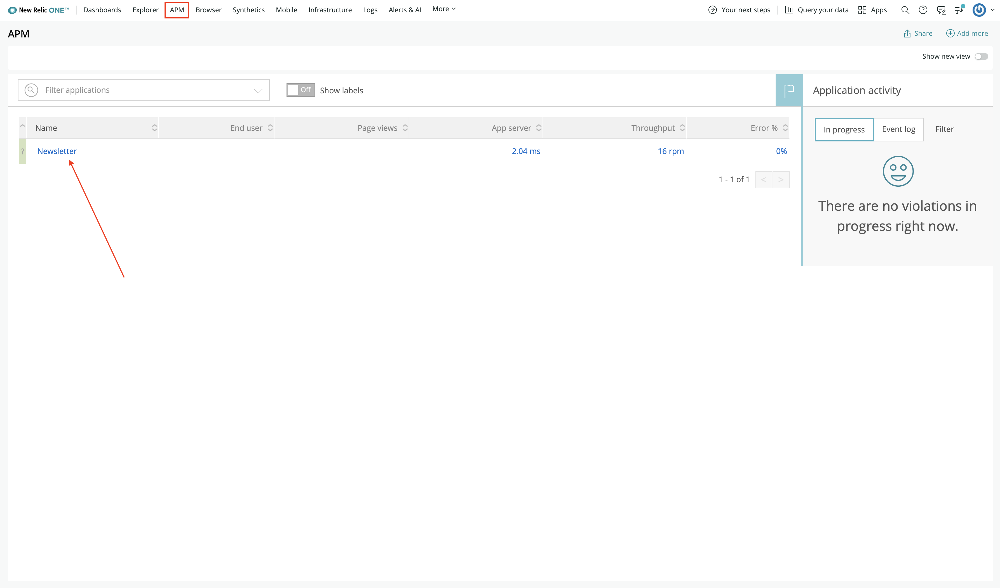
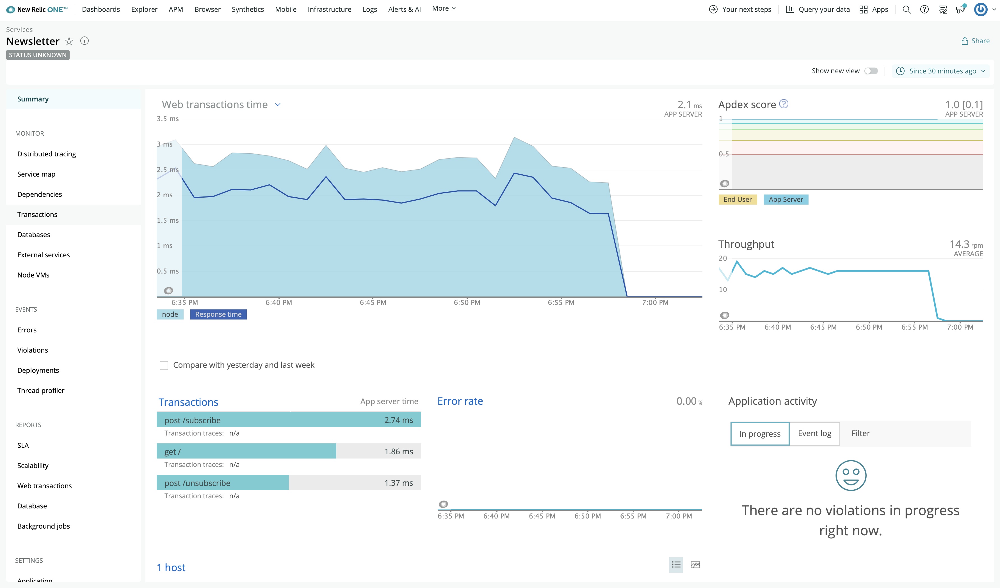

Before you build your New Relic One application, you need to spin up your demo services. This tutorial depends on three important services:

- A website that shows a newsletter signup form. The form's heading text alternates between two versions because you're performing an A/B test to determine which text leads to more high-quality subscriptions.
- A backend web service that accepts requests from the website. You'll instrument this service with New Relic so that you can see transaction data and subscription events in New Relic.
- A simulator service that sends steady traffic to the website so that you don't have to manually generate data

To spin up your demo services, you first need to install [Docker](https://docs.docker.com/get-docker/).

<Steps>

<Step>

Clone the `demo-nodetron` repository from GitHub:

```sh
git clone https://github.com/newrelic/demo-nodetron
```

This repository contains code for creating NodeJS automations.

</Step>

<Step>

Change to the project directory and checkout the A/B tester branch:

```sh
cd demo-nodetron
git checkout DEMO-2536-ab-test-app
```

The `DEMO-2536-ab-test-app` branch contains several important additions to the code in `main`:

- Information in the README.md for spinning up the demo
- The `abtester.aws.json` deployment configuration file. This is used for Demotron deployments.

<Callout variant="tip">

There are two ways to deploy the code for this demo:

- Docker
- Demotron

In this tutorial, you'll learn how to deploy your code to localhost, using Docker. If you'd prefer to deploy this demo to AWS, you can follow the [instructions in the demo's README](https://github.com/newrelic/demo-nodetron/tree/DEMO-2536-ab-test-app#demo-deployer) to use the [`demo-deployer`](https://github.com/newrelic/demo-deployer), also known as Demotron.

</Callout>

</Step>

<Step>

Build the `ab-tester` image from your local directory:

```sh
docker build -t ab-tester .
```

</Step>

<Step>

Run the docker container from the image you created in the last step:

```sh
docker run -d -p 3001:3001 -e NEW_RELIC_LICENSE_KEY=<your NR license key> -e NEW_RELIC_APP_NAME="Newsletter"  ab-tester
```

Once it's finished, you can view the website at localhost:3001.

</Step>

<Step>

Visit [New Relic](https://one.newrelic.com).

</Step>

<Step>

Navigate to **APM** in the top navigation menu and select **Newsletter** from the list of instrumented services:



You may have to wait a minute or two for New Relic to recieve data from your demo services. Once New Relic has the data, you'll see transaction data, such as performance, throughput, and an Apdex score:



</Step>

<Step>

If you need to spin down your demo services at any time, you can look up your container's id with `docker ps` and then kill your container:

```sh
docker container kill <container id>
```

</Step>

</Steps>

Now you're ready to build your New Relic One application! The first step is to [install and configure the New Relic One CLI](../install-nr1).