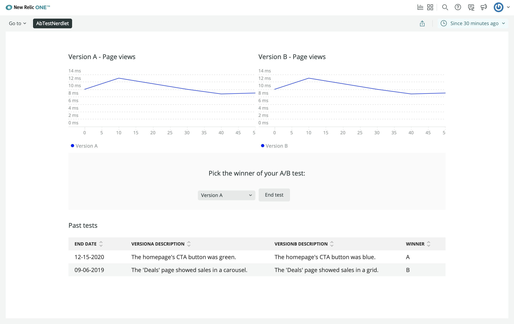

In this course, you’re building an A/B test application in New Relic. The application presents a lot of data, through its charts, about the effectiveness of each design version you’re testing on your demo website. Ultimately, you’ll be able to use that data to decide which design is most effective and show that design to every user who visits your site. In this lesson, you’ll build a form into your application that lets you choose which design you want to show to every user of your site. Before writing any code, look at your design guide to review the section you’re going to build:


This new section has three main components:

- A heading with instructional copy: "Pick a version to end the test"
- A component that you use to crown the winning version of the A/B test
- A button to confirm the winner that you selected

<Steps>

<Step>

Change to the `add-end-test-section` directory of the course repository:

```sh
cd nru-programmability-course/add-end-test-section
```
</Step>

<Step>

Open your Nerdlet's _index.js_ file. All code you write in this lesson belongs in this file.

</Step>

<Step>

Import `Button`, `Select`, and `SelectItem` the way you did for component types in previous lessons:

```js fileName=nerdlets/ab-test-nerdlet/index.js lineHighlight=2
import React from 'react';
import { Button, ChartGroup, Grid, GridItem, HeadingText, LineChart, PieChart, Select, SelectItem, TableChart } from 'nr1';

class NewsletterSignups extends React.Component {
    render() {
        const versionASignups = {
            metadata: {
                id: 'version-a-newsletter-signups',
                name: 'Version A',
                viz: 'main',
                color: 'blue',
            },
            data: [
                { x: 0, y: 0 },
                { x: 10, y: 10 },
                { x: 20, y: 15 },
                { x: 30, y: 5 },
                { x: 40, y: 30 },
                { x: 50, y: 25 },
            ],
        }
        const versionBSignups = {
            metadata: {
                id: 'version-b-newsletter-signups',
                name: 'Version B',
                viz: 'main',
                color: 'green',
            },
            data: [
                { x: 0, y: 20 },
                { x: 10, y: 5 },
                { x: 20, y: 25 },
                { x: 30, y: 45 },
                { x: 40, y: 50 },
                { x: 50, y: 35 },
            ],
        }
        return <React.Fragment>
            <HeadingText style={{ marginTop: '20px', marginBottom: '20px' }}>
                Newsletter subscriptions per version
            </HeadingText>
            <LineChart data={[versionASignups, versionBSignups]} fullWidth />
        </React.Fragment>
    }
}

class TestDistributions extends React.Component {
    render() {
        const distributionA = {
            metadata: {
                id: 'distributions-A',
                name: 'Version A',
                viz: 'main',
                color: 'blue',
            },
            data: [
                { y: 259 },
            ],
        }
        const distributionB = {
            metadata: {
                id: 'distributions-B',
                name: 'Version B',
                viz: 'main',
                color: 'green',
            },
            data: [
                { y: 318 },
            ],
        }
        return <React.Fragment>
            <HeadingText style={{ marginTop: '20px', marginBottom: '20px' }}>
                Total users per version
            </HeadingText>
            <PieChart data={[distributionA, distributionB]} fullWidth />
        </React.Fragment>
    }
}

class SuccessfulRequests extends React.Component {
    render() {
        const successesA = {
            metadata: {
                id: 'successes-A',
                name: 'Version A',
                viz: 'main',
                color: 'blue',
            },
            data: [
                { y: 118 },
            ],
        }
        const successesB = {
            metadata: {
                id: 'successes-B',
                name: 'Version B',
                viz: 'main',
                color: 'green',
            },
            data: [
                { y: 400 },
            ],
        }
        return <React.Fragment>
            <HeadingText style={{ marginTop: '20px', marginBottom: '20px' }}>
                Total subscriptions per version
            </HeadingText>
            <PieChart data={[successesA, successesB]} fullWidth />
        </React.Fragment>
    }
}

class VersionATotals extends React.Component {
    render() {
        const versionATotals = {
            metadata: {
                id: 'totals-A',
                name: 'Version A',
                columns: ['name', 'count'],
            },
            data: [
                {
                    name: 'Successful Requests',
                    count: 85
                },
                {
                    name: 'Failed Requests',
                    count: 2
                },
            ],
        }
        return <React.Fragment>
            <HeadingText style={{ marginTop: '20px', marginBottom: '20px' }}>
                Version A - requests
            </HeadingText>
            <TableChart data={[versionATotals]} fullWidth />
        </React.Fragment>
    }
}

class VersionBTotals extends React.Component {
    render() {
        const versionBTotals = {
            metadata: {
                id: 'totals-B',
                name: 'Version B',
                columns: ['name', 'count'],
            },
            data: [
                {
                    name: 'Successful Requests',
                    count: 180
                },
                {
                    name: 'Failed Requests',
                    count: 30
                },
            ],
        }
        return <React.Fragment>
            <HeadingText style={{ marginTop: '20px', marginBottom: '20px' }}>
                Version B - requests
            </HeadingText>
            <TableChart data={[versionBTotals]} fullWidth />
        </React.Fragment>
    }
}

class VersionAResponseTimes extends React.Component {
    render() {
        const versionAResponseTimes = {
            metadata: {
                id: 'response-times-A',
                name: 'Version A',
                viz: 'main',
                color: 'blue',
                units_data: {
                    y: 'MS'
                }
            },
            data: [
                { x: 0, y: 10 },
                { x: 10, y: 13 },
                { x: 20, y: 11.5 },
                { x: 30, y: 10 },
                { x: 40, y: 8.75 },
                { x: 50, y: 9 },
            ],
        }
        return <React.Fragment>
            <HeadingText style={{ marginTop: '20px', marginBottom: '20px' }}>
                Version A - response times
            </HeadingText>
            <LineChart data={[versionAResponseTimes]} fullWidth />
        </React.Fragment>
    }
}

class VersionBResponseTimes extends React.Component {
    render() {
        const versionBResponseTimes = {
            metadata: {
                id: 'response-times-B',
                name: 'Version B',
                viz: 'main',
                color: 'green',
                units_data: {
                    y: 'MS'
                }
            },
            data: [
                { x: 0, y: 15 },
                { x: 10, y: 13 },
                { x: 20, y: 10 },
                { x: 30, y: 14 },
                { x: 40, y: 16.5 },
                { x: 50, y: 13.5 },
            ],
        }
        return <React.Fragment>
            <HeadingText style={{ marginTop: '20px', marginBottom: '20px' }}>
                Version B - response times
            </HeadingText>
            <LineChart data={[versionBResponseTimes]} fullWidth />
        </React.Fragment>
    }
}

class HistoricalTests extends React.Component {
    render() {
        var historicalData = {
            metadata: {
                id: 'totals-B',
                name: 'Version B',
                columns: ['endDate', 'versionADescription', 'versionBDescription', 'winner'],
            },
            data: [
                {
                    "endDate": "12/15/2020",
                    "versionADescription": "The homepage's CTA button was green.",
                    "versionBDescription": "The homepage's CTA button was blue.",
                    "winner": "A"
                },
                {
                    "endDate": "09/06/2019",
                    "versionADescription": "The 'Deals' page showed sales in a carousel.",
                    "versionBDescription": "The 'Deals' page showed sales in a grid.",
                    "winner": "B"
                }
            ],
        }

        return <React.Fragment>
            <HeadingText style={{ marginTop: '20px', marginBottom: '20px' }}>
                Past tests
            </HeadingText>
            <TableChart data={[historicalData]} fullWidth />
        </React.Fragment>
    }
}

export default class AbTestNerdletNerdlet extends React.Component {
    render() {
        return (
            <Grid>
                <GridItem columnSpan={12}><NewsletterSignups /></GridItem>
                <GridItem columnSpan={6}><TestDistributions /></GridItem>
                <GridItem columnSpan={6}><SuccessfulRequests /></GridItem>
                <GridItem columnSpan={6}><VersionATotals /></GridItem>
                <GridItem columnSpan={6}><VersionBTotals /></GridItem>
                <ChartGroup>
                    <GridItem columnSpan={6}><VersionAResponseTimes /></GridItem>
                    <GridItem columnSpan={6}><VersionBResponseTimes /></GridItem>
                </ChartGroup>
                <GridItem columnSpan={12}><HistoricalTests /></GridItem>
            </Grid>
        )
    }
}
```

Now you’re ready to create your end test section.

</Step>

<Step>

Create a component to encapsulate `Select`, its items, and its logic:

```js fileName=nerdlets/ab-test-nerdlet/index.js lineHighlight=262-269
import React from 'react';
import { Button, ChartGroup, Grid, GridItem, HeadingText, LineChart, PieChart, Select, SelectItem, TableChart } from 'nr1';

class NewsletterSignups extends React.Component {
    render() {
        const versionASignups = {
            metadata: {
                id: 'version-a-newsletter-signups',
                name: 'Version A',
                viz: 'main',
                color: 'blue',
            },
            data: [
                { x: 0, y: 0 },
                { x: 10, y: 10 },
                { x: 20, y: 15 },
                { x: 30, y: 5 },
                { x: 40, y: 30 },
                { x: 50, y: 25 },
            ],
        }
        const versionBSignups = {
            metadata: {
                id: 'version-b-newsletter-signups',
                name: 'Version B',
                viz: 'main',
                color: 'green',
            },
            data: [
                { x: 0, y: 20 },
                { x: 10, y: 5 },
                { x: 20, y: 25 },
                { x: 30, y: 45 },
                { x: 40, y: 50 },
                { x: 50, y: 35 },
            ],
        }
        return <React.Fragment>
            <HeadingText style={{ marginTop: '20px', marginBottom: '20px' }}>
                Newsletter subscriptions per version
            </HeadingText>
            <LineChart data={[versionASignups, versionBSignups]} fullWidth />
        </React.Fragment>
    }
}

class TestDistributions extends React.Component {
    render() {
        const distributionA = {
            metadata: {
                id: 'distributions-A',
                name: 'Version A',
                viz: 'main',
                color: 'blue',
            },
            data: [
                { y: 259 },
            ],
        }
        const distributionB = {
            metadata: {
                id: 'distributions-B',
                name: 'Version B',
                viz: 'main',
                color: 'green',
            },
            data: [
                { y: 318 },
            ],
        }
        return <React.Fragment>
            <HeadingText style={{ marginTop: '20px', marginBottom: '20px' }}>
                Total users per version
            </HeadingText>
            <PieChart data={[distributionA, distributionB]} fullWidth />
        </React.Fragment>
    }
}

class SuccessfulRequests extends React.Component {
    render() {
        const successesA = {
            metadata: {
                id: 'successes-A',
                name: 'Version A',
                viz: 'main',
                color: 'blue',
            },
            data: [
                { y: 118 },
            ],
        }
        const successesB = {
            metadata: {
                id: 'successes-B',
                name: 'Version B',
                viz: 'main',
                color: 'green',
            },
            data: [
                { y: 400 },
            ],
        }
        return <React.Fragment>
            <HeadingText style={{ marginTop: '20px', marginBottom: '20px' }}>
                Total subscriptions per version
            </HeadingText>
            <PieChart data={[successesA, successesB]} fullWidth />
        </React.Fragment>
    }
}

class VersionATotals extends React.Component {
    render() {
        const versionATotals = {
            metadata: {
                id: 'totals-A',
                name: 'Version A',
                columns: ['name', 'count'],
            },
            data: [
                {
                    name: 'Successful Requests',
                    count: 85
                },
                {
                    name: 'Failed Requests',
                    count: 2
                },
            ],
        }
        return <React.Fragment>
            <HeadingText style={{ marginTop: '20px', marginBottom: '20px' }}>
                Version A - requests
            </HeadingText>
            <TableChart data={[versionATotals]} fullWidth />
        </React.Fragment>
    }
}

class VersionBTotals extends React.Component {
    render() {
        const versionBTotals = {
            metadata: {
                id: 'totals-B',
                name: 'Version B',
                columns: ['name', 'count'],
            },
            data: [
                {
                    name: 'Successful Requests',
                    count: 180
                },
                {
                    name: 'Failed Requests',
                    count: 30
                },
            ],
        }
        return <React.Fragment>
            <HeadingText style={{ marginTop: '20px', marginBottom: '20px' }}>
                Version B - requests
            </HeadingText>
            <TableChart data={[versionBTotals]} fullWidth />
        </React.Fragment>
    }
}

class VersionAResponseTimes extends React.Component {
    render() {
        const versionAResponseTimes = {
            metadata: {
                id: 'response-times-A',
                name: 'Version A',
                viz: 'main',
                color: 'blue',
                units_data: {
                    y: 'MS'
                }
            },
            data: [
                { x: 0, y: 10 },
                { x: 10, y: 13 },
                { x: 20, y: 11.5 },
                { x: 30, y: 10 },
                { x: 40, y: 8.75 },
                { x: 50, y: 9 },
            ],
        }
        return <React.Fragment>
            <HeadingText style={{ marginTop: '20px', marginBottom: '20px' }}>
                Version A - response times
            </HeadingText>
            <LineChart data={[versionAResponseTimes]} fullWidth />
        </React.Fragment>
    }
}

class VersionBResponseTimes extends React.Component {
    render() {
        const versionBResponseTimes = {
            metadata: {
                id: 'response-times-B',
                name: 'Version B',
                viz: 'main',
                color: 'green',
                units_data: {
                    y: 'MS'
                }
            },
            data: [
                { x: 0, y: 15 },
                { x: 10, y: 13 },
                { x: 20, y: 10 },
                { x: 30, y: 14 },
                { x: 40, y: 16.5 },
                { x: 50, y: 13.5 },
            ],
        }
        return <React.Fragment>
            <HeadingText style={{ marginTop: '20px', marginBottom: '20px' }}>
                Version B - response times
            </HeadingText>
            <LineChart data={[versionBResponseTimes]} fullWidth />
        </React.Fragment>
    }
}

class HistoricalTests extends React.Component {
    render() {
        var historicalData = {
            metadata: {
                id: 'totals-B',
                name: 'Version B',
                columns: ['endDate', 'versionADescription', 'versionBDescription', 'winner'],
            },
            data: [
                {
                    "endDate": "12/15/2020",
                    "versionADescription": "The homepage's CTA button was green.",
                    "versionBDescription": "The homepage's CTA button was blue.",
                    "winner": "A"
                },
                {
                    "endDate": "09/06/2019",
                    "versionADescription": "The 'Deals' page showed sales in a carousel.",
                    "versionBDescription": "The 'Deals' page showed sales in a grid.",
                    "winner": "B"
                }
            ],
        }

        return <React.Fragment>
            <HeadingText style={{ marginTop: '20px', marginBottom: '20px' }}>
                Past tests
            </HeadingText>
            <TableChart data={[historicalData]} fullWidth />
        </React.Fragment>
    }
}

class VersionSelector extends React.Component {
    render() {
        return <Select>
            <SelectItem value={'A'}>Version A</SelectItem>
            <SelectItem value={'B'}>Version B</SelectItem>
        </Select>
    }
}

export default class AbTestNerdletNerdlet extends React.Component {
    render() {
        return (
            <Grid>
                <GridItem columnSpan={12}><NewsletterSignups /></GridItem>
                <GridItem columnSpan={6}><TestDistributions /></GridItem>
                <GridItem columnSpan={6}><SuccessfulRequests /></GridItem>
                <GridItem columnSpan={6}><VersionATotals /></GridItem>
                <GridItem columnSpan={6}><VersionBTotals /></GridItem>
                <ChartGroup>
                    <GridItem columnSpan={6}><VersionAResponseTimes /></GridItem>
                    <GridItem columnSpan={6}><VersionBResponseTimes /></GridItem>
                </ChartGroup>
                <GridItem columnSpan={12}><HistoricalTests /></GridItem>
            </Grid>
        )
    }
}
```

`VersionSelect` renders a `Select` component with two choices. In each `SelectItem`, you specify a `value` prop. In this case, you use `'A'` to represent version A and `'B'` to represent version B.

</Step>

<Step>

Create a component for the `Button`:

```js fileName=nerdlets/ab-test-nerdlet/index.js lineHighlight=271-277
import React from 'react';
import { Button, ChartGroup, Grid, GridItem, HeadingText, LineChart, PieChart, Select, SelectItem, TableChart } from 'nr1';

class NewsletterSignups extends React.Component {
    render() {
        const versionASignups = {
            metadata: {
                id: 'version-a-newsletter-signups',
                name: 'Version A',
                viz: 'main',
                color: 'blue',
            },
            data: [
                { x: 0, y: 0 },
                { x: 10, y: 10 },
                { x: 20, y: 15 },
                { x: 30, y: 5 },
                { x: 40, y: 30 },
                { x: 50, y: 25 },
            ],
        }
        const versionBSignups = {
            metadata: {
                id: 'version-b-newsletter-signups',
                name: 'Version B',
                viz: 'main',
                color: 'green',
            },
            data: [
                { x: 0, y: 20 },
                { x: 10, y: 5 },
                { x: 20, y: 25 },
                { x: 30, y: 45 },
                { x: 40, y: 50 },
                { x: 50, y: 35 },
            ],
        }
        return <React.Fragment>
            <HeadingText style={{ marginTop: '20px', marginBottom: '20px' }}>
                Newsletter subscriptions per version
            </HeadingText>
            <LineChart data={[versionASignups, versionBSignups]} fullWidth />
        </React.Fragment>
    }
}

class TestDistributions extends React.Component {
    render() {
        const distributionA = {
            metadata: {
                id: 'distributions-A',
                name: 'Version A',
                viz: 'main',
                color: 'blue',
            },
            data: [
                { y: 259 },
            ],
        }
        const distributionB = {
            metadata: {
                id: 'distributions-B',
                name: 'Version B',
                viz: 'main',
                color: 'green',
            },
            data: [
                { y: 318 },
            ],
        }
        return <React.Fragment>
            <HeadingText style={{ marginTop: '20px', marginBottom: '20px' }}>
                Total users per version
            </HeadingText>
            <PieChart data={[distributionA, distributionB]} fullWidth />
        </React.Fragment>
    }
}

class SuccessfulRequests extends React.Component {
    render() {
        const successesA = {
            metadata: {
                id: 'successes-A',
                name: 'Version A',
                viz: 'main',
                color: 'blue',
            },
            data: [
                { y: 118 },
            ],
        }
        const successesB = {
            metadata: {
                id: 'successes-B',
                name: 'Version B',
                viz: 'main',
                color: 'green',
            },
            data: [
                { y: 400 },
            ],
        }
        return <React.Fragment>
            <HeadingText style={{ marginTop: '20px', marginBottom: '20px' }}>
                Total subscriptions per version
            </HeadingText>
            <PieChart data={[successesA, successesB]} fullWidth />
        </React.Fragment>
    }
}

class VersionATotals extends React.Component {
    render() {
        const versionATotals = {
            metadata: {
                id: 'totals-A',
                name: 'Version A',
                columns: ['name', 'count'],
            },
            data: [
                {
                    name: 'Successful Requests',
                    count: 85
                },
                {
                    name: 'Failed Requests',
                    count: 2
                },
            ],
        }
        return <React.Fragment>
            <HeadingText style={{ marginTop: '20px', marginBottom: '20px' }}>
                Version A - requests
            </HeadingText>
            <TableChart data={[versionATotals]} fullWidth />
        </React.Fragment>
    }
}

class VersionBTotals extends React.Component {
    render() {
        const versionBTotals = {
            metadata: {
                id: 'totals-B',
                name: 'Version B',
                columns: ['name', 'count'],
            },
            data: [
                {
                    name: 'Successful Requests',
                    count: 180
                },
                {
                    name: 'Failed Requests',
                    count: 30
                },
            ],
        }
        return <React.Fragment>
            <HeadingText style={{ marginTop: '20px', marginBottom: '20px' }}>
                Version B - requests
            </HeadingText>
            <TableChart data={[versionBTotals]} fullWidth />
        </React.Fragment>
    }
}

class VersionAResponseTimes extends React.Component {
    render() {
        const versionAResponseTimes = {
            metadata: {
                id: 'response-times-A',
                name: 'Version A',
                viz: 'main',
                color: 'blue',
                units_data: {
                    y: 'MS'
                }
            },
            data: [
                { x: 0, y: 10 },
                { x: 10, y: 13 },
                { x: 20, y: 11.5 },
                { x: 30, y: 10 },
                { x: 40, y: 8.75 },
                { x: 50, y: 9 },
            ],
        }
        return <React.Fragment>
            <HeadingText style={{ marginTop: '20px', marginBottom: '20px' }}>
                Version A - response times
            </HeadingText>
            <LineChart data={[versionAResponseTimes]} fullWidth />
        </React.Fragment>
    }
}

class VersionBResponseTimes extends React.Component {
    render() {
        const versionBResponseTimes = {
            metadata: {
                id: 'response-times-B',
                name: 'Version B',
                viz: 'main',
                color: 'green',
                units_data: {
                    y: 'MS'
                }
            },
            data: [
                { x: 0, y: 15 },
                { x: 10, y: 13 },
                { x: 20, y: 10 },
                { x: 30, y: 14 },
                { x: 40, y: 16.5 },
                { x: 50, y: 13.5 },
            ],
        }
        return <React.Fragment>
            <HeadingText style={{ marginTop: '20px', marginBottom: '20px' }}>
                Version B - response times
            </HeadingText>
            <LineChart data={[versionBResponseTimes]} fullWidth />
        </React.Fragment>
    }
}

class HistoricalTests extends React.Component {
    render() {
        var historicalData = {
            metadata: {
                id: 'totals-B',
                name: 'Version B',
                columns: ['endDate', 'versionADescription', 'versionBDescription', 'winner'],
            },
            data: [
                {
                    "endDate": "12/15/2020",
                    "versionADescription": "The homepage's CTA button was green.",
                    "versionBDescription": "The homepage's CTA button was blue.",
                    "winner": "A"
                },
                {
                    "endDate": "09/06/2019",
                    "versionADescription": "The 'Deals' page showed sales in a carousel.",
                    "versionBDescription": "The 'Deals' page showed sales in a grid.",
                    "winner": "B"
                }
            ],
        }

        return <React.Fragment>
            <HeadingText style={{ marginTop: '20px', marginBottom: '20px' }}>
                Past tests
            </HeadingText>
            <TableChart data={[historicalData]} fullWidth />
        </React.Fragment>
    }
}

class VersionSelector extends React.Component {
    render() {
        return <Select>
            <SelectItem value={'A'}>Version A</SelectItem>
            <SelectItem value={'B'}>Version B</SelectItem>
        </Select>
    }
}

class EndTestButton extends React.Component {
    render() {
        return <React.Fragment>
            <Button>End test</Button>
        </React.Fragment>
    }
}

export default class AbTestNerdletNerdlet extends React.Component {
    render() {
        return (
            <Grid>
                <GridItem columnSpan={12}><NewsletterSignups /></GridItem>
                <GridItem columnSpan={6}><TestDistributions /></GridItem>
                <GridItem columnSpan={6}><SuccessfulRequests /></GridItem>
                <GridItem columnSpan={6}><VersionATotals /></GridItem>
                <GridItem columnSpan={6}><VersionBTotals /></GridItem>
                <ChartGroup>
                    <GridItem columnSpan={6}><VersionAResponseTimes /></GridItem>
                    <GridItem columnSpan={6}><VersionBResponseTimes /></GridItem>
                </ChartGroup>
                <GridItem columnSpan={12}><HistoricalTests /></GridItem>
            </Grid>
        )
    }
}
```

This looks trivial, but it will encapsulate button logic as you iterate on your application.

</Step>

<Step>

Create a component for the entire section where your users will end their test:

```js fileName=nerdlets/ab-test-nerdlet/index.js lineHighlight=279-295
import React from 'react';
import { Button, ChartGroup, Grid, GridItem, HeadingText, LineChart, PieChart, Select, SelectItem, TableChart } from 'nr1';

class NewsletterSignups extends React.Component {
    render() {
        const versionASignups = {
            metadata: {
                id: 'version-a-newsletter-signups',
                name: 'Version A',
                viz: 'main',
                color: 'blue',
            },
            data: [
                { x: 0, y: 0 },
                { x: 10, y: 10 },
                { x: 20, y: 15 },
                { x: 30, y: 5 },
                { x: 40, y: 30 },
                { x: 50, y: 25 },
            ],
        }
        const versionBSignups = {
            metadata: {
                id: 'version-b-newsletter-signups',
                name: 'Version B',
                viz: 'main',
                color: 'green',
            },
            data: [
                { x: 0, y: 20 },
                { x: 10, y: 5 },
                { x: 20, y: 25 },
                { x: 30, y: 45 },
                { x: 40, y: 50 },
                { x: 50, y: 35 },
            ],
        }
        return <React.Fragment>
            <HeadingText style={{ marginTop: '20px', marginBottom: '20px' }}>
                Newsletter subscriptions per version
            </HeadingText>
            <LineChart data={[versionASignups, versionBSignups]} fullWidth />
        </React.Fragment>
    }
}

class TestDistributions extends React.Component {
    render() {
        const distributionA = {
            metadata: {
                id: 'distributions-A',
                name: 'Version A',
                viz: 'main',
                color: 'blue',
            },
            data: [
                { y: 259 },
            ],
        }
        const distributionB = {
            metadata: {
                id: 'distributions-B',
                name: 'Version B',
                viz: 'main',
                color: 'green',
            },
            data: [
                { y: 318 },
            ],
        }
        return <React.Fragment>
            <HeadingText style={{ marginTop: '20px', marginBottom: '20px' }}>
                Total users per version
            </HeadingText>
            <PieChart data={[distributionA, distributionB]} fullWidth />
        </React.Fragment>
    }
}

class SuccessfulRequests extends React.Component {
    render() {
        const successesA = {
            metadata: {
                id: 'successes-A',
                name: 'Version A',
                viz: 'main',
                color: 'blue',
            },
            data: [
                { y: 118 },
            ],
        }
        const successesB = {
            metadata: {
                id: 'successes-B',
                name: 'Version B',
                viz: 'main',
                color: 'green',
            },
            data: [
                { y: 400 },
            ],
        }
        return <React.Fragment>
            <HeadingText style={{ marginTop: '20px', marginBottom: '20px' }}>
                Total subscriptions per version
            </HeadingText>
            <PieChart data={[successesA, successesB]} fullWidth />
        </React.Fragment>
    }
}

class VersionATotals extends React.Component {
    render() {
        const versionATotals = {
            metadata: {
                id: 'totals-A',
                name: 'Version A',
                columns: ['name', 'count'],
            },
            data: [
                {
                    name: 'Successful Requests',
                    count: 85
                },
                {
                    name: 'Failed Requests',
                    count: 2
                },
            ],
        }
        return <React.Fragment>
            <HeadingText style={{ marginTop: '20px', marginBottom: '20px' }}>
                Version A - requests
            </HeadingText>
            <TableChart data={[versionATotals]} fullWidth />
        </React.Fragment>
    }
}

class VersionBTotals extends React.Component {
    render() {
        const versionBTotals = {
            metadata: {
                id: 'totals-B',
                name: 'Version B',
                columns: ['name', 'count'],
            },
            data: [
                {
                    name: 'Successful Requests',
                    count: 180
                },
                {
                    name: 'Failed Requests',
                    count: 30
                },
            ],
        }
        return <React.Fragment>
            <HeadingText style={{ marginTop: '20px', marginBottom: '20px' }}>
                Version B - requests
            </HeadingText>
            <TableChart data={[versionBTotals]} fullWidth />
        </React.Fragment>
    }
}

class VersionAResponseTimes extends React.Component {
    render() {
        const versionAResponseTimes = {
            metadata: {
                id: 'response-times-A',
                name: 'Version A',
                viz: 'main',
                color: 'blue',
                units_data: {
                    y: 'MS'
                }
            },
            data: [
                { x: 0, y: 10 },
                { x: 10, y: 13 },
                { x: 20, y: 11.5 },
                { x: 30, y: 10 },
                { x: 40, y: 8.75 },
                { x: 50, y: 9 },
            ],
        }
        return <React.Fragment>
            <HeadingText style={{ marginTop: '20px', marginBottom: '20px' }}>
                Version A - response times
            </HeadingText>
            <LineChart data={[versionAResponseTimes]} fullWidth />
        </React.Fragment>
    }
}

class VersionBResponseTimes extends React.Component {
    render() {
        const versionBResponseTimes = {
            metadata: {
                id: 'response-times-B',
                name: 'Version B',
                viz: 'main',
                color: 'green',
                units_data: {
                    y: 'MS'
                }
            },
            data: [
                { x: 0, y: 15 },
                { x: 10, y: 13 },
                { x: 20, y: 10 },
                { x: 30, y: 14 },
                { x: 40, y: 16.5 },
                { x: 50, y: 13.5 },
            ],
        }
        return <React.Fragment>
            <HeadingText style={{ marginTop: '20px', marginBottom: '20px' }}>
                Version B - response times
            </HeadingText>
            <LineChart data={[versionBResponseTimes]} fullWidth />
        </React.Fragment>
    }
}

class HistoricalTests extends React.Component {
    render() {
        var historicalData = {
            metadata: {
                id: 'totals-B',
                name: 'Version B',
                columns: ['endDate', 'versionADescription', 'versionBDescription', 'winner'],
            },
            data: [
                {
                    "endDate": "12/15/2020",
                    "versionADescription": "The homepage's CTA button was green.",
                    "versionBDescription": "The homepage's CTA button was blue.",
                    "winner": "A"
                },
                {
                    "endDate": "09/06/2019",
                    "versionADescription": "The 'Deals' page showed sales in a carousel.",
                    "versionBDescription": "The 'Deals' page showed sales in a grid.",
                    "winner": "B"
                }
            ],
        }

        return <React.Fragment>
            <HeadingText style={{ marginTop: '20px', marginBottom: '20px' }}>
                Past tests
            </HeadingText>
            <TableChart data={[historicalData]} fullWidth />
        </React.Fragment>
    }
}

class VersionSelector extends React.Component {
    render() {
        return <Select>
            <SelectItem value={'A'}>Version A</SelectItem>
            <SelectItem value={'B'}>Version B</SelectItem>
        </Select>
    }
}

class EndTestButton extends React.Component {
    render() {
        return <React.Fragment>
            <Button>End test</Button>
        </React.Fragment>
    }
}

class EndTestSection extends React.Component {
    render() {
        return <Grid style={{ margin: 'auto', backgroundColor: '#fafafa', padding: '20px' }}>
            <GridItem columnSpan={12}>
                <HeadingText style={{ marginLeft: 'auto', marginRight: 'auto', marginTop: '20px', marginBottom: '20px', textAlign: 'center'}}>
                    Pick a version to end the test:
                </HeadingText>
            </GridItem>
            <GridItem columnStart={5} columnEnd={6} style={{textAlign: 'right', paddingTop: '5px'}}>
                <VersionSelector />
            </GridItem>
            <GridItem columnStart={7} columnEnd={8}>
                <EndTestButton>End test</EndTestButton>
            </GridItem>
        </Grid>
    }
}

export default class AbTestNerdletNerdlet extends React.Component {
    render() {
        return (
            <Grid>
                <GridItem columnSpan={12}><NewsletterSignups /></GridItem>
                <GridItem columnSpan={6}><TestDistributions /></GridItem>
                <GridItem columnSpan={6}><SuccessfulRequests /></GridItem>
                <GridItem columnSpan={6}><VersionATotals /></GridItem>
                <GridItem columnSpan={6}><VersionBTotals /></GridItem>
                <ChartGroup>
                    <GridItem columnSpan={6}><VersionAResponseTimes /></GridItem>
                    <GridItem columnSpan={6}><VersionBResponseTimes /></GridItem>
                </ChartGroup>
                <GridItem columnSpan={12}><HistoricalTests /></GridItem>
            </Grid>
        )
    }
}
```

Here, you create a `Grid` with three items. First, you create a `GridItem` that contains a `HeadingText` and spans all 12 columns. In the next row, you have two items:

- The `VersionSelector` component you created in the previous step
- A `Button` which reads "End test"

These items each span one column, but instead of using `columnSpan`, they use a combination of `columnStart` and `columnEnd` to specify which columns they cover.

</Step>

<Step>

Add `EndTestSection` to your nerdlet:

```js fileName=nerdlets/ab-test-nerdlet/index.js lineHighlight=310
import React from 'react';
import { Button, ChartGroup, Grid, GridItem, HeadingText, LineChart, PieChart, Select, SelectItem, TableChart } from 'nr1';

class NewsletterSignups extends React.Component {
    render() {
        const versionASignups = {
            metadata: {
                id: 'version-a-newsletter-signups',
                name: 'Version A',
                viz: 'main',
                color: 'blue',
            },
            data: [
                { x: 0, y: 0 },
                { x: 10, y: 10 },
                { x: 20, y: 15 },
                { x: 30, y: 5 },
                { x: 40, y: 30 },
                { x: 50, y: 25 },
            ],
        }
        const versionBSignups = {
            metadata: {
                id: 'version-b-newsletter-signups',
                name: 'Version B',
                viz: 'main',
                color: 'green',
            },
            data: [
                { x: 0, y: 20 },
                { x: 10, y: 5 },
                { x: 20, y: 25 },
                { x: 30, y: 45 },
                { x: 40, y: 50 },
                { x: 50, y: 35 },
            ],
        }
        return <React.Fragment>
            <HeadingText style={{ marginTop: '20px', marginBottom: '20px' }}>
                Newsletter subscriptions per version
            </HeadingText>
            <LineChart data={[versionASignups, versionBSignups]} fullWidth />
        </React.Fragment>
    }
}

class TestDistributions extends React.Component {
    render() {
        const distributionA = {
            metadata: {
                id: 'distributions-A',
                name: 'Version A',
                viz: 'main',
                color: 'blue',
            },
            data: [
                { y: 259 },
            ],
        }
        const distributionB = {
            metadata: {
                id: 'distributions-B',
                name: 'Version B',
                viz: 'main',
                color: 'green',
            },
            data: [
                { y: 318 },
            ],
        }
        return <React.Fragment>
            <HeadingText style={{ marginTop: '20px', marginBottom: '20px' }}>
                Total users per version
            </HeadingText>
            <PieChart data={[distributionA, distributionB]} fullWidth />
        </React.Fragment>
    }
}

class SuccessfulRequests extends React.Component {
    render() {
        const successesA = {
            metadata: {
                id: 'successes-A',
                name: 'Version A',
                viz: 'main',
                color: 'blue',
            },
            data: [
                { y: 118 },
            ],
        }
        const successesB = {
            metadata: {
                id: 'successes-B',
                name: 'Version B',
                viz: 'main',
                color: 'green',
            },
            data: [
                { y: 400 },
            ],
        }
        return <React.Fragment>
            <HeadingText style={{ marginTop: '20px', marginBottom: '20px' }}>
                Total subscriptions per version
            </HeadingText>
            <PieChart data={[successesA, successesB]} fullWidth />
        </React.Fragment>
    }
}

class VersionATotals extends React.Component {
    render() {
        const versionATotals = {
            metadata: {
                id: 'totals-A',
                name: 'Version A',
                columns: ['name', 'count'],
            },
            data: [
                {
                    name: 'Successful Requests',
                    count: 85
                },
                {
                    name: 'Failed Requests',
                    count: 2
                },
            ],
        }
        return <React.Fragment>
            <HeadingText style={{ marginTop: '20px', marginBottom: '20px' }}>
                Version A - requests
            </HeadingText>
            <TableChart data={[versionATotals]} fullWidth />
        </React.Fragment>
    }
}

class VersionBTotals extends React.Component {
    render() {
        const versionBTotals = {
            metadata: {
                id: 'totals-B',
                name: 'Version B',
                columns: ['name', 'count'],
            },
            data: [
                {
                    name: 'Successful Requests',
                    count: 180
                },
                {
                    name: 'Failed Requests',
                    count: 30
                },
            ],
        }
        return <React.Fragment>
            <HeadingText style={{ marginTop: '20px', marginBottom: '20px' }}>
                Version B - requests
            </HeadingText>
            <TableChart data={[versionBTotals]} fullWidth />
        </React.Fragment>
    }
}

class VersionAResponseTimes extends React.Component {
    render() {
        const versionAResponseTimes = {
            metadata: {
                id: 'response-times-A',
                name: 'Version A',
                viz: 'main',
                color: 'blue',
                units_data: {
                    y: 'MS'
                }
            },
            data: [
                { x: 0, y: 10 },
                { x: 10, y: 13 },
                { x: 20, y: 11.5 },
                { x: 30, y: 10 },
                { x: 40, y: 8.75 },
                { x: 50, y: 9 },
            ],
        }
        return <React.Fragment>
            <HeadingText style={{ marginTop: '20px', marginBottom: '20px' }}>
                Version A - response times
            </HeadingText>
            <LineChart data={[versionAResponseTimes]} fullWidth />
        </React.Fragment>
    }
}

class VersionBResponseTimes extends React.Component {
    render() {
        const versionBResponseTimes = {
            metadata: {
                id: 'response-times-B',
                name: 'Version B',
                viz: 'main',
                color: 'green',
                units_data: {
                    y: 'MS'
                }
            },
            data: [
                { x: 0, y: 15 },
                { x: 10, y: 13 },
                { x: 20, y: 10 },
                { x: 30, y: 14 },
                { x: 40, y: 16.5 },
                { x: 50, y: 13.5 },
            ],
        }
        return <React.Fragment>
            <HeadingText style={{ marginTop: '20px', marginBottom: '20px' }}>
                Version B - response times
            </HeadingText>
            <LineChart data={[versionBResponseTimes]} fullWidth />
        </React.Fragment>
    }
}

class HistoricalTests extends React.Component {
    render() {
        var historicalData = {
            metadata: {
                id: 'totals-B',
                name: 'Version B',
                columns: ['endDate', 'versionADescription', 'versionBDescription', 'winner'],
            },
            data: [
                {
                    "endDate": "12/15/2020",
                    "versionADescription": "The homepage's CTA button was green.",
                    "versionBDescription": "The homepage's CTA button was blue.",
                    "winner": "A"
                },
                {
                    "endDate": "09/06/2019",
                    "versionADescription": "The 'Deals' page showed sales in a carousel.",
                    "versionBDescription": "The 'Deals' page showed sales in a grid.",
                    "winner": "B"
                }
            ],
        }

        return <React.Fragment>
            <HeadingText style={{ marginTop: '20px', marginBottom: '20px' }}>
                Past tests
            </HeadingText>
            <TableChart data={[historicalData]} fullWidth />
        </React.Fragment>
    }
}

class VersionSelector extends React.Component {
    render() {
        return <Select>
            <SelectItem value={'A'}>Version A</SelectItem>
            <SelectItem value={'B'}>Version B</SelectItem>
        </Select>
    }
}

class EndTestButton extends React.Component {
    render() {
        return <React.Fragment>
            <Button>End test</Button>
        </React.Fragment>
    }
}

class EndTestSection extends React.Component {
    render() {
        return <Grid style={{ margin: 'auto', backgroundColor: '#fafafa', padding: '20px' }}>
            <GridItem columnSpan={12}>
                <HeadingText style={{ marginLeft: 'auto', marginRight: 'auto', marginTop: '20px', marginBottom: '20px', textAlign: 'center'}}>
                    Pick a version to end the test:
                </HeadingText>
            </GridItem>
            <GridItem columnStart={5} columnEnd={6} style={{textAlign: 'right', paddingTop: '5px'}}>
                <VersionSelector />
            </GridItem>
            <GridItem columnStart={7} columnEnd={8}>
                <EndTestButton>End test</EndTestButton>
            </GridItem>
        </Grid>
    }
}

export default class AbTestNerdletNerdlet extends React.Component {
    render() {
        return (
            <Grid>
                <GridItem columnSpan={12}><NewsletterSignups /></GridItem>
                <GridItem columnSpan={6}><TestDistributions /></GridItem>
                <GridItem columnSpan={6}><SuccessfulRequests /></GridItem>
                <GridItem columnSpan={6}><VersionATotals /></GridItem>
                <GridItem columnSpan={6}><VersionBTotals /></GridItem>
                <ChartGroup>
                    <GridItem columnSpan={6}><VersionAResponseTimes /></GridItem>
                    <GridItem columnSpan={6}><VersionBResponseTimes /></GridItem>
                </ChartGroup>
                <GridItem columnSpan={12}><EndTestSection /></GridItem>
                <GridItem columnSpan={12}><HistoricalTests /></GridItem>
            </Grid>
        )
    }
}
```

If you check your application in New Relic One, you'll see that you're already off to a good start:



</Step>

</Steps>

However, you need to make a few improvements to this code. When you select a version, the selected value in the component doesn't change. You must control the value that `Select` displays using its `value` prop and `onChange` event handler. In the next lesson, you’ll update your code to persist your version choice in the `Select` component.
