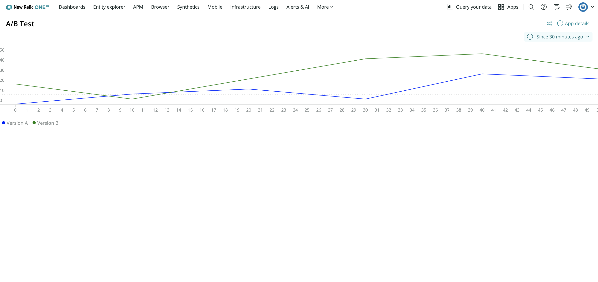

In this course, you’re building an A/B test application in the New Relic platform. Previously, you learned about the New Relic One SDK and its component library. Now, It’s time for you to start building your application focusing first on chart components. Before you write any code, consult your design guide to remember what the application will look like when you finish:


There are several charts you need to create, which may seem overwhelming at first, but take it one step at a time. The topmost chart, and the first you’ll create, is a line chart that shows the number of users who sign up for your newsletter and what version of your website they were shown.

<Steps>

<Step>

Change to the `add-your-first-chart` directory of the course repository:

```sh
cd nru-programmability-course/add-your-first-chart
```

This directory contains the code that we expect your application to have at this point in the course. By navigating to the correct directory at the start of each lesson, you leave your custom code behind, thereby protecting yourself from carrying incorrect code from one lesson to the next.

</Step>

<Step>

Open your Nerdlet's _index.js_ file. All code you write in this lesson belongs in this file.

</Step>

<Step>

Import `LineChart`:

```js fileName=nerdlets/ab-test-nerdlet/index.js lineHighlight=2
import React from 'react';
import { LineChart } from 'nr1';

export default class AbTestNerdletNerdlet extends React.Component {
    render() {
        return <h1>A/B test results</h1>;
    }
}

```

This lets you create `LineChart` components in your application code.

</Step>

<Step>

Create a component called `NewsletterSignups` to hold your first `LineChart` and some mock data:

```js fileName=index.js lineHighlight=4-40
import React from 'react';
import { LineChart } from 'nr1';

class NewsletterSignups extends React.Component {
    render() {
        const versionASignups = {
            metadata: {
                id: 'version-a-newsletter-signups',
                name: 'Version A',
                viz: 'main',
                color: 'blue',
            },
            data: [
                { x: 0, y: 0 },
                { x: 10, y: 10 },
                { x: 20, y: 15 },
                { x: 30, y: 5 },
                { x: 40, y: 30 },
                { x: 50, y: 25 },
            ],
        }
        const versionBSignups = {
            metadata: {
                id: 'version-b-newsletter-signups',
                name: 'Version B',
                viz: 'main',
                color: 'green',
            },
            data: [
                { x: 0, y: 20 },
                { x: 10, y: 5 },
                { x: 20, y: 25 },
                { x: 30, y: 45 },
                { x: 40, y: 50 },
                { x: 50, y: 35 },
            ],
        }
        return <LineChart data={[versionASignups, versionBSignups]} fullWidth />
    }
}

export default class AbTestNerdletNerdlet extends React.Component {
    render() {
        return <h1>Hello, ab-test-nerdlet Nerdlet!</h1>;
    }
}
```

Here, you’ve created two arbitrary data series which represent versions A and B of your test. Right now, you're using manually-crafted data points. In the future, you'll replace these with data queried from New Relic.

Notice that you’ve specified a color for each series in the chart. The `color` metadata attribute takes any CSS-acceptable color format. Setting `viz: 'main'` means that you want to render the `LineChart` series as a line, the component's default display style. For the `data` prop in the `LineChart` component, you passed the two series in an array so that both are represented together. Finally, you used the chart’s `fullWidth` prop to stretch the chart’s width to fill the view.

</Step>

<Step>

Replace the default heading in your Nerdlet's `render()` method with your new component:

```js fileName=index.js lineHighlight=43-47
import React from 'react';
import { LineChart } from 'nr1';

class NewsletterSignups extends React.Component {
    render() {
        const versionASignups = {
            metadata: {
                id: 'version-a-newsletter-signups',
                name: 'Version A',
                viz: 'main',
                color: 'blue',
            },
            data: [
                { x: 0, y: 0 },
                { x: 10, y: 10 },
                { x: 20, y: 15 },
                { x: 30, y: 5 },
                { x: 40, y: 30 },
                { x: 50, y: 25 },
            ],
        }
        const versionBSignups = {
            metadata: {
                id: 'version-b-newsletter-signups',
                name: 'Version B',
                viz: 'main',
                color: 'green',
            },
            data: [
                { x: 0, y: 20 },
                { x: 10, y: 5 },
                { x: 20, y: 25 },
                { x: 30, y: 45 },
                { x: 40, y: 50 },
                { x: 50, y: 35 },
            ],
        }
        return <LineChart data={[versionASignups, versionBSignups]} fullWidth />
    }
}

export default class AbTestNerdletNerdlet extends React.Component {
    render() {
        return <React.Fragment>
            <NewsletterSignups />
        </React.Fragment>;
    }
}
```

If you serve your Nerdpack with `nr1 nerdpack:serve`, you'll see the `LineChart` displayed in your application:



</Step>

</Steps>

In five steps, you’ve breathed life into your New Relic One application. Instead of a bland “Hello world” message, your application now shows a colorful line chart with two mocked data series. These data series represent server-side traffic for each of the competing designs in your demo website. In the next lesson, you’ll build on this foundation by creating another chart type.
