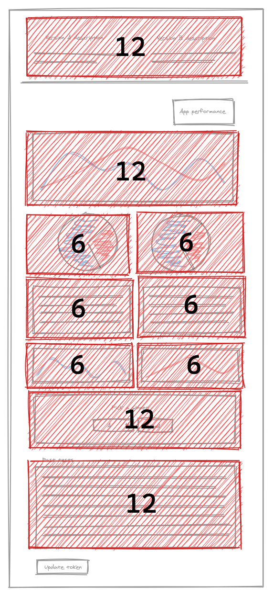

In previous hands-on lessons, you created all the charts from your design guide. Unfortunately, they aren’t laid out like they are in the design. The New Relic One SDK provides multiple solutions for organizing your components. The one you’ll learn about in this lesson is the `Grid` component.

To arrange your charts, place them in a `Grid`. A `Grid` is a container you use to organize your content into 12-column rows.  A `GridItem` is the building block for a `Grid`. You specify the `columnSpan` of a `GridItem` between _1_ and _12_ to determine how much of the row that the `GridItem` should cover. So, if you want a chart to stretch across the width of the view, you would place the chart in a `GridItem` with a `columnSpan` of _12_. If you want twelve charts to fit in a single row, use a `columnSpan` of _1_.

Using the design guide as a base, you can plan how to organize your `Grid`:



Once you’ve planned out how you’re going to arrange your columns, you can write some code to realize your plans.

<Steps>

<Step>

Change to the `add-a-grid` directory of the course repository:

```sh
cd nru-programmability-course/add-a-grid
```

</Step>

<Step>

Open your Nerdlet's _index.js_ file. All code you write in this lesson belongs in this file.

</Step>

<Step>

Import `Grid` and `GridItem` the way you did for other component types in previous lessons:

```js
// index.js

import { ChartGroup, Grid, GridItem, LineChart, PieChart, TableChart } from 'nr1';
```

Now, you’re ready to organize your charts.

</Step>

<Step>

In your nerdlet's `render()` method, place each chart in a `GridItem`. Then, place all your items in a `Grid`:

```js
render() {
    return (
        <Grid>
            <GridItem columnSpan={12}><NewsletterSignups /></GridItem>
            <GridItem columnSpan={6}><TestDistributions /></GridItem>
            <GridItem columnSpan={6}><SuccessfulRequests /></GridItem>
            <GridItem columnSpan={6}><VersionATotals /></GridItem>
            <GridItem columnSpan={6}><VersionBTotals /></GridItem>
            <ChartGroup>
                <GridItem columnSpan={6}><VersionAResponseTimes /></GridItem>
                <GridItem columnSpan={6}><VersionBResponseTimes /></GridItem>
            </ChartGroup>
            <GridItem columnSpan={12}><HistoricalTests /></GridItem>
        </Grid>
    )
}
```

The `columnSpan` for each chart matches the layout plan. Every chart that takes up half the 12-column row has a `columnSpan` of _6_, and every chart that takes up the whole row has a `columnSpan` of _12_. Notice that each of the charts in the `ChartGroup`, but not the `ChartGroup` itself, is in a `GridItem`. A `ChartGroup` connects charts' behaviors, not their locations.

<Callout variant="tip">

Each chart fills its `columnSpan` because they use the `fullWidth` prop. `fullWidth` makes the chart fill its available horizontal space and `GridItem.columnSpan` restricts that space to some fraction of the row. Remove a `fullWidth` prop, and see how the chart reacts.

</Callout>

Serve your application and view your changes in New Relic One:


</Step>

</Steps>

Now your charts are organized, but your nerdlet would look cleaner with margins around its charts.

In just four steps, you significantly improved the readability and usability of your A/B test application, but you can take further steps to improve the usability of your charts. In the next lesson, you’ll add headings to your charts to remind yourself of what data each chart presents.