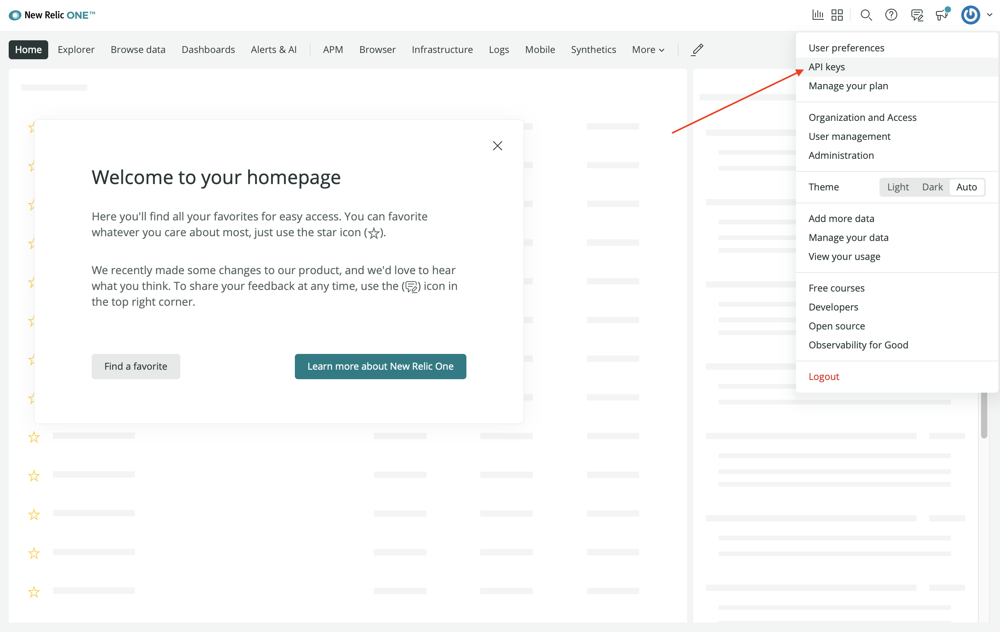
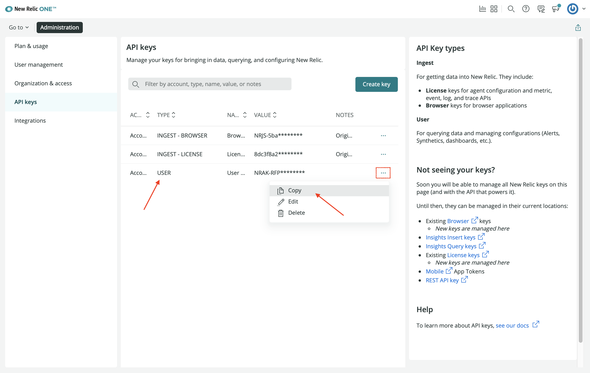
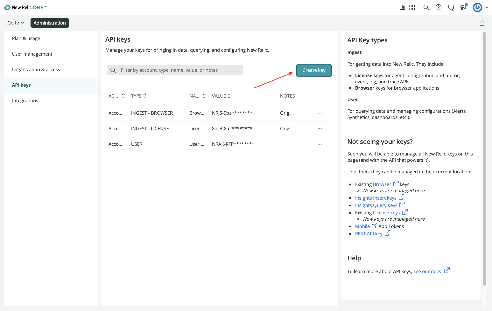
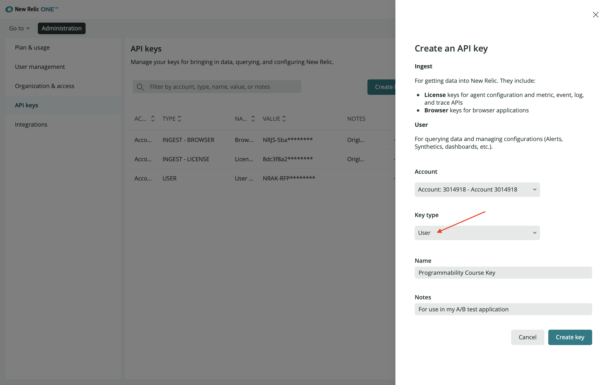

<HideWhenEmbedded>

<Callout variant="course">

This lesson is part of a course that teaches you how to build a New Relic One application from the ground up. If you haven't already, check out the [course introduction](/ab-test).

Each lesson in the course builds upon the last, so make sure you've completed the last lesson, [_Spin up your demo services_](/build-apps/ab-test/demo-setup), before starting this one.

</Callout>

</HideWhenEmbedded>

One of the primary elements of the New Relic One SDK is the command line interface (CLI). To create a Nerdpack , you'll need to install the SDK, configure the CLI to work with your New Relic account, and then utilize its `create` command.

# Install and configure the CLI

<Steps>

<Step>

**Select or create a User key.**

From the top navigation, go to **API keys**:



If you have an existing User key, copy it:



If not, click **Create key**:



Select **User** for **Key type**, optionally add a name and notes, and click **Create key**:



Copy the key you created. You'll use it to associate your New Relic account with the CLI. The CLI will then use the key to manage entities within your account.

</Step>

<Step>

**Download the SDK's installer for your operating system.**

Install the SDK for your operating system:

- [Mac download](https://cli.nr-ext.net/installer.pkg)
- [Linux download](https://cli.nr-ext.net/installer.sh)
- [Windows download](https://cli.nr-ext.net/installer.exe)

Once you've installed the SDK, you'll have access to the `nr1` CLI. Verify this by checking your SDK version:

```sh
nr1 --version
```

<Callout variant="tip">

It’s important to distinguish between the `newrelic` CLI and the `nr1` CLI. `newrelic` is for managing entities in your New Relic account. `nr1` is for managing New Relic One applications.

</Callout>

</Step>

<Step>

**Associate your New Relic account as a CLI profile.**

Use `nr1 profiles:add` to associate the CLI with your New Relic account:

```sh
nr1 profiles:add --name <profile name> --api-key <User key> --region <region>
```

<Callout variant="important">

Make sure to replace the `<profile name>` with an arbirary name, the `<User key>` with the key you copied in **Step 1**, and the region with either `us` or `eu`.

</Callout>

Profiles let you select which New Relic account you want to run commands against. If you have multiple accounts, you can view them with `profiles:list`:

```sh
nr1 profiles:list
```

Notice that one profile is your default profile. This is the account your commands will run against, unless you specify another. To specify a profile for a particular command, use the `--profile` option:

```sh
nr1 create --profile <your profile>
```

If this is your first time using the CLI, then the profile you just added is your default profile. If you have other profiles, you need to set your default to the one you'd like to use for this course:

```sh
nr1 profiles:default
```

<Callout variant="tip">

If you forget these commands, you can look them up in the profiles help menu:

```sh
nr1 profiles --help
```

</Callout>

</Step>

</Steps>

Now, you’re ready to build an application with the New Relic One CLI.

<HideWhenEmbedded>

<Callout variant="course">

This lesson is part of a course that teaches you how to build a New Relic One application from the ground up. Continue on to the next lesson: [_Create a Nerdpack_](/build-apps/ab-test/create-nerdpack).

</Callout>

</HideWhenEmbedded>