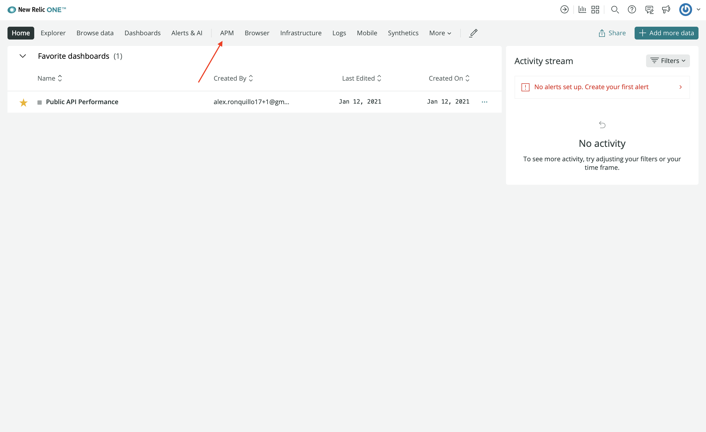
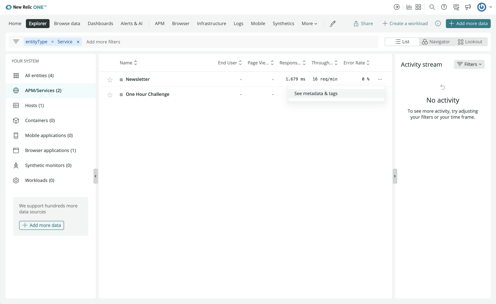
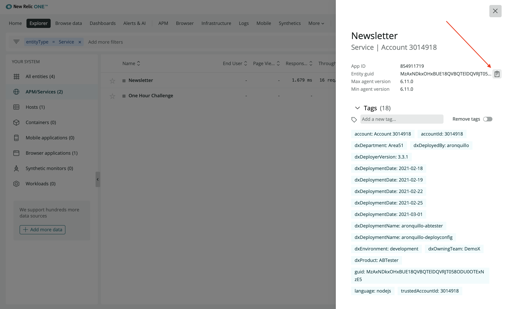
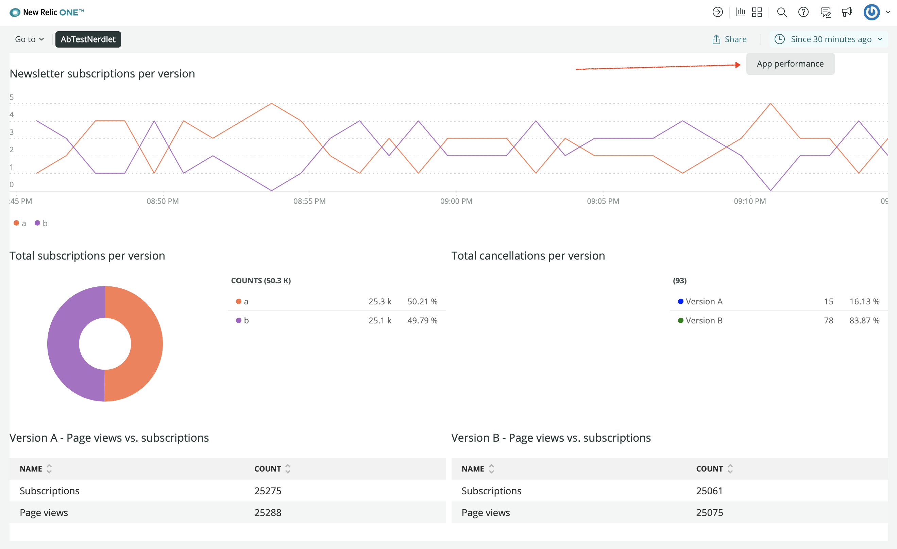
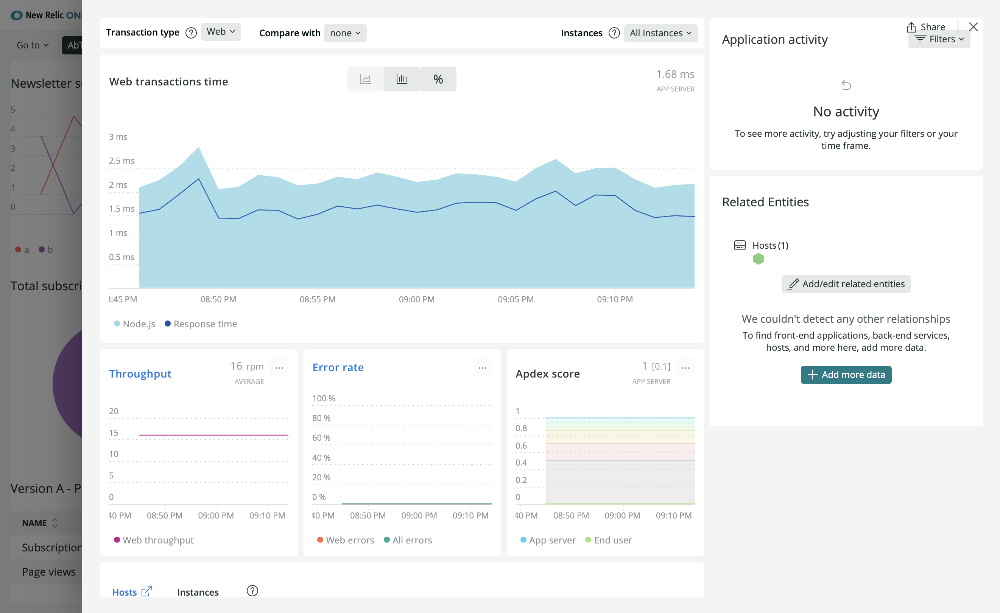

In the last lesson, you used `PlatformStateContext` from the New Relic One SDK to lookup the application user's account ID and the time range they selected from the app's time picker. Now, you'll learn about another component that interacts with the New Relic platform: `navigation`.

The `navigation` component lets you open entities, navigate to entities, and build Location objects for entities from your nerdlet. You can also use `navigation` for other nerdlets and launchers.

<Steps>

<Step>

Change to the `add-platform-state-context` directory of the course repository:

```sh
cd nru-programmability-course/add-platform-state-context
```

This directory contains the code that we expect your application to have at this point in the course. By navigating to the correct directory at the start of each lesson, you leave your custom code behind, thereby protecting yourself from carrying incorrect code from one lesson to the next.

</Step>

<Step>

Open your Nerdlet's index.js file. All code you write in this lesson belongs in this file.

</Step>

<Step>

Import `PlatformStateContext`:

```js
import { AccountStorageMutation, AccountStorageQuery, BlockText, Button, ChartGroup, Select, SelectItem, Spinner, Grid, GridItem, HeadingText, LineChart, Modal, NerdGraphQuery, NerdGraphMutation, navigation, PlatformStateContext, PieChart, TableChart, NrqlQuery, TextField } from 'nr1';
```

Now, you can use the `navigation` component in your nerdlet. For this New Relic One application, you'll create a button that shows to your demo service's APM entity.

</Step>

<Step>

Create a new `NewsletterSignups` method, called `.openApmEntity()`:

```js
openApmEntity() {
    navigation.openStackedEntity(ENTITY_GUID)
}
```

This method uses `navigation.openStackedEntity()` to display your demo application's APM entity in a stacked view. Notice `.openApmEntity()` requires your `ENTITY_GUID`. You need to locate that ID and store it in a constant.

</Step>

<Step>

Navigate to **APM**:



See metadata for your **Newsletter** service:



Copy the entity's GUID:



Create an `ENTITY_GUID` constant:

```js
const ENTITY_GUID = "<YOUR-ENTITY-GUID>"
```

Now `.openApmEntity()` knows that entity to show. Next, you need to create a button to invoke this method.

</Step>

<Step>

Create a button to show your APM entity:

```js
<Grid>
    <GridItem columnSpan={10}>
        <HeadingText className="chartHeader">
            Newsletter subscriptions per version
        </HeadingText>
    </GridItem>
    <GridItem columnSpan={2}>
        <Button onClick={this.openAPMEntity}>
            App performance
        </Button>
    </GridItem>
</Grid>
```

Here, you've created a button, added a grid to place the button on the right side of the chart's heading, and configured the button to call `.openApmEntity()` when it's clicked.

</Step>

<Step>

Navigate to the root of your Nerdpack at `nru-programmability-course/persist-selected-version/ab-test`.

</Step>

<Step>

Serve your application locally:

```sh
nr1 nerdpack:serve
```

</Step>

<Step>

[View your application](https://one.newrelic.com?nerdpacks=local):



Click **App performance**:



Now you see the stacked entity!

</Step>

</Steps>

Congratulations! You're finished writing all the code you'll write for you New Relic One A/B test application. Now, you have an application reporting New Relic data from your demo application that is running an A/B test. You've created several charts, buttons, and other UI elements. You've organized your components into a readable and usable view.

On top of the visuals, you've supplied data to your charts from multiple data sources in and out of New Relic. You've created some backend functionality which utilizes your New Relic One application's own data store. You've also utilized the platform APIs for interacting with platform UI and showing a stacked entity view.

You've really accomplished a lot throughout this course, so far. There are only a few things left to do! First, is to learn how to deploy and subscribe to your New Relic application so that it can run on our platform instead of your own local server. Second, is to learn how to deal with some common issues you might see in New Relic One application development.