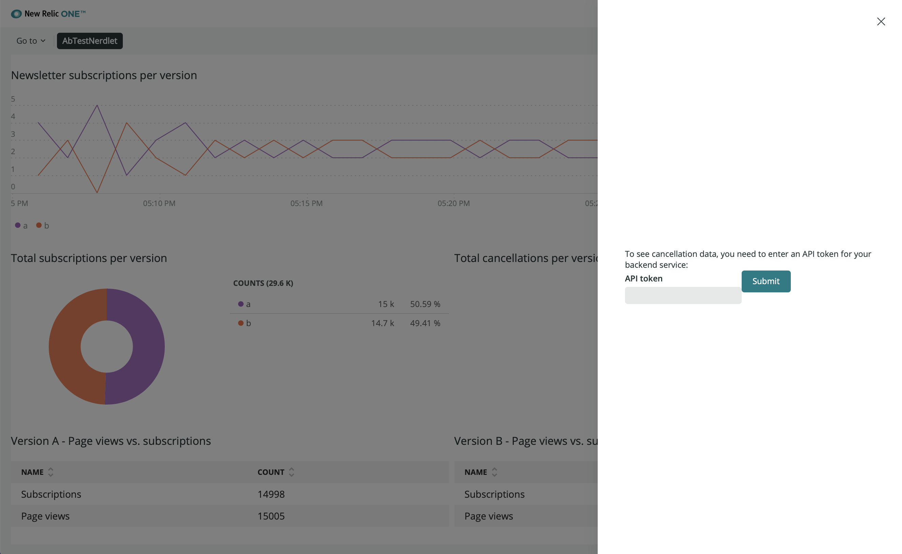
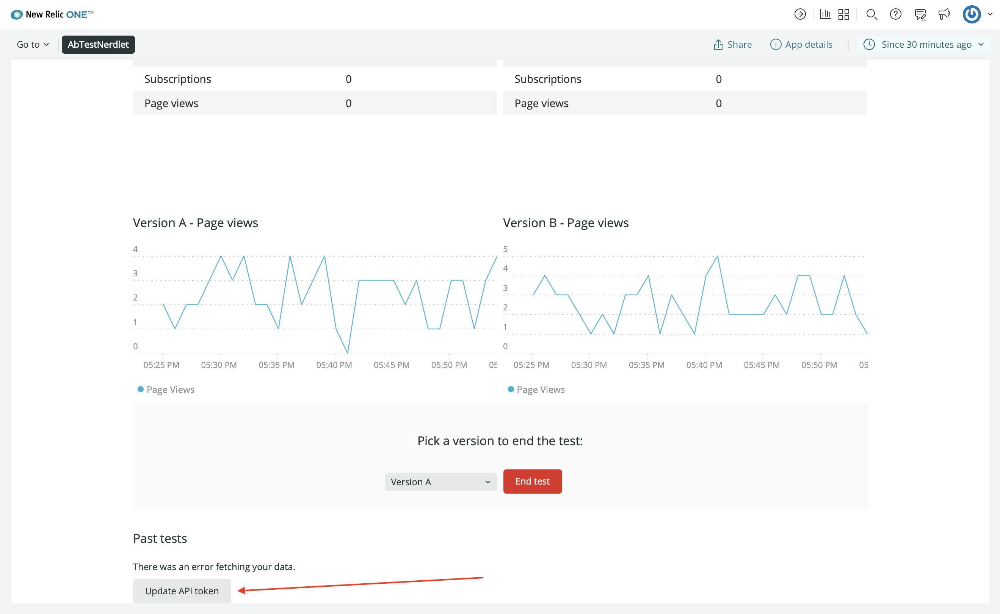
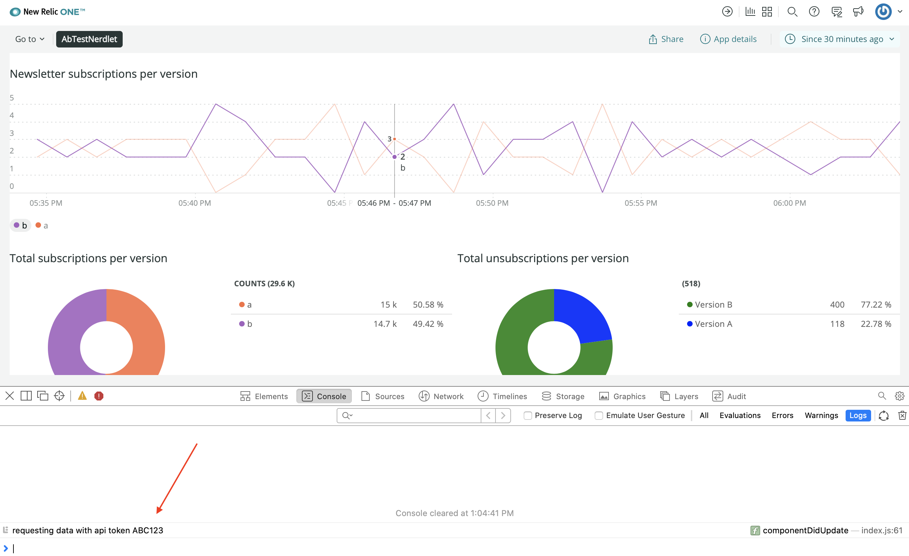

Throughout this course, you're building a New Relic One application that gathers telemetry data from a demo web service that's running an A/B test on a newsletter signup form. The purpose of your New Relic One application is to help you understand how design changes impact the number of high quality newsletter subscriptions your service gets. The business objective, to increase your service's high quality newsletter subscriptions, relies primarily on three key pieces of information:

- Number of page views per version
- Number of subscriptions per version
- Number of cancellations

Cancellations are important because if one design version of your newsletter signup form results in a high number of subscriptions but also a high number of cancellations, then those subscriptions are not as valuable.

In previous lessons, you gathered data for page views and subscriptions from New Relic's database (NRDB), but you still need cancellation data. Your demo application does not report cancellation data to New Relic, so you need to fetch that data from an external source. We've provided a service at https://api.nerdsletter.net/cancellations to return fake cancellation data for the purposes of this course. If you visit this URL in your browser, you'll see a brief message: "Unauthorized". This is because we created this service with a requirement that whoever requests its data must pass an Authorization header with the bearer token `ABC123`.

So before you can request cancellation data from api.nerdsletter.net, you need to implement a few new behaviors in your application:

- Provide a mechanism for inputting an authorization token
- Persist the authorization token in a secure data store

To input your authorization token, you'll use a `Modal` with a `TextField`. The secure data store you'll use is called `NerdStorageVault`. It's different from `NerdStorage`, which you used in the last lesson, because it only supports user storage and encrypts its data.

<Steps>

<Step>

Change to the `add-nerdstoragevault` directory of the course repository:

```sh
cd nru-programmability-course/add-nerdstoragevault
```

This directory contains the code that we expect your application to have at this point in the course. By navigating to the correct directory at the start of each lesson, you leave your custom code behind, thereby protecting yourself from carrying incorrect code from one lesson to the next.

</Step>

<Step>

Open your Nerdlet's index.js file. All code you write in this lesson belongs in this file.

</Step>

<Step>

Unlike `NerdStorage`, which has query and mutation components for your convenience, `NerdStorageVault` has no components in the SDK. Instead, you have to use `NerdGraphQuery` and `NerdGraphMutation` to interact with it:

```js
import { AccountStorageMutation, AccountStorageQuery, BlockText, Button, ChartGroup, Select, SelectItem, Spinner, Grid, GridItem, HeadingText, LineChart, Modal, NerdGraphQuery, NerdGraphMutation, PieChart, TableChart, NrqlQuery } from 'nr1';
```

</Step>

<Step>

Initialize `state` in `AbTestNerdletNerdlet` with a `null` token default:

```js
constructor() {
    super(...arguments);

    this.state = {
        token: null,
    }
}
```

Your nerdlet uses this `token` state to manage the authorization token you'll later pass to the third-party service. However, a component's `state` is not a long-term solution for data management. For that, you need `NerdStorageVault`.

</Step>

<Step>

Implement a method, called `storeToken`, which mutates `NerdStorageVault` data, and bind that method to the `AbTestNerdletNerdlet` instance:

```js
constructor() {
    super(...arguments);

    this.state = {
        token: null,
    }

    this.storeToken = this.storeToken.bind(this);
}

storeToken(newToken) {
    if (newToken != this.state.token) {
        const mutation = `
            mutation($key: String!, $token: SecureValue!) {
                nerdStorageVaultWriteSecret(
                    scope: { actor: CURRENT_USER }
                    secret: { key: $key, value: $token }
                ) {
                    status
                    errors {
                        message
                        type
                    }
                }
            }
        `;
        const variables = {
            key: "api_token",
            token: newToken,
        };
        NerdGraphMutation.mutate({ mutation: mutation, variables: variables }).then(
            (data) => {
                if (data.data.nerdStorageVaultWriteSecret.status === "SUCCESS") {
                    this.setState({token: newToken})
                }
            }
        );
    }
}
```

When you call `.storeToken()` with a new token value, your nerdlet uses `NerdGraph` APIs to mutate `NerdStorageVault` data for the `api_token` key. If the request to `NerdGraph` is successful, `.storeToken()` updates `state.token` so that the new token is locally accessible.

<Callout variant="important">

It's important to remember that `NerdStorageVault` is limited to the user scope. Any other users of your New Relic One application will have their own `NerdStorageVault` data. This means that even other users on your account will need to enter their token separately.

</Callout>

Now that your nerdlet can store a token in `NerdStorageVault`, you need a way to provide that token to your nerdlet. You'll do this by presenting a token prompt.

</Step>

<Step>

First, create methods and `state` to show and hide your API token prompt:

```js
constructor() {
    super(...arguments);

    this.state = {
        hideTokenPrompt: true,
        token: null,
    }

    this.showPrompt = this.showPrompt.bind(this);
    this.hidePrompt = this.hidePrompt.bind(this);
    this.storeToken = this.storeToken.bind(this);
}

showPrompt() {
    this.setState({ hideTokenPrompt: false });
}

hidePrompt() {
    this.setState({ hideTokenPrompt: true });
}
```

`state.hideTokenPrompt` determines whether or not the prompt is visible. Now, you need a mechanism for revealing the prompt, which is hidden by default.

</Step>

<Step>

Query `NerdStorageVault` for your `api_token`:

```js
componentDidMount() {
    const query = `
        query($key: String!) {
            actor {
                nerdStorageVault {
                    secret(key: $key) {
                        value
                    }
                }
            }
        }
    `;
    const variables = {
        key: "api_token",
    };

    NerdGraphQuery.query(
        {
            query: query,
            variables: variables,
        }
    ).then(
        ({ loading, error, data }) => {
            if (error) {
                console.error(error);
                this.showPrompt();
            }

            if (data && data.actor.nerdStorageVault.secret) {
                this.setState({ token: data.actor.nerdStorageVault.secret.value })
            } else {
                this.showPrompt();
            }
        }
    )
}
```

Here, in `.componentDidMount()`, you've queried `NerdGraph` for your `api_token` data. `.componentDidMount()` is a React lifecycle method that's called when your component is mounted in the component tree. This means that early in it's setup process, your application will request your `api_token`.

If the `NerdGraph` query responds successfully with your token from `NerdStorageVault`, it sets the token in `state`. Otherwise, it shows the prompt so that you can enter a token.

This is great for storing an initial token, but what if you enter the wrong token or the API changes? You need a way reveal the prompt on-demand.

</Step>

<Step>

Create a button that allows you to enter a new token on demand:

```js
class ApiTokenButton extends React.Component {
    constructor(props) {
        super(props)
    }

    render() {
        return (
            <Button onClick={this.props.showPrompt}>Update API token</Button>
        )
    }
}

...

<GridItem columnSpan={12}><ApiTokenButton showPrompt={this.showPrompt} /></GridItem>
```

`ApiTokenButton` receives `.showPrompt()` in its props and calls that method when its `Button` is clicked.

</Step>

<Step>

Before you create your token prompt, import `TextField` from the `nr1` library:

```js
import { AccountStorageMutation, AccountStorageQuery, BlockText, Button, ChartGroup, Select, SelectItem, Spinner, Grid, GridItem, HeadingText, LineChart, Modal, NerdGraphQuery, NerdGraphMutation, PieChart, TableChart, NrqlQuery, TextField } from 'nr1';
```

You use the `TextField` component to input a token value.

</Step>

<Step>

Create a token prompt using a `Modal`, and render it in your nerdlet:

```js
class ApiTokenPrompt extends React.Component {
    constructor() {
        super(...arguments);

        this.state = {
            token: null,
            tokenError: false,
        };

        this.submitToken = this.submitToken.bind(this);
        this.hideTokenError = this.hideTokenError.bind(this);
        this.changeToken = this.changeToken.bind(this);
        this.keyPress = this.keyPress.bind(this);
    }

    showTokenError() {
        this.setState({ tokenError: true });
    }

    hideTokenError() {
        this.setState({ tokenError: false });
    }

    changeToken(event) {
        this.setState({ token: event.target.value });
    }

    submitToken(event) {
        event.preventDefault();

        if (this.state.token) {
            this.props.storeToken(this.state.token)
            this.hideTokenError()
            this.props.hidePrompt()
        } else {
            this.showTokenError()
        }
    }

    keyPress(event) {
        if(event.keyCode == 13) {
            event.preventDefault();

            this.submitToken(event);
        }
    }

    render() {
        return <Modal hidden={this.props.hideTokenPrompt} onClose={this.props.hidePrompt}>
            To see cancellation data, you need to enter an API token for your backend service:
            <form>
                <TextField label="API token" onChange={this.changeToken} onKeyDown={this.keyPress} invalid={this.state.tokenError ? "Token required" : false} />
                <Button type={Button.TYPE.PRIMARY} onClick={this.submitToken}>Submit</Button>
            </form>
        </Modal>
    }
}


render() {
    return (
        <React.Fragment>
            <ApiTokenPrompt
                hideTokenPrompt={this.state.hideTokenPrompt}
                hidePrompt={this.hidePrompt}
                showPrompt={this.showPrompt}
                storeToken={this.storeToken}
            />

            <Grid className="wrapper">
                <GridItem columnSpan={6}><VersionDescription version="A" description={VERSION_A_DESCRIPTION} /></GridItem>
                <GridItem columnSpan={6}><VersionDescription version="B" description={VERSION_B_DESCRIPTION} /></GridItem>
                <GridItem columnSpan={12}><hr /></GridItem>
                <GridItem columnSpan={12}><NewsletterSignups /></GridItem>
                <GridItem columnSpan={6}><TotalSubscriptions /></GridItem>
                <GridItem columnSpan={6}>
                    <TotalCancellations token={this.state.token} />
                </GridItem>
                <GridItem columnSpan={6}><VersionATotals /></GridItem>
                <GridItem columnSpan={6}><VersionBTotals /></GridItem>
                <ChartGroup>
                    <GridItem columnSpan={6}><VersionAPageViews /></GridItem>
                    <GridItem columnSpan={6}><VersionBPageViews /></GridItem>
                </ChartGroup>
                <GridItem columnSpan={12}><EndTestSection /></GridItem>
                <GridItem columnSpan={12}><PastTests /></GridItem>
                <GridItem columnSpan={12}><ApiTokenButton showPrompt={this.showPrompt} /></GridItem>
            </Grid>
        </React.Fragment>
    )
}
```

`ApiTokenPrompt` renders a `Modal` with a `TextField`, a `Button`, and an explanatory prompt. You use the `Modal` to enter your API token. It also provides basic error handling if you try to submit the form with no token value.

It's important to distinguish the `token` in `AbTestNerdletNerdlet.state` and the `token` in `ApiTokenPrompt.state`. The `token` in your nerdlet's `state` is the current token that your nerdlet knows about. It's this token that matches what's in `NerdStorageVault`. The `token` in `ApiTokenPrompt.state` is a fluid value that changes as you update the text in the `TextField`. When you press **Submit** in the modal, `ApiTokenPrompt` submits its `token` to your nerdlet's `.storeToken()` method. Then, `.storeToken()` mutates `NerdStorageVault` with the new token.

</Step>

<Step>

Navigate to the root of your Nerdpack at `nru-programmability-course/add-nerdstoragevault/ab-test`.

</Step>

<Step>

Serve your application locally:

```sh
nr1 nerdpack:serve
```

</Step>

<Step>

[View your changes](https://one.newrelic.com?nerdpacks=local):



When you visit your application for the first time, the prompt is automatically revealed. Enter "ABC123" in the `TextField`, as that's the token that the third-party service expects. Once you submit your token and your nerdlet hides the prompt, click **Update API token** at the bottom of your New Relic One application to reveal it again:



</Step>

<Step>

Pass the token to `TotalCancellations`, so that you're prepared to make a request to the third-party service:

```js
<GridItem columnSpan={6}>
    <TotalCancellations token={this.state.token} />
</GridItem>

class TotalCancellations extends React.Component {
    constructor() {
        super(...arguments);

        this.state = {
            lastToken: null
        }
    }

    componentDidUpdate() {
        if (this.props.token && this.props.token != this.state.lastToken) {
            console.log(`requesting data with api token ${this.props.token}`)
            this.setState({lastToken: this.props.token})
        }
    }

    render() {
        const successesA = {
            metadata: {
                id: 'successes-A',
                name: 'Version A',
                viz: 'main',
                color: 'blue',
            },
            data: [
                { y: 118 },
            ],
        }
        const successesB = {
            metadata: {
                id: 'successes-B',
                name: 'Version B',
                viz: 'main',
                color: 'green',
            },
            data: [
                { y: 400 },
            ],
        }
        return <React.Fragment>
            <HeadingText className="chartHeader">
                Total unsubscriptions per version
            </HeadingText>
            <PieChart data={[successesA, successesB]} fullWidth />
        </React.Fragment>
    }
}
```

Here, you've implemented another React lifecycle method, called `.componentDidUpdate()`. Now, every time your nerdlet's `state.token` changes, `TotalCancellations` gets a new token prop, which triggers `.componentDidUpdate()`. In `.componentDidUpdate()`, you check that the incoming token is not the same as the last token it knew about, which is stored in local state. If the incoming token is different, you log a message with the new token and update `state.lastToken`.

This logic prepares your code for a future change to use your API token in a request to a third-party service.

</Step>

<Step>

While still serving your nerdpack locally, view your New Relic One application to see the log from `TotalCancellations` in your browser's console:



If you change your token, you'll see another log from `TotalCancellations` with your updated token.

When you're finished, stop serving your New Relic One application by pressing `CTRL+C` in the terminal window where you're serving your application.

</Step>

</Steps>

Now you know how to use `NerdGraphQuery` and `NerdGraphMutation` to manage data in `NerdStorageVault`! Remember, use `NerdStorage` for your New Relic One application's non-sensitive data and `NerdStorageVault` for the sensitive stuff like tokens, passwords, and other secrets. As a bonus, you created a way to manage your token in `NerdStorageVault` from the user interface. You also passed the token to your `TotalCancellations` component for later use.

Whether it's been with `NrqlQuery`, `AccountStorageQuery`, `AccountStorageMutation`, `NerdGraphQuery`, or `NerdGraphMutation`, you've learned several ways to interact with New Relic data in your New Relic One application. But New Relic One applications aren't just another way to show New Relic data. The purpose of New Relic One applications is to show you how your software is helping you meet your business objectives. Sometimes, New Relic data is all you need to make that happen, but other times you need to look beyond New Relic for data to fill in the gaps.