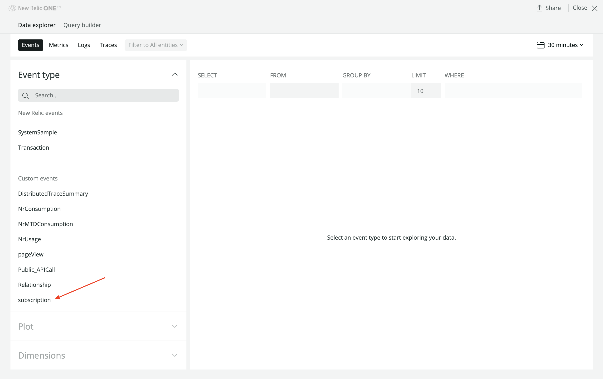
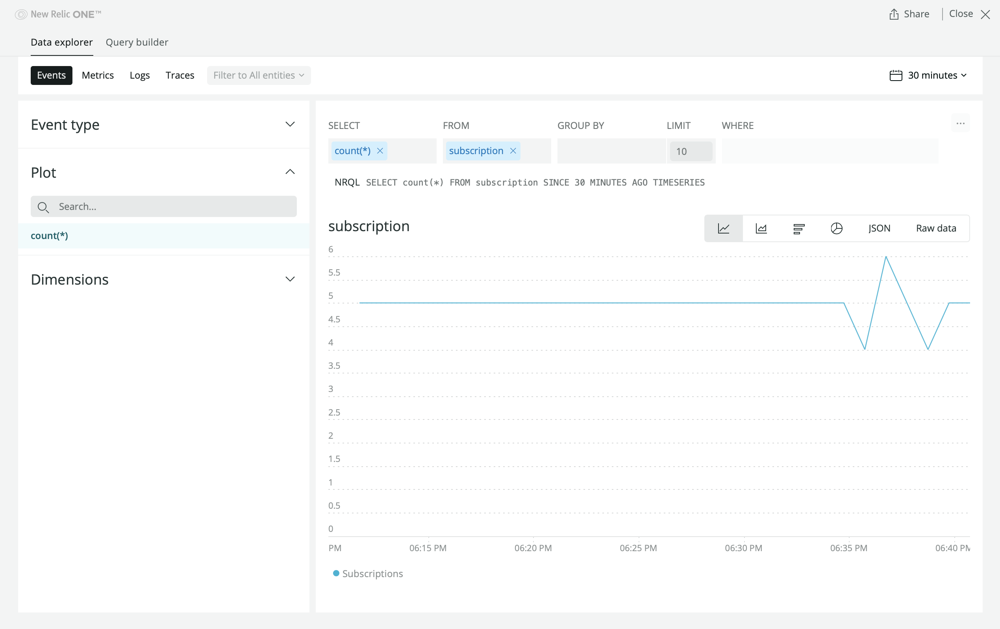
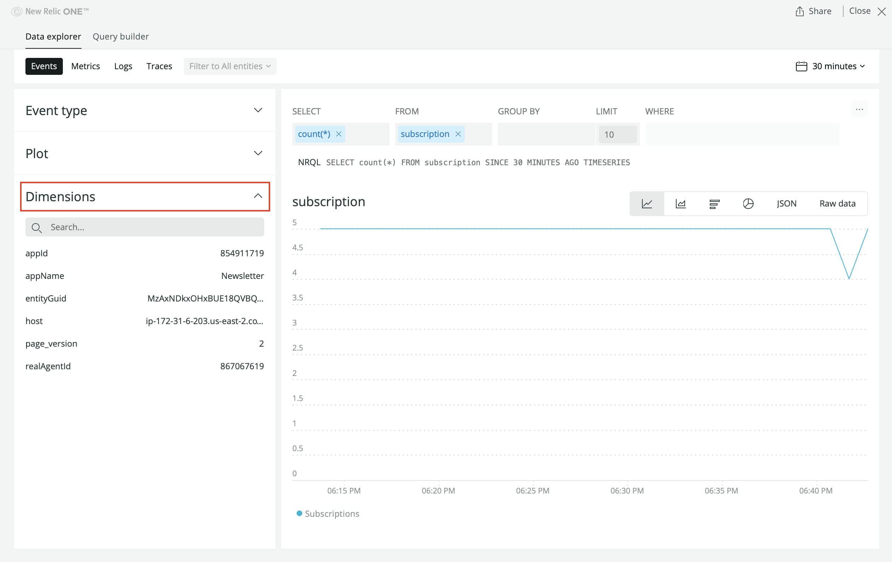
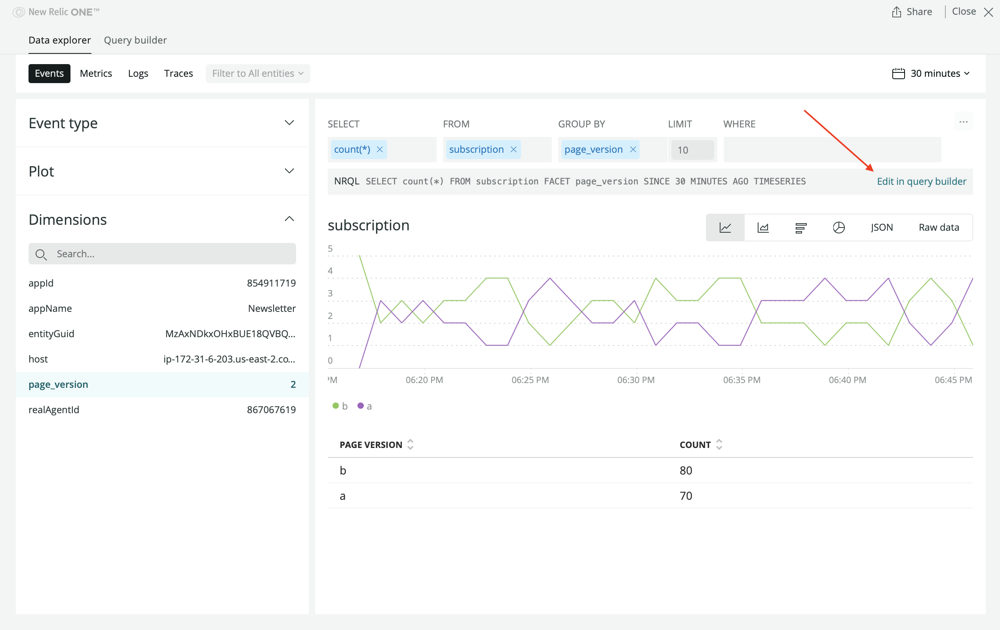
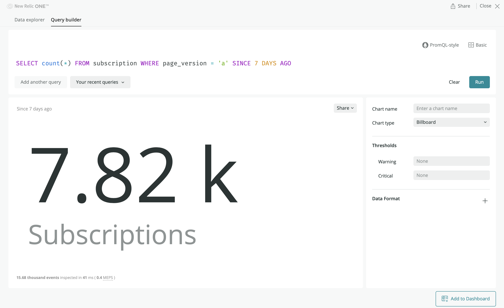

In this series, you're creating a New Relic One application, or NR1 app for short, that shows A/B test data in a variety of charts. Most of the charts need to show data that comes from a demo service you spun up at the beginning of this series. To refresh your memory on what you're building, review your design guide:


In the last lesson, you supplied real data, which comes from New Relic's database, to the following charts:

- _Newsletter subscriptions per version_
- _Version A - Page views_
- _Version B - Page views_
- _Total subscriptions per version_

Because you have experience querying subscription and page view data, you may feel ready to supply data to even more charts:

- _Version A - Page views vs. subscriptions_
- _Version B - Page views vs. subscriptions_

However, these charts are different than the charts you've supplied data to because they compare data from two different sources: `subscription` events and `pageView` events.

In this lesson, you learn how to format data from multiple sources to exist in the same chart.

<Steps>

<Step>

From your [New Relic](https://one.newrelic.com) homepage's top navigation menu, go to to the **Data explorer**:


Here, you can experiment with `subscription` event and `pageView` event queries to make sure you fetch the right data in your app.

</Step>

<Step>

Select **subscription** from the **Custom events** menu:



This queries NRDB for subscription event totals per minute over the last 30 minutes and shows that data in a chart:



</Step>

<Step>

Click **Dimensions** to see a list of the attributes associated with these subscription events:



You can filter and group subscription events using these dimensions. For _Version A - Page views vs. subscriptions_ and _Version B - Page views vs. subscriptions_, you want to filter your subscription totals by `page_version`.

</Step>

<Step>

Click the **NRQL** query to navigate to the Query builder:



Here, you can view and manually edit the query to fetch the data you need.

</Step>

<Step>

Add a `WHERE` clause to filter subscription totals by `page_version`:

```sql
SELECT count(*) FROM subscription WHERE page_version = 'a' SINCE 30 MINUTES AGO TIMESERIES
```

 Remove the `TIMESERIES` clause to fetch a count:

 ```sql
 SELECT count(*) FROM subscription WHERE page_version = 'a' SINCE 30 MINUTES AGO
 ```

 Modify the `SINCE` clause to see totals over the past week:

 ```sql
 SELECT count(*) FROM subscription WHERE page_version = 'a' SINCE 7 DAYS AGO
 ```

Click **Run** and see the data visualized in a billboard chart instead of a line chart:



</Step>

<Step>

_Version A - Page views vs. subscriptions_ and _Version B - Page views vs. subscriptions_ need a combined total of four data values:

- All-time subscription totals for version A
- All-time page view totals for version A
- All-time subscription totals for version B
- All-time page view totals for version B

Experiment with the Query builder to discover the four queries which pull the right data. In the end, you'll come up with the following four queries:

```sql
SELECT count(*) FROM subscription WHERE page_version = 'a' SINCE 7 DAYS AGO
SELECT count(*) FROM pageView WHERE page_version = 'a' SINCE 7 DAYS AGO
SELECT count(*) FROM subscription WHERE page_version = 'b' SINCE 7 DAYS AGO
SELECT count(*) FROM pageView WHERE page_version = 'b' SINCE 7 DAYS AGO
```

<Callout variant="tip" title="technical detail">

Unlike other structured query languages, NRQL doesn't provide a mechanism for joining data across sources. This is why you have to perform two queries to get `subscription` event totals and `pageView` event totals.

</Callout>

Until now, you've provided every chart with a single query. Here, you have to provide two queries per chart. In the remaining steps, you'll learn how to customize `NrqlQuery` results to merge data from multiple sources.

</Step>

<Step>

Change to the `customize-nrql-data` directory of the course repository:

```sh
cd nru-programmability-course/customize-nrql-data
```

This directory contains the code that we expect your application to have at this point in the course. By navigating to the correct directory at the start of each lesson, you leave your custom code behind, thereby protecting yourself from carrying incorrect code from one lesson to the next.

</Step>

<Step>

Open your Nerdlet's index.js file. All code you write in this lesson belongs in this file.

</Step>

<Step>

Implement `constructor()` and the React lifecycle method `componentDidMount()` in `VersionATotals` and `VersionBTotals`:

```js fileName=nerdlets/ab-test-nerdlet/index.js lineHighlight=80-120,127,133-173,180
import React from 'react';
import { BlockText, Button, ChartGroup, Grid, GridItem, HeadingText, LineChart, Modal, NrqlQuery, PieChart, Select, SelectItem, TableChart } from 'nr1';

class NewsletterSignups extends React.Component {
    render() {
        return <React.Fragment>
            <HeadingText style={{ marginTop: '20px', marginBottom: '20px' }}>
                Newsletter subscriptions per version
            </HeadingText>
            <NrqlQuery
                accountId={<YOUR NEW RELIC ACCOUNT ID>}
                query="SELECT count(*) FROM subscription FACET page_version SINCE 30 MINUTES AGO TIMESERIES"
                pollInterval={60000}
            >
                {
                    ({ data }) => {
                        return <LineChart data={data} fullWidth />;
                    }
                }
            </NrqlQuery>
        </React.Fragment>
    }
}

class TestDistributions extends React.Component {
    render() {
        return <React.Fragment>
            <HeadingText style={{ marginTop: '20px', marginBottom: '20px' }}>
                Total subscriptions per version
            </HeadingText>
            <NrqlQuery
                accountId={<YOUR NEW RELIC ACCOUNT ID>}
                query="SELECT count(*) FROM subscription FACET page_version SINCE 7 DAYS AGO"
                pollInterval={60000}
            >
                {
                    ({ data }) => {
                        return <PieChart data={data} fullWidth />
                    }
                }
            </NrqlQuery>
        </React.Fragment>
    }
}

class SuccessfulRequests extends React.Component {
    render() {
        const successesA = {
            metadata: {
                id: 'successes-A',
                name: 'Version A',
                viz: 'main',
                color: 'blue',
            },
            data: [
                { y: 118 },
            ],
        }
        const successesB = {
            metadata: {
                id: 'successes-B',
                name: 'Version B',
                viz: 'main',
                color: 'green',
            },
            data: [
                { y: 400 },
            ],
        }
        return <React.Fragment>
            <HeadingText style={{ marginTop: '20px', marginBottom: '20px' }}>
                Total unsubscriptions per version
            </HeadingText>
            <PieChart data={[successesA, successesB]} fullWidth />
        </React.Fragment>
    }
}

class VersionATotals extends React.Component {
    constructor() {
        super(...arguments);

        this.state = {
            tableData: {
                metadata: {
                    id: 'totals-A',
                    name: 'Version A',
                    columns: ['name', 'count'],
                },
                data: [
                    {
                        name: 'Subscriptions',
                        count: 0
                    },
                    {
                        name: 'Page views',
                        count: 0
                    },
                ],
            }
        }
    }

    componentDidMount() {
        NrqlQuery.query({
            accountId: <YOUR NEW RELIC ACCOUNT ID>,
            query: "SELECT count(*) FROM subscription WHERE page_version = 'a' SINCE 7 DAYS AGO",
            formatType: NrqlQuery.FORMAT_TYPE.RAW
        }).then(({ data }) => {
            console.log(data);
        })

        NrqlQuery.query({
            accountId: <YOUR NEW RELIC ACCOUNT ID>,
            query: "SELECT count(*) FROM pageView WHERE page_version = 'a' SINCE 7 DAYS AGO",
            formatType: NrqlQuery.FORMAT_TYPE.RAW
        }).then(({ data }) => {
            console.log(data);
        })
    }

    render() {
        return <React.Fragment>
            <HeadingText style={{ marginTop: '20px', marginBottom: '20px' }}>
                Version A - Page views vs. subscriptions
            </HeadingText>
            <TableChart data={[this.state.tableData]} fullWidth />
        </React.Fragment>
    }
}

class VersionBTotals extends React.Component {
    constructor() {
        super(...arguments);

        this.state = {
            tableData: {
                metadata: {
                    id: 'totals-B',
                    name: 'Version B',
                    columns: ['name', 'count'],
                },
                data: [
                    {
                        name: 'Subscriptions',
                        count: 0
                    },
                    {
                        name: 'Page views',
                        count: 0
                    },
                ],
            }
        }
    }

    componentDidMount() {
        NrqlQuery.query({
            accountId: <YOUR NEW RELIC ACCOUNT ID>,
            query: "SELECT count(*) FROM subscription WHERE page_version = 'b' SINCE 7 DAYS AGO",
            formatType: NrqlQuery.FORMAT_TYPE.RAW
        }).then(({ data }) => {
            console.log(data)
        })

        NrqlQuery.query({
            accountId: <YOUR NEW RELIC ACCOUNT ID>,
            query: "SELECT count(*) FROM pageView WHERE page_version = 'b' SINCE 7 DAYS AGO",
            formatType: NrqlQuery.FORMAT_TYPE.RAW
        }).then(({ data }) => {
            console.log(data);
        })
    }

    render() {
        return <React.Fragment>
            <HeadingText style={{ marginTop: '20px', marginBottom: '20px' }}>
                Version B - Page views vs. subscriptions
            </HeadingText>
            <TableChart data={[this.state.tableData]} fullWidth />
        </React.Fragment>
    }
}

class VersionAResponseTimes extends React.Component {
    render() {
        return <React.Fragment>
            <HeadingText style={{ marginTop: '20px', marginBottom: '20px' }}>
                Version A - Page views
            </HeadingText>
            <NrqlQuery
                accountId={<YOUR NEW RELIC ACCOUNT ID>}
                query="SELECT count(*) FROM pageView WHERE page_version = 'a' SINCE 30 MINUTES AGO TIMESERIES"
                pollInterval={60000}
            >
                {
                    ({ data }) => {
                        return <LineChart data={data} fullWidth />;
                    }
                }
            </NrqlQuery>
        </React.Fragment>
    }
}

class VersionBResponseTimes extends React.Component {
    render() {
        return <React.Fragment>
            <HeadingText style={{ marginTop: '20px', marginBottom: '20px' }}>
                Version B - Page views
            </HeadingText>
            <NrqlQuery
                accountId={<YOUR NEW RELIC ACCOUNT ID>}
                query="SELECT count(*) FROM pageView WHERE page_version = 'b' SINCE 30 MINUTES AGO TIMESERIES"
                pollInterval={60000}
            >
                {
                    ({ data }) => {
                        return <LineChart data={data} fullWidth />;
                    }
                }
            </NrqlQuery>
        </React.Fragment>
    }
}

class HistoricalTests extends React.Component {
    render() {
        var historicalData = {
            metadata: {
                id: 'totals-B',
                name: 'Version B',
                columns: ['endDate', 'versionADescription', 'versionBDescription', 'winner'],
            },
            data: [
                {
                    "endDate": "12/15/2020",
                    "versionADescription": "The homepage's CTA button was green.",
                    "versionBDescription": "The homepage's CTA button was blue.",
                    "winner": "A"
                },
                {
                    "endDate": "09/06/2019",
                    "versionADescription": "The 'Deals' page showed sales in a carousel.",
                    "versionBDescription": "The 'Deals' page showed sales in a grid.",
                    "winner": "B"
                }
            ],
        }

        return <React.Fragment>
            <HeadingText style={{ marginTop: '20px', marginBottom: '20px' }}>
                Past tests
            </HeadingText>
            <TableChart data={[historicalData]} fullWidth />
        </React.Fragment>
    }
}

class VersionSelector extends React.Component {
    constructor(props) {
        super(props);
    }

    render() {
        return <Select onChange={this.props.selectVersion} value={this.props.selectedVersion}>
            <SelectItem value={'A'}>Version A</SelectItem>
            <SelectItem value={'B'}>Version B</SelectItem>
        </Select>
    }
}

class EndTestButton extends React.Component {
    constructor(props) {
        super(props);
    }

    render() {
        return <React.Fragment>
            <Button type={Button.TYPE.DESTRUCTIVE} onClick={this.props.showModal}>End test</Button>

            <Modal hidden={this.props.modalHidden} onClose={this.props.closeModal}>
                <HeadingText>Are you sure?</HeadingText>
                <BlockText>
                    If you end the test, all your users will receive the version you selected:
                </BlockText>

                <BlockText spacingType={[BlockText.SPACING_TYPE.LARGE]}>
                    <b>Version {this.props.selectedVersion}</b>
                </BlockText>

                <Button onClick={this.props.closeModal}>No, continue test</Button>
                <Button type={Button.TYPE.DESTRUCTIVE} onClick={this.props.closeModal}>Yes, end test</Button>
            </Modal>
        </React.Fragment>
    }
}

class EndTestSection extends React.Component {
    constructor() {
        super(...arguments);

        this.state = {
            selectedVersion: 'A',
            modalHidden: true,
        };

        this.selectVersion = this.selectVersion.bind(this);
        this.showModal = this.showModal.bind(this);
        this.closeModal = this.closeModal.bind(this);
    }

    selectVersion(event, value) {
        this.setState({ selectedVersion: value });
    }

    closeModal() {
        this.setState({ modalHidden: true });
    }

    showModal() {
        this.setState({ modalHidden: false });
    }

    render() {
        return <Grid style={{ margin: 'auto', backgroundColor: '#fafafa', padding: '20px' }}>
            <GridItem columnSpan={12}>
                <HeadingText style={{ marginLeft: 'auto', marginRight: 'auto', marginTop: '20px', marginBottom: '20px', textAlign: 'center' }}>
                    Pick a version to end the test:
                </HeadingText>
            </GridItem>
            <GridItem columnStart={5} columnEnd={6} style={{ textAlign: 'right', paddingTop: '5px' }}>
                <VersionSelector
                    selectedVersion={this.state.selectedVersion}
                    selectVersion={this.selectVersion}
                />
            </GridItem>
            <GridItem columnStart={7} columnEnd={8}>
                <EndTestButton
                    modalHidden={this.state.modalHidden}
                    closeModal={this.closeModal}
                    showModal={this.showModal}
                    selectedVersion={this.state.selectedVersion}
                >
                    End test
                </EndTestButton>
            </GridItem>
        </Grid>
    }
}

export default class AbTestNerdletNerdlet extends React.Component {
    render() {
        return (
            <Grid>
                <GridItem columnSpan={12}><NewsletterSignups /></GridItem>
                <GridItem columnSpan={6}><TestDistributions /></GridItem>
                <GridItem columnSpan={6}><SuccessfulRequests /></GridItem>
                <GridItem columnSpan={6}><VersionATotals /></GridItem>
                <GridItem columnSpan={6}><VersionBTotals /></GridItem>
                <ChartGroup>
                    <GridItem columnSpan={6}><VersionAResponseTimes /></GridItem>
                    <GridItem columnSpan={6}><VersionBResponseTimes /></GridItem>
                </ChartGroup>
                <GridItem columnSpan={12}><EndTestSection /></GridItem>
                <GridItem columnSpan={12}><HistoricalTests /></GridItem>
            </Grid>
        )
    }
}
```

<Callout variant="important">

Make sure you replace `<YOUR NEW RELIC ACCOUNT ID>` with your actual New Relic [account id](https://docs.newrelic.com/docs/accounts/accounts-billing/account-setup/account-id).

</Callout>

Here, you initialize your state in the component's constructor. The state has a single value, `tableData`, which is an empty array. In [`componentDidMount()`](https://reactjs.org/docs/react-component.html#componentdidmount), you query the data that will fill this array.

 `componentDidMount()` is a React lifecycle method that is called when a component is mounted in the component tree. You use this method, instead of the constructor, to query data because your logic, which requests data from New Relic, introduces side effects and sets state values, neither of which you should do in the constructor.

 In `componentDidMount()`, you use `NrqlQuery` in a new way. First, you specified the `formatType` to `NrqlQuery.FORMAT_TYPE.RAW` because you're going to modify the data instead of supplying it directly to a chart Before, you used its JSX form in the `render()` method of a chart. Second, you called its `query()` method and handled the results in a `then()` callback, which logs them to the console.

 </Step>

<Step>

Navigate to the root of your Nerdpack at `nru-programmability-course/persist-selected-version/ab-test`.

</Step>

<Step>

Serve your application locally:

```sh
nr1 nerdpack:serve
```

</Step>

<Step>

To view your logs, which are useful for uncovering errors in your application, turn on developer tools in your favorite browser and navigate to the **Console**:

- [FireFox instructions](https://developer.mozilla.org/en-US/docs/Tools/Web_Console)
- [Safari instructions](https://developer.apple.com/library/archive/documentation/NetworkingInternetWeb/Conceptual/Web_Inspector_Tutorial/DebuggingyourWebpage/DebuggingyourWebpage.html#//apple_ref/doc/uid/TP40017576-CH5-DontLinkElementID_24)
- [Chrome instructions](https://developers.google.com/web/tools/chrome-devtools#console)

[View your NR1 application](https://one.newrelic.com?nerdpacks=local) and notice the NRQL data in the console:


This console log tells you that you can find the data you're looking for, namely the `subscription` or `pageView` count, at `data.raw.results[0].count`. The next step is to store that count in `state.tableData`.

</Step>

<Step>

Store the query data in state:

```js fileName=nerdlets/ab-test-nerdlet/index.js lineHighlight=110-112,120-122,167-169,177-179
import React from 'react';
import { BlockText, Button, ChartGroup, Grid, GridItem, HeadingText, LineChart, Modal, NrqlQuery, PieChart, Select, SelectItem, TableChart } from 'nr1';

class NewsletterSignups extends React.Component {
    render() {
        return <React.Fragment>
            <HeadingText style={{ marginTop: '20px', marginBottom: '20px' }}>
                Newsletter subscriptions per version
            </HeadingText>
            <NrqlQuery
                accountId={<YOUR NEW RELIC ACCOUNT ID>}
                query="SELECT count(*) FROM subscription FACET page_version SINCE 30 MINUTES AGO TIMESERIES"
                pollInterval={60000}
            >
                {
                    ({ data }) => {
                        return <LineChart data={data} fullWidth />;
                    }
                }
            </NrqlQuery>
        </React.Fragment>
    }
}

class TestDistributions extends React.Component {
    render() {
        return <React.Fragment>
            <HeadingText style={{ marginTop: '20px', marginBottom: '20px' }}>
                Total subscriptions per version
            </HeadingText>
            <NrqlQuery
                accountId={<YOUR NEW RELIC ACCOUNT ID>}
                query="SELECT count(*) FROM subscription FACET page_version SINCE 7 DAYS AGO"
                pollInterval={60000}
            >
                {
                    ({ data }) => {
                        return <PieChart data={data} fullWidth />
                    }
                }
            </NrqlQuery>
        </React.Fragment>
    }
}

class SuccessfulRequests extends React.Component {
    render() {
        const successesA = {
            metadata: {
                id: 'successes-A',
                name: 'Version A',
                viz: 'main',
                color: 'blue',
            },
            data: [
                { y: 118 },
            ],
        }
        const successesB = {
            metadata: {
                id: 'successes-B',
                name: 'Version B',
                viz: 'main',
                color: 'green',
            },
            data: [
                { y: 400 },
            ],
        }
        return <React.Fragment>
            <HeadingText style={{ marginTop: '20px', marginBottom: '20px' }}>
                Total unsubscriptions per version
            </HeadingText>
            <PieChart data={[successesA, successesB]} fullWidth />
        </React.Fragment>
    }
}

class VersionATotals extends React.Component {
    constructor() {
        super(...arguments);

        this.state = {
            tableData: {
                metadata: {
                    id: 'totals-A',
                    name: 'Version A',
                    columns: ['name', 'count'],
                },
                data: [
                    {
                        name: 'Subscriptions',
                        count: 0
                    },
                    {
                        name: 'Page views',
                        count: 0
                    },
                ],
            }
        }
    }

    componentDidMount() {
        NrqlQuery.query({
            accountId: <YOUR NEW RELIC ACCOUNT ID>,
            query: "SELECT count(*) FROM subscription WHERE page_version = 'a' SINCE 7 DAYS AGO",
            formatType: NrqlQuery.FORMAT_TYPE.RAW
        }).then(({ data }) => {
            this.setState(state => {
                state.tableData.data[0].count = data.raw.results[0].count
            })
        })

        NrqlQuery.query({
            accountId: <YOUR NEW RELIC ACCOUNT ID>,
            query: "SELECT count(*) FROM pageView WHERE page_version = 'a' SINCE 7 DAYS AGO",
            formatType: NrqlQuery.FORMAT_TYPE.RAW
        }).then(({ data }) => {
            this.setState(state => {
                state.tableData.data[1].count = data.raw.results[0].count
            })
        })
    }

    render() {
        return <React.Fragment>
            <HeadingText style={{ marginTop: '20px', marginBottom: '20px' }}>
                Version A - Page views vs. subscriptions
            </HeadingText>
            <TableChart data={[this.state.tableData]} fullWidth />
        </React.Fragment>
    }
}

class VersionBTotals extends React.Component {
    constructor() {
        super(...arguments);

        this.state = {
            tableData: {
                metadata: {
                    id: 'totals-B',
                    name: 'Version B',
                    columns: ['name', 'count'],
                },
                data: [
                    {
                        name: 'Subscriptions',
                        count: 0
                    },
                    {
                        name: 'Page views',
                        count: 0
                    },
                ],
            }
        }
    }

    componentDidMount() {
        NrqlQuery.query({
            accountId: <YOUR NEW RELIC ACCOUNT ID>,
            query: "SELECT count(*) FROM subscription WHERE page_version = 'b' SINCE 7 DAYS AGO",
            formatType: NrqlQuery.FORMAT_TYPE.RAW
        }).then(({ data }) => {
            this.setState(state => {
                state.tableData.data[0].count = data.raw.results[0].count
            })
        })

        NrqlQuery.query({
            accountId: <YOUR NEW RELIC ACCOUNT ID>,
            query: "SELECT count(*) FROM pageView WHERE page_version = 'b' SINCE 7 DAYS AGO",
            formatType: NrqlQuery.FORMAT_TYPE.RAW
        }).then(({ data }) => {
            this.setState(state => {
                state.tableData.data[1].count = data.raw.results[0].count
            })
        })
    }

    render() {
        return <React.Fragment>
            <HeadingText style={{ marginTop: '20px', marginBottom: '20px' }}>
                Version B - Page views vs. subscriptions
            </HeadingText>
            <TableChart data={[this.state.tableData]} fullWidth />
        </React.Fragment>
    }
}

class VersionAResponseTimes extends React.Component {
    render() {
        return <React.Fragment>
            <HeadingText style={{ marginTop: '20px', marginBottom: '20px' }}>
                Version A - Page views
            </HeadingText>
            <NrqlQuery
                accountId={<YOUR NEW RELIC ACCOUNT ID>}
                query="SELECT count(*) FROM pageView WHERE page_version = 'a' SINCE 30 MINUTES AGO TIMESERIES"
                pollInterval={60000}
            >
                {
                    ({ data }) => {
                        return <LineChart data={data} fullWidth />;
                    }
                }
            </NrqlQuery>
        </React.Fragment>
    }
}

class VersionBResponseTimes extends React.Component {
    render() {
        return <React.Fragment>
            <HeadingText style={{ marginTop: '20px', marginBottom: '20px' }}>
                Version B - Page views
            </HeadingText>
            <NrqlQuery
                accountId={<YOUR NEW RELIC ACCOUNT ID>}
                query="SELECT count(*) FROM pageView WHERE page_version = 'b' SINCE 30 MINUTES AGO TIMESERIES"
                pollInterval={60000}
            >
                {
                    ({ data }) => {
                        return <LineChart data={data} fullWidth />;
                    }
                }
            </NrqlQuery>
        </React.Fragment>
    }
}

class HistoricalTests extends React.Component {
    render() {
        var historicalData = {
            metadata: {
                id: 'totals-B',
                name: 'Version B',
                columns: ['endDate', 'versionADescription', 'versionBDescription', 'winner'],
            },
            data: [
                {
                    "endDate": "12/15/2020",
                    "versionADescription": "The homepage's CTA button was green.",
                    "versionBDescription": "The homepage's CTA button was blue.",
                    "winner": "A"
                },
                {
                    "endDate": "09/06/2019",
                    "versionADescription": "The 'Deals' page showed sales in a carousel.",
                    "versionBDescription": "The 'Deals' page showed sales in a grid.",
                    "winner": "B"
                }
            ],
        }

        return <React.Fragment>
            <HeadingText style={{ marginTop: '20px', marginBottom: '20px' }}>
                Past tests
            </HeadingText>
            <TableChart data={[historicalData]} fullWidth />
        </React.Fragment>
    }
}

class VersionSelector extends React.Component {
    constructor(props) {
        super(props);
    }

    render() {
        return <Select onChange={this.props.selectVersion} value={this.props.selectedVersion}>
            <SelectItem value={'A'}>Version A</SelectItem>
            <SelectItem value={'B'}>Version B</SelectItem>
        </Select>
    }
}

class EndTestButton extends React.Component {
    constructor(props) {
        super(props);
    }

    render() {
        return <React.Fragment>
            <Button type={Button.TYPE.DESTRUCTIVE} onClick={this.props.showModal}>End test</Button>

            <Modal hidden={this.props.modalHidden} onClose={this.props.closeModal}>
                <HeadingText>Are you sure?</HeadingText>
                <BlockText>
                    If you end the test, all your users will receive the version you selected:
                </BlockText>

                <BlockText spacingType={[BlockText.SPACING_TYPE.LARGE]}>
                    <b>Version {this.props.selectedVersion}</b>
                </BlockText>

                <Button onClick={this.props.closeModal}>No, continue test</Button>
                <Button type={Button.TYPE.DESTRUCTIVE} onClick={this.props.closeModal}>Yes, end test</Button>
            </Modal>
        </React.Fragment>
    }
}

class EndTestSection extends React.Component {
    constructor() {
        super(...arguments);

        this.state = {
            selectedVersion: 'A',
            modalHidden: true,
        };

        this.selectVersion = this.selectVersion.bind(this);
        this.showModal = this.showModal.bind(this);
        this.closeModal = this.closeModal.bind(this);
    }

    selectVersion(event, value) {
        this.setState({ selectedVersion: value });
    }

    closeModal() {
        this.setState({ modalHidden: true });
    }

    showModal() {
        this.setState({ modalHidden: false });
    }

    render() {
        return <Grid style={{ margin: 'auto', backgroundColor: '#fafafa', padding: '20px' }}>
            <GridItem columnSpan={12}>
                <HeadingText style={{ marginLeft: 'auto', marginRight: 'auto', marginTop: '20px', marginBottom: '20px', textAlign: 'center' }}>
                    Pick a version to end the test:
                </HeadingText>
            </GridItem>
            <GridItem columnStart={5} columnEnd={6} style={{ textAlign: 'right', paddingTop: '5px' }}>
                <VersionSelector
                    selectedVersion={this.state.selectedVersion}
                    selectVersion={this.selectVersion}
                />
            </GridItem>
            <GridItem columnStart={7} columnEnd={8}>
                <EndTestButton
                    modalHidden={this.state.modalHidden}
                    closeModal={this.closeModal}
                    showModal={this.showModal}
                    selectedVersion={this.state.selectedVersion}
                >
                    End test
                </EndTestButton>
            </GridItem>
        </Grid>
    }
}

export default class AbTestNerdletNerdlet extends React.Component {
    render() {
        return (
            <Grid>
                <GridItem columnSpan={12}><NewsletterSignups /></GridItem>
                <GridItem columnSpan={6}><TestDistributions /></GridItem>
                <GridItem columnSpan={6}><SuccessfulRequests /></GridItem>
                <GridItem columnSpan={6}><VersionATotals /></GridItem>
                <GridItem columnSpan={6}><VersionBTotals /></GridItem>
                <ChartGroup>
                    <GridItem columnSpan={6}><VersionAResponseTimes /></GridItem>
                    <GridItem columnSpan={6}><VersionBResponseTimes /></GridItem>
                </ChartGroup>
                <GridItem columnSpan={12}><EndTestSection /></GridItem>
                <GridItem columnSpan={12}><HistoricalTests /></GridItem>
            </Grid>
        )
    }
}
```

<Callout variant="important">

Make sure you replace `<YOUR NEW RELIC ACCOUNT ID>` with your actual New Relic [account id](https://docs.newrelic.com/docs/accounts/accounts-billing/account-setup/account-id).

</Callout>

Pay close attention to the data you're accessing. The array indices are particularly important to get right. The subscription data should go to `state.tableData.data[0].count` because in `tableData`, it is the first element in the data array:

```json
data: [
    {
        name: 'Subscriptions',
        count: 0
    },
    {
        name: 'Page views',
        count: 0
    },
],
```

By similar logic, page view data should go to `state.tableData.data[1].count`.

</Step>

<Step>

While still serving your nerdpack locally, view your NR1 app to see your charts serving real data:


</Step>

</Steps>

In this lesson, you learned how to use `NrqlQuery.query()` to fetch data from multiple sources and stitch them together into data your chart can use. Notice that there are still two charts in your NR1 application that use mock data:

- _Total unsubscriptions per version_
- _Past tests_

Unfortunately, your demo application doesn't create custom New Relic events when a user unsubscribes from your newsletter or you end an A/B test. In the next lesson, you'll learn how to use NerdGraph and NerdStorage to populate _Past tests_.
