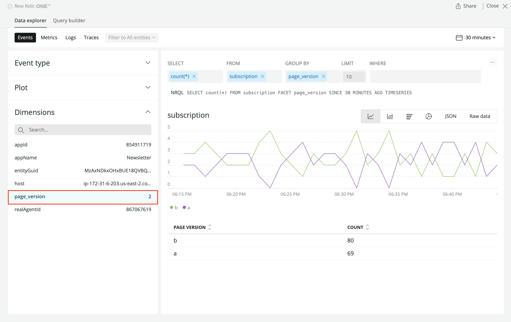
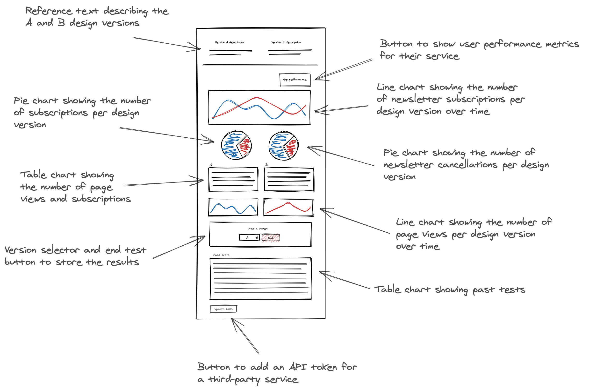

In this series, you're building a full-fledged New Relic One application that ingests data from a demo service that's running an A/B test. The app shows the A/B test data in interesting ways so that you'll ultimately be able to choose whether Version A or Version B is more effective at accomplishing your business goal: to increase high-quality newsletter subscriptions.

In past tutorials, you created charts to visualize your data, and you organized those charts so you can use and understand them. You also created a form in your app for ending your test once you're confident in the most effective version. Until now, though, you can't gauge which version is more effective because your charts have been showing mock data, such as:

```js
const versionASignups = {
    metadata: {
        id: 'version-a-newsletter-signups',
        name: 'Version A',
        viz: 'main',
        color: 'blue',
    },
    data: [
        { x: 0, y: 0 },
        { x: 10, y: 10 },
        { x: 20, y: 15 },
        { x: 30, y: 5 },
        { x: 40, y: 30 },
        { x: 50, y: 25 },
    ],
}
```

A chart's `data` prop is useful for supplying manually-crafted data like this or even reformatted third-party data. But for many of your charts, you want to show real-time New Relic data. For example, _Newsletter subscriptions by version_ should show subscription data, which exists in New Relic's database, NRDB for short.

To query NRDB, you first need to know what data you're looking for. Remember your [demo backend service](../demo-setup)? Well, that service reports a subscription event to New Relic when a user subscribes to a newsletter from your site. You can view these subscription events in New Relic while your demo services are running.

## View Subscription Events in New Relic

Before you query NRDB from your charts, experiment with querying data from New Relic's web interface.

<Steps>

<Step>

From your [New Relic](https://one.newrelic.com) homepage, go to to the **Data explorer** from the top navigation menu:


[Data explorer](https://docs.newrelic.com/docs/insights/use-insights-ui/explore-data/data-explorer-query-chart-event-data) lets you explore your telemetry data:

- metrics
- events
- logs
- traces

Since the backend submits newsletter subscriptions as events to New Relic, you can see them in this view.

</Step>

<Step>

Select **subscription** from the **Custom events** menu:


This queries NRDB for subscription event totals per minute over the last 30 minutes and shows that data in a chart:


</Step>

<Step>

Click **Dimensions** to see a list of the attributes associated with these subscription events:


You can filter and group subscription events using these dimensions. Notice the **NRQL** query above the chart. This shows the chart's underlying query, which is based on these dimensions.

Click the **page-version** dimension to see the query change to group by `FACET page_version`:



The Data explorer presents two options for filtering and sorting your data:

- User interface (UI) selections like the one you've just made
- New Relic Query Language (NRQL)

The UI is useful for quickly filtering data, and it doesn't require you to know NRQL. For your New Relic One application, however, you need to use NRQL queries.

Click the **NRQL** query to navigate to the Query builder:


Here, you can view and manually edit the query to fetch the data you need.

</Step>

</Steps>

Before you begin integrating New Relic data in your NR1 app, consult your design guide:



Your New Relic One application has eight charts in total, including line charts, pie charts, and table charts. Each of these charts currently shows mock data, but they need to show real data to be useful. First, focus on querying data for the topmost chart: _Newsletter subscriptions per version_.

With the query you've built in the Data explorer, you already have the data you need for this chart:


<Callout variant="tip" title="Technical detail">

In your query, you fetch subscription totals (`SELECT count(*) FROM subscriptions`), group them by their page version (`FACET page_version`), and focus the timeseries to the past 30 minutes (`SINCE 30 MINUTES AGO TIMESERIES`).

Explore our [documentation](https://docs.newrelic.com/docs/query-your-data/nrql-new-relic-query-language/get-started/introduction-nrql-new-relics-query-language) to learn more about NRQL queries.

</Callout>

Next, you learn how to pass your NRQL query to your _Newsletter subscriptions per version_ chart.

<Steps>

<Step>

Change to the `add-nrql-components` directory of the course repository:

```sh
cd nru-programmability-course/add-nrql-components
```

This directory contains the code that we expect your application to have at this point in the course. By navigating to the correct directory at the start of each lesson, you leave your custom code behind, thereby protecting yourself from carrying incorrect code from one lesson to the next.

</Step>

<Step>

Open your Nerdlet's index.js file. All code you write in this lesson belongs in this file.

</Step>

<Step>

Import `TableChart` the same way you did for `LineChart` and `PieChart` in previous lessons:

```js fileName=nerdlets/ab-test-nerdlet/index.js lineHighlight=2
import React from 'react';
import { BlockText, Button, ChartGroup, Grid, GridItem, HeadingText, LineChart, Modal, NrqlQuery, PieChart, Select, SelectItem, TableChart } from 'nr1';

class NewsletterSignups extends React.Component {
    render() {
        const versionASignups = {
            metadata: {
                id: 'version-a-newsletter-signups',
                name: 'Version A',
                viz: 'main',
                color: 'blue',
            },
            data: [
                { x: 0, y: 0 },
                { x: 10, y: 10 },
                { x: 20, y: 15 },
                { x: 30, y: 5 },
                { x: 40, y: 30 },
                { x: 50, y: 25 },
            ],
        }
        const versionBSignups = {
            metadata: {
                id: 'version-b-newsletter-signups',
                name: 'Version B',
                viz: 'main',
                color: 'green',
            },
            data: [
                { x: 0, y: 20 },
                { x: 10, y: 5 },
                { x: 20, y: 25 },
                { x: 30, y: 45 },
                { x: 40, y: 50 },
                { x: 50, y: 35 },
            ],
        }
        return <React.Fragment>
            <HeadingText style={{ marginTop: '20px', marginBottom: '20px' }}>
                Newsletter subscriptions per version
            </HeadingText>
            <LineChart data={[versionASignups, versionBSignups]} fullWidth />
        </React.Fragment>
    }
}

class TestDistributions extends React.Component {
    render() {
        const distributionA = {
            metadata: {
                id: 'distributions-A',
                name: 'Version A',
                viz: 'main',
                color: 'blue',
            },
            data: [
                { y: 259 },
            ],
        }
        const distributionB = {
            metadata: {
                id: 'distributions-B',
                name: 'Version B',
                viz: 'main',
                color: 'green',
            },
            data: [
                { y: 318 },
            ],
        }
        return <React.Fragment>
            <HeadingText style={{ marginTop: '20px', marginBottom: '20px' }}>
                Total subscriptions per version
            </HeadingText>
            <PieChart data={[distributionA, distributionB]} fullWidth />
        </React.Fragment>
    }
}

class SuccessfulRequests extends React.Component {
    render() {
        const successesA = {
            metadata: {
                id: 'successes-A',
                name: 'Version A',
                viz: 'main',
                color: 'blue',
            },
            data: [
                { y: 118 },
            ],
        }
        const successesB = {
            metadata: {
                id: 'successes-B',
                name: 'Version B',
                viz: 'main',
                color: 'green',
            },
            data: [
                { y: 400 },
            ],
        }
        return <React.Fragment>
            <HeadingText style={{ marginTop: '20px', marginBottom: '20px' }}>
                Total unsubscriptions per version
            </HeadingText>
            <PieChart data={[successesA, successesB]} fullWidth />
        </React.Fragment>
    }
}

class VersionATotals extends React.Component {
    render() {
        const versionATotals = {
            metadata: {
                id: 'totals-A',
                name: 'Version A',
                columns: ['name', 'count'],
            },
            data: [
                {
                    name: 'Successful Requests',
                    count: 85
                },
                {
                    name: 'Failed Requests',
                    count: 2
                },
            ],
        }
        return <React.Fragment>
            <HeadingText style={{ marginTop: '20px', marginBottom: '20px' }}>
                Version A - Page views vs. subscriptions
            </HeadingText>
            <TableChart data={[versionATotals]} fullWidth />
        </React.Fragment>
    }
}

class VersionBTotals extends React.Component {
    render() {
        const versionBTotals = {
            metadata: {
                id: 'totals-B',
                name: 'Version B',
                columns: ['name', 'count'],
            },
            data: [
                {
                    name: 'Successful Requests',
                    count: 180
                },
                {
                    name: 'Failed Requests',
                    count: 30
                },
            ],
        }
        return <React.Fragment>
            <HeadingText style={{ marginTop: '20px', marginBottom: '20px' }}>
                Version B - Page views vs. subscriptions
            </HeadingText>
            <TableChart data={[versionBTotals]} fullWidth />
        </React.Fragment>
    }
}

class VersionAResponseTimes extends React.Component {
    render() {
        const versionAResponseTimes = {
            metadata: {
                id: 'response-times-A',
                name: 'Version A',
                viz: 'main',
                color: 'blue',
                units_data: {
                    y: 'MS'
                }
            },
            data: [
                { x: 0, y: 10 },
                { x: 10, y: 13 },
                { x: 20, y: 11.5 },
                { x: 30, y: 10 },
                { x: 40, y: 8.75 },
                { x: 50, y: 9 },
            ],
        }
        return <React.Fragment>
            <HeadingText style={{ marginTop: '20px', marginBottom: '20px' }}>
                Version A - Page views
            </HeadingText>
            <LineChart data={[versionAResponseTimes]} fullWidth />
        </React.Fragment>
    }
}

class VersionBResponseTimes extends React.Component {
    render() {
        const versionBResponseTimes = {
            metadata: {
                id: 'response-times-B',
                name: 'Version B',
                viz: 'main',
                color: 'green',
                units_data: {
                    y: 'MS'
                }
            },
            data: [
                { x: 0, y: 15 },
                { x: 10, y: 13 },
                { x: 20, y: 10 },
                { x: 30, y: 14 },
                { x: 40, y: 16.5 },
                { x: 50, y: 13.5 },
            ],
        }
        return <React.Fragment>
            <HeadingText style={{ marginTop: '20px', marginBottom: '20px' }}>
                Version B - Page views
            </HeadingText>
            <LineChart data={[versionBResponseTimes]} fullWidth />
        </React.Fragment>
    }
}

class HistoricalTests extends React.Component {
    render() {
        var historicalData = {
            metadata: {
                id: 'totals-B',
                name: 'Version B',
                columns: ['endDate', 'versionADescription', 'versionBDescription', 'winner'],
            },
            data: [
                {
                    "endDate": "12/15/2020",
                    "versionADescription": "The homepage's CTA button was green.",
                    "versionBDescription": "The homepage's CTA button was blue.",
                    "winner": "A"
                },
                {
                    "endDate": "09/06/2019",
                    "versionADescription": "The 'Deals' page showed sales in a carousel.",
                    "versionBDescription": "The 'Deals' page showed sales in a grid.",
                    "winner": "B"
                }
            ],
        }

        return <React.Fragment>
            <HeadingText style={{ marginTop: '20px', marginBottom: '20px' }}>
                Past tests
            </HeadingText>
            <TableChart data={[historicalData]} fullWidth />
        </React.Fragment>
    }
}

class VersionSelector extends React.Component {
    constructor(props) {
        super(props);
    }

    render() {
        return <Select onChange={this.props.selectVersion} value={this.props.selectedVersion}>
            <SelectItem value={'A'}>Version A</SelectItem>
            <SelectItem value={'B'}>Version B</SelectItem>
        </Select>
    }
}

class EndTestButton extends React.Component {
    constructor(props) {
        super(props);
    }

    render() {
        return <React.Fragment>
            <Button type={Button.TYPE.DESTRUCTIVE} onClick={this.props.showModal}>End test</Button>

            <Modal hidden={this.props.modalHidden} onClose={this.props.closeModal}>
                <HeadingText>Are you sure?</HeadingText>
                <BlockText>
                    If you end the test, all your users will receive the version you selected:
                </BlockText>

                <BlockText spacingType={[BlockText.SPACING_TYPE.LARGE]}>
                    <b>Version {this.props.selectedVersion}</b>
                </BlockText>

                <Button onClick={this.props.closeModal}>No, continue test</Button>
                <Button type={Button.TYPE.DESTRUCTIVE} onClick={this.props.closeModal}>Yes, end test</Button>
            </Modal>
        </React.Fragment>
    }
}

class EndTestSection extends React.Component {
    constructor() {
        super(...arguments);

        this.state = {
            selectedVersion: 'A',
            modalHidden: true,
        };

        this.selectVersion = this.selectVersion.bind(this);
        this.showModal = this.showModal.bind(this);
        this.closeModal = this.closeModal.bind(this);
    }

    selectVersion(event, value) {
        this.setState({ selectedVersion: value });
    }

    closeModal() {
        this.setState({ modalHidden: true });
    }

    showModal() {
        this.setState({ modalHidden: false });
    }

    render() {
        return <Grid style={{ margin: 'auto', backgroundColor: '#fafafa', padding: '20px' }}>
            <GridItem columnSpan={12}>
                <HeadingText style={{ marginLeft: 'auto', marginRight: 'auto', marginTop: '20px', marginBottom: '20px', textAlign: 'center' }}>
                    Pick a version to end the test:
                </HeadingText>
            </GridItem>
            <GridItem columnStart={5} columnEnd={6} style={{ textAlign: 'right', paddingTop: '5px' }}>
                <VersionSelector
                    selectedVersion={this.state.selectedVersion}
                    selectVersion={this.selectVersion}
                />
            </GridItem>
            <GridItem columnStart={7} columnEnd={8}>
                <EndTestButton
                    modalHidden={this.state.modalHidden}
                    closeModal={this.closeModal}
                    showModal={this.showModal}
                    selectedVersion={this.state.selectedVersion}
                >
                    End test
                </EndTestButton>
            </GridItem>
        </Grid>
    }
}

export default class AbTestNerdletNerdlet extends React.Component {
    render() {
        return (
            <Grid>
                <GridItem columnSpan={12}><NewsletterSignups /></GridItem>
                <GridItem columnSpan={6}><TestDistributions /></GridItem>
                <GridItem columnSpan={6}><SuccessfulRequests /></GridItem>
                <GridItem columnSpan={6}><VersionATotals /></GridItem>
                <GridItem columnSpan={6}><VersionBTotals /></GridItem>
                <ChartGroup>
                    <GridItem columnSpan={6}><VersionAResponseTimes /></GridItem>
                    <GridItem columnSpan={6}><VersionBResponseTimes /></GridItem>
                </ChartGroup>
                <GridItem columnSpan={12}><EndTestSection /></GridItem>
                <GridItem columnSpan={12}><HistoricalTests /></GridItem>
            </Grid>
        )
    }
}
```

</Step>

<Step>

Update the `LineChart` in `NewsletterSignups`. Remove the mock data, and use the NRQL query you built in the Data explorer:

```js fileName=nerdlets/ab-test-nerdlet/index.js lineHighlight=10-19
import React from 'react';
import { BlockText, Button, ChartGroup, Grid, GridItem, HeadingText, LineChart, Modal, NrqlQuery, PieChart, Select, SelectItem, TableChart } from 'nr1';

class NewsletterSignups extends React.Component {
    render() {
        return <React.Fragment>
            <HeadingText style={{ marginTop: '20px', marginBottom: '20px' }}>
                Newsletter subscriptions per version
            </HeadingText>
            <NrqlQuery
                accountId={<YOUR NEW RELIC ACCOUNT ID>}
                query="SELECT count(*) FROM subscription FACET page_version SINCE 30 MINUTES AGO TIMESERIES"
            >
                {
                    ({ data }) => {
                        return <LineChart data={data} fullWidth />;
                    }
                }
            </NrqlQuery>
        </React.Fragment>
    }
}

class TestDistributions extends React.Component {
                render() {
        const distributionA = {
                metadata: {
                id: 'distributions-A',
                name: 'Version A',
                viz: 'main',
                color: 'blue',
            },
            data: [
                {y: 259 },
            ],
        }
        const distributionB = {
                metadata: {
                id: 'distributions-B',
                name: 'Version B',
                viz: 'main',
                color: 'green',
            },
            data: [
                {y: 318 },
            ],
        }
        return <React.Fragment>
                <HeadingText style={{ marginTop: '20px', marginBottom: '20px' }}>
                    Total subscriptions per version
            </HeadingText>
                <PieChart data={[distributionA, distributionB]} fullWidth />
            </React.Fragment>
    }
}

class SuccessfulRequests extends React.Component {
                render() {
        const successesA = {
                metadata: {
                id: 'successes-A',
                name: 'Version A',
                viz: 'main',
                color: 'blue',
            },
            data: [
                {y: 118 },
            ],
        }
        const successesB = {
                metadata: {
                id: 'successes-B',
                name: 'Version B',
                viz: 'main',
                color: 'green',
            },
            data: [
                {y: 400 },
            ],
        }
        return <React.Fragment>
                <HeadingText style={{ marginTop: '20px', marginBottom: '20px' }}>
                    Total unsubscriptions per version
            </HeadingText>
                <PieChart data={[successesA, successesB]} fullWidth />
            </React.Fragment>
    }
}

class VersionATotals extends React.Component {
                render() {
        const versionATotals = {
                metadata: {
                id: 'totals-A',
                name: 'Version A',
                columns: ['name', 'count'],
            },
            data: [
                {
                name: 'Successful Requests',
                    count: 85
                },
                {
                name: 'Failed Requests',
                    count: 2
                },
            ],
        }
        return <React.Fragment>
                <HeadingText style={{ marginTop: '20px', marginBottom: '20px' }}>
                    Version A - Page views vs. subscriptions
            </HeadingText>
                <TableChart data={[versionATotals]} fullWidth />
            </React.Fragment>
    }
}

class VersionBTotals extends React.Component {
                render() {
        const versionBTotals = {
                metadata: {
                id: 'totals-B',
                name: 'Version B',
                columns: ['name', 'count'],
            },
            data: [
                {
                name: 'Successful Requests',
                    count: 180
                },
                {
                name: 'Failed Requests',
                    count: 30
                },
            ],
        }
        return <React.Fragment>
                <HeadingText style={{ marginTop: '20px', marginBottom: '20px' }}>
                    Version B - Page views vs. subscriptions
            </HeadingText>
                <TableChart data={[versionBTotals]} fullWidth />
            </React.Fragment>
    }
}

class VersionAResponseTimes extends React.Component {
                render() {
        const versionAResponseTimes = {
                metadata: {
                id: 'response-times-A',
                name: 'Version A',
                viz: 'main',
                color: 'blue',
                units_data: {
                y: 'MS'
                }
            },
            data: [
                {x: 0, y: 10 },
                {x: 10, y: 13 },
                {x: 20, y: 11.5 },
                {x: 30, y: 10 },
                {x: 40, y: 8.75 },
                {x: 50, y: 9 },
            ],
        }
        return <React.Fragment>
                <HeadingText style={{ marginTop: '20px', marginBottom: '20px' }}>
                    Version A - Page views
            </HeadingText>
                <LineChart data={[versionAResponseTimes]} fullWidth />
            </React.Fragment>
    }
}

class VersionBResponseTimes extends React.Component {
                render() {
        const versionBResponseTimes = {
                metadata: {
                id: 'response-times-B',
                name: 'Version B',
                viz: 'main',
                color: 'green',
                units_data: {
                y: 'MS'
                }
            },
            data: [
                {x: 0, y: 15 },
                {x: 10, y: 13 },
                {x: 20, y: 10 },
                {x: 30, y: 14 },
                {x: 40, y: 16.5 },
                {x: 50, y: 13.5 },
            ],
        }
        return <React.Fragment>
                <HeadingText style={{ marginTop: '20px', marginBottom: '20px' }}>
                    Version B - Page views
            </HeadingText>
                <LineChart data={[versionBResponseTimes]} fullWidth />
            </React.Fragment>
    }
}

class HistoricalTests extends React.Component {
                render() {
        var historicalData = {
                metadata: {
                id: 'totals-B',
                name: 'Version B',
                columns: ['endDate', 'versionADescription', 'versionBDescription', 'winner'],
            },
            data: [
                {
                "endDate": "12/15/2020",
                    "versionADescription": "The homepage's CTA button was green.",
                    "versionBDescription": "The homepage's CTA button was blue.",
                    "winner": "A"
                },
                {
                "endDate": "09/06/2019",
                    "versionADescription": "The 'Deals' page showed sales in a carousel.",
                    "versionBDescription": "The 'Deals' page showed sales in a grid.",
                    "winner": "B"
                }
            ],
        }

        return <React.Fragment>
                <HeadingText style={{ marginTop: '20px', marginBottom: '20px' }}>
                    Past tests
            </HeadingText>
                <TableChart data={[historicalData]} fullWidth />
            </React.Fragment>
    }
}

class VersionSelector extends React.Component {
                constructor(props) {
                super(props);
    }

    render() {
        return <Select onChange={this.props.selectVersion} value={this.props.selectedVersion}>
                <SelectItem value={'A'}>Version A</SelectItem>
                <SelectItem value={'B'}>Version B</SelectItem>
            </Select>
    }
}

class EndTestButton extends React.Component {
                constructor(props) {
                super(props);
    }

    render() {
        return <React.Fragment>
                <Button type={Button.TYPE.DESTRUCTIVE} onClick={this.props.showModal}>End test</Button>

                <Modal hidden={this.props.modalHidden} onClose={this.props.closeModal}>
                    <HeadingText>Are you sure?</HeadingText>
                    <BlockText>
                        If you end the test, all your users will receive the version you selected:
                </BlockText>

                    <BlockText spacingType={[BlockText.SPACING_TYPE.LARGE]}>
                        <b>Version {this.props.selectedVersion}</b>
                    </BlockText>

                    <Button onClick={this.props.closeModal}>No, continue test</Button>
                    <Button type={Button.TYPE.DESTRUCTIVE} onClick={this.props.closeModal}>Yes, end test</Button>
                </Modal>
            </React.Fragment>
    }
}

class EndTestSection extends React.Component {
                constructor() {
                super(...arguments);

        this.state = {
                selectedVersion: 'A',
            modalHidden: true,
        };

        this.selectVersion = this.selectVersion.bind(this);
        this.showModal = this.showModal.bind(this);
        this.closeModal = this.closeModal.bind(this);
    }

    selectVersion(event, value) {
                this.setState({ selectedVersion: value });
    }

    closeModal() {
                this.setState({ modalHidden: true });
    }

    showModal() {
                this.setState({ modalHidden: false });
    }

    render() {
        return <Grid style={{ margin: 'auto', backgroundColor: '#fafafa', padding: '20px' }}>
                <GridItem columnSpan={12}>
                    <HeadingText style={{ marginLeft: 'auto', marginRight: 'auto', marginTop: '20px', marginBottom: '20px', textAlign: 'center' }}>
                        Pick a version to end the test:
                </HeadingText>
                </GridItem>
                <GridItem columnStart={5} columnEnd={6} style={{ textAlign: 'right', paddingTop: '5px' }}>
                    <VersionSelector
                        selectedVersion={this.state.selectedVersion}
                        selectVersion={this.selectVersion}
                    />
                </GridItem>
                <GridItem columnStart={7} columnEnd={8}>
                    <EndTestButton
                        modalHidden={this.state.modalHidden}
                        closeModal={this.closeModal}
                        showModal={this.showModal}
                        selectedVersion={this.state.selectedVersion}
                    >
                        End test
                </EndTestButton>
                </GridItem>
            </Grid>
    }
}

export default class AbTestNerdletNerdlet extends React.Component {
                render() {
        return (
            <Grid>
                <GridItem columnSpan={12}><NewsletterSignups /></GridItem>
                <GridItem columnSpan={6}><TestDistributions /></GridItem>
                <GridItem columnSpan={6}><SuccessfulRequests /></GridItem>
                <GridItem columnSpan={6}><VersionATotals /></GridItem>
                <GridItem columnSpan={6}><VersionBTotals /></GridItem>
                <ChartGroup>
                    <GridItem columnSpan={6}><VersionAResponseTimes /></GridItem>
                    <GridItem columnSpan={6}><VersionBResponseTimes /></GridItem>
                </ChartGroup>
                <GridItem columnSpan={12}><EndTestSection /></GridItem>
                <GridItem columnSpan={12}><HistoricalTests /></GridItem>
            </Grid>
        )
    }
}
```

<Callout variant="important">

Make sure you replace `<YOUR NEW RELIC ACCOUNT ID>` with your actual New Relic [account id](https://docs.newrelic.com/docs/accounts/accounts-billing/account-setup/account-id).

</Callout>

In `NrqlQuery`, you set two props:

- `accountId`: The id for the account you query from
- `query`: The query to perform

With these, your NR1 app can query the data you want to show in your chart.

<Callout variant="tip">

There is a convenience prop for using NRQL to supply data to your charts, called `query`. If you'd rather not use the `NrqlQuery` component, try the `query` prop instead:

```js
<LineChart
    accountId={1606862}
    query="SELECT count(*) FROM subscription FACET page_version SINCE 30 MINUTES AGO TIMESERIES"
/>
```

Keep in mind you must still supply the `accountId`.

</Callout>

</Step>

<Step>

Serve your application locally:

```sh
nr1 nerdpack:serve
```

</Step>

<Step>

[View your changes](https://one.newrelic.com?nerdpacks=local):


_Newsletter subscriptions by version_ now shows real data from New Relic's database rather than the mock data you defined before. Notice that your chart pulls data when your application loads, but does not continue pulling data while the application is open. You can fix this by adding another prop.

</Step>

<Step>

Add a `pollInterval`:

```js fileName=nerdlets/ab-test-nerdlet/index.js lineHighlight=13
import React from 'react';
import { BlockText, Button, ChartGroup, Grid, GridItem, HeadingText, LineChart, Modal, NrqlQuery, PieChart, Select, SelectItem, TableChart } from 'nr1';

class NewsletterSignups extends React.Component {
    render() {
        return <React.Fragment>
            <HeadingText style={{ marginTop: '20px', marginBottom: '20px' }}>
                Newsletter subscriptions per version
            </HeadingText>
            <NrqlQuery
                accountId={<YOUR NEW RELIC ACCOUNT ID>}
                query="SELECT count(*) FROM subscription FACET page_version SINCE 30 MINUTES AGO TIMESERIES"
                pollInterval={60000}
            >
                {
                    ({ data }) => {
                        return <LineChart data={data} fullWidth />;
                    }
                }
            </NrqlQuery>
        </React.Fragment>
    }
}

class TestDistributions extends React.Component {
    render() {
        const distributionA = {
            metadata: {
                id: 'distributions-A',
                name: 'Version A',
                viz: 'main',
                color: 'blue',
            },
            data: [
                { y: 259 },
            ],
        }
        const distributionB = {
            metadata: {
                id: 'distributions-B',
                name: 'Version B',
                viz: 'main',
                color: 'green',
            },
            data: [
                { y: 318 },
            ],
        }
        return <React.Fragment>
            <HeadingText style={{ marginTop: '20px', marginBottom: '20px' }}>
                Total subscriptions per version
            </HeadingText>
            <PieChart data={[distributionA, distributionB]} fullWidth />
        </React.Fragment>
    }
}

class SuccessfulRequests extends React.Component {
    render() {
        const successesA = {
            metadata: {
                id: 'successes-A',
                name: 'Version A',
                viz: 'main',
                color: 'blue',
            },
            data: [
                { y: 118 },
            ],
        }
        const successesB = {
            metadata: {
                id: 'successes-B',
                name: 'Version B',
                viz: 'main',
                color: 'green',
            },
            data: [
                { y: 400 },
            ],
        }
        return <React.Fragment>
            <HeadingText style={{ marginTop: '20px', marginBottom: '20px' }}>
                Total unsubscriptions per version
            </HeadingText>
            <PieChart data={[successesA, successesB]} fullWidth />
        </React.Fragment>
    }
}

class VersionATotals extends React.Component {
    render() {
        const versionATotals = {
            metadata: {
                id: 'totals-A',
                name: 'Version A',
                columns: ['name', 'count'],
            },
            data: [
                {
                    name: 'Successful Requests',
                    count: 85
                },
                {
                    name: 'Failed Requests',
                    count: 2
                },
            ],
        }
        return <React.Fragment>
            <HeadingText style={{ marginTop: '20px', marginBottom: '20px' }}>
                Version A - Page views vs. subscriptions
            </HeadingText>
            <TableChart data={[versionATotals]} fullWidth />
        </React.Fragment>
    }
}

class VersionBTotals extends React.Component {
    render() {
        const versionBTotals = {
            metadata: {
                id: 'totals-B',
                name: 'Version B',
                columns: ['name', 'count'],
            },
            data: [
                {
                    name: 'Successful Requests',
                    count: 180
                },
                {
                    name: 'Failed Requests',
                    count: 30
                },
            ],
        }
        return <React.Fragment>
            <HeadingText style={{ marginTop: '20px', marginBottom: '20px' }}>
                Version B - Page views vs. subscriptions
            </HeadingText>
            <TableChart data={[versionBTotals]} fullWidth />
        </React.Fragment>
    }
}

class VersionAResponseTimes extends React.Component {
    render() {
        const versionAResponseTimes = {
            metadata: {
                id: 'response-times-A',
                name: 'Version A',
                viz: 'main',
                color: 'blue',
                units_data: {
                    y: 'MS'
                }
            },
            data: [
                { x: 0, y: 10 },
                { x: 10, y: 13 },
                { x: 20, y: 11.5 },
                { x: 30, y: 10 },
                { x: 40, y: 8.75 },
                { x: 50, y: 9 },
            ],
        }
        return <React.Fragment>
            <HeadingText style={{ marginTop: '20px', marginBottom: '20px' }}>
                Version A - Page views
            </HeadingText>
            <LineChart data={[versionAResponseTimes]} fullWidth />
        </React.Fragment>
    }
}

class VersionBResponseTimes extends React.Component {
    render() {
        const versionBResponseTimes = {
            metadata: {
                id: 'response-times-B',
                name: 'Version B',
                viz: 'main',
                color: 'green',
                units_data: {
                    y: 'MS'
                }
            },
            data: [
                { x: 0, y: 15 },
                { x: 10, y: 13 },
                { x: 20, y: 10 },
                { x: 30, y: 14 },
                { x: 40, y: 16.5 },
                { x: 50, y: 13.5 },
            ],
        }
        return <React.Fragment>
            <HeadingText style={{ marginTop: '20px', marginBottom: '20px' }}>
                Version B - Page views
            </HeadingText>
            <LineChart data={[versionBResponseTimes]} fullWidth />
        </React.Fragment>
    }
}

class HistoricalTests extends React.Component {
    render() {
        var historicalData = {
            metadata: {
                id: 'totals-B',
                name: 'Version B',
                columns: ['endDate', 'versionADescription', 'versionBDescription', 'winner'],
            },
            data: [
                {
                    "endDate": "12/15/2020",
                    "versionADescription": "The homepage's CTA button was green.",
                    "versionBDescription": "The homepage's CTA button was blue.",
                    "winner": "A"
                },
                {
                    "endDate": "09/06/2019",
                    "versionADescription": "The 'Deals' page showed sales in a carousel.",
                    "versionBDescription": "The 'Deals' page showed sales in a grid.",
                    "winner": "B"
                }
            ],
        }

        return <React.Fragment>
            <HeadingText style={{ marginTop: '20px', marginBottom: '20px' }}>
                Past tests
            </HeadingText>
            <TableChart data={[historicalData]} fullWidth />
        </React.Fragment>
    }
}

class VersionSelector extends React.Component {
    constructor(props) {
        super(props);
    }

    render() {
        return <Select onChange={this.props.selectVersion} value={this.props.selectedVersion}>
            <SelectItem value={'A'}>Version A</SelectItem>
            <SelectItem value={'B'}>Version B</SelectItem>
        </Select>
    }
}

class EndTestButton extends React.Component {
    constructor(props) {
        super(props);
    }

    render() {
        return <React.Fragment>
            <Button type={Button.TYPE.DESTRUCTIVE} onClick={this.props.showModal}>End test</Button>

            <Modal hidden={this.props.modalHidden} onClose={this.props.closeModal}>
                <HeadingText>Are you sure?</HeadingText>
                <BlockText>
                    If you end the test, all your users will receive the version you selected:
                </BlockText>

                <BlockText spacingType={[BlockText.SPACING_TYPE.LARGE]}>
                    <b>Version {this.props.selectedVersion}</b>
                </BlockText>

                <Button onClick={this.props.closeModal}>No, continue test</Button>
                <Button type={Button.TYPE.DESTRUCTIVE} onClick={this.props.closeModal}>Yes, end test</Button>
            </Modal>
        </React.Fragment>
    }
}

class EndTestSection extends React.Component {
    constructor() {
        super(...arguments);

        this.state = {
            selectedVersion: 'A',
            modalHidden: true,
        };

        this.selectVersion = this.selectVersion.bind(this);
        this.showModal = this.showModal.bind(this);
        this.closeModal = this.closeModal.bind(this);
    }

    selectVersion(event, value) {
        this.setState({ selectedVersion: value });
    }

    closeModal() {
        this.setState({ modalHidden: true });
    }

    showModal() {
        this.setState({ modalHidden: false });
    }

    render() {
        return <Grid style={{ margin: 'auto', backgroundColor: '#fafafa', padding: '20px' }}>
            <GridItem columnSpan={12}>
                <HeadingText style={{ marginLeft: 'auto', marginRight: 'auto', marginTop: '20px', marginBottom: '20px', textAlign: 'center' }}>
                    Pick a version to end the test:
                </HeadingText>
            </GridItem>
            <GridItem columnStart={5} columnEnd={6} style={{ textAlign: 'right', paddingTop: '5px' }}>
                <VersionSelector
                    selectedVersion={this.state.selectedVersion}
                    selectVersion={this.selectVersion}
                />
            </GridItem>
            <GridItem columnStart={7} columnEnd={8}>
                <EndTestButton
                    modalHidden={this.state.modalHidden}
                    closeModal={this.closeModal}
                    showModal={this.showModal}
                    selectedVersion={this.state.selectedVersion}
                >
                    End test
                </EndTestButton>
            </GridItem>
        </Grid>
    }
}

export default class AbTestNerdletNerdlet extends React.Component {
    render() {
        return (
            <Grid>
                <GridItem columnSpan={12}><NewsletterSignups /></GridItem>
                <GridItem columnSpan={6}><TestDistributions /></GridItem>
                <GridItem columnSpan={6}><SuccessfulRequests /></GridItem>
                <GridItem columnSpan={6}><VersionATotals /></GridItem>
                <GridItem columnSpan={6}><VersionBTotals /></GridItem>
                <ChartGroup>
                    <GridItem columnSpan={6}><VersionAResponseTimes /></GridItem>
                    <GridItem columnSpan={6}><VersionBResponseTimes /></GridItem>
                </ChartGroup>
                <GridItem columnSpan={12}><EndTestSection /></GridItem>
                <GridItem columnSpan={12}><HistoricalTests /></GridItem>
            </Grid>
        )
    }
}
```

<Callout variant="important">

Make sure you replace `<YOUR NEW RELIC ACCOUNT ID>` with your actual New Relic [account id](https://docs.newrelic.com/docs/accounts/accounts-billing/account-setup/account-id).

</Callout>

The `pollInterval` is the number of milliseconds between chart refreshes. Each time the chart refreshes, it queries fresh data from New Relic. In this case, you refresh every minute.

</Step>

<Step>

Now that you've seen how to passed New Relic data to _Newsletter subscriptions per version_, it's time to move on to _Total subscriptions per version_. These two charts are is similar in that they compare subscription event data grouped by version. The primary differences between _Newsletter subscriptions per version_ and _Total subscriptions per version_ are:

- One is a line chart and one is a pie chart
- One shows timeseries data and one shows all-time totals

Update the `PieChart` in `TestDistributions`, removing the mock data and using the same NRQL query you used for _Newsletter subscriptions per version_ but with different the `TIMESERIES` and `SINCE` clauses:

```js fileName=nerdlets/ab-test-nerdlet/index.js lineHighlight=31-41
import React from 'react';
import { BlockText, Button, ChartGroup, Grid, GridItem, HeadingText, LineChart, Modal, NrqlQuery, PieChart, Select, SelectItem, TableChart } from 'nr1';

class NewsletterSignups extends React.Component {
    render() {
        return <React.Fragment>
            <HeadingText style={{ marginTop: '20px', marginBottom: '20px' }}>
                Newsletter subscriptions per version
            </HeadingText>
            <NrqlQuery
                accountId={<YOUR NEW RELIC ACCOUNT ID>}
                query="SELECT count(*) FROM subscription FACET page_version SINCE 30 MINUTES AGO TIMESERIES"
                pollInterval={60000}
            >
                {
                    ({ data }) => {
                        return <LineChart data={data} fullWidth />;
                    }
                }
            </NrqlQuery>
        </React.Fragment>
    }
}

class TestDistributions extends React.Component {
    render() {
        return <React.Fragment>
            <HeadingText style={{ marginTop: '20px', marginBottom: '20px' }}>
                Total subscriptions per version
            </HeadingText>
            <NrqlQuery
                accountId={<YOUR NEW RELIC ACCOUNT ID>}
                query="SELECT count(*) FROM subscription FACET page_version SINCE 7 DAYS AGO"
                pollInterval={60000}
            >
                {
                    ({ data }) => {
                        return <PieChart data={data} fullWidth />
                    }
                }
            </NrqlQuery>
        </React.Fragment>
    }
}

class SuccessfulRequests extends React.Component {
    render() {
        const successesA = {
            metadata: {
                id: 'successes-A',
                name: 'Version A',
                viz: 'main',
                color: 'blue',
            },
            data: [
                { y: 118 },
            ],
        }
        const successesB = {
            metadata: {
                id: 'successes-B',
                name: 'Version B',
                viz: 'main',
                color: 'green',
            },
            data: [
                { y: 400 },
            ],
        }
        return <React.Fragment>
            <HeadingText style={{ marginTop: '20px', marginBottom: '20px' }}>
                Total unsubscriptions per version
            </HeadingText>
            <PieChart data={[successesA, successesB]} fullWidth />
        </React.Fragment>
    }
}

class VersionATotals extends React.Component {
    render() {
        const versionATotals = {
            metadata: {
                id: 'totals-A',
                name: 'Version A',
                columns: ['name', 'count'],
            },
            data: [
                {
                    name: 'Successful Requests',
                    count: 85
                },
                {
                    name: 'Failed Requests',
                    count: 2
                },
            ],
        }
        return <React.Fragment>
            <HeadingText style={{ marginTop: '20px', marginBottom: '20px' }}>
                Version A - Page views vs. subscriptions
            </HeadingText>
            <TableChart data={[versionATotals]} fullWidth />
        </React.Fragment>
    }
}

class VersionBTotals extends React.Component {
    render() {
        const versionBTotals = {
            metadata: {
                id: 'totals-B',
                name: 'Version B',
                columns: ['name', 'count'],
            },
            data: [
                {
                    name: 'Successful Requests',
                    count: 180
                },
                {
                    name: 'Failed Requests',
                    count: 30
                },
            ],
        }
        return <React.Fragment>
            <HeadingText style={{ marginTop: '20px', marginBottom: '20px' }}>
                Version B - Page views vs. subscriptions
            </HeadingText>
            <TableChart data={[versionBTotals]} fullWidth />
        </React.Fragment>
    }
}

class VersionAResponseTimes extends React.Component {
    render() {
        return <React.Fragment>
            <HeadingText style={{ marginTop: '20px', marginBottom: '20px' }}>
                Version A - Page views
            </HeadingText>
            <NrqlQuery
                accountId={<YOUR NEW RELIC ACCOUNT ID>}
                query="SELECT count(*) FROM pageView WHERE page_version = 'a' SINCE 30 MINUTES AGO TIMESERIES"
                pollInterval={60000}
            >
                {
                    ({ data }) => {
                        return <LineChart data={data} fullWidth />;
                    }
                }
            </NrqlQuery>
        </React.Fragment>
    }
}

class VersionBResponseTimes extends React.Component {
    render() {
        return <React.Fragment>
            <HeadingText style={{ marginTop: '20px', marginBottom: '20px' }}>
                Version B - Page views
            </HeadingText>
            <NrqlQuery
                accountId={<YOUR NEW RELIC ACCOUNT ID>}
                query="SELECT count(*) FROM pageView WHERE page_version = 'b' SINCE 30 MINUTES AGO TIMESERIES"
                pollInterval={60000}
            >
                {
                    ({ data }) => {
                        return <LineChart data={data} fullWidth />;
                    }
                }
            </NrqlQuery>
        </React.Fragment>
    }
}

class HistoricalTests extends React.Component {
    render() {
        var historicalData = {
            metadata: {
                id: 'totals-B',
                name: 'Version B',
                columns: ['endDate', 'versionADescription', 'versionBDescription', 'winner'],
            },
            data: [
                {
                    "endDate": "12/15/2020",
                    "versionADescription": "The homepage's CTA button was green.",
                    "versionBDescription": "The homepage's CTA button was blue.",
                    "winner": "A"
                },
                {
                    "endDate": "09/06/2019",
                    "versionADescription": "The 'Deals' page showed sales in a carousel.",
                    "versionBDescription": "The 'Deals' page showed sales in a grid.",
                    "winner": "B"
                }
            ],
        }

        return <React.Fragment>
            <HeadingText style={{ marginTop: '20px', marginBottom: '20px' }}>
                Past tests
            </HeadingText>
            <TableChart data={[historicalData]} fullWidth />
        </React.Fragment>
    }
}

class VersionSelector extends React.Component {
    constructor(props) {
        super(props);
    }

    render() {
        return <Select onChange={this.props.selectVersion} value={this.props.selectedVersion}>
            <SelectItem value={'A'}>Version A</SelectItem>
            <SelectItem value={'B'}>Version B</SelectItem>
        </Select>
    }
}

class EndTestButton extends React.Component {
    constructor(props) {
        super(props);
    }

    render() {
        return <React.Fragment>
            <Button type={Button.TYPE.DESTRUCTIVE} onClick={this.props.showModal}>End test</Button>

            <Modal hidden={this.props.modalHidden} onClose={this.props.closeModal}>
                <HeadingText>Are you sure?</HeadingText>
                <BlockText>
                    If you end the test, all your users will receive the version you selected:
                </BlockText>

                <BlockText spacingType={[BlockText.SPACING_TYPE.LARGE]}>
                    <b>Version {this.props.selectedVersion}</b>
                </BlockText>

                <Button onClick={this.props.closeModal}>No, continue test</Button>
                <Button type={Button.TYPE.DESTRUCTIVE} onClick={this.props.closeModal}>Yes, end test</Button>
            </Modal>
        </React.Fragment>
    }
}

class EndTestSection extends React.Component {
    constructor() {
        super(...arguments);

        this.state = {
            selectedVersion: 'A',
            modalHidden: true,
        };

        this.selectVersion = this.selectVersion.bind(this);
        this.showModal = this.showModal.bind(this);
        this.closeModal = this.closeModal.bind(this);
    }

    selectVersion(event, value) {
        this.setState({ selectedVersion: value });
    }

    closeModal() {
        this.setState({ modalHidden: true });
    }

    showModal() {
        this.setState({ modalHidden: false });
    }

    render() {
        return <Grid style={{ margin: 'auto', backgroundColor: '#fafafa', padding: '20px' }}>
            <GridItem columnSpan={12}>
                <HeadingText style={{ marginLeft: 'auto', marginRight: 'auto', marginTop: '20px', marginBottom: '20px', textAlign: 'center' }}>
                    Pick a version to end the test:
                </HeadingText>
            </GridItem>
            <GridItem columnStart={5} columnEnd={6} style={{ textAlign: 'right', paddingTop: '5px' }}>
                <VersionSelector
                    selectedVersion={this.state.selectedVersion}
                    selectVersion={this.selectVersion}
                />
            </GridItem>
            <GridItem columnStart={7} columnEnd={8}>
                <EndTestButton
                    modalHidden={this.state.modalHidden}
                    closeModal={this.closeModal}
                    showModal={this.showModal}
                    selectedVersion={this.state.selectedVersion}
                >
                    End test
                </EndTestButton>
            </GridItem>
        </Grid>
    }
}

export default class AbTestNerdletNerdlet extends React.Component {
    render() {
        return (
            <Grid>
                <GridItem columnSpan={12}><NewsletterSignups /></GridItem>
                <GridItem columnSpan={6}><TestDistributions /></GridItem>
                <GridItem columnSpan={6}><SuccessfulRequests /></GridItem>
                <GridItem columnSpan={6}><VersionATotals /></GridItem>
                <GridItem columnSpan={6}><VersionBTotals /></GridItem>
                <ChartGroup>
                    <GridItem columnSpan={6}><VersionAResponseTimes /></GridItem>
                    <GridItem columnSpan={6}><VersionBResponseTimes /></GridItem>
                </ChartGroup>
                <GridItem columnSpan={12}><EndTestSection /></GridItem>
                <GridItem columnSpan={12}><HistoricalTests /></GridItem>
            </Grid>
        )
    }
}
```

<Callout variant="important">

Make sure you replace `<YOUR NEW RELIC ACCOUNT ID>` with your actual New Relic [account id](https://docs.newrelic.com/docs/accounts/accounts-billing/account-setup/account-id).

</Callout>

You don't need the `TIMESERIES` clause because the pie chart only shows numerical data. You don't need the `SINCE` clause because _Total subscriptions per version_ needs to show all-time subscription totals.

</Step>

<Step>

While still serving your nerdpack locally, view your NR1 app to see your charts serving real data:


_Total subscriptions per version_ now shows all-time subscription totals from both versions of your demo application.

</Step>

<Step>

Well done! You've configured some charts to query real subscription data from New Relic's database. Consider the remaining charts that still use mock data:

- _Total unsubscriptions per version_
- _Version A - Page views vs. subscriptions_
- _Version B - Page views vs. subscriptions_
- _Version A - Page views_
- _Version B - Page views_
- _Past tests_

Some of these charts need to show page view data. Fortunately, your demo application creates a custom event for every page view like it does for subscriptions! Since _Version A - Page views vs. subscriptions_ and _Version B - Page views vs. subscriptions_ require data from two sources, ignore these for now and focus on _Version A - Page views_ and _Version B - Page views_.

To supply those charts with New Relic data, remove their existing mock data and use `NrqlQuery` components to supply a query to each:

```js fileName=nerdlets/ab-test-nerdlet/index.js lineHighlight=153-163,174-184
import React from 'react';
import { BlockText, Button, ChartGroup, Grid, GridItem, HeadingText, LineChart, Modal, NrqlQuery, PieChart, Select, SelectItem, TableChart } from 'nr1';

class NewsletterSignups extends React.Component {
    render() {
        return <React.Fragment>
            <HeadingText style={{ marginTop: '20px', marginBottom: '20px' }}>
                Newsletter subscriptions per version
            </HeadingText>
            <NrqlQuery
                accountId={<YOUR NEW RELIC ACCOUNT ID>}
                query="SELECT count(*) FROM subscription FACET page_version SINCE 30 MINUTES AGO TIMESERIES"
                pollInterval={60000}
            >
                {
                    ({ data }) => {
                        return <LineChart data={data} fullWidth />;
                    }
                }
            </NrqlQuery>
        </React.Fragment>
    }
}

class TestDistributions extends React.Component {
    render() {
        const distributionA = {
            metadata: {
                id: 'distributions-A',
                name: 'Version A',
                viz: 'main',
                color: 'blue',
            },
            data: [
                { y: 259 },
            ],
        }
        const distributionB = {
            metadata: {
                id: 'distributions-B',
                name: 'Version B',
                viz: 'main',
                color: 'green',
            },
            data: [
                { y: 318 },
            ],
        }
        return <React.Fragment>
            <HeadingText style={{ marginTop: '20px', marginBottom: '20px' }}>
                Total subscriptions per version
            </HeadingText>
            <PieChart data={[distributionA, distributionB]} fullWidth />
        </React.Fragment>
    }
}

class SuccessfulRequests extends React.Component {
    render() {
        const successesA = {
            metadata: {
                id: 'successes-A',
                name: 'Version A',
                viz: 'main',
                color: 'blue',
            },
            data: [
                { y: 118 },
            ],
        }
        const successesB = {
            metadata: {
                id: 'successes-B',
                name: 'Version B',
                viz: 'main',
                color: 'green',
            },
            data: [
                { y: 400 },
            ],
        }
        return <React.Fragment>
            <HeadingText style={{ marginTop: '20px', marginBottom: '20px' }}>
                Total unsubscriptions per version
            </HeadingText>
            <PieChart data={[successesA, successesB]} fullWidth />
        </React.Fragment>
    }
}

class VersionATotals extends React.Component {
    render() {
        const versionATotals = {
            metadata: {
                id: 'totals-A',
                name: 'Version A',
                columns: ['name', 'count'],
            },
            data: [
                {
                    name: 'Successful Requests',
                    count: 85
                },
                {
                    name: 'Failed Requests',
                    count: 2
                },
            ],
        }
        return <React.Fragment>
            <HeadingText style={{ marginTop: '20px', marginBottom: '20px' }}>
                Version A - Page views vs. subscriptions
            </HeadingText>
            <TableChart data={[versionATotals]} fullWidth />
        </React.Fragment>
    }
}

class VersionBTotals extends React.Component {
    render() {
        const versionBTotals = {
            metadata: {
                id: 'totals-B',
                name: 'Version B',
                columns: ['name', 'count'],
            },
            data: [
                {
                    name: 'Successful Requests',
                    count: 180
                },
                {
                    name: 'Failed Requests',
                    count: 30
                },
            ],
        }
        return <React.Fragment>
            <HeadingText style={{ marginTop: '20px', marginBottom: '20px' }}>
                Version B - Page views vs. subscriptions
            </HeadingText>
            <TableChart data={[versionBTotals]} fullWidth />
        </React.Fragment>
    }
}

class VersionAResponseTimes extends React.Component {
    render() {
        return <React.Fragment>
            <HeadingText style={{ marginTop: '20px', marginBottom: '20px' }}>
                Version A - Page views
            </HeadingText>
            <NrqlQuery
                accountId={<YOUR NEW RELIC ACCOUNT ID>}
                query="SELECT count(*) FROM pageView WHERE page_version = 'a' SINCE 30 MINUTES AGO TIMESERIES"
                pollInterval={60000}
            >
                {
                    ({ data }) => {
                        return <LineChart data={data} fullWidth />;
                    }
                }
            </NrqlQuery>
        </React.Fragment>
    }
}

class VersionBResponseTimes extends React.Component {
    render() {
        return <React.Fragment>
            <HeadingText style={{ marginTop: '20px', marginBottom: '20px' }}>
                Version B - Page views
            </HeadingText>
            <NrqlQuery
                accountId={<YOUR NEW RELIC ACCOUNT ID>}
                query="SELECT count(*) FROM pageView WHERE page_version = 'b' SINCE 30 MINUTES AGO TIMESERIES"
                pollInterval={60000}
            >
                {
                    ({ data }) => {
                        return <LineChart data={data} fullWidth />;
                    }
                }
            </NrqlQuery>
        </React.Fragment>
    }
}

class HistoricalTests extends React.Component {
    render() {
        var historicalData = {
            metadata: {
                id: 'totals-B',
                name: 'Version B',
                columns: ['endDate', 'versionADescription', 'versionBDescription', 'winner'],
            },
            data: [
                {
                    "endDate": "12/15/2020",
                    "versionADescription": "The homepage's CTA button was green.",
                    "versionBDescription": "The homepage's CTA button was blue.",
                    "winner": "A"
                },
                {
                    "endDate": "09/06/2019",
                    "versionADescription": "The 'Deals' page showed sales in a carousel.",
                    "versionBDescription": "The 'Deals' page showed sales in a grid.",
                    "winner": "B"
                }
            ],
        }

        return <React.Fragment>
            <HeadingText style={{ marginTop: '20px', marginBottom: '20px' }}>
                Past tests
            </HeadingText>
            <TableChart data={[historicalData]} fullWidth />
        </React.Fragment>
    }
}

class VersionSelector extends React.Component {
    constructor(props) {
        super(props);
    }

    render() {
        return <Select onChange={this.props.selectVersion} value={this.props.selectedVersion}>
            <SelectItem value={'A'}>Version A</SelectItem>
            <SelectItem value={'B'}>Version B</SelectItem>
        </Select>
    }
}

class EndTestButton extends React.Component {
    constructor(props) {
        super(props);
    }

    render() {
        return <React.Fragment>
            <Button type={Button.TYPE.DESTRUCTIVE} onClick={this.props.showModal}>End test</Button>

            <Modal hidden={this.props.modalHidden} onClose={this.props.closeModal}>
                <HeadingText>Are you sure?</HeadingText>
                <BlockText>
                    If you end the test, all your users will receive the version you selected:
                </BlockText>

                <BlockText spacingType={[BlockText.SPACING_TYPE.LARGE]}>
                    <b>Version {this.props.selectedVersion}</b>
                </BlockText>

                <Button onClick={this.props.closeModal}>No, continue test</Button>
                <Button type={Button.TYPE.DESTRUCTIVE} onClick={this.props.closeModal}>Yes, end test</Button>
            </Modal>
        </React.Fragment>
    }
}

class EndTestSection extends React.Component {
    constructor() {
        super(...arguments);

        this.state = {
            selectedVersion: 'A',
            modalHidden: true,
        };

        this.selectVersion = this.selectVersion.bind(this);
        this.showModal = this.showModal.bind(this);
        this.closeModal = this.closeModal.bind(this);
    }

    selectVersion(event, value) {
        this.setState({ selectedVersion: value });
    }

    closeModal() {
        this.setState({ modalHidden: true });
    }

    showModal() {
        this.setState({ modalHidden: false });
    }

    render() {
        return <Grid style={{ margin: 'auto', backgroundColor: '#fafafa', padding: '20px' }}>
            <GridItem columnSpan={12}>
                <HeadingText style={{ marginLeft: 'auto', marginRight: 'auto', marginTop: '20px', marginBottom: '20px', textAlign: 'center' }}>
                    Pick a version to end the test:
                </HeadingText>
            </GridItem>
            <GridItem columnStart={5} columnEnd={6} style={{ textAlign: 'right', paddingTop: '5px' }}>
                <VersionSelector
                    selectedVersion={this.state.selectedVersion}
                    selectVersion={this.selectVersion}
                />
            </GridItem>
            <GridItem columnStart={7} columnEnd={8}>
                <EndTestButton
                    modalHidden={this.state.modalHidden}
                    closeModal={this.closeModal}
                    showModal={this.showModal}
                    selectedVersion={this.state.selectedVersion}
                >
                    End test
                </EndTestButton>
            </GridItem>
        </Grid>
    }
}

export default class AbTestNerdletNerdlet extends React.Component {
    render() {
        return (
            <Grid>
                <GridItem columnSpan={12}><NewsletterSignups /></GridItem>
                <GridItem columnSpan={6}><TestDistributions /></GridItem>
                <GridItem columnSpan={6}><SuccessfulRequests /></GridItem>
                <GridItem columnSpan={6}><VersionATotals /></GridItem>
                <GridItem columnSpan={6}><VersionBTotals /></GridItem>
                <ChartGroup>
                    <GridItem columnSpan={6}><VersionAResponseTimes /></GridItem>
                    <GridItem columnSpan={6}><VersionBResponseTimes /></GridItem>
                </ChartGroup>
                <GridItem columnSpan={12}><EndTestSection /></GridItem>
                <GridItem columnSpan={12}><HistoricalTests /></GridItem>
            </Grid>
        )
    }
}
```

<Callout variant="important">

Make sure you replace `<YOUR NEW RELIC ACCOUNT ID>` with your actual New Relic [account id](https://docs.newrelic.com/docs/accounts/accounts-billing/account-setup/account-id).

</Callout>

While still serving your nerdpack locally, view your NR1 app to see your charts serving real data:


In these new queries, you fetch `pageView` custom events instead of `subscription` events. You also use a `WHERE` clause to filter to a particular `page_version` rather than a `FACET` to group by `page_version`.

</Step>

</Steps>

Phew, that's a lot of queries, but your application looks great! You're now showing real data in four charts. Remember the two charts you ignored because they require data from two sources?

- _Version A - Page views vs. subscriptions_
- _Version B - Page views vs. subscriptions_

You have to handle these differently than you did for the charts you've been dealing with because NRQL has no method for querying data from multiple sources. In the next lesson, you'll learn how to supply data to these two charts.