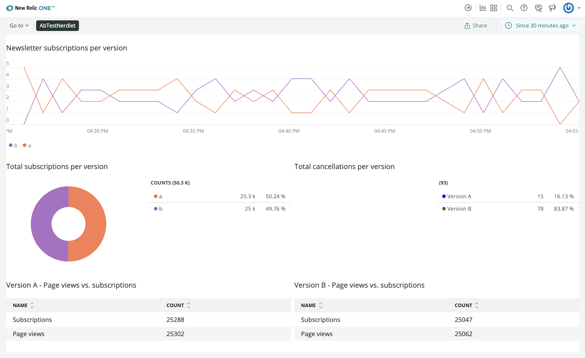
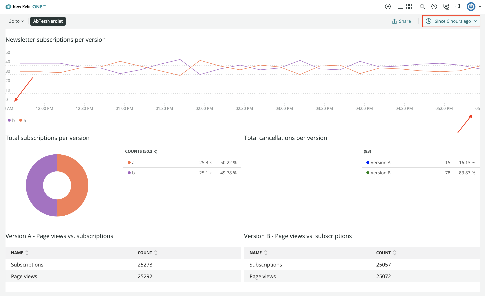
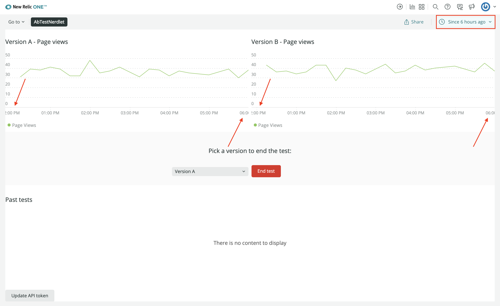

<HideWhenEmbedded>

<Callout variant="tip" title="Course">

This lesson is part of a course that teaches you how to build a New Relic One application from the ground up. If you haven't already, check out the [course introduction](/ab-test).

Each lesson in the course builds upon the last, so make sure you've completed the last lesson, [_Fetch data from a third-party service_](/build-apps/ab-test/third-party-service), before starting this one.

</Callout>

</HideWhenEmbedded>

In this course, you're building a New Relic One application. This application shows telemetry data from a demo service that is running an A/B test so that it can reveal that data in charts, like a dashboard. Your New Relic application is different than a dashboard, however, because it does more than show New Relic data. It pulls external data, provides UI components and functionality, and even has its own small data stores. The purpose of this New Relic application is to present context so you can better understand the A/B test results and how those results tie in to your business objectives.

So far, you've built all your charts, organized them for improved usability, provided them with real data, and more. There are some final improvements you can make, using Platform API components. In this lesson, you learn how to use values in the New Relic platform state.

<Steps>

<Step>

Change to the _add-platform-state-context/ab-test_ directory of the [coursework repository](https://github.com/newrelic-experimental/nru-programmability-course):

```sh
cd nru-programmability-course/add-platform-state-context/ab-test
```

This directory contains the code that we expect your application to have at this point in the course. By navigating to the correct directory at the start of each lesson, you leave your custom code behind, thereby protecting yourself from carrying incorrect code from one lesson to the next.

</Step>

<Step>

In _nerdlets/ab-test-nerdlet/newsletter-signups.js_, add a `PlatformStateContext.Consumer` to your `NewsletterSignups` component's `render()` method:

```js fileName=nerdlets/ab-test-nerdlet/newsletter-signups.js lineHighlight=6,17-33
import React from 'react';
import {
    HeadingText,
    LineChart,
    NrqlQuery,
    PlatformStateContext,
} from 'nr1';

const ACCOUNT_ID = 123456  // <YOUR NEW RELIC ACCOUNT ID>

export default class NewsletterSignups extends React.Component {
    render() {
        return <div>
            <HeadingText className="chartHeader">
                Newsletter subscriptions per version
            </HeadingText>
            <PlatformStateContext.Consumer>
                {
                    (platformState) => {
                        return <NrqlQuery
                            accountId={ACCOUNT_ID}
                            query="SELECT count(*) FROM subscription FACET page_version SINCE 30 MINUTES AGO TIMESERIES"
                            pollInterval={60000}
                        >
                            {
                                ({ data }) => {
                                    return <LineChart data={data} fullWidth />;
                                }
                            }
                        </NrqlQuery>
                    }
                }
            </PlatformStateContext.Consumer>
        </div>
    }
}

```

`PlatformStateContext.Consumer` provides access to the platform's URL state. This state contains two important values for you to use in this context:

- accountId
- timeRange

Notice that `NrqlQuery` uses a constant called `ACCOUNT_ID`. Instead of hardcoding an account identifier in your nerdlet, you can use `accountId` from the platform URL state.

</Step>

<Step>

Use `platformState.accountId` in your `NrqlQuery`:

```js fileName=nerdlets/ab-test-nerdlet/newsletter-signups.js lineHighlight=21
import React from 'react';
import {
    HeadingText,
    LineChart,
    NrqlQuery,
    PlatformStateContext,
} from 'nr1';

export default class NewsletterSignups extends React.Component {
    render() {
        return <div>
            <HeadingText className="chartHeader">
                Newsletter subscriptions per version
            </HeadingText>
            <PlatformStateContext.Consumer>
                {
                    (platformState) => {
                        return <NrqlQuery
                            accountId={platformState.accountId}
                            query="SELECT count(*) FROM subscription FACET page_version SINCE 30 MINUTES AGO TIMESERIES"
                            pollInterval={60000}
                        >
                            {
                                ({ data }) => {
                                    return <LineChart data={data} fullWidth />;
                                }
                            }
                        </NrqlQuery>
                    }
                }
            </PlatformStateContext.Consumer>
        </div>
    }
}
```

Next, notice that your query uses a `SINCE` clause, which identifies the historical timeframe your query should fetch data from.

</Step>

<Step>

Utilize platform state's `timeRange`:

```js fileName=nerdlets/ab-test-nerdlet/newsletter-signups.js lineHighlight=22-23
import React from 'react';
import {
    HeadingText,
    LineChart,
    NrqlQuery,
    PlatformStateContext,
} from 'nr1';

export default class NewsletterSignups extends React.Component {
    render() {
        return <div>
            <HeadingText className="chartHeader">
                Newsletter subscriptions per version
            </HeadingText>
            <PlatformStateContext.Consumer>
                {
                    (platformState) => {
                        return <NrqlQuery
                            accountId={platformState.accountId}
                            query="SELECT count(*) FROM subscription FACET page_version TIMESERIES"
                            timeRange={platformState.timeRange}
                            pollInterval={60000}
                        >
                            {
                                ({ data }) => {
                                    return <LineChart data={data} fullWidth />;
                                }
                            }
                        </NrqlQuery>
                    }
                }
            </PlatformStateContext.Consumer>
        </div>
    }
}
```

Now, `NewsletterSignups` uses `platformState.timeRange` instead of a hardcoded `SINCE` clause.

<Callout variant="tip">

While `NrqlQuery` components accept a convenient `timeRange` prop, not every component does. You can still use `timeRange` in other contexts by accessing `duration`, `begin_time`, or `end_time`:

```jsx
<PlatformStateContext.Consumer>
    {
        (platformState) => { console.log(platformState.timeRange.duration); }
    }
</PlatformStateContext.Consumer>
```

</Callout>

</Step>

<Step>

Navigate to the root of your Nerdpack at _nru-programmability-course/add-platform-state-context/ab-test_.

</Step>

<Step>

Generate a new UUID for your Nerdpack:

```sh
nr1 nerdpack:uuid -gf
```

Because you cloned the coursework repository that contained an existing Nerdpack, you need to generate your own unique identifier. This UUID maps your Nerdpack to your New Relic account. It also allows your app to make Nerdgraph requests on behalf of your account.

</Step>

<Step>

Serve your application locally:

```sh
nr1 nerdpack:serve
```

</Step>

<Step>

[View your application](https://one.newrelic.com?nerdpacks=local):



Your `NrqlQuery` is now using the account ID, which it got from platform state. It's also using the platform state's time range, but your chart probably still shows the last 30 minutes. Why? Where does the `timeRange` in platform state come from?

The time picker sits on the right side of your application's navigation bar:


Change this value and see your chart update:



</Step>

<Step>

Update `VersionPageViews`:

```js fileName=nerdlets/ab-test-nerdlet/page-views.js lineHighlight=6,15-32
import React from 'react';
import {
    HeadingText,
    LineChart,
    NrqlQuery,
    PlatformStateContext,
} from 'nr1';

export default class VersionPageViews extends React.Component {
    render() {
        return <div>
            <HeadingText className="chartHeader">
                Version {this.props.version.toUpperCase()} - Page views
            </HeadingText>
            <PlatformStateContext.Consumer>
                {
                    (platformState) => {
                        return <NrqlQuery
                            accountId={platformState.accountId}
                            query={`SELECT count(*) FROM pageView WHERE page_version = '${this.props.version}' TIMESERIES`}
                            timeRange={platformState.timeRange}
                            pollInterval={60000}
                        >
                            {
                                ({ data }) => {
                                    return <LineChart data={data} fullWidth />;
                                }
                            }
                        </NrqlQuery>
                    }
                }
            </PlatformStateContext.Consumer>
        </div>
    }
}
```

Of all the charts in your New Relic One application, these three charts are the ones that should update with the time picker. The others, **Total subscriptions per version**, **Total cancellations per version**, **Version A - Page views vs. subscriptions**, **Version B - Page views vs. subscriptions**, show total values over time. So, hardcoding their `SINCE` clauses to `7 DAYS AGO` makes sense, as this is a reasonable time period for the purposes of this course.

</Step>

<Step>

While still serving your nerdpack locally, view your NR1 app to see your charts updating with the time range you choose:



When you're finished, stop serving your New Relic One application by pressing `CTRL+C` in the terminal window where you're serving your application.

</Step>

</Steps>

Now that you're basing your queries off the platform state, some of your charts are dynamic in their time ranges. This is a great improvement because it allows you to adjust your charts to show data from any particular point in time, which is useful for tying data to business outcomes.

The Platform API components offer a lot more functionality, too, including the ability to navigate the user to another place in New Relic. You'll learn how to do this in the next lesson.

<HideWhenEmbedded>

<Callout variant="tip" title="Course">

This lesson is part of a course that teaches you how to build a New Relic One application from the ground up. Continue on to the next lesson: [_Add navigation to your nerdlet_](/build-apps/ab-test/navigation).

</Callout>

</HideWhenEmbedded>