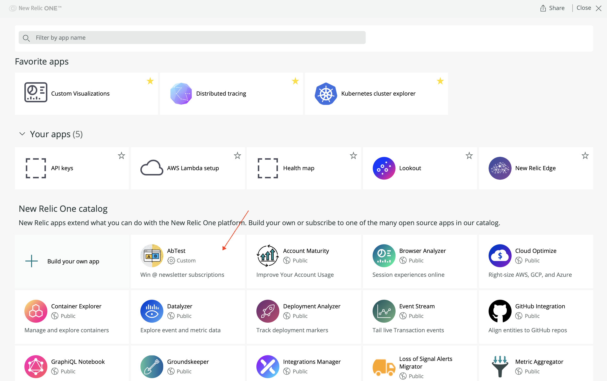
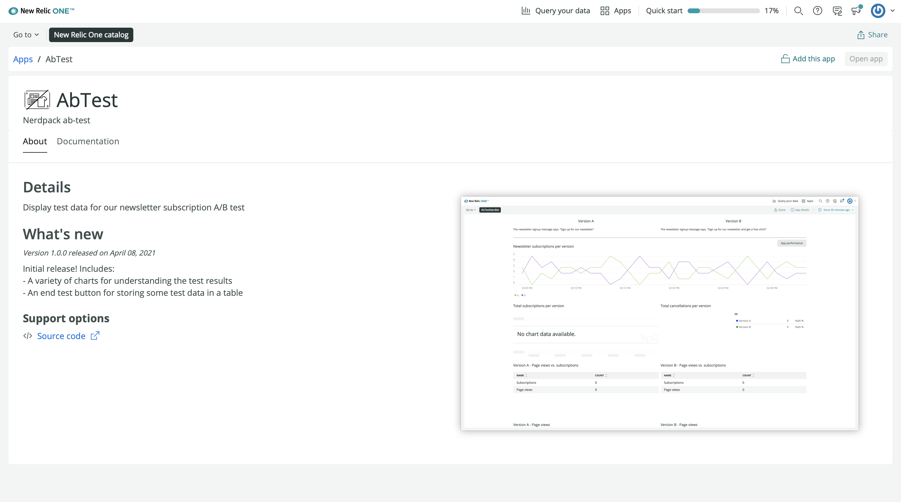
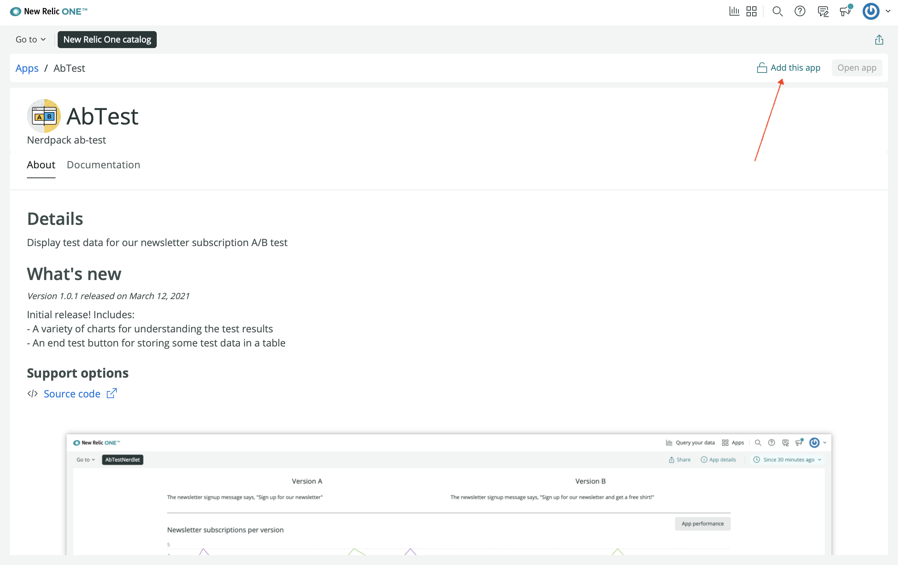
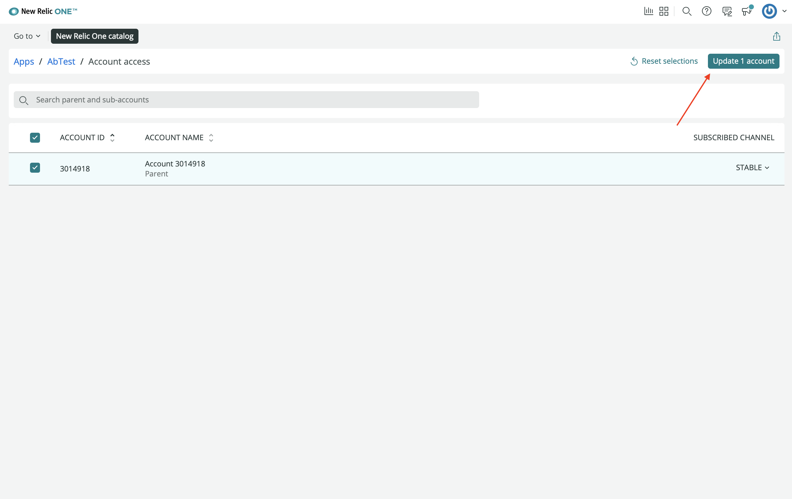
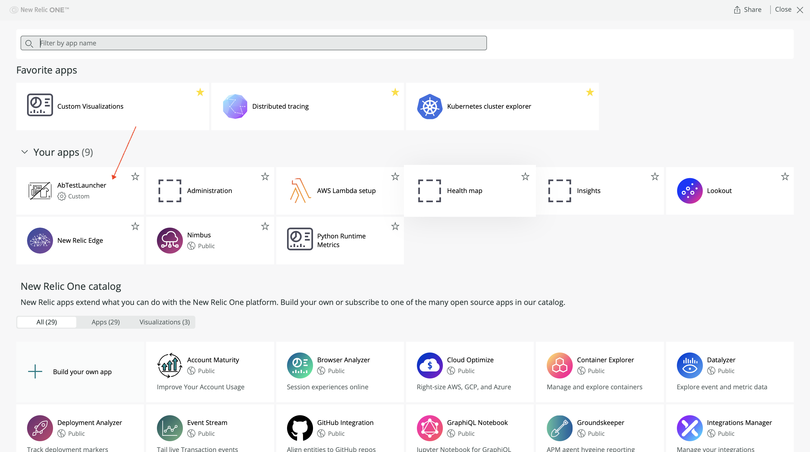
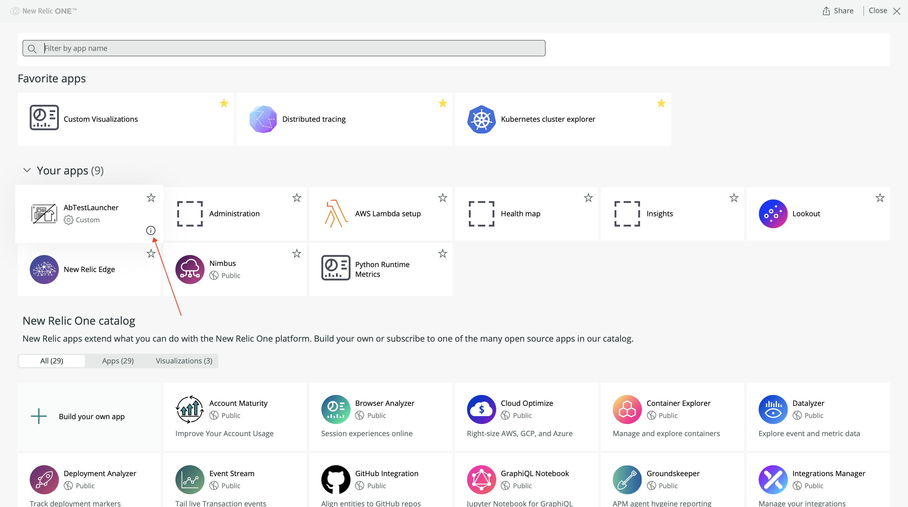
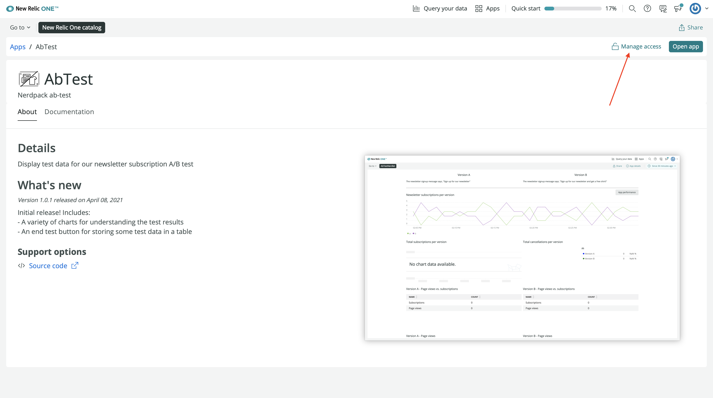
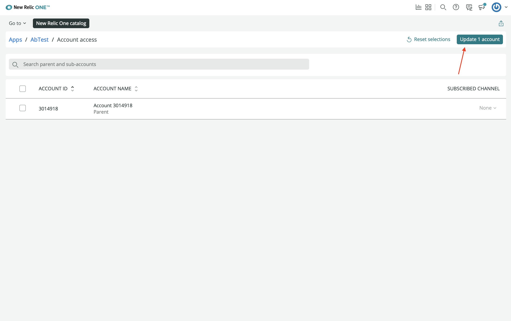

<HideWhenEmbedded>

<Callout variant="course">

This lesson is part of a course that teaches you how to build a New Relic One application from the ground up. If you haven't already, check out the [course introduction](/ab-test).

Each lesson in the course builds upon the last, so make sure you've completed the last lesson, [_Publish your New Relic One application_](/build-apps/ab-test/publish), before starting this one.

</Callout>

</HideWhenEmbedded>

In the last lesson, you published your A/B test app to the New Relic One catalog. You then submitted your app's description, metadata, documentation, and screenshots. Now, it's time to subscribe your account to the published app.

## Subscribe to your application

Now that your application is published to the catalog, you can view it by visiting the **Apps** page of [New Relic](https://one.newrelic.com):

From the catalog UI, you can subscribe to applications.

<Steps>

<Step>

From the catalog, click your app:

<Callout variant="tip">

If you don't see your app in the catalog, you may have to refresh the page or clear your browser cache.

</Callout>

This opens the app's **About** page and shows the details you submitted to the catalog in the last lesson:

</Step>

<Step>

At the top right of this page, click **Add this app**:

This opens the **Account access** view.

</Step>

<Step>

From **Account access**, select the account you want to subscribe to the application and the channel to subscribe to. Finally, select **Update 1 account**:

Here, you only had one version tag to subscribe to. In other projects, you may have other versions with other tags.

<Callout variant="tip" title="Technical detail">

Notice that the web UI uses the term "channel" instead of "tag". This is a relic of an older version of New Relic One apps. With later versions of `nr1`, we've moved toward "tags" terminology. Eventually, the UI will also use "tags".

</Callout>

</Step>

<Step>

Navigate to the **Apps** page, and see the AbTest app under **Your apps**:

From there, you can click your app and use it like you did when you were serving it locally!

<Callout variant="tip">

If you don't see the app under **Your apps**, you may have to refresh the page or clear your browser cache.

</Callout>

</Step>

</Steps>

It's important to note that you can subscribe to applications in the catalog with the `nr1` CLI. Read [our documentation](publish-deploy#subscribe-or-unsubscribe-apps) to learn more.

## Unsubscribe from your application

The process for unsubscribing from an application is similar to that of subscribing.

<Steps>

<Step>

Click the "i" icon on your app launcher:

Here, you see the same app details you saw when your app was in the catalog.

</Step>

<Step>

Click **Manage access**:

This opens the **Account access** view.

</Step>

<Step>

From **Account access**, deselect the account you want to unsubscribe from the app, and select **Update 1 account**:

If you navigate back to **Apps**, you will see your app in the catalog.

</Step>

</Steps>

Throughout this course, you've built a New Relic One application from the ground up. You've used the `nr1` CLI to create a Nerdpack, launcher, and Nerdlet. You've used many components from the SDK. You've learned how to publish, tag, subscribe, and unsubscribe to and from apps in the catalog. You've also learned how to submit metadata to the catalog.

## Next steps

Now that you know how to build a New Relic One application, you can read the SDK documentation to learn more about all the components you can use to create apps for your own purposes.

<HideWhenEmbedded>

<Callout variant="course">

This lesson is the final part of a course that teaches you how to build a New Relic One application from the ground up. Congratulations on making it to the end!

</Callout>

</HideWhenEmbedded>