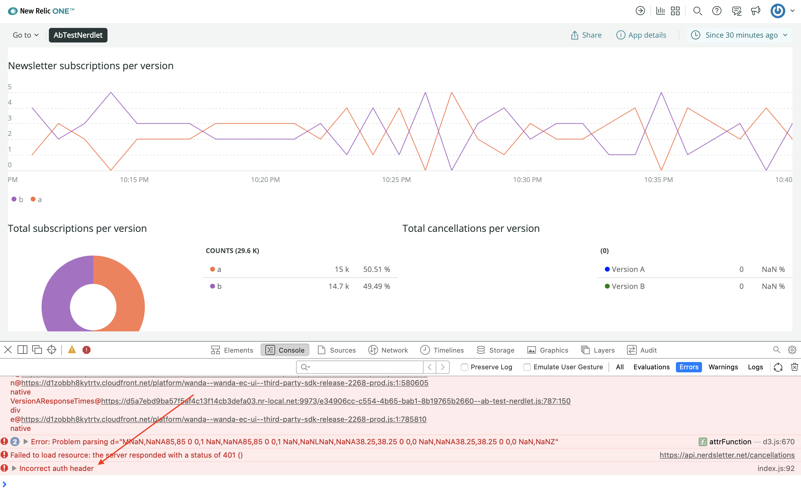
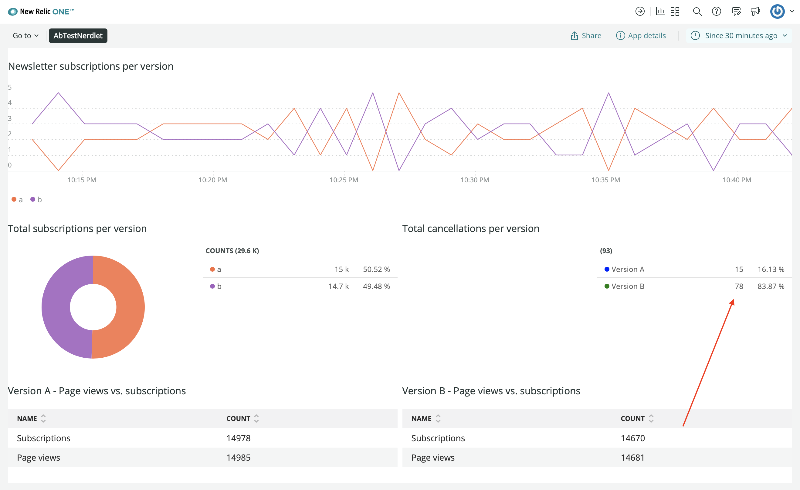

In previous lessons, you learned of a third-party service that you can use to fetch mock cancellation data for the **Total cancellations per version** chart in your New Relic One application. Even though the data in this service is fake, the real value of this lesson is learning how you can use third party services to supply data to your New Relic One application.

If you make a request to the mock service with cancellation data (https://api.nerdsletter.net/cancellations) you'll see a response rejecting your request with a message that reads "Unauthorized":

```sh
curl https://api.nerdsletter.net/cancellations
[output] Unauthorized
```

This is because the Nerdsletter API requires an `Authorization` header. More specifically, you must pass a bearer token of `ABC123` to gain authorized access to its data. If you make a request to the service with the header `Authorization: Bearer ABC123`, you'll get a successful response with the mocked cancellation data:

```sh
curl https://api.nerdsletter.net/cancellations -h 'Authorization: Bearer ABC123'
[output] {"a": 15, "b": 78}
```

In the last lesson, you used `NerdGraph` to store this API token in your New Relic One application's `NerdStorageVault` data store. You also passed the token to your `TotalCancellations` component and logged its use to your browser's console. In this lesson, you follow up that log statement with a real request to the Nerdsletter API using your authorization token. Then, you supply the data from that external resource to your **Total cancellations per version** chart.

<Steps>

<Step>

Change to the `third-party-services` directory of the course repository:

```sh
cd nru-programmability-course/third-party-services
```

This directory contains the code that we expect your application to have at this point in the course. By navigating to the correct directory at the start of each lesson, you leave your custom code behind, thereby protecting yourself from carrying incorrect code from one lesson to the next.

</Step>

<Step>

Open your Nerdlet's index.js file. All code you write in this lesson belongs in this file.

</Step>

<Step>

In `TotalCancellations`, modify `.componentDidUpdate()`:

```js
constructor() {
    super(...arguments);

    this.state = {
        cancellations: [
            {
                metadata: {
                    id: 'cancellations-A',
                    name: 'Version A',
                    viz: 'main',
                    color: 'blue',
                },
                data: [
                    { y: 0 },
                ],
            },
            {
                metadata: {
                    id: 'cancellations-B',
                    name: 'Version B',
                    viz: 'main',
                    color: 'green',
                },
                data: [
                    { y: 0 },
                ],
            },
        ],
        lastToken: null
    }
}

componentDidUpdate() {
    if (this.props.token && this.props.token != this.state.lastToken) {
        console.log(`requesting data with api token ${this.props.token}`)
        fetch("https://api.nerdsletter.net/cancellations", {headers: {"Authorization": `Bearer ${this.props.token}`}})
            .then(
                (response) => {
                    if (response.status == 200) {
                        return response.json()
                    } else if (response.status == 401) {
                        console.error("Incorrect auth header")
                    } else {
                        console.error(response.text())
                    }
                }
            )
            .then(
                (data) => {
                    if (data) {
                        let cancellations = this.state.cancellations.slice()
                        cancellations[0].data[0].y = data.a
                        cancellations[1].data[0].y = data.b
                        this.setState({ cancellations: cancellations, lastToken: this.props.token })
                    }
                }
            )
    }
}
```

In this code, you initialize `TotalCancellations.state.cancellations` with zero for the y-value in each series instead of the previously hardcoded values. This helps to more realistically represent what the chart should show if your New Relic One app hasn't successfully requested data from the Nerdsletter API. Next, you use Javascript's `fetch()` function to make an HTTP request to the Nerdsletter API. You then pass your token in the request's `Authorization` header. If the request is successful, you update the cancellation data in `TotalCancellations.state` so that that data is reflected in the component's render method.

</Step>

<Step>

Navigate to the root of your Nerdpack at `nru-programmability-course/third-party-service/ab-test`.

</Step>

<Step>

Serve your application locally:

```sh
nr1 nerdpack:serve
```

</Step>

<Step>

[View your changes](https://one.newrelic.com?nerdpacks=local). If your token in `NerdStorageVault` is not "ABC123", then your console will show an error that reads, "Incorrect auth header":



If you set the token to "ABC123", then **Total cancellations per version** updates to show the values from the third-party service:



When you're finished, stop serving your New Relic One application by pressing `CTRL+C` in the terminal window where you're serving your application.

</Step>

</Steps>

Great job! You've come a long way from running `nr1 nerdpack:create` for the first time. Take a look back at your design guide to see that your application now has everything from an interface and data perspective that you planned from the beginning:


You've created eight charts with varying styles and supplied them with dynamic data from multiple sources. You've learned about the New Relic One SDK and used many of its components. You've even gathered data from a third-party service and mixed it seemlessly with your New Relic data to provide a complete look at how the competing versions in your A/B test perform against each other.

From here, there is only one more set of APIs in the New Relic One SDK that you've yet to get your hands on: Platform APIs. These will come in handy in improving the usability of your New Relic One application.