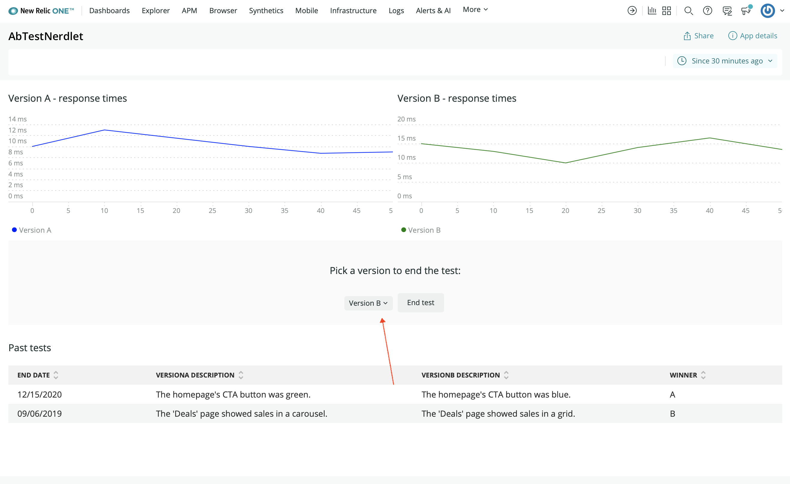

With your charts organized and descriptive headings above each one, your New Relic One application is becoming more usable. In this lesson, you'll continue that trend by creating descriptions for each design version in your A/B test.

<Steps>

<Step>

In _nerdlets/ab-test-nerdlet/_, add a new Javascript file named _description.js_.

</Step>

<Step>

In this new file, create a new React component, called `VersionDescription`, which uses a `HeadingText` and a `BlockText` to render a version description:

```js fileName=description.js
import React from 'react';
import {
    BlockText,
    HeadingText,
} from 'nr1';

export default class VersionDescription extends React.Component {
    constructor(props) {
        super(props);
    }

    render() {
        return (
            <div>
                <HeadingText className="versionHeader">
                    Version {this.props.version}
                </HeadingText>
                <BlockText className="versionText">
                    {this.props.description}
                </BlockText>
            </div>
        )
    }
}
```

You'll use this one class to create a version description for each design version in your A/B test.

</Step>

<Step>

In your Nerdlet's _index.js_ file, import `VersionDescription`:

```js filename="index.js"
import VersionDescription from './description';
```

</Step>

<Step>

Also in _index.js_, add a new `GridItem` component for each design version:

```js filename=index.js
<GridItem columnSpan={6}>
    <VersionDescription
        description={VERSION_A_DESCRIPTION}
        version="A"
    />
</GridItem>
<GridItem columnSpan={6}>
    <VersionDescription
        description={VERSION_B_DESCRIPTION}
        version="B"
    />
</GridItem>
<GridItem columnSpan={12}><hr /></GridItem>
```

Here, you've created two `VersionDescription` components. You passed the `description` and `version` props, which correspond to a design version.

You also added a horizontal rule to visually separate the descriptions from the charts in your app. For this, you added a `GridItem` with a `columnSpan` of 12, to stretch the rule the full width of the grid.

</Step>

<Step>

Navigate to the root of your Nerdpack at `nru-programmability-course/add-version-descriptions/ab-test`.

</Step>

<Step>

Serve your application locally:

```sh
nr1 nerdpack:serve
```

</Step>

<Step>

[View your changes](https://one.newrelic.com?nerdpacks=local):



When you're finished, stop serving your New Relic One application by pressing `CTRL+C` in the terminal window where you're serving your application.

</Step>

</Steps>

Now, you've added descriptions for your competing designs and your charts. In the next lesson, you’ll create a new section of your application from user interface components. This section will be used to end the A/B test with the click of a button.