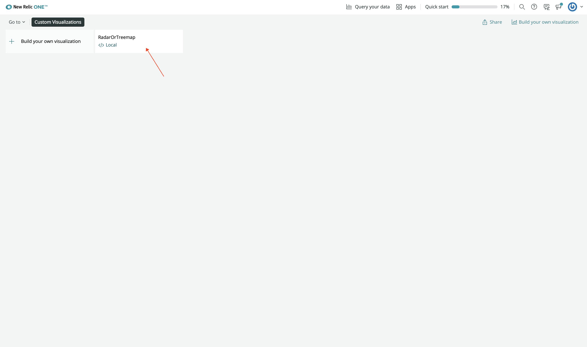
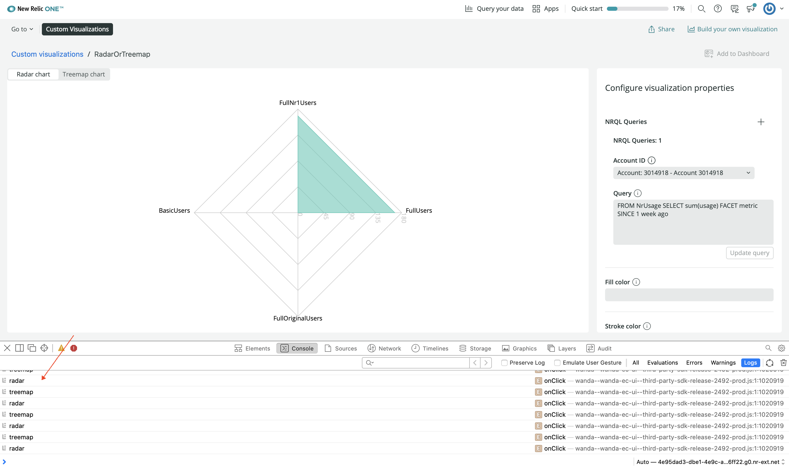
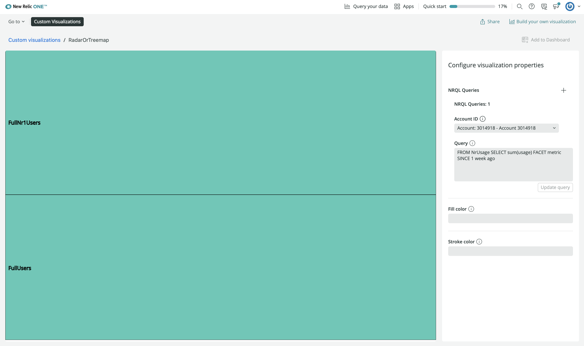
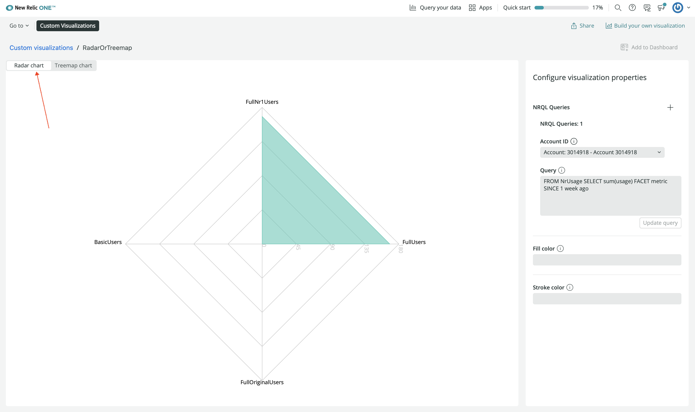
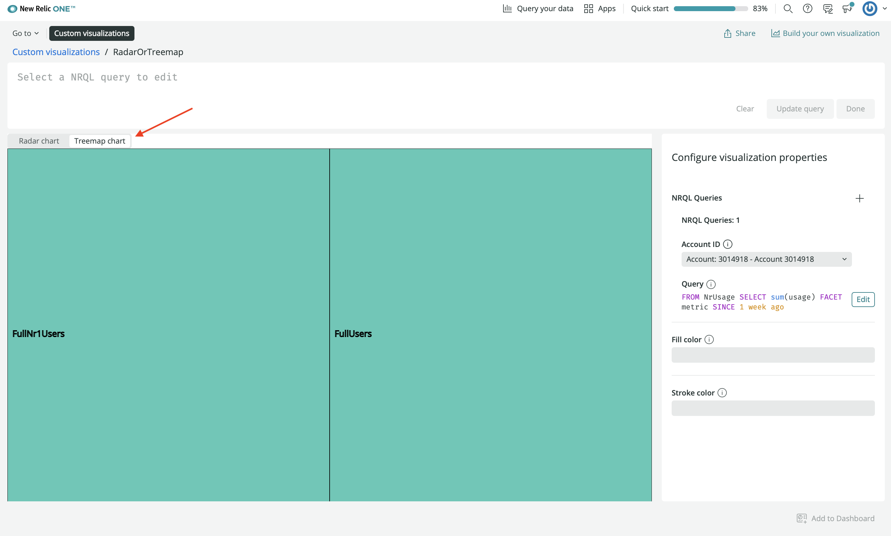

<Callout variant="course">

This lesson is part of a course that teaches you how to build a custom visualization in the New Relic One platform

</Callout>

<Intro>

Use New Relic One custom visualizations to display your data, whether it's from New Relic's database or an external source, in unique ways that are distinct from the charts offered by the New Relic platform.

In this lesson, you build a visualization that displays your data in one of two chart types: [`RadarChart`](https://recharts.org/en-US/api/RadarChart) or [`Treemap`](https://recharts.org/en-US/api/Treemap). You then implement a `SegmentedControl` component from the New Relic One SDK, which allows you to alternate between the two chart types. Ultimately, this gives you freedom to view your data in a dynamic way that isn't possible with New Relic's base offerings.

<Callout variant="tip">

If you get lost in the code project and would like to see what the files should look like when you're done with each lesson, check out the [course project](https://github.com/newrelic/nru-custom-visualization-course) on Github.

</Callout>

</Intro>

## Before you begin

Explore our [custom visualization](/explore-docs/custom-viz) guides and [build your first visualization](/explore-docs/custom-viz/build-visualization). After you're done, you'll have a better foundation for building more complex visualizations, such as the one you'll build in this course.

Finally, if you haven't already:

- Sign up for a [New Relic account](https://newrelic.com/signup?utm_source=developer-site)
- Install [Node.js](https://nodejs.org/en/download/)
- Complete the steps in the [`nr1` quick start](https://one.newrelic.com/launcher/developer-center.launcher?pane=eyJuZXJkbGV0SWQiOiJkZXZlbG9wZXItY2VudGVyLmRldmVsb3Blci1jZW50ZXIifQ==) to install and configure the CLI

## Create your visualization

<Steps>

<Step>

Ensure you're working with the latest version of the New Relic One CLI:

```bash
nr1 update
```

</Step>

<Step>

Create a Nerdpack:

```bash
nr1 create --type nerdpack --name alternate-viz
```

If you receive a `RequestError` for a self-signed certificate when you run `nr1 create`, you may need to add a certificate to Node's certificate chain. Read more about this and other advanced configurations in [Enable advanced configurations for your Nerdpack](/build-apps/advanced-config).

</Step>

<Step>

From the root of your Nerdpack, create a visualization:

```bash
cd alternate-viz
nr1 create --type visualization --name radar-or-treemap
```

As a result, you have a new `visualizations/radar-or-treemap` directory:

```bash
ls visualizations/radar-or-treemap
[output] index.js    nr1.json    styles.scss
```

</Step>

</Steps>

<Tutorial>

<Project>

```js fileName=visualizations/radar-or-treemap/index.js
import React from 'react';
import PropTypes from 'prop-types';
import {
  Radar,
  RadarChart,
  PolarGrid,
  PolarAngleAxis,
  PolarRadiusAxis,
} from 'recharts';
import {Card, CardBody, HeadingText, NrqlQuery, Spinner, AutoSizer} from 'nr1';

export default class RadarOrTreemapVisualization extends React.Component {
  // Custom props you wish to be configurable in the UI must also be defined in
  // the nr1.json file for the visualization. See docs for more details.
  static propTypes = {
    /**
     * A fill color to override the default fill color. This is an example of
     * a custom chart configuration.
     */
    fill: PropTypes.string,

    /**
     * A stroke color to override the default stroke color. This is an example of
     * a custom chart configuration.
     */
    stroke: PropTypes.string,
    /**
     * An array of objects consisting of a nrql `query` and `accountId`.
     * This should be a standard prop for any NRQL based visualizations.
     */
    nrqlQueries: PropTypes.arrayOf(
      PropTypes.shape({
        accountId: PropTypes.number,
        query: PropTypes.string,
      })
    ),
  };

  /**
   * Restructure the data for a non-time-series, facet-based NRQL query into a
   * form accepted by the Recharts library's RadarChart.
   * (https://recharts.org/api/RadarChart).
   */
  transformData = (rawData) => {
    return rawData.map((entry) => ({
      name: entry.metadata.name,
      // Only grabbing the first data value because this is not time-series data.
      value: entry.data[0].y,
    }));
  };

  /**
   * Format the given axis tick's numeric value into a string for display.
   */
  formatTick = (value) => {
    return value.toLocaleString();
  };

  render() {
    const {nrqlQueries, stroke, fill} = this.props;

    const nrqlQueryPropsAvailable =
      nrqlQueries &&
      nrqlQueries[0] &&
      nrqlQueries[0].accountId &&
      nrqlQueries[0].query;

    if (!nrqlQueryPropsAvailable) {
      return <EmptyState />;
    }

    return (
      <AutoSizer>
        {({width, height}) => (
          <NrqlQuery
            query={nrqlQueries[0].query}
            accountId={parseInt(nrqlQueries[0].accountId)}
            pollInterval={NrqlQuery.AUTO_POLL_INTERVAL}
          >
            {({data, loading, error}) => {
              if (loading) {
                return <Spinner />;
              }

              if (error) {
                return <ErrorState />;
              }

              const transformedData = this.transformData(data);

              return (
                <RadarChart
                  width={width}
                  height={height}
                  data={transformedData}
                >
                  <PolarGrid />
                  <PolarAngleAxis dataKey="name" />
                  <PolarRadiusAxis tickFormatter={this.formatTick} />
                  <Radar
                    dataKey="value"
                    stroke={stroke || '#51C9B7'}
                    fill={fill || '#51C9B7'}
                    fillOpacity={0.6}
                  />
                </RadarChart>
              );
            }}
          </NrqlQuery>
        )}
      </AutoSizer>
    );
  }
}

const EmptyState = () => (
  <Card className="EmptyState">
    <CardBody className="EmptyState-cardBody">
      <HeadingText
        spacingType={[HeadingText.SPACING_TYPE.LARGE]}
        type={HeadingText.TYPE.HEADING_3}
      >
        Please provide at least one NRQL query & account ID pair
      </HeadingText>
      <HeadingText
        spacingType={[HeadingText.SPACING_TYPE.MEDIUM]}
        type={HeadingText.TYPE.HEADING_4}
      >
        An example NRQL query you can try is:
      </HeadingText>
      <code>FROM NrUsage SELECT sum(usage) FACET metric SINCE 1 week ago</code>
    </CardBody>
  </Card>
);

const ErrorState = () => (
  <Card className="ErrorState">
    <CardBody className="ErrorState-cardBody">
      <HeadingText
        className="ErrorState-headingText"
        spacingType={[HeadingText.SPACING_TYPE.LARGE]}
        type={HeadingText.TYPE.HEADING_3}
      >
        Oops! Something went wrong.
      </HeadingText>
    </CardBody>
  </Card>
);
```

</Project>

## Set up your component state

Add component state to the default visualization template that `nr1` created for you.

<Steps>

<Step>

Navigate to _alternate-viz/visualizations/radar-or-treemap/index.js_. You'll work in _index.js_ for the rest of this guide.

</Step>

<Step>

Add a constant called `CHART_TYPES`:

```js fileName=visualizations/radar-or-treemap/index.js
import React from 'react';
import PropTypes from 'prop-types';
import {
  Radar,
  RadarChart,
  PolarGrid,
  PolarAngleAxis,
  PolarRadiusAxis,
} from 'recharts';
import {Card, CardBody, HeadingText, NrqlQuery, Spinner, AutoSizer} from 'nr1';

const CHART_TYPES = {
  'Radar': 'radar',
  'Treemap': 'treemap'
}

export default class RadarOrTreemapVisualization extends React.Component {
  // Custom props you wish to be configurable in the UI must also be defined in
  // the nr1.json file for the visualization. See docs for more details.
  static propTypes = {
    /**
     * A fill color to override the default fill color. This is an example of
     * a custom chart configuration.
     */
    fill: PropTypes.string,

    /**
     * A stroke color to override the default stroke color. This is an example of
     * a custom chart configuration.
     */
    stroke: PropTypes.string,
    /**
     * An array of objects consisting of a nrql `query` and `accountId`.
     * This should be a standard prop for any NRQL based visualizations.
     */
    nrqlQueries: PropTypes.arrayOf(
      PropTypes.shape({
        accountId: PropTypes.number,
        query: PropTypes.string,
      })
    ),
  };

  /**
   * Restructure the data for a non-time-series, facet-based NRQL query into a
   * form accepted by the Recharts library's RadarChart.
   * (https://recharts.org/api/RadarChart).
   */
  transformData = (rawData) => {
    return rawData.map((entry) => ({
      name: entry.metadata.name,
      // Only grabbing the first data value because this is not time-series data.
      value: entry.data[0].y,
    }));
  };

  /**
   * Format the given axis tick's numeric value into a string for display.
   */
  formatTick = (value) => {
    return value.toLocaleString();
  };

  render() {
    const {nrqlQueries, stroke, fill} = this.props;

    const nrqlQueryPropsAvailable =
      nrqlQueries &&
      nrqlQueries[0] &&
      nrqlQueries[0].accountId &&
      nrqlQueries[0].query;

    if (!nrqlQueryPropsAvailable) {
      return <EmptyState />;
    }

    return (
      <AutoSizer>
        {({width, height}) => (
          <NrqlQuery
            query={nrqlQueries[0].query}
            accountId={parseInt(nrqlQueries[0].accountId)}
            pollInterval={NrqlQuery.AUTO_POLL_INTERVAL}
          >
            {({data, loading, error}) => {
              if (loading) {
                return <Spinner />;
              }

              if (error) {
                return <ErrorState />;
              }

              const transformedData = this.transformData(data);

              return (
                <RadarChart
                  width={width}
                  height={height}
                  data={transformedData}
                >
                  <PolarGrid />
                  <PolarAngleAxis dataKey="name" />
                  <PolarRadiusAxis tickFormatter={this.formatTick} />
                  <Radar
                    dataKey="value"
                    stroke={stroke || '#51C9B7'}
                    fill={fill || '#51C9B7'}
                    fillOpacity={0.6}
                  />
                </RadarChart>
              );
            }}
          </NrqlQuery>
        )}
      </AutoSizer>
    );
  }
}

const EmptyState = () => (
  <Card className="EmptyState">
    <CardBody className="EmptyState-cardBody">
      <HeadingText
        spacingType={[HeadingText.SPACING_TYPE.LARGE]}
        type={HeadingText.TYPE.HEADING_3}
      >
        Please provide at least one NRQL query & account ID pair
      </HeadingText>
      <HeadingText
        spacingType={[HeadingText.SPACING_TYPE.MEDIUM]}
        type={HeadingText.TYPE.HEADING_4}
      >
        An example NRQL query you can try is:
      </HeadingText>
      <code>FROM NrUsage SELECT sum(usage) FACET metric SINCE 1 week ago</code>
    </CardBody>
  </Card>
);

const ErrorState = () => (
  <Card className="ErrorState">
    <CardBody className="ErrorState-cardBody">
      <HeadingText
        className="ErrorState-headingText"
        spacingType={[HeadingText.SPACING_TYPE.LARGE]}
        type={HeadingText.TYPE.HEADING_3}
      >
        Oops! Something went wrong.
      </HeadingText>
    </CardBody>
  </Card>
);
```

`CHART_TYPES` enumerates the two chart types you'll be able to alternate between in your visualization.

</Step>

<Step>

Initialize `selectedChart` in your component's `state`:

```js fileName=visualizations/radar-or-treemap/index.js
import React from 'react';
import PropTypes from 'prop-types';
import {
  Radar,
  RadarChart,
  PolarGrid,
  PolarAngleAxis,
  PolarRadiusAxis,
} from 'recharts';
import {Card, CardBody, HeadingText, NrqlQuery, Spinner, AutoSizer} from 'nr1';

const CHART_TYPES = {
  'Radar': 'radar',
  'Treemap': 'treemap'
}

export default class RadarOrTreemapVisualization extends React.Component {
  // Custom props you wish to be configurable in the UI must also be defined in
  // the nr1.json file for the visualization. See docs for more details.
  static propTypes = {
    /**
     * A fill color to override the default fill color. This is an example of
     * a custom chart configuration.
     */
    fill: PropTypes.string,

    /**
     * A stroke color to override the default stroke color. This is an example of
     * a custom chart configuration.
     */
    stroke: PropTypes.string,
    /**
     * An array of objects consisting of a nrql `query` and `accountId`.
     * This should be a standard prop for any NRQL based visualizations.
     */
    nrqlQueries: PropTypes.arrayOf(
      PropTypes.shape({
        accountId: PropTypes.number,
        query: PropTypes.string,
      })
    ),
  };

  state = {
    selectedChart: CHART_TYPES.Radar,
  };

  /**
   * Restructure the data for a non-time-series, facet-based NRQL query into a
   * form accepted by the Recharts library's RadarChart.
   * (https://recharts.org/api/RadarChart).
   */
  transformData = (rawData) => {
    return rawData.map((entry) => ({
      name: entry.metadata.name,
      // Only grabbing the first data value because this is not time-series data.
      value: entry.data[0].y,
    }));
  };

  /**
   * Format the given axis tick's numeric value into a string for display.
   */
  formatTick = (value) => {
    return value.toLocaleString();
  };

  render() {
    const {nrqlQueries, stroke, fill} = this.props;

    const nrqlQueryPropsAvailable =
      nrqlQueries &&
      nrqlQueries[0] &&
      nrqlQueries[0].accountId &&
      nrqlQueries[0].query;

    if (!nrqlQueryPropsAvailable) {
      return <EmptyState />;
    }

    return (
      <AutoSizer>
        {({width, height}) => (
          <NrqlQuery
            query={nrqlQueries[0].query}
            accountId={parseInt(nrqlQueries[0].accountId)}
            pollInterval={NrqlQuery.AUTO_POLL_INTERVAL}
          >
            {({data, loading, error}) => {
              if (loading) {
                return <Spinner />;
              }

              if (error) {
                return <ErrorState />;
              }

              const transformedData = this.transformData(data);

              return (
                <RadarChart
                  width={width}
                  height={height}
                  data={transformedData}
                >
                  <PolarGrid />
                  <PolarAngleAxis dataKey="name" />
                  <PolarRadiusAxis tickFormatter={this.formatTick} />
                  <Radar
                    dataKey="value"
                    stroke={stroke || '#51C9B7'}
                    fill={fill || '#51C9B7'}
                    fillOpacity={0.6}
                  />
                </RadarChart>
              );
            }}
          </NrqlQuery>
        )}
      </AutoSizer>
    );
  }
}

const EmptyState = () => (
  <Card className="EmptyState">
    <CardBody className="EmptyState-cardBody">
      <HeadingText
        spacingType={[HeadingText.SPACING_TYPE.LARGE]}
        type={HeadingText.TYPE.HEADING_3}
      >
        Please provide at least one NRQL query & account ID pair
      </HeadingText>
      <HeadingText
        spacingType={[HeadingText.SPACING_TYPE.MEDIUM]}
        type={HeadingText.TYPE.HEADING_4}
      >
        An example NRQL query you can try is:
      </HeadingText>
      <code>FROM NrUsage SELECT sum(usage) FACET metric SINCE 1 week ago</code>
    </CardBody>
  </Card>
);

const ErrorState = () => (
  <Card className="ErrorState">
    <CardBody className="ErrorState-cardBody">
      <HeadingText
        className="ErrorState-headingText"
        spacingType={[HeadingText.SPACING_TYPE.LARGE]}
        type={HeadingText.TYPE.HEADING_3}
      >
        Oops! Something went wrong.
      </HeadingText>
    </CardBody>
  </Card>
);
```

This `state` value stores the chart type in which you want to show your data.

Now that you've created an object which enumerates the chart type options for your visualization, and you've initialized `state.selectedChart`, you're ready to implement a control UI for switching between the two chart types.

</Step>

</Steps>

## Add `SegmentedControl` components

`state.selectedChart` isn't useful unless your visualization's users can actually select a chart type. Use [`SegmentedControl`](/components/segmented-control) and [`SegmentedControlItem`](/components/segmented-control-item) to switch between the two chart types.

<Callout variant="tip">

To learn more about the components available in the New Relic One SDK, go to our [Intro to New Relic One SDK](/explore-docs/intro-to-sdk).

</Callout>

<Steps>

<Step>

Import `SegmentedControl` and `SegmentedControlItem` from `nr1`:

```js fileName=visualizations/radar-or-treemap/index.js
import React from 'react';
import PropTypes from 'prop-types';
import {
  Radar,
  RadarChart,
  PolarGrid,
  PolarAngleAxis,
  PolarRadiusAxis,
} from 'recharts';
import {
    AutoSizer,
    Card,
    CardBody,
    HeadingText,
    NrqlQuery,
    SegmentedControl,
    SegmentedControlItem,
    Spinner,
} from 'nr1';

const CHART_TYPES = {
  'Radar': 'radar',
  'Treemap': 'treemap'
}

export default class RadarOrTreemapVisualization extends React.Component {
  // Custom props you wish to be configurable in the UI must also be defined in
  // the nr1.json file for the visualization. See docs for more details.
  static propTypes = {
    /**
     * A fill color to override the default fill color. This is an example of
     * a custom chart configuration.
     */
    fill: PropTypes.string,

    /**
     * A stroke color to override the default stroke color. This is an example of
     * a custom chart configuration.
     */
    stroke: PropTypes.string,
    /**
     * An array of objects consisting of a nrql `query` and `accountId`.
     * This should be a standard prop for any NRQL based visualizations.
     */
    nrqlQueries: PropTypes.arrayOf(
      PropTypes.shape({
        accountId: PropTypes.number,
        query: PropTypes.string,
      })
    ),
  };

  state = {
    selectedChart: CHART_TYPES.Radar,
  };

  /**
   * Restructure the data for a non-time-series, facet-based NRQL query into a
   * form accepted by the Recharts library's RadarChart.
   * (https://recharts.org/api/RadarChart).
   */
  transformData = (rawData) => {
    return rawData.map((entry) => ({
      name: entry.metadata.name,
      // Only grabbing the first data value because this is not time-series data.
      value: entry.data[0].y,
    }));
  };

  /**
   * Format the given axis tick's numeric value into a string for display.
   */
  formatTick = (value) => {
    return value.toLocaleString();
  };

  render() {
    const {nrqlQueries, stroke, fill} = this.props;

    const nrqlQueryPropsAvailable =
      nrqlQueries &&
      nrqlQueries[0] &&
      nrqlQueries[0].accountId &&
      nrqlQueries[0].query;

    if (!nrqlQueryPropsAvailable) {
      return <EmptyState />;
    }

    return (
      <AutoSizer>
        {({width, height}) => (
          <NrqlQuery
            query={nrqlQueries[0].query}
            accountId={parseInt(nrqlQueries[0].accountId)}
            pollInterval={NrqlQuery.AUTO_POLL_INTERVAL}
          >
            {({data, loading, error}) => {
              if (loading) {
                return <Spinner />;
              }

              if (error) {
                return <ErrorState />;
              }

              const transformedData = this.transformData(data);

              return (
                <RadarChart
                  width={width}
                  height={height}
                  data={transformedData}
                >
                  <PolarGrid />
                  <PolarAngleAxis dataKey="name" />
                  <PolarRadiusAxis tickFormatter={this.formatTick} />
                  <Radar
                    dataKey="value"
                    stroke={stroke || '#51C9B7'}
                    fill={fill || '#51C9B7'}
                    fillOpacity={0.6}
                  />
                </RadarChart>
              );
            }}
          </NrqlQuery>
        )}
      </AutoSizer>
    );
  }
}

const EmptyState = () => (
  <Card className="EmptyState">
    <CardBody className="EmptyState-cardBody">
      <HeadingText
        spacingType={[HeadingText.SPACING_TYPE.LARGE]}
        type={HeadingText.TYPE.HEADING_3}
      >
        Please provide at least one NRQL query & account ID pair
      </HeadingText>
      <HeadingText
        spacingType={[HeadingText.SPACING_TYPE.MEDIUM]}
        type={HeadingText.TYPE.HEADING_4}
      >
        An example NRQL query you can try is:
      </HeadingText>
      <code>FROM NrUsage SELECT sum(usage) FACET metric SINCE 1 week ago</code>
    </CardBody>
  </Card>
);

const ErrorState = () => (
  <Card className="ErrorState">
    <CardBody className="ErrorState-cardBody">
      <HeadingText
        className="ErrorState-headingText"
        spacingType={[HeadingText.SPACING_TYPE.LARGE]}
        type={HeadingText.TYPE.HEADING_3}
      >
        Oops! Something went wrong.
      </HeadingText>
    </CardBody>
  </Card>
);
```

</Step>

<Step>

In `render()`, wrap `RadarChart` in a `React.Fragment`:

```js fileName=visualizations/radar-or-treemap/index.js
import React from 'react';
import PropTypes from 'prop-types';
import {
  Radar,
  RadarChart,
  PolarGrid,
  PolarAngleAxis,
  PolarRadiusAxis,
} from 'recharts';
import {
    AutoSizer,
    Card,
    CardBody,
    HeadingText,
    NrqlQuery,
    SegmentedControl,
    SegmentedControlItem,
    Spinner,
} from 'nr1';

const CHART_TYPES = {
  'Radar': 'radar',
  'Treemap': 'treemap'
}

export default class RadarOrTreemapVisualization extends React.Component {
  // Custom props you wish to be configurable in the UI must also be defined in
  // the nr1.json file for the visualization. See docs for more details.
  static propTypes = {
    /**
     * A fill color to override the default fill color. This is an example of
     * a custom chart configuration.
     */
    fill: PropTypes.string,

    /**
     * A stroke color to override the default stroke color. This is an example of
     * a custom chart configuration.
     */
    stroke: PropTypes.string,
    /**
     * An array of objects consisting of a nrql `query` and `accountId`.
     * This should be a standard prop for any NRQL based visualizations.
     */
    nrqlQueries: PropTypes.arrayOf(
      PropTypes.shape({
        accountId: PropTypes.number,
        query: PropTypes.string,
      })
    ),
  };

  state = {
    selectedChart: CHART_TYPES.Radar,
  };

  /**
   * Restructure the data for a non-time-series, facet-based NRQL query into a
   * form accepted by the Recharts library's RadarChart.
   * (https://recharts.org/api/RadarChart).
   */
  transformData = (rawData) => {
    return rawData.map((entry) => ({
      name: entry.metadata.name,
      // Only grabbing the first data value because this is not time-series data.
      value: entry.data[0].y,
    }));
  };

  /**
   * Format the given axis tick's numeric value into a string for display.
   */
  formatTick = (value) => {
    return value.toLocaleString();
  };

  render() {
    const {nrqlQueries, stroke, fill} = this.props;

    const nrqlQueryPropsAvailable =
      nrqlQueries &&
      nrqlQueries[0] &&
      nrqlQueries[0].accountId &&
      nrqlQueries[0].query;

    if (!nrqlQueryPropsAvailable) {
      return <EmptyState />;
    }

    return (
      <AutoSizer>
        {({width, height}) => (
          <NrqlQuery
            query={nrqlQueries[0].query}
            accountId={parseInt(nrqlQueries[0].accountId)}
            pollInterval={NrqlQuery.AUTO_POLL_INTERVAL}
          >
            {({data, loading, error}) => {
              if (loading) {
                return <Spinner />;
              }

              if (error) {
                return <ErrorState />;
              }

              const transformedData = this.transformData(data);

              return (
                <React.Fragment>
                <RadarChart
                  width={width}
                  height={height}
                  data={transformedData}
                >
                  <PolarGrid />
                  <PolarAngleAxis dataKey="name" />
                  <PolarRadiusAxis tickFormatter={this.formatTick} />
                  <Radar
                    dataKey="value"
                    stroke={stroke || '#51C9B7'}
                    fill={fill || '#51C9B7'}
                    fillOpacity={0.6}
                  />
                </RadarChart>
                </React.Fragment>
              );
            }}
          </NrqlQuery>
        )}
      </AutoSizer>
    );
  }
}

const EmptyState = () => (
  <Card className="EmptyState">
    <CardBody className="EmptyState-cardBody">
      <HeadingText
        spacingType={[HeadingText.SPACING_TYPE.LARGE]}
        type={HeadingText.TYPE.HEADING_3}
      >
        Please provide at least one NRQL query & account ID pair
      </HeadingText>
      <HeadingText
        spacingType={[HeadingText.SPACING_TYPE.MEDIUM]}
        type={HeadingText.TYPE.HEADING_4}
      >
        An example NRQL query you can try is:
      </HeadingText>
      <code>FROM NrUsage SELECT sum(usage) FACET metric SINCE 1 week ago</code>
    </CardBody>
  </Card>
);

const ErrorState = () => (
  <Card className="ErrorState">
    <CardBody className="ErrorState-cardBody">
      <HeadingText
        className="ErrorState-headingText"
        spacingType={[HeadingText.SPACING_TYPE.LARGE]}
        type={HeadingText.TYPE.HEADING_3}
      >
        Oops! Something went wrong.
      </HeadingText>
    </CardBody>
  </Card>
);
```

This allows you to return multiple components from the same `render()`.

</Step>

<Step>

Add a `SegmentedControl` and two `SegmentedControlItem` components, each with a `value` and a `label`:

```js fileName=visualizations/radar-or-treemap/index.js
import React from 'react';
import PropTypes from 'prop-types';
import {
  Radar,
  RadarChart,
  PolarGrid,
  PolarAngleAxis,
  PolarRadiusAxis,
} from 'recharts';
import {
    AutoSizer,
    Card,
    CardBody,
    HeadingText,
    NrqlQuery,
    SegmentedControl,
    SegmentedControlItem,
    Spinner,
} from 'nr1';

const CHART_TYPES = {
  'Radar': 'radar',
  'Treemap': 'treemap'
}

export default class RadarOrTreemapVisualization extends React.Component {
  // Custom props you wish to be configurable in the UI must also be defined in
  // the nr1.json file for the visualization. See docs for more details.
  static propTypes = {
    /**
     * A fill color to override the default fill color. This is an example of
     * a custom chart configuration.
     */
    fill: PropTypes.string,

    /**
     * A stroke color to override the default stroke color. This is an example of
     * a custom chart configuration.
     */
    stroke: PropTypes.string,
    /**
     * An array of objects consisting of a nrql `query` and `accountId`.
     * This should be a standard prop for any NRQL based visualizations.
     */
    nrqlQueries: PropTypes.arrayOf(
      PropTypes.shape({
        accountId: PropTypes.number,
        query: PropTypes.string,
      })
    ),
  };

  state = {
    selectedChart: CHART_TYPES.Radar,
  };

  /**
   * Restructure the data for a non-time-series, facet-based NRQL query into a
   * form accepted by the Recharts library's RadarChart.
   * (https://recharts.org/api/RadarChart).
   */
  transformData = (rawData) => {
    return rawData.map((entry) => ({
      name: entry.metadata.name,
      // Only grabbing the first data value because this is not time-series data.
      value: entry.data[0].y,
    }));
  };

  /**
   * Format the given axis tick's numeric value into a string for display.
   */
  formatTick = (value) => {
    return value.toLocaleString();
  };

  render() {
    const {nrqlQueries, stroke, fill} = this.props;

    const nrqlQueryPropsAvailable =
      nrqlQueries &&
      nrqlQueries[0] &&
      nrqlQueries[0].accountId &&
      nrqlQueries[0].query;

    if (!nrqlQueryPropsAvailable) {
      return <EmptyState />;
    }

    return (
      <AutoSizer>
        {({width, height}) => (
          <NrqlQuery
            query={nrqlQueries[0].query}
            accountId={parseInt(nrqlQueries[0].accountId)}
            pollInterval={NrqlQuery.AUTO_POLL_INTERVAL}
          >
            {({data, loading, error}) => {
              if (loading) {
                return <Spinner />;
              }

              if (error) {
                return <ErrorState />;
              }

              const transformedData = this.transformData(data);

              return (
                <React.Fragment>
                <SegmentedControl
                  onChange={(event, value) => console.log(value)}
                >
                  <SegmentedControlItem
                    value={CHART_TYPES.Radar}
                    label="Radar chart"
                  />
                  <SegmentedControlItem
                    value={CHART_TYPES.Treemap}
                    label="Treemap chart"
                  />
                </SegmentedControl>
                <RadarChart
                  width={width}
                  height={height}
                  data={transformedData}
                >
                  <PolarGrid />
                  <PolarAngleAxis dataKey="name" />
                  <PolarRadiusAxis tickFormatter={this.formatTick} />
                  <Radar
                    dataKey="value"
                    stroke={stroke || '#51C9B7'}
                    fill={fill || '#51C9B7'}
                    fillOpacity={0.6}
                  />
                </RadarChart>
                </React.Fragment>
              );
            }}
          </NrqlQuery>
        )}
      </AutoSizer>
    );
  }
}

const EmptyState = () => (
  <Card className="EmptyState">
    <CardBody className="EmptyState-cardBody">
      <HeadingText
        spacingType={[HeadingText.SPACING_TYPE.LARGE]}
        type={HeadingText.TYPE.HEADING_3}
      >
        Please provide at least one NRQL query & account ID pair
      </HeadingText>
      <HeadingText
        spacingType={[HeadingText.SPACING_TYPE.MEDIUM]}
        type={HeadingText.TYPE.HEADING_4}
      >
        An example NRQL query you can try is:
      </HeadingText>
      <code>FROM NrUsage SELECT sum(usage) FACET metric SINCE 1 week ago</code>
    </CardBody>
  </Card>
);

const ErrorState = () => (
  <Card className="ErrorState">
    <CardBody className="ErrorState-cardBody">
      <HeadingText
        className="ErrorState-headingText"
        spacingType={[HeadingText.SPACING_TYPE.LARGE]}
        type={HeadingText.TYPE.HEADING_3}
      >
        Oops! Something went wrong.
      </HeadingText>
    </CardBody>
  </Card>
);
```

Here, your `SegmentedControl` logs the `SegmentedControlItem.value` to the console when you change your selection. The values you've defined for your `SegmentedControlItem` components correspond to the two `CHART_TYPES` you created in a previous step.

</Step>

<Step>

Navigate to the root of your Nerdpack at _alternate-viz_.

</Step>

<Step>

[Serve your Nerdpack locally](/build-apps/publish-deploy/serve/):

```bash
nr1 nerdpack:serve
```

</Step>

<Step>

Go to [https://one.newrelic.com/?nerdpacks=local](https://one.newrelic.com/?nerdpacks=local). The `nerdpacks=local` query string directs the UI to load your visualization from the local server.

</Step>

<Step>

Open the **Apps** page:


</Step>

<Step>

Go to **Custom Visualizations**, which is favorited by default:


</Step>

<Step>

In **Custom Visualizations**, find and click your visualization:



</Step>

<Step>

Configure your visualization with an account ID and a query:


With some required data for your chart to process, you now see a `RadarChart` with the `SegmentedControl` at the top of the view.

Look at your browser's console to see your `SegmentedControl` logs:



</Step>

</Steps>

## Connect your component's `state` to the `SegmentedControl`

Add a method to update `state` and connect that method with the `SegmentedControl` you added in the last section.

<Steps>

<Step>

Add a component method, called `updateSelectedChart()`:

```js fileName=visualizations/radar-or-treemap/index.js
import React from 'react';
import PropTypes from 'prop-types';
import {
  Radar,
  RadarChart,
  PolarGrid,
  PolarAngleAxis,
  PolarRadiusAxis,
} from 'recharts';
import {
    AutoSizer,
    Card,
    CardBody,
    HeadingText,
    NrqlQuery,
    SegmentedControl,
    SegmentedControlItem,
    Spinner,
} from 'nr1';

const CHART_TYPES = {
  'Radar': 'radar',
  'Treemap': 'treemap'
}

export default class RadarOrTreemapVisualization extends React.Component {
  // Custom props you wish to be configurable in the UI must also be defined in
  // the nr1.json file for the visualization. See docs for more details.
  static propTypes = {
    /**
     * A fill color to override the default fill color. This is an example of
     * a custom chart configuration.
     */
    fill: PropTypes.string,

    /**
     * A stroke color to override the default stroke color. This is an example of
     * a custom chart configuration.
     */
    stroke: PropTypes.string,
    /**
     * An array of objects consisting of a nrql `query` and `accountId`.
     * This should be a standard prop for any NRQL based visualizations.
     */
    nrqlQueries: PropTypes.arrayOf(
      PropTypes.shape({
        accountId: PropTypes.number,
        query: PropTypes.string,
      })
    ),
  };

  state = {
    selectedChart: CHART_TYPES.Radar,
  };

  /**
   * Restructure the data for a non-time-series, facet-based NRQL query into a
   * form accepted by the Recharts library's RadarChart.
   * (https://recharts.org/api/RadarChart).
   */
  transformData = (rawData) => {
    return rawData.map((entry) => ({
      name: entry.metadata.name,
      // Only grabbing the first data value because this is not time-series data.
      value: entry.data[0].y,
    }));
  };

  /**
   * Format the given axis tick's numeric value into a string for display.
   */
  formatTick = (value) => {
    return value.toLocaleString();
  };

  updateSelectedChart = (evt, value) => {
    this.setState({ selectedChart: value })
  };

  render() {
    const {nrqlQueries, stroke, fill} = this.props;

    const nrqlQueryPropsAvailable =
      nrqlQueries &&
      nrqlQueries[0] &&
      nrqlQueries[0].accountId &&
      nrqlQueries[0].query;

    if (!nrqlQueryPropsAvailable) {
      return <EmptyState />;
    }

    return (
      <AutoSizer>
        {({width, height}) => (
          <NrqlQuery
            query={nrqlQueries[0].query}
            accountId={parseInt(nrqlQueries[0].accountId)}
            pollInterval={NrqlQuery.AUTO_POLL_INTERVAL}
          >
            {({data, loading, error}) => {
              if (loading) {
                return <Spinner />;
              }

              if (error) {
                return <ErrorState />;
              }

              const transformedData = this.transformData(data);

              return (
                <React.Fragment>
                <SegmentedControl
                  onChange={(event, value) => console.log(value)}
                >
                  <SegmentedControlItem
                    value={CHART_TYPES.Radar}
                    label="Radar chart"
                  />
                  <SegmentedControlItem
                    value={CHART_TYPES.Treemap}
                    label="Treemap chart"
                  />
                </SegmentedControl>
                <RadarChart
                  width={width}
                  height={height}
                  data={transformedData}
                >
                  <PolarGrid />
                  <PolarAngleAxis dataKey="name" />
                  <PolarRadiusAxis tickFormatter={this.formatTick} />
                  <Radar
                    dataKey="value"
                    stroke={stroke || '#51C9B7'}
                    fill={fill || '#51C9B7'}
                    fillOpacity={0.6}
                  />
                </RadarChart>
                </React.Fragment>
              );
            }}
          </NrqlQuery>
        )}
      </AutoSizer>
    );
  }
}

const EmptyState = () => (
  <Card className="EmptyState">
    <CardBody className="EmptyState-cardBody">
      <HeadingText
        spacingType={[HeadingText.SPACING_TYPE.LARGE]}
        type={HeadingText.TYPE.HEADING_3}
      >
        Please provide at least one NRQL query & account ID pair
      </HeadingText>
      <HeadingText
        spacingType={[HeadingText.SPACING_TYPE.MEDIUM]}
        type={HeadingText.TYPE.HEADING_4}
      >
        An example NRQL query you can try is:
      </HeadingText>
      <code>FROM NrUsage SELECT sum(usage) FACET metric SINCE 1 week ago</code>
    </CardBody>
  </Card>
);

const ErrorState = () => (
  <Card className="ErrorState">
    <CardBody className="ErrorState-cardBody">
      <HeadingText
        className="ErrorState-headingText"
        spacingType={[HeadingText.SPACING_TYPE.LARGE]}
        type={HeadingText.TYPE.HEADING_3}
      >
        Oops! Something went wrong.
      </HeadingText>
    </CardBody>
  </Card>
);
```

This new method takes a `value` argument and sets `state.selectedChart` to that value.

</Step>

<Step>

Set `SegmentedControl.onChange` to `updateSelectedChart()`:

```js fileName=visualizations/radar-or-treemap/index.js
import React from 'react';
import PropTypes from 'prop-types';
import {
  Radar,
  RadarChart,
  PolarGrid,
  PolarAngleAxis,
  PolarRadiusAxis,
} from 'recharts';
import {
    AutoSizer,
    Card,
    CardBody,
    HeadingText,
    NrqlQuery,
    SegmentedControl,
    SegmentedControlItem,
    Spinner,
} from 'nr1';

const CHART_TYPES = {
  'Radar': 'radar',
  'Treemap': 'treemap'
}

export default class RadarOrTreemapVisualization extends React.Component {
  // Custom props you wish to be configurable in the UI must also be defined in
  // the nr1.json file for the visualization. See docs for more details.
  static propTypes = {
    /**
     * A fill color to override the default fill color. This is an example of
     * a custom chart configuration.
     */
    fill: PropTypes.string,

    /**
     * A stroke color to override the default stroke color. This is an example of
     * a custom chart configuration.
     */
    stroke: PropTypes.string,
    /**
     * An array of objects consisting of a nrql `query` and `accountId`.
     * This should be a standard prop for any NRQL based visualizations.
     */
    nrqlQueries: PropTypes.arrayOf(
      PropTypes.shape({
        accountId: PropTypes.number,
        query: PropTypes.string,
      })
    ),
  };

  state = {
    selectedChart: CHART_TYPES.Radar,
  };

  /**
   * Restructure the data for a non-time-series, facet-based NRQL query into a
   * form accepted by the Recharts library's RadarChart.
   * (https://recharts.org/api/RadarChart).
   */
  transformData = (rawData) => {
    return rawData.map((entry) => ({
      name: entry.metadata.name,
      // Only grabbing the first data value because this is not time-series data.
      value: entry.data[0].y,
    }));
  };

  /**
   * Format the given axis tick's numeric value into a string for display.
   */
  formatTick = (value) => {
    return value.toLocaleString();
  };

  updateSelectedChart = (evt, value) => {
    this.setState({ selectedChart: value })
  };

  render() {
    const {nrqlQueries, stroke, fill} = this.props;

    const nrqlQueryPropsAvailable =
      nrqlQueries &&
      nrqlQueries[0] &&
      nrqlQueries[0].accountId &&
      nrqlQueries[0].query;

    if (!nrqlQueryPropsAvailable) {
      return <EmptyState />;
    }

    return (
      <AutoSizer>
        {({width, height}) => (
          <NrqlQuery
            query={nrqlQueries[0].query}
            accountId={parseInt(nrqlQueries[0].accountId)}
            pollInterval={NrqlQuery.AUTO_POLL_INTERVAL}
          >
            {({data, loading, error}) => {
              if (loading) {
                return <Spinner />;
              }

              if (error) {
                return <ErrorState />;
              }

              const transformedData = this.transformData(data);

              return (
                <React.Fragment>
                <SegmentedControl
                  onChange={this.updateSelectedChart}
                >
                  <SegmentedControlItem
                    value={CHART_TYPES.Radar}
                    label="Radar chart"
                  />
                  <SegmentedControlItem
                    value={CHART_TYPES.Treemap}
                    label="Treemap chart"
                  />
                </SegmentedControl>
                <RadarChart
                  width={width}
                  height={height}
                  data={transformedData}
                >
                  <PolarGrid />
                  <PolarAngleAxis dataKey="name" />
                  <PolarRadiusAxis tickFormatter={this.formatTick} />
                  <Radar
                    dataKey="value"
                    stroke={stroke || '#51C9B7'}
                    fill={fill || '#51C9B7'}
                    fillOpacity={0.6}
                  />
                </RadarChart>
                </React.Fragment>
              );
            }}
          </NrqlQuery>
        )}
      </AutoSizer>
    );
  }
}

const EmptyState = () => (
  <Card className="EmptyState">
    <CardBody className="EmptyState-cardBody">
      <HeadingText
        spacingType={[HeadingText.SPACING_TYPE.LARGE]}
        type={HeadingText.TYPE.HEADING_3}
      >
        Please provide at least one NRQL query & account ID pair
      </HeadingText>
      <HeadingText
        spacingType={[HeadingText.SPACING_TYPE.MEDIUM]}
        type={HeadingText.TYPE.HEADING_4}
      >
        An example NRQL query you can try is:
      </HeadingText>
      <code>FROM NrUsage SELECT sum(usage) FACET metric SINCE 1 week ago</code>
    </CardBody>
  </Card>
);

const ErrorState = () => (
  <Card className="ErrorState">
    <CardBody className="ErrorState-cardBody">
      <HeadingText
        className="ErrorState-headingText"
        spacingType={[HeadingText.SPACING_TYPE.LARGE]}
        type={HeadingText.TYPE.HEADING_3}
      >
        Oops! Something went wrong.
      </HeadingText>
    </CardBody>
  </Card>
);
```

Now, when you change your selection in the `SegmentedControl`,

</Step>

</Steps>

## Implement a `Treemap` option

Add a [`Treemap`](https://recharts.org/en-US/api/Treemap) to your visualization. This map will be an alternative to the existing `RadarChart`.

<Callout variant="tip" title="Technical detail">

This guide uses [Recharts](https://recharts.org) components for third-party charts, but you can use any other JavaScript charting libraries that are compatible with the current React version when you build New Relic One visualizations and apps.

</Callout>

<Steps>

<Step>

Import `Treemap` from `recharts`:

```js fileName=visualizations/radar-or-treemap/index.js
import React from 'react';
import PropTypes from 'prop-types';
import {
  Radar,
  RadarChart,
  PolarGrid,
  PolarAngleAxis,
  PolarRadiusAxis,
  Treemap,
} from 'recharts';
import {
    AutoSizer,
    Card,
    CardBody,
    HeadingText,
    NrqlQuery,
    SegmentedControl,
    SegmentedControlItem,
    Spinner,
} from 'nr1';

const CHART_TYPES = {
  'Radar': 'radar',
  'Treemap': 'treemap'
}

export default class RadarOrTreemapVisualization extends React.Component {
  // Custom props you wish to be configurable in the UI must also be defined in
  // the nr1.json file for the visualization. See docs for more details.
  static propTypes = {
    /**
     * A fill color to override the default fill color. This is an example of
     * a custom chart configuration.
     */
    fill: PropTypes.string,

    /**
     * A stroke color to override the default stroke color. This is an example of
     * a custom chart configuration.
     */
    stroke: PropTypes.string,
    /**
     * An array of objects consisting of a nrql `query` and `accountId`.
     * This should be a standard prop for any NRQL based visualizations.
     */
    nrqlQueries: PropTypes.arrayOf(
      PropTypes.shape({
        accountId: PropTypes.number,
        query: PropTypes.string,
      })
    ),
  };

  state = {
    selectedChart: CHART_TYPES.Radar,
  };

  /**
   * Restructure the data for a non-time-series, facet-based NRQL query into a
   * form accepted by the Recharts library's RadarChart.
   * (https://recharts.org/api/RadarChart).
   */
  transformData = (rawData) => {
    return rawData.map((entry) => ({
      name: entry.metadata.name,
      // Only grabbing the first data value because this is not time-series data.
      value: entry.data[0].y,
    }));
  };

  /**
   * Format the given axis tick's numeric value into a string for display.
   */
  formatTick = (value) => {
    return value.toLocaleString();
  };

  updateSelectedChart = (evt, value) => {
    this.setState({ selectedChart: value })
  };

  render() {
    const {nrqlQueries, stroke, fill} = this.props;

    const nrqlQueryPropsAvailable =
      nrqlQueries &&
      nrqlQueries[0] &&
      nrqlQueries[0].accountId &&
      nrqlQueries[0].query;

    if (!nrqlQueryPropsAvailable) {
      return <EmptyState />;
    }

    return (
      <AutoSizer>
        {({width, height}) => (
          <NrqlQuery
            query={nrqlQueries[0].query}
            accountId={parseInt(nrqlQueries[0].accountId)}
            pollInterval={NrqlQuery.AUTO_POLL_INTERVAL}
          >
            {({data, loading, error}) => {
              if (loading) {
                return <Spinner />;
              }

              if (error) {
                return <ErrorState />;
              }

              const transformedData = this.transformData(data);

              return (
                <React.Fragment>
                <SegmentedControl
                  onChange={this.updateSelectedChart}
                >
                  <SegmentedControlItem
                    value={CHART_TYPES.Radar}
                    label="Radar chart"
                  />
                  <SegmentedControlItem
                    value={CHART_TYPES.Treemap}
                    label="Treemap chart"
                  />
                </SegmentedControl>
                <RadarChart
                  width={width}
                  height={height}
                  data={transformedData}
                >
                  <PolarGrid />
                  <PolarAngleAxis dataKey="name" />
                  <PolarRadiusAxis tickFormatter={this.formatTick} />
                  <Radar
                    dataKey="value"
                    stroke={stroke || '#51C9B7'}
                    fill={fill || '#51C9B7'}
                    fillOpacity={0.6}
                  />
                </RadarChart>
                </React.Fragment>
              );
            }}
          </NrqlQuery>
        )}
      </AutoSizer>
    );
  }
}

const EmptyState = () => (
  <Card className="EmptyState">
    <CardBody className="EmptyState-cardBody">
      <HeadingText
        spacingType={[HeadingText.SPACING_TYPE.LARGE]}
        type={HeadingText.TYPE.HEADING_3}
      >
        Please provide at least one NRQL query & account ID pair
      </HeadingText>
      <HeadingText
        spacingType={[HeadingText.SPACING_TYPE.MEDIUM]}
        type={HeadingText.TYPE.HEADING_4}
      >
        An example NRQL query you can try is:
      </HeadingText>
      <code>FROM NrUsage SELECT sum(usage) FACET metric SINCE 1 week ago</code>
    </CardBody>
  </Card>
);

const ErrorState = () => (
  <Card className="ErrorState">
    <CardBody className="ErrorState-cardBody">
      <HeadingText
        className="ErrorState-headingText"
        spacingType={[HeadingText.SPACING_TYPE.LARGE]}
        type={HeadingText.TYPE.HEADING_3}
      >
        Oops! Something went wrong.
      </HeadingText>
    </CardBody>
  </Card>
);
```

Now, you can use `Treemap` in your visualization component.

</Step>

<Step>

In `render()`, add a `Treemap` component:

```js fileName=visualizations/radar-or-treemap/index.js
import React from 'react';
import PropTypes from 'prop-types';
import {
  Radar,
  RadarChart,
  PolarGrid,
  PolarAngleAxis,
  PolarRadiusAxis,
  Treemap,
} from 'recharts';
import {
    AutoSizer,
    Card,
    CardBody,
    HeadingText,
    NrqlQuery,
    SegmentedControl,
    SegmentedControlItem,
    Spinner,
} from 'nr1';

const CHART_TYPES = {
  'Radar': 'radar',
  'Treemap': 'treemap'
}

export default class RadarOrTreemapVisualization extends React.Component {
  // Custom props you wish to be configurable in the UI must also be defined in
  // the nr1.json file for the visualization. See docs for more details.
  static propTypes = {
    /**
     * A fill color to override the default fill color. This is an example of
     * a custom chart configuration.
     */
    fill: PropTypes.string,

    /**
     * A stroke color to override the default stroke color. This is an example of
     * a custom chart configuration.
     */
    stroke: PropTypes.string,
    /**
     * An array of objects consisting of a nrql `query` and `accountId`.
     * This should be a standard prop for any NRQL based visualizations.
     */
    nrqlQueries: PropTypes.arrayOf(
      PropTypes.shape({
        accountId: PropTypes.number,
        query: PropTypes.string,
      })
    ),
  };

  state = {
    selectedChart: CHART_TYPES.Radar,
  };

  /**
   * Restructure the data for a non-time-series, facet-based NRQL query into a
   * form accepted by the Recharts library's RadarChart.
   * (https://recharts.org/api/RadarChart).
   */
  transformData = (rawData) => {
    return rawData.map((entry) => ({
      name: entry.metadata.name,
      // Only grabbing the first data value because this is not time-series data.
      value: entry.data[0].y,
    }));
  };

  /**
   * Format the given axis tick's numeric value into a string for display.
   */
  formatTick = (value) => {
    return value.toLocaleString();
  };

  updateSelectedChart = (evt, value) => {
    this.setState({ selectedChart: value })
  };

  render() {
    const {nrqlQueries, stroke, fill} = this.props;

    const nrqlQueryPropsAvailable =
      nrqlQueries &&
      nrqlQueries[0] &&
      nrqlQueries[0].accountId &&
      nrqlQueries[0].query;

    if (!nrqlQueryPropsAvailable) {
      return <EmptyState />;
    }

    return (
      <AutoSizer>
        {({width, height}) => (
          <NrqlQuery
            query={nrqlQueries[0].query}
            accountId={parseInt(nrqlQueries[0].accountId)}
            pollInterval={NrqlQuery.AUTO_POLL_INTERVAL}
          >
            {({data, loading, error}) => {
              if (loading) {
                return <Spinner />;
              }

              if (error) {
                return <ErrorState />;
              }

              const transformedData = this.transformData(data);

              return (
                <React.Fragment>
                <SegmentedControl
                  onChange={this.updateSelectedChart}
                >
                  <SegmentedControlItem
                    value={CHART_TYPES.Radar}
                    label="Radar chart"
                  />
                  <SegmentedControlItem
                    value={CHART_TYPES.Treemap}
                    label="Treemap chart"
                  />
                </SegmentedControl>
                <RadarChart
                  width={width}
                  height={height}
                  data={transformedData}
                >
                  <PolarGrid />
                  <PolarAngleAxis dataKey="name" />
                  <PolarRadiusAxis tickFormatter={this.formatTick} />
                  <Radar
                    dataKey="value"
                    stroke={stroke || '#51C9B7'}
                    fill={fill || '#51C9B7'}
                    fillOpacity={0.6}
                  />
                </RadarChart>
                <Treemap
                  width={width}
                  height={height}
                  data={transformedData}
                  dataKey="value"
                  ratio={4 / 3}
                  stroke={stroke || '#000000'}
                  fill={fill || '#51C9B7'}
                />
                </React.Fragment>
              );
            }}
          </NrqlQuery>
        )}
      </AutoSizer>
    );
  }
}

const EmptyState = () => (
  <Card className="EmptyState">
    <CardBody className="EmptyState-cardBody">
      <HeadingText
        spacingType={[HeadingText.SPACING_TYPE.LARGE]}
        type={HeadingText.TYPE.HEADING_3}
      >
        Please provide at least one NRQL query & account ID pair
      </HeadingText>
      <HeadingText
        spacingType={[HeadingText.SPACING_TYPE.MEDIUM]}
        type={HeadingText.TYPE.HEADING_4}
      >
        An example NRQL query you can try is:
      </HeadingText>
      <code>FROM NrUsage SELECT sum(usage) FACET metric SINCE 1 week ago</code>
    </CardBody>
  </Card>
);

const ErrorState = () => (
  <Card className="ErrorState">
    <CardBody className="ErrorState-cardBody">
      <HeadingText
        className="ErrorState-headingText"
        spacingType={[HeadingText.SPACING_TYPE.LARGE]}
        type={HeadingText.TYPE.HEADING_3}
      >
        Oops! Something went wrong.
      </HeadingText>
    </CardBody>
  </Card>
);
```

Here, you've defined a new `Treemap` component with some props, including `height`, `width`, `fill`, and `stroke`.

</Step>

<Step>

With your Nerdpack served locally, [view your visualization](https://one.newrelic.com?nerdpacks=local). The `SegmentedControl` and `RadarChart` are at the top of the view, but if you scroll down, you'll see your new `Treemap`:



</Step>

</Steps>


## Switch between charts with your component's `state`

Use `state.selectedChart` to determine which chart to show: the `RadarChart` or the `Treemap`.

<Steps>

<Step>

Destructure `this.state` to access `selectedChart` as a separate constant. Then, compare `selectedChart` to `CHART_TYPES.Radar`. If they are the same, render a `RadarChart`. Otherwise, render a `Treemap`:

```js fileName=visualizations/radar-or-treemap/index.js
import React from 'react';
import PropTypes from 'prop-types';
import {
  Radar,
  RadarChart,
  PolarGrid,
  PolarAngleAxis,
  PolarRadiusAxis,
  Treemap,
} from 'recharts';
import {
    AutoSizer,
    Card,
    CardBody,
    HeadingText,
    NrqlQuery,
    SegmentedControl,
    SegmentedControlItem,
    Spinner,
} from 'nr1';

const CHART_TYPES = {
  'Radar': 'radar',
  'Treemap': 'treemap'
}

export default class RadarOrTreemapVisualization extends React.Component {
  // Custom props you wish to be configurable in the UI must also be defined in
  // the nr1.json file for the visualization. See docs for more details.
  static propTypes = {
    /**
     * A fill color to override the default fill color. This is an example of
     * a custom chart configuration.
     */
    fill: PropTypes.string,

    /**
     * A stroke color to override the default stroke color. This is an example of
     * a custom chart configuration.
     */
    stroke: PropTypes.string,
    /**
     * An array of objects consisting of a nrql `query` and `accountId`.
     * This should be a standard prop for any NRQL based visualizations.
     */
    nrqlQueries: PropTypes.arrayOf(
      PropTypes.shape({
        accountId: PropTypes.number,
        query: PropTypes.string,
      })
    ),
  };

  state = {
    selectedChart: CHART_TYPES.Radar,
  };

  /**
   * Restructure the data for a non-time-series, facet-based NRQL query into a
   * form accepted by the Recharts library's RadarChart.
   * (https://recharts.org/api/RadarChart).
   */
  transformData = (rawData) => {
    return rawData.map((entry) => ({
      name: entry.metadata.name,
      // Only grabbing the first data value because this is not time-series data.
      value: entry.data[0].y,
    }));
  };

  /**
   * Format the given axis tick's numeric value into a string for display.
   */
  formatTick = (value) => {
    return value.toLocaleString();
  };

  updateSelectedChart = (evt, value) => {
    this.setState({ selectedChart: value })
  };

  render() {
    const {nrqlQueries, stroke, fill} = this.props;
    const {selectedChart} = this.state;

    const nrqlQueryPropsAvailable =
      nrqlQueries &&
      nrqlQueries[0] &&
      nrqlQueries[0].accountId &&
      nrqlQueries[0].query;

    if (!nrqlQueryPropsAvailable) {
      return <EmptyState />;
    }

    return (
      <AutoSizer>
        {({width, height}) => (
          <NrqlQuery
            query={nrqlQueries[0].query}
            accountId={parseInt(nrqlQueries[0].accountId)}
            pollInterval={NrqlQuery.AUTO_POLL_INTERVAL}
          >
            {({data, loading, error}) => {
              if (loading) {
                return <Spinner />;
              }

              if (error) {
                return <ErrorState />;
              }

              const transformedData = this.transformData(data);

              return (
                <React.Fragment>
                <SegmentedControl
                  onChange={this.updateSelectedChart}
                >
                  <SegmentedControlItem
                    value={CHART_TYPES.Radar}
                    label="Radar chart"
                  />
                  <SegmentedControlItem
                    value={CHART_TYPES.Treemap}
                    label="Treemap chart"
                  />
                </SegmentedControl>
                {selectedChart === CHART_TYPES.Radar ? (
                <RadarChart
                  width={width}
                  height={height}
                  data={transformedData}
                >
                  <PolarGrid />
                  <PolarAngleAxis dataKey="name" />
                  <PolarRadiusAxis tickFormatter={this.formatTick} />
                  <Radar
                    dataKey="value"
                    stroke={stroke || '#51C9B7'}
                    fill={fill || '#51C9B7'}
                    fillOpacity={0.6}
                  />
                </RadarChart>
                ) : (
                <Treemap
                  width={width}
                  height={height}
                  data={transformedData}
                  dataKey="value"
                  ratio={4 / 3}
                  stroke={stroke || '#000000'}
                  fill={fill || '#51C9B7'}
                />
                )}
                </React.Fragment>
              );
            }}
          </NrqlQuery>
        )}
      </AutoSizer>
    );
  }
}

const EmptyState = () => (
  <Card className="EmptyState">
    <CardBody className="EmptyState-cardBody">
      <HeadingText
        spacingType={[HeadingText.SPACING_TYPE.LARGE]}
        type={HeadingText.TYPE.HEADING_3}
      >
        Please provide at least one NRQL query & account ID pair
      </HeadingText>
      <HeadingText
        spacingType={[HeadingText.SPACING_TYPE.MEDIUM]}
        type={HeadingText.TYPE.HEADING_4}
      >
        An example NRQL query you can try is:
      </HeadingText>
      <code>FROM NrUsage SELECT sum(usage) FACET metric SINCE 1 week ago</code>
    </CardBody>
  </Card>
);

const ErrorState = () => (
  <Card className="ErrorState">
    <CardBody className="ErrorState-cardBody">
      <HeadingText
        className="ErrorState-headingText"
        spacingType={[HeadingText.SPACING_TYPE.LARGE]}
        type={HeadingText.TYPE.HEADING_3}
      >
        Oops! Something went wrong.
      </HeadingText>
    </CardBody>
  </Card>
);
```

Here, you used a ternary expression to render a `RadarChart` or a `Treemap`. The rendered chart is determined by the value of `selectedChart`.

</Step>

With your Nerdpack served locally, [view your visualization](https://one.newrelic.com?nerdpacks=local).

Select **Radar chart** from the `SegmentedControl`:



Select **Treemap chart** from the `SegmentedControl`:



</Steps>

</Tutorial>

## Summary

Congratulations! In this lesson, you learned how to:

- Customize your visualization using New Relic One SDK components
- Add a new chart type to your visualization
- Create a user interaction in your visualization