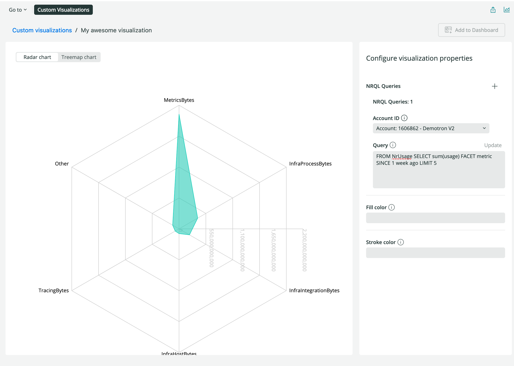
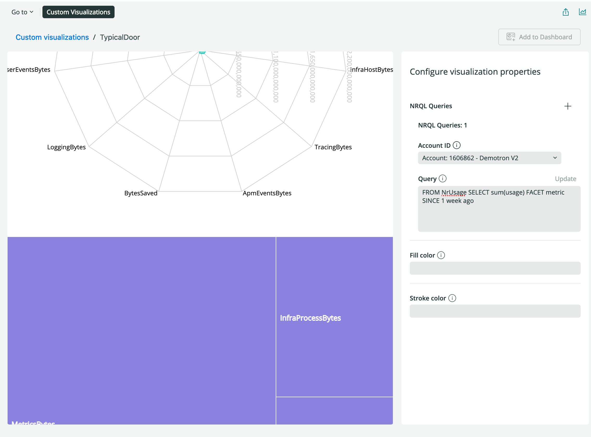
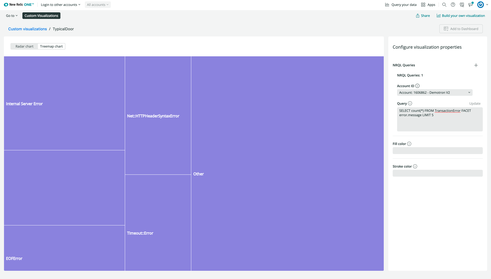

<Intro>

Now that you have a basic visualization, it's time to customize it! You can use all of the <Link to="explore-docs/intro-to-sdk">New Relic One SDK</Link> components in a Custom Visualization the same way you can use them in a Nerdlet. In this guide, you'll add a new chart type and a `SegmentedControl` component. You'll be able to dynamically swap between the Radar chart and the new chart right from the browser. 

This guide builds off the <Link to="/build-apps/build-visualization">Build a custom visualization for dashboards</Link> guide. 

</Intro>

## Before you begin

To get started, follow the <Link to="/build-apps/build-visualization">Build a custom visualization for dashboards</Link> guide to get set up with your <Link to="https://newrelic.com/signup?utm_source=developer-site">New Relic</Link> account, install the <Link to="/explore-docs/nr1-cli">New Relic One CLI</Link>, and create your first visualization. You'll use the visualization you create in that guide as a starting point for this guide.

## Set up the visualization component state

In this first set of steps you'll add component state to your visualization template from the previous guide referenced above. 

<Tutorial>

<Project>

```jsx fileName=visualizations/your-visualization/index.js
import React from 'react';
import PropTypes from 'prop-types';
import {
  Radar,
  RadarChart,
  PolarGrid,
  PolarAngleAxis,
  PolarRadiusAxis,
} from 'recharts';
import { 
  Card,
  CardBody,
  HeadingText,
  NrqlQuery,
  Spinner,
  AutoSizer
} from 'nr1';

export default class YourAwesomeVisualization extends React.Component {
  // Custom props you wish to be configurable in the UI must also be defined in
  // the nr1.json file for the visualization. See docs for more details.
  static propTypes = {
    /**
     * A fill color to override the default fill color. This is an example of
     * a custom chart configuration.
     */
    fill: PropTypes.string,

    /**
     * A stroke color to override the default stroke color. This is an example of
     * a custom chart configuration.
     */
    stroke: PropTypes.string,
    /**
     * An array of objects consisting of a nrql `query` and `accountId`.
     * This should be a standard prop for any NRQL based visualizations.
     */
    nrqlQueries: PropTypes.arrayOf(
      PropTypes.shape({
        accountId: PropTypes.number,
        query: PropTypes.string,
      })
    ),
  };

  state = {
    selectedChart: CHART_TYPES.Radar
  }

  /**
   * Restructure the data for a non-time-series, facet-based NRQL query into a
   * form accepted by the Recharts library's RadarChart.
   * (https://recharts.org/api/RadarChart).
   */
  transformData = (rawData) => {
    return rawData.map((entry) => ({
      name: entry.metadata.name,
      // Only grabbing the first data value because this is not time-series data.
      value: entry.data[0].y,
    }));
  };

  /**
   * Format the given axis tick's numeric value into a string for display.
   */
  formatTick = (value) => {
    return value.toLocaleString();
  };

  render() {
    const {nrqlQueries, stroke, fill} = this.props;

    const nrqlQueryPropsAvailable =
      nrqlQueries &&
      nrqlQueries[0] &&
      nrqlQueries[0].accountId &&
      nrqlQueries[0].query;

    if (!nrqlQueryPropsAvailable) {
      return <EmptyState />;
    }

    return (
      <AutoSizer>
        {({width, height}) => (
          <NrqlQuery
            query={nrqlQueries[0].query}
            accountId={parseInt(nrqlQueries[0].accountId)}
            pollInterval={NrqlQuery.AUTO_POLL_INTERVAL}
          >
            {({data, loading, error}) => {
              if (loading) {
                return <Spinner />;
              }

              if (error) {
                return <ErrorState />;
              }

              const transformedData = this.transformData(data);

              return (
                <RadarChart
                  width={width}
                  height={height}
                  data={transformedData}
                >
                  <PolarGrid />
                  <PolarAngleAxis dataKey="name" />
                  <PolarRadiusAxis tickFormatter={this.formatTick} />
                  <Radar
                    dataKey="value"
                    stroke={stroke || '#51C9B7'}
                    fill={fill || '#51C9B7'}
                    fillOpacity={0.6}
                  />
                </RadarChart>
              );
            }}
          </NrqlQuery>
        )}
      </AutoSizer>
    );
  }
}


const EmptyState = () => (
  <Card className="EmptyState">
    <CardBody className="EmptyState-cardBody">
      <HeadingText
        spacingType={[HeadingText.SPACING_TYPE.LARGE]}
        type={HeadingText.TYPE.HEADING_3}
      >
        Please provide at least one NRQL query & account ID pair
      </HeadingText>
      <HeadingText
        spacingType={[HeadingText.SPACING_TYPE.MEDIUM]}
        type={HeadingText.TYPE.HEADING_4}
      >
        An example NRQL query you can try is:
      </HeadingText>
      <code>FROM NrUsage SELECT sum(usage) FACET metric SINCE 1 week ago</code>
    </CardBody>
  </Card>
);
const ErrorState = () => (
  <Card className="ErrorState">
    <CardBody className="ErrorState-cardBody">
      <HeadingText
        className="ErrorState-headingText"
        spacingType={[HeadingText.SPACING_TYPE.LARGE]}
        type={HeadingText.TYPE.HEADING_3}
      >
        Oops! Something went wrong.
      </HeadingText>
    </CardBody>
  </Card>
);
```

</Project>

<Steps>

  <Step>

From the root of the Nerdpack project you created in the previous guide, navigate to `/visualizations/<your-visualization>/index.js`. You'll continue to work in the `index.js` file for the rest of this guide. 

Add a chart types constant above the first line of the class and add the component state property with an initial state for `selectedChart`:


```jsx fileName=visualizations/your-visualization/index.js
import React from 'react';
import PropTypes from 'prop-types';
import {
  Radar,
  RadarChart,
  PolarGrid,
  PolarAngleAxis,
  PolarRadiusAxis,
} from 'recharts';
import { 
  Card,
  CardBody,
  HeadingText,
  NrqlQuery,
  Spinner,
  AutoSizer
} from 'nr1';

const CHART_TYPES = {
  'Radar': 'radar',
  'Treemap': 'treemap'
}

export default class YourAwesomeVisualization extends React.Component {
  // Custom props you wish to be configurable in the UI must also be defined in
  // the nr1.json file for the visualization. See docs for more details.
  static propTypes = {
    /**
     * A fill color to override the default fill color. This is an example of
     * a custom chart configuration.
     */
    fill: PropTypes.string,

    /**
     * A stroke color to override the default stroke color. This is an example of
     * a custom chart configuration.
     */
    stroke: PropTypes.string,
    /**
     * An array of objects consisting of a nrql `query` and `accountId`.
     * This should be a standard prop for any NRQL based visualizations.
     */
    nrqlQueries: PropTypes.arrayOf(
      PropTypes.shape({
        accountId: PropTypes.number,
        query: PropTypes.string,
      })
    ),
  };

  state = {
    selectedChart: CHART_TYPES.Radar
  }

  /**
   * Restructure the data for a non-time-series, facet-based NRQL query into a
   * form accepted by the Recharts library's RadarChart.
   * (https://recharts.org/api/RadarChart).
   */
  transformData = (rawData) => {
    return rawData.map((entry) => ({
      name: entry.metadata.name,
      // Only grabbing the first data value because this is not time-series data.
      value: entry.data[0].y,
    }));
  };

  /**
   * Format the given axis tick's numeric value into a string for display.
   */
  formatTick = (value) => {
    return value.toLocaleString();
  };

  render() {
    const {nrqlQueries, stroke, fill} = this.props;

    const nrqlQueryPropsAvailable =
      nrqlQueries &&
      nrqlQueries[0] &&
      nrqlQueries[0].accountId &&
      nrqlQueries[0].query;

    if (!nrqlQueryPropsAvailable) {
      return <EmptyState />;
    }

    return (
      <AutoSizer>
        {({width, height}) => (
          <NrqlQuery
            query={nrqlQueries[0].query}
            accountId={parseInt(nrqlQueries[0].accountId)}
            pollInterval={NrqlQuery.AUTO_POLL_INTERVAL}
          >
            {({data, loading, error}) => {
              if (loading) {
                return <Spinner />;
              }

              if (error) {
                return <ErrorState />;
              }

              const transformedData = this.transformData(data);

              return (
                <RadarChart
                  width={width}
                  height={height}
                  data={transformedData}
                >
                  <PolarGrid />
                  <PolarAngleAxis dataKey="name" />
                  <PolarRadiusAxis tickFormatter={this.formatTick} />
                  <Radar
                    dataKey="value"
                    stroke={stroke || '#51C9B7'}
                    fill={fill || '#51C9B7'}
                    fillOpacity={0.6}
                  />
                </RadarChart>
              );
            }}
          </NrqlQuery>
        )}
      </AutoSizer>
    );
  }
}


const EmptyState = () => (
  <Card className="EmptyState">
    <CardBody className="EmptyState-cardBody">
      <HeadingText
        spacingType={[HeadingText.SPACING_TYPE.LARGE]}
        type={HeadingText.TYPE.HEADING_3}
      >
        Please provide at least one NRQL query & account ID pair
      </HeadingText>
      <HeadingText
        spacingType={[HeadingText.SPACING_TYPE.MEDIUM]}
        type={HeadingText.TYPE.HEADING_4}
      >
        An example NRQL query you can try is:
      </HeadingText>
      <code>FROM NrUsage SELECT sum(usage) FACET metric SINCE 1 week ago</code>
    </CardBody>
  </Card>
);
const ErrorState = () => (
  <Card className="ErrorState">
    <CardBody className="ErrorState-cardBody">
      <HeadingText
        className="ErrorState-headingText"
        spacingType={[HeadingText.SPACING_TYPE.LARGE]}
        type={HeadingText.TYPE.HEADING_3}
      >
        Oops! Something went wrong.
      </HeadingText>
    </CardBody>
  </Card>
);
```

  </Step>

</Steps>

## Add the `SegmentedControl` components

To let the consumers of your visualization decide what type of chart they want to display, you'll use `SegmentedControl` and `SegmentedControlItem`, which allow users to switch between a set of provided options. To learn more about the components available from New Relic, go to our <Link to="explore-docs/intro-to-sdk">Intro to New Relic One SDK</Link>.

<Steps>

  <Step>

Add `SegmentedControl` and `SegmentedControlItem` to the import from `nr1`. 

```js fileName=visualizations/your-visualization/index.js
import React from 'react';
import PropTypes from 'prop-types';
import {
  Radar,
  RadarChart,
  PolarGrid,
  PolarAngleAxis,
  PolarRadiusAxis,
} from 'recharts';
import { 
  Card,
  CardBody,
  HeadingText,
  NrqlQuery,
  SegmentedControl,
  SegmentedControlItem,
  Spinner,
  AutoSizer
} from 'nr1';

const CHART_TYPES = {
  'Radar': 'radar',
  'Treemap': 'treemap'
}

export default class YourAwesomeVisualization extends React.Component {
  // Custom props you wish to be configurable in the UI must also be defined in
  // the nr1.json file for the visualization. See docs for more details.
  static propTypes = {
    /**
     * A fill color to override the default fill color. This is an example of
     * a custom chart configuration.
     */
    fill: PropTypes.string,

    /**
     * A stroke color to override the default stroke color. This is an example of
     * a custom chart configuration.
     */
    stroke: PropTypes.string,
    /**
     * An array of objects consisting of a nrql `query` and `accountId`.
     * This should be a standard prop for any NRQL based visualizations.
     */
    nrqlQueries: PropTypes.arrayOf(
      PropTypes.shape({
        accountId: PropTypes.number,
        query: PropTypes.string,
      })
    ),
  };

  state = {
    selectedChart: CHART_TYPES.Radar
  }

  /**
   * Restructure the data for a non-time-series, facet-based NRQL query into a
   * form accepted by the Recharts library's RadarChart.
   * (https://recharts.org/api/RadarChart).
   */
  transformData = (rawData) => {
    return rawData.map((entry) => ({
      name: entry.metadata.name,
      // Only grabbing the first data value because this is not time-series data.
      value: entry.data[0].y,
    }));
  };

  /**
   * Format the given axis tick's numeric value into a string for display.
   */
  formatTick = (value) => {
    return value.toLocaleString();
  };

  render() {
    const {nrqlQueries, stroke, fill} = this.props;

    const nrqlQueryPropsAvailable =
      nrqlQueries &&
      nrqlQueries[0] &&
      nrqlQueries[0].accountId &&
      nrqlQueries[0].query;

    if (!nrqlQueryPropsAvailable) {
      return <EmptyState />;
    }

    return (
      <AutoSizer>
        {({width, height}) => (
          <NrqlQuery
            query={nrqlQueries[0].query}
            accountId={parseInt(nrqlQueries[0].accountId)}
            pollInterval={NrqlQuery.AUTO_POLL_INTERVAL}
          >
            {({data, loading, error}) => {
              if (loading) {
                return <Spinner />;
              }

              if (error) {
                return <ErrorState />;
              }

              const transformedData = this.transformData(data);

              return (
                <RadarChart
                  width={width}
                  height={height}
                  data={transformedData}
                >
                  <PolarGrid />
                  <PolarAngleAxis dataKey="name" />
                  <PolarRadiusAxis tickFormatter={this.formatTick} />
                  <Radar
                    dataKey="value"
                    stroke={stroke || '#51C9B7'}
                    fill={fill || '#51C9B7'}
                    fillOpacity={0.6}
                  />
                </RadarChart>
              );
            }}
          </NrqlQuery>
        )}
      </AutoSizer>
    );
  }
}


const EmptyState = () => (
  <Card className="EmptyState">
    <CardBody className="EmptyState-cardBody">
      <HeadingText
        spacingType={[HeadingText.SPACING_TYPE.LARGE]}
        type={HeadingText.TYPE.HEADING_3}
      >
        Please provide at least one NRQL query & account ID pair
      </HeadingText>
      <HeadingText
        spacingType={[HeadingText.SPACING_TYPE.MEDIUM]}
        type={HeadingText.TYPE.HEADING_4}
      >
        An example NRQL query you can try is:
      </HeadingText>
      <code>FROM NrUsage SELECT sum(usage) FACET metric SINCE 1 week ago</code>
    </CardBody>
  </Card>
);
const ErrorState = () => (
  <Card className="ErrorState">
    <CardBody className="ErrorState-cardBody">
      <HeadingText
        className="ErrorState-headingText"
        spacingType={[HeadingText.SPACING_TYPE.LARGE]}
        type={HeadingText.TYPE.HEADING_3}
      >
        Oops! Something went wrong.
      </HeadingText>
    </CardBody>
  </Card>
);
```

  </Step>

  <Step>

In the `render` function, wrap `RadarChart` in `<React.Fragment> ... </React.Fragment>`. Then add the `SegmentedControl` and `SegmentedControlItem` above the `RadarChart` and set the value and label:

```jsx fileName=visualizations/your-visualization/index.js
import React from 'react';
import PropTypes from 'prop-types';
import {
  Radar,
  RadarChart,
  PolarGrid,
  PolarAngleAxis,
  PolarRadiusAxis,
} from 'recharts';
import { 
  Card,
  CardBody,
  HeadingText,
  NrqlQuery,
  SegmentedControl,
  SegmentedControlItem,
  Spinner,
  AutoSizer
} from 'nr1';
const CHART_TYPES = {
  'Radar': 'radar',
  'Treemap': 'treemap'
}
export default class YourAwesomeVisualization extends React.Component {
  // Custom props you wish to be configurable in the UI must also be defined in
  // the nr1.json file for the visualization. See docs for more details.
  static propTypes = {
    /**
     * A fill color to override the default fill color. This is an example of
     * a custom chart configuration.
     */
    fill: PropTypes.string,
    /**
     * A stroke color to override the default stroke color. This is an example of
     * a custom chart configuration.
     */
    stroke: PropTypes.string,
    /**
     * An array of objects consisting of a nrql `query` and `accountId`.
     * This should be a standard prop for any NRQL based visualizations.
     */
    nrqlQueries: PropTypes.arrayOf(
      PropTypes.shape({
        accountId: PropTypes.number,
        query: PropTypes.string,
      })
    ),
  };
  state = {
    selectedChart: CHART_TYPES.Radar
  }
  /**
   * Restructure the data for a non-time-series, facet-based NRQL query into a
   * form accepted by the Recharts library's RadarChart.
   * (https://recharts.org/api/RadarChart).
   */
  transformData = (rawData) => {
    return rawData.map((entry) => ({
      name: entry.metadata.name,
      // Only grabbing the first data value because this is not time-series data.
      value: entry.data[0].y,
    }));
  };
  /**
   * Format the given axis tick's numeric value into a string for display.
   */
  formatTick = (value) => {
    return value.toLocaleString();
  };
  render() {
    const {nrqlQueries, stroke, fill} = this.props;
    const nrqlQueryPropsAvailable =
      nrqlQueries &&
      nrqlQueries[0] &&
      nrqlQueries[0].accountId &&
      nrqlQueries[0].query;
    if (!nrqlQueryPropsAvailable) {
      return <EmptyState />;
    }
    return (
      <AutoSizer>
        {({width, height}) => (
          <NrqlQuery
            query={nrqlQueries[0].query}
            accountId={parseInt(nrqlQueries[0].accountId)}
            pollInterval={NrqlQuery.AUTO_POLL_INTERVAL}
          >
            {({data, loading, error}) => {
              if (loading) {
                return <Spinner />;
              }
              if (error) {
                return <ErrorState />;
              }
              const transformedData = this.transformData(data);
              return (
                <React.Fragment>
                <SegmentedControl
                    onChange={(event, value) => console.log(value)}
                  >
                    <SegmentedControlItem
                      value={CHART_TYPES.Radar}
                      label="Radar chart"
                    />
                    <SegmentedControlItem
                      value={CHART_TYPES.Treemap}
                      label="Treemap chart"
                    />
                  </SegmentedControl>
                <RadarChart
                  width={width}
                  height={height}
                  data={transformedData}
                >
                  <PolarGrid />
                  <PolarAngleAxis dataKey="name" />
                  <PolarRadiusAxis tickFormatter={this.formatTick} />
                  <Radar
                    dataKey="value"
                    stroke={stroke || '#51C9B7'}
                    fill={fill || '#51C9B7'}
                    fillOpacity={0.6}
                  />
                </RadarChart>
                </React.Fragment>
              );
            }}
          </NrqlQuery>
        )}
      </AutoSizer>
    );
  }
}


const EmptyState = () => (
  <Card className="EmptyState">
    <CardBody className="EmptyState-cardBody">
      <HeadingText
        spacingType={[HeadingText.SPACING_TYPE.LARGE]}
        type={HeadingText.TYPE.HEADING_3}
      >
        Please provide at least one NRQL query & account ID pair
      </HeadingText>
      <HeadingText
        spacingType={[HeadingText.SPACING_TYPE.MEDIUM]}
        type={HeadingText.TYPE.HEADING_4}
      >
        An example NRQL query you can try is:
      </HeadingText>
      <code>FROM NrUsage SELECT sum(usage) FACET metric SINCE 1 week ago</code>
    </CardBody>
  </Card>
);
const ErrorState = () => (
  <Card className="ErrorState">
    <CardBody className="ErrorState-cardBody">
      <HeadingText
        className="ErrorState-headingText"
        spacingType={[HeadingText.SPACING_TYPE.LARGE]}
        type={HeadingText.TYPE.HEADING_3}
      >
        Oops! Something went wrong.
      </HeadingText>
    </CardBody>
  </Card>
);
```

  </Step>

If you <Link to="/build-apps/build-visualization#render-the-visualization-in-local-development">run your visualization locally</Link>, your visualization should match the following image and changing the SegmentedControl should not have any effect on the visualization. 



</Steps>

## Connect component state with the new UI controls

In the next steps, you're going to add a function to update state and connect that with the `SegmentedControl` component.

<Steps>

  <Step>

Add a component method that updates state to your visualization class.

```js fileName=visualizations/your-visualization/index.js 
import React from 'react';
import PropTypes from 'prop-types';
import {
  Radar,
  RadarChart,
  PolarGrid,
  PolarAngleAxis,
  PolarRadiusAxis,
} from 'recharts';
import { 
  Card,
  CardBody,
  HeadingText,
  NrqlQuery,
  SegmentedControl,
  SegmentedControlItem,
  Spinner,
  AutoSizer
} from 'nr1';
const CHART_TYPES = {
  'Radar': 'radar',
  'Treemap': 'treemap'
}
export default class YourAwesomeVisualization extends React.Component {
  // Custom props you wish to be configurable in the UI must also be defined in
  // the nr1.json file for the visualization. See docs for more details.
  static propTypes = {
    /**
     * A fill color to override the default fill color. This is an example of
     * a custom chart configuration.
     */
    fill: PropTypes.string,
    /**
     * A stroke color to override the default stroke color. This is an example of
     * a custom chart configuration.
     */
    stroke: PropTypes.string,
    /**
     * An array of objects consisting of a nrql `query` and `accountId`.
     * This should be a standard prop for any NRQL based visualizations.
     */
    nrqlQueries: PropTypes.arrayOf(
      PropTypes.shape({
        accountId: PropTypes.number,
        query: PropTypes.string,
      })
    ),
  };
  state = {
    selectedChart: CHART_TYPES.Radar
  }
  /**
   * Restructure the data for a non-time-series, facet-based NRQL query into a
   * form accepted by the Recharts library's RadarChart.
   * (https://recharts.org/api/RadarChart).
   */
  transformData = (rawData) => {
    return rawData.map((entry) => ({
      name: entry.metadata.name,
      // Only grabbing the first data value because this is not time-series data.
      value: entry.data[0].y,
    }));
  };
  /**
   * Format the given axis tick's numeric value into a string for display.
   */
  formatTick = (value) => {
    return value.toLocaleString();
  };

  updateSelectedChart = (evt, value) => {
    this.setState({ selectedChart: value })
  };

  render() {
    const {nrqlQueries, stroke, fill} = this.props;
    const nrqlQueryPropsAvailable =
      nrqlQueries &&
      nrqlQueries[0] &&
      nrqlQueries[0].accountId &&
      nrqlQueries[0].query;
    if (!nrqlQueryPropsAvailable) {
      return <EmptyState />;
    }
    return (
      <AutoSizer>
        {({width, height}) => (
          <NrqlQuery
            query={nrqlQueries[0].query}
            accountId={parseInt(nrqlQueries[0].accountId)}
            pollInterval={NrqlQuery.AUTO_POLL_INTERVAL}
          >
            {({data, loading, error}) => {
              if (loading) {
                return <Spinner />;
              }
              if (error) {
                return <ErrorState />;
              }
              const transformedData = this.transformData(data);
              return (
                <React.Fragment>
                <SegmentedControl
                    onChange={(event, value) => console.log(value)}
                  >
                    <SegmentedControlItem
                      value={CHART_TYPES.Radar}
                      label="Radar chart"
                    />
                    <SegmentedControlItem
                      value={CHART_TYPES.Treemap}
                      label="Treemap chart"
                    />
                  </SegmentedControl>
                <RadarChart
                  width={width}
                  height={height}
                  data={transformedData}
                >
                  <PolarGrid />
                  <PolarAngleAxis dataKey="name" />
                  <PolarRadiusAxis tickFormatter={this.formatTick} />
                  <Radar
                    dataKey="value"
                    stroke={stroke || '#51C9B7'}
                    fill={fill || '#51C9B7'}
                    fillOpacity={0.6}
                  />
                </RadarChart>
                </React.Fragment>
              );
            }}
          </NrqlQuery>
        )}
      </AutoSizer>
    );
  }
}


const EmptyState = () => (
  <Card className="EmptyState">
    <CardBody className="EmptyState-cardBody">
      <HeadingText
        spacingType={[HeadingText.SPACING_TYPE.LARGE]}
        type={HeadingText.TYPE.HEADING_3}
      >
        Please provide at least one NRQL query & account ID pair
      </HeadingText>
      <HeadingText
        spacingType={[HeadingText.SPACING_TYPE.MEDIUM]}
        type={HeadingText.TYPE.HEADING_4}
      >
        An example NRQL query you can try is:
      </HeadingText>
      <code>FROM NrUsage SELECT sum(usage) FACET metric SINCE 1 week ago</code>
    </CardBody>
  </Card>
);
const ErrorState = () => (
  <Card className="ErrorState">
    <CardBody className="ErrorState-cardBody">
      <HeadingText
        className="ErrorState-headingText"
        spacingType={[HeadingText.SPACING_TYPE.LARGE]}
        type={HeadingText.TYPE.HEADING_3}
      >
        Oops! Something went wrong.
      </HeadingText>
    </CardBody>
  </Card>
);
```

  </Step>

  <Step>

Pass `updateSelectedChart` as the `SegmentedControl` component's onChange prop:

```jsx fileName=visualizations/your-visualization/index.js 
import React from 'react';
import PropTypes from 'prop-types';
import {
  Radar,
  RadarChart,
  PolarGrid,
  PolarAngleAxis,
  PolarRadiusAxis,
} from 'recharts';
import { 
  Card,
  CardBody,
  HeadingText,
  NrqlQuery,
  SegmentedControl,
  SegmentedControlItem,
  Spinner,
  AutoSizer
} from 'nr1';
const CHART_TYPES = {
  'Radar': 'radar',
  'Treemap': 'treemap'
}
export default class YourAwesomeVisualization extends React.Component {
  // Custom props you wish to be configurable in the UI must also be defined in
  // the nr1.json file for the visualization. See docs for more details.
  static propTypes = {
    /**
     * A fill color to override the default fill color. This is an example of
     * a custom chart configuration.
     */
    fill: PropTypes.string,
    /**
     * A stroke color to override the default stroke color. This is an example of
     * a custom chart configuration.
     */
    stroke: PropTypes.string,
    /**
     * An array of objects consisting of a nrql `query` and `accountId`.
     * This should be a standard prop for any NRQL based visualizations.
     */
    nrqlQueries: PropTypes.arrayOf(
      PropTypes.shape({
        accountId: PropTypes.number,
        query: PropTypes.string,
      })
    ),
  };
  state = {
    selectedChart: CHART_TYPES.Radar
  }
  /**
   * Restructure the data for a non-time-series, facet-based NRQL query into a
   * form accepted by the Recharts library's RadarChart.
   * (https://recharts.org/api/RadarChart).
   */
  transformData = (rawData) => {
    return rawData.map((entry) => ({
      name: entry.metadata.name,
      // Only grabbing the first data value because this is not time-series data.
      value: entry.data[0].y,
    }));
  };
  /**
   * Format the given axis tick's numeric value into a string for display.
   */
  formatTick = (value) => {
    return value.toLocaleString();
  };

  updateSelectedChart = (evt, value) => {
    this.setState({ selectedChart: value })
  };

  render() {
    const {nrqlQueries, stroke, fill} = this.props;
    const nrqlQueryPropsAvailable =
      nrqlQueries &&
      nrqlQueries[0] &&
      nrqlQueries[0].accountId &&
      nrqlQueries[0].query;
    if (!nrqlQueryPropsAvailable) {
      return <EmptyState />;
    }
    return (
      <AutoSizer>
        {({width, height}) => (
          <NrqlQuery
            query={nrqlQueries[0].query}
            accountId={parseInt(nrqlQueries[0].accountId)}
            pollInterval={NrqlQuery.AUTO_POLL_INTERVAL}
          >
            {({data, loading, error}) => {
              if (loading) {
                return <Spinner />;
              }
              if (error) {
                return <ErrorState />;
              }
              const transformedData = this.transformData(data);
              return (
                <React.Fragment>
                <SegmentedControl onChange={this.updateSelectedChart}>
                    <SegmentedControlItem
                      value={CHART_TYPES.Radar}
                      label="Radar chart"
                    />
                    <SegmentedControlItem
                      value={CHART_TYPES.Treemap}
                      label="Treemap chart"
                    />
                  </SegmentedControl>
                <RadarChart
                  width={width}
                  height={height}
                  data={transformedData}
                >
                  <PolarGrid />
                  <PolarAngleAxis dataKey="name" />
                  <PolarRadiusAxis tickFormatter={this.formatTick} />
                  <Radar
                    dataKey="value"
                    stroke={stroke || '#51C9B7'}
                    fill={fill || '#51C9B7'}
                    fillOpacity={0.6}
                  />
                </RadarChart>
                </React.Fragment>
              );
            }}
          </NrqlQuery>
        )}
      </AutoSizer>
    );
  }
}


const EmptyState = () => (
  <Card className="EmptyState">
    <CardBody className="EmptyState-cardBody">
      <HeadingText
        spacingType={[HeadingText.SPACING_TYPE.LARGE]}
        type={HeadingText.TYPE.HEADING_3}
      >
        Please provide at least one NRQL query & account ID pair
      </HeadingText>
      <HeadingText
        spacingType={[HeadingText.SPACING_TYPE.MEDIUM]}
        type={HeadingText.TYPE.HEADING_4}
      >
        An example NRQL query you can try is:
      </HeadingText>
      <code>FROM NrUsage SELECT sum(usage) FACET metric SINCE 1 week ago</code>
    </CardBody>
  </Card>
);
const ErrorState = () => (
  <Card className="ErrorState">
    <CardBody className="ErrorState-cardBody">
      <HeadingText
        className="ErrorState-headingText"
        spacingType={[HeadingText.SPACING_TYPE.LARGE]}
        type={HeadingText.TYPE.HEADING_3}
      >
        Oops! Something went wrong.
      </HeadingText>
    </CardBody>
  </Card>
);
```

  </Step>

</Steps>


## Add your new chart option 

In the next couple of steps, you'll add the <Link to="https://recharts.org/en-US/api/Treemap">Treemap chart from Recharts</Link> and get the correct values passed into it.

<Callout variant="tip">
This guide uses <Link to="https://recharts.org">Recharts</Link> chart components but you can explore any other JavaScript charting libraries that are compatible with the current React version on the New Relic One Platform.
</Callout>

<Steps>

  <Step>

Add `Treemap` to the import from recharts:

```jsx fileName=visualizations/your-visualization/index.js 
import React from 'react';
import PropTypes from 'prop-types';
import {
  Radar,
  RadarChart,
  PolarGrid,
  PolarAngleAxis,
  PolarRadiusAxis,
  Treemap,
} from 'recharts';
import { 
  Card,
  CardBody,
  HeadingText,
  NrqlQuery,
  SegmentedControl,
  SegmentedControlItem,
  Spinner,
  AutoSizer
} from 'nr1';
const CHART_TYPES = {
  'Radar': 'radar',
  'Treemap': 'treemap'
}
export default class YourAwesomeVisualization extends React.Component {
  // Custom props you wish to be configurable in the UI must also be defined in
  // the nr1.json file for the visualization. See docs for more details.
  static propTypes = {
    /**
     * A fill color to override the default fill color. This is an example of
     * a custom chart configuration.
     */
    fill: PropTypes.string,
    /**
     * A stroke color to override the default stroke color. This is an example of
     * a custom chart configuration.
     */
    stroke: PropTypes.string,
    /**
     * An array of objects consisting of a nrql `query` and `accountId`.
     * This should be a standard prop for any NRQL based visualizations.
     */
    nrqlQueries: PropTypes.arrayOf(
      PropTypes.shape({
        accountId: PropTypes.number,
        query: PropTypes.string,
      })
    ),
  };
  state = {
    selectedChart: CHART_TYPES.Radar
  }
  /**
   * Restructure the data for a non-time-series, facet-based NRQL query into a
   * form accepted by the Recharts library's RadarChart.
   * (https://recharts.org/api/RadarChart).
   */
  transformData = (rawData) => {
    return rawData.map((entry) => ({
      name: entry.metadata.name,
      // Only grabbing the first data value because this is not time-series data.
      value: entry.data[0].y,
    }));
  };
  /**
   * Format the given axis tick's numeric value into a string for display.
   */
  formatTick = (value) => {
    return value.toLocaleString();
  };

  updateSelectedChart = (evt, value) => {
    this.setState({ selectedChart: value })
  };

  render() {
    const {nrqlQueries, stroke, fill} = this.props;
    const nrqlQueryPropsAvailable =
      nrqlQueries &&
      nrqlQueries[0] &&
      nrqlQueries[0].accountId &&
      nrqlQueries[0].query;
    if (!nrqlQueryPropsAvailable) {
      return <EmptyState />;
    }
    return (
      <AutoSizer>
        {({width, height}) => (
          <NrqlQuery
            query={nrqlQueries[0].query}
            accountId={parseInt(nrqlQueries[0].accountId)}
            pollInterval={NrqlQuery.AUTO_POLL_INTERVAL}
          >
            {({data, loading, error}) => {
              if (loading) {
                return <Spinner />;
              }
              if (error) {
                return <ErrorState />;
              }
              const transformedData = this.transformData(data);
              return (
                <React.Fragment>
                <SegmentedControl onChange={this.updateSelectedChart}>
                    <SegmentedControlItem
                      value={CHART_TYPES.Radar}
                      label="Radar chart"
                    />
                    <SegmentedControlItem
                      value={CHART_TYPES.Treemap}
                      label="Treemap chart"
                    />
                  </SegmentedControl>
                <RadarChart
                  width={width}
                  height={height}
                  data={transformedData}
                >
                  <PolarGrid />
                  <PolarAngleAxis dataKey="name" />
                  <PolarRadiusAxis tickFormatter={this.formatTick} />
                  <Radar
                    dataKey="value"
                    stroke={stroke || '#51C9B7'}
                    fill={fill || '#51C9B7'}
                    fillOpacity={0.6}
                  />
                </RadarChart>
                </React.Fragment>
              );
            }}
          </NrqlQuery>
        )}
      </AutoSizer>
    );
  }
}


const EmptyState = () => (
  <Card className="EmptyState">
    <CardBody className="EmptyState-cardBody">
      <HeadingText
        spacingType={[HeadingText.SPACING_TYPE.LARGE]}
        type={HeadingText.TYPE.HEADING_3}
      >
        Please provide at least one NRQL query & account ID pair
      </HeadingText>
      <HeadingText
        spacingType={[HeadingText.SPACING_TYPE.MEDIUM]}
        type={HeadingText.TYPE.HEADING_4}
      >
        An example NRQL query you can try is:
      </HeadingText>
      <code>FROM NrUsage SELECT sum(usage) FACET metric SINCE 1 week ago</code>
    </CardBody>
  </Card>
);
const ErrorState = () => (
  <Card className="ErrorState">
    <CardBody className="ErrorState-cardBody">
      <HeadingText
        className="ErrorState-headingText"
        spacingType={[HeadingText.SPACING_TYPE.LARGE]}
        type={HeadingText.TYPE.HEADING_3}
      >
        Oops! Something went wrong.
      </HeadingText>
    </CardBody>
  </Card>
);
```

<Callout variant="tip" title="Further reading">
To learn more about the Treemap chart component, go to the <Link to="https://recharts.org/en-US/examples/SimpleTreemap">Recharts Treemap example</Link> or the <Link to="https://recharts.org/en-US/api/Treemap">Recharts Treemap API docs</Link>.
</Callout>
    
  </Step>


  <Step>

Under the `RadarChart` closing tag in render, add the `Treemap` component and the necessary props:

```jsx fileName=visualizations/your-visualization/index.js 
import React from 'react';
import PropTypes from 'prop-types';
import {
  Radar,
  RadarChart,
  PolarGrid,
  PolarAngleAxis,
  PolarRadiusAxis,
} from 'recharts';
import { 
  Card,
  CardBody,
  HeadingText,
  NrqlQuery,
  SegmentedControl,
  SegmentedControlItem,
  Spinner,
  AutoSizer
} from 'nr1';
const CHART_TYPES = {
  'Radar': 'radar',
  'Treemap': 'treemap'
}
export default class YourAwesomeVisualization extends React.Component {
  // Custom props you wish to be configurable in the UI must also be defined in
  // the nr1.json file for the visualization. See docs for more details.
  static propTypes = {
    /**
     * A fill color to override the default fill color. This is an example of
     * a custom chart configuration.
     */
    fill: PropTypes.string,
    /**
     * A stroke color to override the default stroke color. This is an example of
     * a custom chart configuration.
     */
    stroke: PropTypes.string,
    /**
     * An array of objects consisting of a nrql `query` and `accountId`.
     * This should be a standard prop for any NRQL based visualizations.
     */
    nrqlQueries: PropTypes.arrayOf(
      PropTypes.shape({
        accountId: PropTypes.number,
        query: PropTypes.string,
      })
    ),
  };
  state = {
    selectedChart: CHART_TYPES.Radar
  }
  /**
   * Restructure the data for a non-time-series, facet-based NRQL query into a
   * form accepted by the Recharts library's RadarChart.
   * (https://recharts.org/api/RadarChart).
   */
  transformData = (rawData) => {
    return rawData.map((entry) => ({
      name: entry.metadata.name,
      // Only grabbing the first data value because this is not time-series data.
      value: entry.data[0].y,
    }));
  };
  /**
   * Format the given axis tick's numeric value into a string for display.
   */
  formatTick = (value) => {
    return value.toLocaleString();
  };

  updateSelectedChart = (evt, value) => {
    this.setState({ selectedChart: value })
  };

  render() {
    const {nrqlQueries, stroke, fill} = this.props;
    const nrqlQueryPropsAvailable =
      nrqlQueries &&
      nrqlQueries[0] &&
      nrqlQueries[0].accountId &&
      nrqlQueries[0].query;
    if (!nrqlQueryPropsAvailable) {
      return <EmptyState />;
    }
    return (
      <AutoSizer>
        {({width, height}) => (
          <NrqlQuery
            query={nrqlQueries[0].query}
            accountId={parseInt(nrqlQueries[0].accountId)}
            pollInterval={NrqlQuery.AUTO_POLL_INTERVAL}
          >
            {({data, loading, error}) => {
              if (loading) {
                return <Spinner />;
              }
              if (error) {
                return <ErrorState />;
              }
              const transformedData = this.transformData(data);
              return (
                <React.Fragment>
                <SegmentedControl onChange={this.updateSelectedChart}>
                    <SegmentedControlItem
                      value={CHART_TYPES.Radar}
                      label="Radar chart"
                    />
                    <SegmentedControlItem
                      value={CHART_TYPES.Treemap}
                      label="Treemap chart"
                    />
                  </SegmentedControl>
                <RadarChart
                  width={width}
                  height={height}
                  data={transformedData}
                >
                  <PolarGrid />
                  <PolarAngleAxis dataKey="name" />
                  <PolarRadiusAxis tickFormatter={this.formatTick} />
                  <Radar
                    dataKey="value"
                    stroke={stroke || '#51C9B7'}
                    fill={fill || '#51C9B7'}
                    fillOpacity={0.6}
                  />
                </RadarChart>
                <Treemap
                  width={width}
                  height={height}
                  data={transformedData}
                  dataKey="value"
                  ratio={4 / 3}
                  stroke="#fff"
                  fill="#8884d8"
                />
                </React.Fragment>
              );
            }}
          </NrqlQuery>
        )}
      </AutoSizer>
    );
  }
}


const EmptyState = () => (
  <Card className="EmptyState">
    <CardBody className="EmptyState-cardBody">
      <HeadingText
        spacingType={[HeadingText.SPACING_TYPE.LARGE]}
        type={HeadingText.TYPE.HEADING_3}
      >
        Please provide at least one NRQL query & account ID pair
      </HeadingText>
      <HeadingText
        spacingType={[HeadingText.SPACING_TYPE.MEDIUM]}
        type={HeadingText.TYPE.HEADING_4}
      >
        An example NRQL query you can try is:
      </HeadingText>
      <code>FROM NrUsage SELECT sum(usage) FACET metric SINCE 1 week ago</code>
    </CardBody>
  </Card>
);
const ErrorState = () => (
  <Card className="ErrorState">
    <CardBody className="ErrorState-cardBody">
      <HeadingText
        className="ErrorState-headingText"
        spacingType={[HeadingText.SPACING_TYPE.LARGE]}
        type={HeadingText.TYPE.HEADING_3}
      >
        Oops! Something went wrong.
      </HeadingText>
    </CardBody>
  </Card>
);
```

Now <Link to="/build-apps/build-visualization#render-the-visualization-in-local-development">render the visualization in local development</Link> to see the new Treemap chart below your Radar chart. If you scroll down a bit in your visualization, it should look something like the following: 



  </Step>

</Steps>


## Use component state to switch between charts 

In the final steps, you'll use the `selectedChart` state value to determine which chart to show, the Radar chart or the Treemap chart.

<Steps>

  <Step>

Destructure `selectedChart` from state near the top of the `render()` function:

```jsx fileName=visualizations/your-visualization/index.js 
import React from 'react';
import PropTypes from 'prop-types';
import {
  Radar,
  RadarChart,
  PolarGrid,
  PolarAngleAxis,
  PolarRadiusAxis,
} from 'recharts';
import { 
  Card,
  CardBody,
  HeadingText,
  NrqlQuery,
  SegmentedControl,
  SegmentedControlItem,
  Spinner,
  AutoSizer
} from 'nr1';
const CHART_TYPES = {
  'Radar': 'radar',
  'Treemap': 'treemap'
}
export default class YourAwesomeVisualization extends React.Component {
  // Custom props you wish to be configurable in the UI must also be defined in
  // the nr1.json file for the visualization. See docs for more details.
  static propTypes = {
    /**
     * A fill color to override the default fill color. This is an example of
     * a custom chart configuration.
     */
    fill: PropTypes.string,
    /**
     * A stroke color to override the default stroke color. This is an example of
     * a custom chart configuration.
     */
    stroke: PropTypes.string,
    /**
     * An array of objects consisting of a nrql `query` and `accountId`.
     * This should be a standard prop for any NRQL based visualizations.
     */
    nrqlQueries: PropTypes.arrayOf(
      PropTypes.shape({
        accountId: PropTypes.number,
        query: PropTypes.string,
      })
    ),
  };
  state = {
    selectedChart: CHART_TYPES.Radar
  }
  /**
   * Restructure the data for a non-time-series, facet-based NRQL query into a
   * form accepted by the Recharts library's RadarChart.
   * (https://recharts.org/api/RadarChart).
   */
  transformData = (rawData) => {
    return rawData.map((entry) => ({
      name: entry.metadata.name,
      // Only grabbing the first data value because this is not time-series data.
      value: entry.data[0].y,
    }));
  };
  /**
   * Format the given axis tick's numeric value into a string for display.
   */
  formatTick = (value) => {
    return value.toLocaleString();
  };

  updateSelectedChart = (evt, value) => {
    this.setState({ selectedChart: value })
  };

  render() {
    const {nrqlQueries, stroke, fill} = this.props;
    const { selectedChart } = this.state;
    const nrqlQueryPropsAvailable =
      nrqlQueries &&
      nrqlQueries[0] &&
      nrqlQueries[0].accountId &&
      nrqlQueries[0].query;
    if (!nrqlQueryPropsAvailable) {
      return <EmptyState />;
    }
    return (
      <AutoSizer>
        {({width, height}) => (
          <NrqlQuery
            query={nrqlQueries[0].query}
            accountId={parseInt(nrqlQueries[0].accountId)}
            pollInterval={NrqlQuery.AUTO_POLL_INTERVAL}
          >
            {({data, loading, error}) => {
              if (loading) {
                return <Spinner />;
              }
              if (error) {
                return <ErrorState />;
              }
              const transformedData = this.transformData(data);
              return (
                <React.Fragment>
                <SegmentedControl onChange={this.updateSelectedChart}>
                    <SegmentedControlItem
                      value={CHART_TYPES.Radar}
                      label="Radar chart"
                    />
                    <SegmentedControlItem
                      value={CHART_TYPES.Treemap}
                      label="Treemap chart"
                    />
                  </SegmentedControl>
                <RadarChart
                  width={width}
                  height={height}
                  data={transformedData}
                >
                  <PolarGrid />
                  <PolarAngleAxis dataKey="name" />
                  <PolarRadiusAxis tickFormatter={this.formatTick} />
                  <Radar
                    dataKey="value"
                    stroke={stroke || '#51C9B7'}
                    fill={fill || '#51C9B7'}
                    fillOpacity={0.6}
                  />
                </RadarChart>
                <Treemap
                  width={width}
                  height={height}
                  data={transformedData}
                  dataKey="value"
                  ratio={4 / 3}
                  stroke="#fff"
                  fill="#8884d8"
                />
                </React.Fragment>
              );
            }}
          </NrqlQuery>
        )}
      </AutoSizer>
    );
  }
}


const EmptyState = () => (
  <Card className="EmptyState">
    <CardBody className="EmptyState-cardBody">
      <HeadingText
        spacingType={[HeadingText.SPACING_TYPE.LARGE]}
        type={HeadingText.TYPE.HEADING_3}
      >
        Please provide at least one NRQL query & account ID pair
      </HeadingText>
      <HeadingText
        spacingType={[HeadingText.SPACING_TYPE.MEDIUM]}
        type={HeadingText.TYPE.HEADING_4}
      >
        An example NRQL query you can try is:
      </HeadingText>
      <code>FROM NrUsage SELECT sum(usage) FACET metric SINCE 1 week ago</code>
    </CardBody>
  </Card>
);
const ErrorState = () => (
  <Card className="ErrorState">
    <CardBody className="ErrorState-cardBody">
      <HeadingText
        className="ErrorState-headingText"
        spacingType={[HeadingText.SPACING_TYPE.LARGE]}
        type={HeadingText.TYPE.HEADING_3}
      >
        Oops! Something went wrong.
      </HeadingText>
    </CardBody>
  </Card>
);
```

  </Step>

  <Step>

Here, you compare `selectedChart` to `CHART_TYPES.Radar`. If `selectedChart` is a Radar, you render a RadarChart. Otherwise, you render a Treemap. You can achieve this by wrapping the `RadarChart` and `Treemap` in a ternary using the `selectedChart` state:

```jsx fileName=visualizations/your-visualization/index.js 
import React from 'react';
import PropTypes from 'prop-types';
import {
  Radar,
  RadarChart,
  PolarGrid,
  PolarAngleAxis,
  PolarRadiusAxis,
} from 'recharts';
import { 
  Card,
  CardBody,
  HeadingText,
  NrqlQuery,
  SegmentedControl,
  SegmentedControlItem,
  Spinner,
  AutoSizer
} from 'nr1';
const CHART_TYPES = {
  'Radar': 'radar',
  'Treemap': 'treemap'
}
export default class YourAwesomeVisualization extends React.Component {
  // Custom props you wish to be configurable in the UI must also be defined in
  // the nr1.json file for the visualization. See docs for more details.
  static propTypes = {
    /**
     * A fill color to override the default fill color. This is an example of
     * a custom chart configuration.
     */
    fill: PropTypes.string,
    /**
     * A stroke color to override the default stroke color. This is an example of
     * a custom chart configuration.
     */
    stroke: PropTypes.string,
    /**
     * An array of objects consisting of a nrql `query` and `accountId`.
     * This should be a standard prop for any NRQL based visualizations.
     */
    nrqlQueries: PropTypes.arrayOf(
      PropTypes.shape({
        accountId: PropTypes.number,
        query: PropTypes.string,
      })
    ),
  };
  state = {
    selectedChart: CHART_TYPES.Radar
  }
  /**
   * Restructure the data for a non-time-series, facet-based NRQL query into a
   * form accepted by the Recharts library's RadarChart.
   * (https://recharts.org/api/RadarChart).
   */
  transformData = (rawData) => {
    return rawData.map((entry) => ({
      name: entry.metadata.name,
      // Only grabbing the first data value because this is not time-series data.
      value: entry.data[0].y,
    }));
  };
  /**
   * Format the given axis tick's numeric value into a string for display.
   */
  formatTick = (value) => {
    return value.toLocaleString();
  };

  updateSelectedChart = (evt, value) => {
    this.setState({ selectedChart: value })
  };

  render() {
    const {nrqlQueries, stroke, fill} = this.props;
    const { selectedChart } = this.state;
    const nrqlQueryPropsAvailable =
      nrqlQueries &&
      nrqlQueries[0] &&
      nrqlQueries[0].accountId &&
      nrqlQueries[0].query;
    if (!nrqlQueryPropsAvailable) {
      return <EmptyState />;
    }
    return (
      <AutoSizer>
        {({width, height}) => (
          <NrqlQuery
            query={nrqlQueries[0].query}
            accountId={parseInt(nrqlQueries[0].accountId)}
            pollInterval={NrqlQuery.AUTO_POLL_INTERVAL}
          >
            {({data, loading, error}) => {
              if (loading) {
                return <Spinner />;
              }
              if (error) {
                return <ErrorState />;
              }
              const transformedData = this.transformData(data);
              return (
                <React.Fragment>
                <SegmentedControl onChange={this.updateSelectedChart}>
                    <SegmentedControlItem
                      value={CHART_TYPES.Radar}
                      label="Radar chart"
                    />
                    <SegmentedControlItem
                      value={CHART_TYPES.Treemap}
                      label="Treemap chart"
                    />
                  </SegmentedControl>
                {
                  selectedChart === CHART_TYPES.Radar ?
                (<RadarChart
                  width={width}
                  height={height}
                  data={transformedData}
                >
                  <PolarGrid />
                  <PolarAngleAxis dataKey="name" />
                  <PolarRadiusAxis tickFormatter={this.formatTick} />
                  <Radar
                    dataKey="value"
                    stroke={stroke || '#51C9B7'}
                    fill={fill || '#51C9B7'}
                    fillOpacity={0.6}
                  />
                </RadarChart>)
                :
                (<Treemap
                  width={width}
                  height={height}
                  data={transformedData}
                  dataKey="value"
                  ratio={4 / 3}
                  stroke="#fff"
                  fill="#8884d8"
                />)}
                </React.Fragment>
              );
            }}
          </NrqlQuery>
        )}
      </AutoSizer>
    );
  }
}


const EmptyState = () => (
  <Card className="EmptyState">
    <CardBody className="EmptyState-cardBody">
      <HeadingText
        spacingType={[HeadingText.SPACING_TYPE.LARGE]}
        type={HeadingText.TYPE.HEADING_3}
      >
        Please provide at least one NRQL query & account ID pair
      </HeadingText>
      <HeadingText
        spacingType={[HeadingText.SPACING_TYPE.MEDIUM]}
        type={HeadingText.TYPE.HEADING_4}
      >
        An example NRQL query you can try is:
      </HeadingText>
      <code>FROM NrUsage SELECT sum(usage) FACET metric SINCE 1 week ago</code>
    </CardBody>
  </Card>
);
const ErrorState = () => (
  <Card className="ErrorState">
    <CardBody className="ErrorState-cardBody">
      <HeadingText
        className="ErrorState-headingText"
        spacingType={[HeadingText.SPACING_TYPE.LARGE]}
        type={HeadingText.TYPE.HEADING_3}
      >
        Oops! Something went wrong.
      </HeadingText>
    </CardBody>
  </Card>
);
```

  </Step>

Go to the browser and try it out! <Link to="/build-apps/build-visualization#render-the-visualization-in-local-development">Run your visualization locally</Link> and view it in the Custom Visualization app in New Relic. Click on "Treemap chart" in the SegmentedControl. You should see your Treemap chart render instead of the Radar chart! 


<p style="text-align: center">Radar chart selected </p>



<p style="text-align: center">Treemap chart selected </p>

</Steps>

</Tutorial>


## Summary

Congratulations on completing the steps in this example! You've learned how to:

- Customize your visualization using New Relic One SDK components
- Add a new chart type to your visualization
- Create a user interaction in your visualization

## Additional resources

- New Relic Quick Tips video: [Dashboards and Custom Visualizations](https://www.youtube.com/watch?v=_F61mxtKfGA) (6 minutes)
- New Relic NerdBytes video: [Configuring custom visualizations for dashboards](https://www.youtube.com/watch?v=sFpG_iG7Xa8) (7 minutes)
- New Relic Nerdlog live stream: [Custom Data Visualizations on New Relic](https://www.youtube.com/watch?v=HuR0EdHGz24) (30 minutes)
- New Relic One SDK components: <Link to="explore-docs/intro-to-sdk">Intro to New Relic One SDK Component library</Link>
