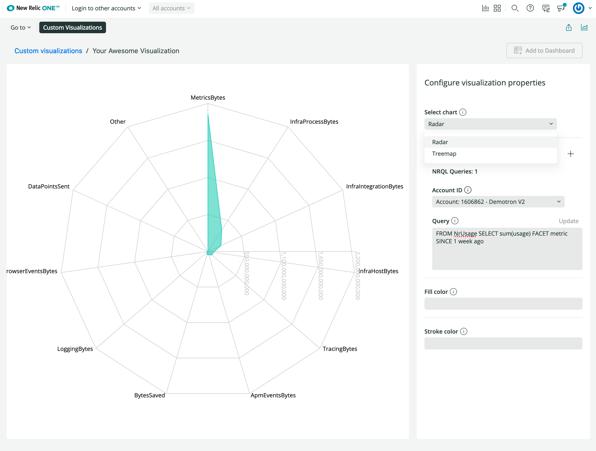

<Intro>

This guide builds off of the previous <Link to="/build-apps/custom-visualizations-and-the-new-relic-one-sdk">Custom visualizations and the New Relic One SDK</Link> guide. If you haven't followed that guide, please start there as this guide assumes you have the code you built there to get started.

Following the previous guide, your current visualization should be able to switch between two charts types. Your current implementation takes up some space in the visualization but offers your users the choice to switch between two chart types at any point in the visualization lifecycle. What if you only need to be able to select an option once, when adding it to the dashboard? In that case, you can use the `configuration` key in your visualization's nr1.json file. In the following steps, you'll replace the `SegmentedControl` component with an option in the `configuration` array.

</Intro>

<Tutorial>

<Project>

```jsx fileName=visualizations/your-visualization/index.js
import React from 'react';
import PropTypes from 'prop-types';
import {
  Radar,
  RadarChart,
  PolarGrid,
  PolarAngleAxis,
  PolarRadiusAxis,
  Treemap,
} from 'recharts';
import {
  Card,
  CardBody,
  HeadingText,
  NrqlQuery,
  SegmentedControl,
  SegmentedControlItem,
  Spinner,
  AutoSizer
} from 'nr1';
const CHART_TYPES = {
  'Radar': 'radar',
  'Treemap': 'treemap'
}
export default class YourAwesomeVisualization extends React.Component {
  // Custom props you wish to be configurable in the UI must also be defined in
  // the nr1.json file for the visualization. See docs for more details.
  static propTypes = {
    /**
     * A fill color to override the default fill color. This is an example of
     * a custom chart configuration.
     */
    fill: PropTypes.string,
    /**
     * A stroke color to override the default stroke color. This is an example of
     * a custom chart configuration.
     */
    stroke: PropTypes.string,
    /**
     * An array of objects consisting of a nrql `query` and `accountId`.
     * This should be a standard prop for any NRQL based visualizations.
     */
    nrqlQueries: PropTypes.arrayOf(
      PropTypes.shape({
        accountId: PropTypes.number,
        query: PropTypes.string,
      })
    ),
    /**
    * A chart type configuration to switch between "Radar" and "Treemap" chart types
    */
    selectedChart: PropTypes.string
  };
  state = {
    selectedChart: CHART_TYPES.Radar
  }
  /**
   * Restructure the data for a non-time-series, facet-based NRQL query into a
   * form accepted by the Recharts library's RadarChart.
   * (https://recharts.org/api/RadarChart).
   */
  transformData = (rawData) => {
    return rawData.map((entry) => ({
      name: entry.metadata.name,
      // Only grabbing the first data value because this is not time-series data.
      value: entry.data[0].y,
    }));
  };
  /**
   * Format the given axis tick's numeric value into a string for display.
   */
  formatTick = (value) => {
    return value.toLocaleString();
  };

  updateSelectedChart = (evt, value) => {
    this.setState({ selectedChart: value })
  };

  render() {
    const {nrqlQueries, stroke, fill} = this.props;
    const { selectedChart } = this.state;
    const nrqlQueryPropsAvailable =
      nrqlQueries &&
      nrqlQueries[0] &&
      nrqlQueries[0].accountId &&
      nrqlQueries[0].query;
    if (!nrqlQueryPropsAvailable) {
      return <EmptyState />;
    }
    return (
      <AutoSizer>
        {({width, height}) => (
          <NrqlQuery
            query={nrqlQueries[0].query}
            accountId={parseInt(nrqlQueries[0].accountId)}
            pollInterval={NrqlQuery.AUTO_POLL_INTERVAL}
          >
            {({data, loading, error}) => {
              if (loading) {
                return <Spinner />;
              }
              if (error) {
                return <ErrorState />;
              }
              const transformedData = this.transformData(data);
              return (
                <React.Fragment>
                <SegmentedControl onChange={this.updateSelectedChart}>
                    <SegmentedControlItem
                      value={CHART_TYPES.Radar}
                      label="Radar chart"
                    />
                    <SegmentedControlItem
                      value={CHART_TYPES.Treemap}
                      label="Treemap chart"
                    />
                  </SegmentedControl>
                {
                  selectedChart === CHART_TYPES.Radar ?
                (<RadarChart
                  width={width}
                  height={height}
                  data={transformedData}
                >
                  <PolarGrid />
                  <PolarAngleAxis dataKey="name" />
                  <PolarRadiusAxis tickFormatter={this.formatTick} />
                  <Radar
                    dataKey="value"
                    stroke={stroke || '#51C9B7'}
                    fill={fill || '#51C9B7'}
                    fillOpacity={0.6}
                  />
                </RadarChart>)
                :
                (<Treemap
                  width={width}
                  height={height}
                  data={transformedData}
                  dataKey="value"
                  ratio={4 / 3}
                  stroke="#fff"
                  fill="#8884d8"
                />)}
                </React.Fragment>
              );
            }}
          </NrqlQuery>
        )}
      </AutoSizer>
    );
  }
}


const EmptyState = () => (
  <Card className="EmptyState">
    <CardBody className="EmptyState-cardBody">
      <HeadingText
        spacingType={[HeadingText.SPACING_TYPE.LARGE]}
        type={HeadingText.TYPE.HEADING_3}
      >
        Please provide at least one NRQL query & account ID pair
      </HeadingText>
      <HeadingText
        spacingType={[HeadingText.SPACING_TYPE.MEDIUM]}
        type={HeadingText.TYPE.HEADING_4}
      >
        An example NRQL query you can try is:
      </HeadingText>
      <code>FROM NrUsage SELECT sum(usage) FACET metric SINCE 1 week ago</code>
    </CardBody>
  </Card>
);
const ErrorState = () => (
  <Card className="ErrorState">
    <CardBody className="ErrorState-cardBody">
      <HeadingText
        className="ErrorState-headingText"
        spacingType={[HeadingText.SPACING_TYPE.LARGE]}
        type={HeadingText.TYPE.HEADING_3}
      >
        Oops! Something went wrong.
      </HeadingText>
    </CardBody>
  </Card>
);
```

```json fileName=visualizations/your-visualization/nr1.json lineHighlight=7-22 lineNumbers=true
{
  "schemaType": "VISUALIZATION",
  "id": "your-awesome-visualization",
  "displayName": "Your Awesome Visualization",
  "description": "",
  "configuration": [
    {
      "name": "nrqlQueries",
      "title": "NRQL Queries",
      "type": "collection",
      "items": [
        {
          "name": "accountId",
          "title": "Account ID",
          "description": "Account ID to be associated with the query",
          "type": "number"
        },
        {
          "name": "query",
          "title": "Query",
          "description": "NRQL query for visualization",
          "type": "nrql"
        }
      ]
    },
    {
      "name": "fill",
      "title": "Fill color",
      "description": "A fill color to override the default fill color",
      "type": "string"
    },
    {
      "name": "stroke",
      "title": "Stroke color",
      "description": "A stroke color to override the default stroke color",
      "type": "string"
    }
  ]
}
```

</Project>

## Before you begin

To get started, make sure you follow the <Link to="/build-apps/custom-visualizations-and-the-new-relic-one-sdk">Custom visualizations and the New Relic One SDK</Link> guide. You should have that code as your starting point for this guide.

## Replace the SegmentedControl with configuration

<Steps>

  <Step>

In you visualization's root folder, open the `nr1.json` file. Add an `enum` configuration object for `selectedChart`:

```json fileName=visualizations/your-visualization/nr1.json
{
  "schemaType": "VISUALIZATION",
  "id": "your-awesome-visualization",
  "displayName": "Your Awesome Visualization",
  "description": "",
  "configuration": [
    {
      "name": "selectedChart",
      "title": "Select chart",
      "description": "Select which chart to display",
      "type": "enum",
      "items": [
        {
          "title": "Radar",
          "value": "radar"
        },
        {
          "title": "Treemap",
          "value": "treemap"
        }
      ]
    },
    {
      "name": "nrqlQueries",
      "title": "NRQL Queries",
      "type": "collection",
      "items": [
        {
          "name": "accountId",
          "title": "Account ID",
          "description": "Account ID to be associated with the query",
          "type": "number"
        },
        {
          "name": "query",
          "title": "Query",
          "description": "NRQL query for visualization",
          "type": "nrql"
        }
      ]
    },
    {
      "name": "fill",
      "title": "Fill color",
      "description": "A fill color to override the default fill color",
      "type": "string"
    },
    {
      "name": "stroke",
      "title": "Stroke color",
      "description": "A stroke color to override the default stroke color",
      "type": "string"
    }
  ]
}
```

This should look familiar to the component state options you added in the previous guide.

  </Step>

  <Step>

In your visualization's root folder, open `index.js`. You'll be working in this file for the rest of the guide:

```jsx fileName=visualizations/your-visualization/index.js
import React from 'react';
import PropTypes from 'prop-types';
import {
  Radar,
  RadarChart,
  PolarGrid,
  PolarAngleAxis,
  PolarRadiusAxis,
  Treemap,
} from 'recharts';
import {
  Card,
  CardBody,
  HeadingText,
  NrqlQuery,
  SegmentedControl,
  SegmentedControlItem,
  Spinner,
  AutoSizer
} from 'nr1';
const CHART_TYPES = {
  'Radar': 'radar',
  'Treemap': 'treemap'
}
export default class YourAwesomeVisualization extends React.Component {
  // Custom props you wish to be configurable in the UI must also be defined in
  // the nr1.json file for the visualization. See docs for more details.
  static propTypes = {
    /**
     * A fill color to override the default fill color. This is an example of
     * a custom chart configuration.
     */
    fill: PropTypes.string,
    /**
     * A stroke color to override the default stroke color. This is an example of
     * a custom chart configuration.
     */
    stroke: PropTypes.string,
    /**
     * An array of objects consisting of a nrql `query` and `accountId`.
     * This should be a standard prop for any NRQL based visualizations.
     */
    nrqlQueries: PropTypes.arrayOf(
      PropTypes.shape({
        accountId: PropTypes.number,
        query: PropTypes.string,
      })
    ),
    /**
    * A chart type configuration to switch between "Radar" and "Treemap" chart types
    */
    selectedChart: PropTypes.string
  };
  state = {
    selectedChart: CHART_TYPES.Radar
  }
  /**
   * Restructure the data for a non-time-series, facet-based NRQL query into a
   * form accepted by the Recharts library's RadarChart.
   * (https://recharts.org/api/RadarChart).
   */
  transformData = (rawData) => {
    return rawData.map((entry) => ({
      name: entry.metadata.name,
      // Only grabbing the first data value because this is not time-series data.
      value: entry.data[0].y,
    }));
  };
  /**
   * Format the given axis tick's numeric value into a string for display.
   */
  formatTick = (value) => {
    return value.toLocaleString();
  };

  updateSelectedChart = (evt, value) => {
    this.setState({ selectedChart: value })
  };

  render() {
    const {nrqlQueries, stroke, fill} = this.props;
    const { selectedChart } = this.state;
    const nrqlQueryPropsAvailable =
      nrqlQueries &&
      nrqlQueries[0] &&
      nrqlQueries[0].accountId &&
      nrqlQueries[0].query;
    if (!nrqlQueryPropsAvailable) {
      return <EmptyState />;
    }
    return (
      <AutoSizer>
        {({width, height}) => (
          <NrqlQuery
            query={nrqlQueries[0].query}
            accountId={parseInt(nrqlQueries[0].accountId)}
            pollInterval={NrqlQuery.AUTO_POLL_INTERVAL}
          >
            {({data, loading, error}) => {
              if (loading) {
                return <Spinner />;
              }
              if (error) {
                return <ErrorState />;
              }
              const transformedData = this.transformData(data);
              return (
                <React.Fragment>
                <SegmentedControl onChange={this.updateSelectedChart}>
                    <SegmentedControlItem
                      value={CHART_TYPES.Radar}
                      label="Radar chart"
                    />
                    <SegmentedControlItem
                      value={CHART_TYPES.Treemap}
                      label="Treemap chart"
                    />
                  </SegmentedControl>
                {
                  selectedChart === CHART_TYPES.Radar ?
                (<RadarChart
                  width={width}
                  height={height}
                  data={transformedData}
                >
                  <PolarGrid />
                  <PolarAngleAxis dataKey="name" />
                  <PolarRadiusAxis tickFormatter={this.formatTick} />
                  <Radar
                    dataKey="value"
                    stroke={stroke || '#51C9B7'}
                    fill={fill || '#51C9B7'}
                    fillOpacity={0.6}
                  />
                </RadarChart>)
                :
                (<Treemap
                  width={width}
                  height={height}
                  data={transformedData}
                  dataKey="value"
                  ratio={4 / 3}
                  stroke="#fff"
                  fill="#8884d8"
                />)}
                </React.Fragment>
              );
            }}
          </NrqlQuery>
        )}
      </AutoSizer>
    );
  }
}

const EmptyState = () => (
  <Card className="EmptyState">
    <CardBody className="EmptyState-cardBody">
      <HeadingText
        spacingType={[HeadingText.SPACING_TYPE.LARGE]}
        type={HeadingText.TYPE.HEADING_3}
      >
        Please provide at least one NRQL query & account ID pair
      </HeadingText>
      <HeadingText
        spacingType={[HeadingText.SPACING_TYPE.MEDIUM]}
        type={HeadingText.TYPE.HEADING_4}
      >
        An example NRQL query you can try is:
      </HeadingText>
      <code>FROM NrUsage SELECT sum(usage) FACET metric SINCE 1 week ago</code>
    </CardBody>
  </Card>
);
const ErrorState = () => (
  <Card className="ErrorState">
    <CardBody className="ErrorState-cardBody">
      <HeadingText
        className="ErrorState-headingText"
        spacingType={[HeadingText.SPACING_TYPE.LARGE]}
        type={HeadingText.TYPE.HEADING_3}
      >
        Oops! Something went wrong.
      </HeadingText>
    </CardBody>
  </Card>
);
```

</Step>

<Step>

In `render()`, add `selectedChart` to the prop descrtructuring and remove the state reference:

```jsx fileName=visualizations/your-visualization/index.js
import React from 'react';
import PropTypes from 'prop-types';
import {
  Radar,
  RadarChart,
  PolarGrid,
  PolarAngleAxis,
  PolarRadiusAxis,
  Treemap,
} from 'recharts';
import {
  Card,
  CardBody,
  HeadingText,
  NrqlQuery,
  SegmentedControl,
  SegmentedControlItem,
  Spinner,
  AutoSizer
} from 'nr1';
const CHART_TYPES = {
  'Radar': 'radar',
  'Treemap': 'treemap'
}
export default class YourAwesomeVisualization extends React.Component {
  // Custom props you wish to be configurable in the UI must also be defined in
  // the nr1.json file for the visualization. See docs for more details.
  static propTypes = {
    /**
     * A fill color to override the default fill color. This is an example of
     * a custom chart configuration.
     */
    fill: PropTypes.string,
    /**
     * A stroke color to override the default stroke color. This is an example of
     * a custom chart configuration.
     */
    stroke: PropTypes.string,
    /**
     * An array of objects consisting of a nrql `query` and `accountId`.
     * This should be a standard prop for any NRQL based visualizations.
     */
    nrqlQueries: PropTypes.arrayOf(
      PropTypes.shape({
        accountId: PropTypes.number,
        query: PropTypes.string,
      })
    ),
    /**
    * A chart type configuration to switch between "Radar" and "Treemap" chart types
    */
    selectedChart: PropTypes.string
  };
  state = {
    selectedChart: CHART_TYPES.Radar
  }
  /**
   * Restructure the data for a non-time-series, facet-based NRQL query into a
   * form accepted by the Recharts library's RadarChart.
   * (https://recharts.org/api/RadarChart).
   */
  transformData = (rawData) => {
    return rawData.map((entry) => ({
      name: entry.metadata.name,
      // Only grabbing the first data value because this is not time-series data.
      value: entry.data[0].y,
    }));
  };
  /**
   * Format the given axis tick's numeric value into a string for display.
   */
  formatTick = (value) => {
    return value.toLocaleString();
  };

  updateSelectedChart = (evt, value) => {
    this.setState({ selectedChart: value })
  };

  render() {
    const {nrqlQueries, stroke, fill, selectedChart} = this.props;
    // const { selectedChart } = this.state;
    const nrqlQueryPropsAvailable =
      nrqlQueries &&
      nrqlQueries[0] &&
      nrqlQueries[0].accountId &&
      nrqlQueries[0].query;
    if (!nrqlQueryPropsAvailable) {
      return <EmptyState />;
    }
    return (
      <AutoSizer>
        {({width, height}) => (
          <NrqlQuery
            query={nrqlQueries[0].query}
            accountId={parseInt(nrqlQueries[0].accountId)}
            pollInterval={NrqlQuery.AUTO_POLL_INTERVAL}
          >
            {({data, loading, error}) => {
              if (loading) {
                return <Spinner />;
              }
              if (error) {
                return <ErrorState />;
              }
              const transformedData = this.transformData(data);
              return (
                <React.Fragment>
                <SegmentedControl onChange={this.updateSelectedChart}>
                    <SegmentedControlItem
                      value={CHART_TYPES.Radar}
                      label="Radar chart"
                    />
                    <SegmentedControlItem
                      value={CHART_TYPES.Treemap}
                      label="Treemap chart"
                    />
                  </SegmentedControl>
                {
                  selectedChart === CHART_TYPES.Radar ?
                (<RadarChart
                  width={width}
                  height={height}
                  data={transformedData}
                >
                  <PolarGrid />
                  <PolarAngleAxis dataKey="name" />
                  <PolarRadiusAxis tickFormatter={this.formatTick} />
                  <Radar
                    dataKey="value"
                    stroke={stroke || '#51C9B7'}
                    fill={fill || '#51C9B7'}
                    fillOpacity={0.6}
                  />
                </RadarChart>)
                :
                (<Treemap
                  width={width}
                  height={height}
                  data={transformedData}
                  dataKey="value"
                  ratio={4 / 3}
                  stroke="#fff"
                  fill="#8884d8"
                />)}
                </React.Fragment>
              );
            }}
          </NrqlQuery>
        )}
      </AutoSizer>
    );
  }
}


const EmptyState = () => (
  <Card className="EmptyState">
    <CardBody className="EmptyState-cardBody">
      <HeadingText
        spacingType={[HeadingText.SPACING_TYPE.LARGE]}
        type={HeadingText.TYPE.HEADING_3}
      >
        Please provide at least one NRQL query & account ID pair
      </HeadingText>
      <HeadingText
        spacingType={[HeadingText.SPACING_TYPE.MEDIUM]}
        type={HeadingText.TYPE.HEADING_4}
      >
        An example NRQL query you can try is:
      </HeadingText>
      <code>FROM NrUsage SELECT sum(usage) FACET metric SINCE 1 week ago</code>
    </CardBody>
  </Card>
);
const ErrorState = () => (
  <Card className="ErrorState">
    <CardBody className="ErrorState-cardBody">
      <HeadingText
        className="ErrorState-headingText"
        spacingType={[HeadingText.SPACING_TYPE.LARGE]}
        type={HeadingText.TYPE.HEADING_3}
      >
        Oops! Something went wrong.
      </HeadingText>
    </CardBody>
  </Card>
);
```

  </Step>

  <Step>

You no longer have a default chart defined at this point, but you still want the Radar chart to be the default. Add more to the ternary in the render to achieve the same default state as you had previously:

```jsx fileName=visualizations/your-visualization/index.js
import React from 'react';
import PropTypes from 'prop-types';
import {
  Radar,
  RadarChart,
  PolarGrid,
  PolarAngleAxis,
  PolarRadiusAxis,
  Treemap,
} from 'recharts';
import {
  Card,
  CardBody,
  HeadingText,
  NrqlQuery,
  SegmentedControl,
  SegmentedControlItem,
  Spinner,
  AutoSizer
} from 'nr1';
const CHART_TYPES = {
  'Radar': 'radar',
  'Treemap': 'treemap'
}
export default class YourAwesomeVisualization extends React.Component {
  // Custom props you wish to be configurable in the UI must also be defined in
  // the nr1.json file for the visualization. See docs for more details.
  static propTypes = {
    /**
     * A fill color to override the default fill color. This is an example of
     * a custom chart configuration.
     */
    fill: PropTypes.string,
    /**
     * A stroke color to override the default stroke color. This is an example of
     * a custom chart configuration.
     */
    stroke: PropTypes.string,
    /**
     * An array of objects consisting of a nrql `query` and `accountId`.
     * This should be a standard prop for any NRQL based visualizations.
     */
    nrqlQueries: PropTypes.arrayOf(
      PropTypes.shape({
        accountId: PropTypes.number,
        query: PropTypes.string,
      })
    ),
    /**
    * A chart type configuration to switch between "Radar" and "Treemap" chart types
    */
    selectedChart: PropTypes.string
  };
  state = {
    selectedChart: CHART_TYPES.Radar
  }
  /**
   * Restructure the data for a non-time-series, facet-based NRQL query into a
   * form accepted by the Recharts library's RadarChart.
   * (https://recharts.org/api/RadarChart).
   */
  transformData = (rawData) => {
    return rawData.map((entry) => ({
      name: entry.metadata.name,
      // Only grabbing the first data value because this is not time-series data.
      value: entry.data[0].y,
    }));
  };
  /**
   * Format the given axis tick's numeric value into a string for display.
   */
  formatTick = (value) => {
    return value.toLocaleString();
  };

  updateSelectedChart = (evt, value) => {
    this.setState({ selectedChart: value })
  };

  render() {
    const {nrqlQueries, stroke, fill, selectedChart} = this.props;
    // const { selectedChart } = this.state;
    const nrqlQueryPropsAvailable =
      nrqlQueries &&
      nrqlQueries[0] &&
      nrqlQueries[0].accountId &&
      nrqlQueries[0].query;
    if (!nrqlQueryPropsAvailable) {
      return <EmptyState />;
    }
    return (
      <AutoSizer>
        {({width, height}) => (
          <NrqlQuery
            query={nrqlQueries[0].query}
            accountId={parseInt(nrqlQueries[0].accountId)}
            pollInterval={NrqlQuery.AUTO_POLL_INTERVAL}
          >
            {({data, loading, error}) => {
              if (loading) {
                return <Spinner />;
              }
              if (error) {
                return <ErrorState />;
              }
              const transformedData = this.transformData(data);
              return (
                <React.Fragment>
                <SegmentedControl onChange={this.updateSelectedChart}>
                    <SegmentedControlItem
                      value={CHART_TYPES.Radar}
                      label="Radar chart"
                    />
                    <SegmentedControlItem
                      value={CHART_TYPES.Treemap}
                      label="Treemap chart"
                    />
                  </SegmentedControl>
                {
                  selectedChart === CHART_TYPES.Radar || !Boolean(selectedChart) ?
                (<RadarChart
                  width={width}
                  height={height}
                  data={transformedData}
                >
                  <PolarGrid />
                  <PolarAngleAxis dataKey="name" />
                  <PolarRadiusAxis tickFormatter={this.formatTick} />
                  <Radar
                    dataKey="value"
                    stroke={stroke || '#51C9B7'}
                    fill={fill || '#51C9B7'}
                    fillOpacity={0.6}
                  />
                </RadarChart>)
                :
                (<Treemap
                  width={width}
                  height={height}
                  data={transformedData}
                  dataKey="value"
                  ratio={4 / 3}
                  stroke="#fff"
                  fill="#8884d8"
                />)}
                </React.Fragment>
              );
            }}
          </NrqlQuery>
        )}
      </AutoSizer>
    );
  }
}


const EmptyState = () => (
  <Card className="EmptyState">
    <CardBody className="EmptyState-cardBody">
      <HeadingText
        spacingType={[HeadingText.SPACING_TYPE.LARGE]}
        type={HeadingText.TYPE.HEADING_3}
      >
        Please provide at least one NRQL query & account ID pair
      </HeadingText>
      <HeadingText
        spacingType={[HeadingText.SPACING_TYPE.MEDIUM]}
        type={HeadingText.TYPE.HEADING_4}
      >
        An example NRQL query you can try is:
      </HeadingText>
      <code>FROM NrUsage SELECT sum(usage) FACET metric SINCE 1 week ago</code>
    </CardBody>
  </Card>
);
const ErrorState = () => (
  <Card className="ErrorState">
    <CardBody className="ErrorState-cardBody">
      <HeadingText
        className="ErrorState-headingText"
        spacingType={[HeadingText.SPACING_TYPE.LARGE]}
        type={HeadingText.TYPE.HEADING_3}
      >
        Oops! Something went wrong.
      </HeadingText>
    </CardBody>
  </Card>
);
```

  </Step>

  <Step>

You no longer need `SegmentedControl`, so remove it from `render()`:

```jsx fileName=visualizations/your-visualization/index.js
import React from 'react';
import PropTypes from 'prop-types';
import {
  Radar,
  RadarChart,
  PolarGrid,
  PolarAngleAxis,
  PolarRadiusAxis,
  Treemap,
} from 'recharts';
import {
  Card,
  CardBody,
  HeadingText,
  NrqlQuery,
  SegmentedControl,
  SegmentedControlItem,
  Spinner,
  AutoSizer
} from 'nr1';
const CHART_TYPES = {
  'Radar': 'radar',
  'Treemap': 'treemap'
}
export default class YourAwesomeVisualization extends React.Component {
  // Custom props you wish to be configurable in the UI must also be defined in
  // the nr1.json file for the visualization. See docs for more details.
  static propTypes = {
    /**
     * A fill color to override the default fill color. This is an example of
     * a custom chart configuration.
     */
    fill: PropTypes.string,
    /**
     * A stroke color to override the default stroke color. This is an example of
     * a custom chart configuration.
     */
    stroke: PropTypes.string,
    /**
     * An array of objects consisting of a nrql `query` and `accountId`.
     * This should be a standard prop for any NRQL based visualizations.
     */
    nrqlQueries: PropTypes.arrayOf(
      PropTypes.shape({
        accountId: PropTypes.number,
        query: PropTypes.string,
      })
    ),
    /**
    * A chart type configuration to switch between "Radar" and "Treemap" chart types
    */
    selectedChart: PropTypes.string
  };
  state = {
    selectedChart: CHART_TYPES.Radar
  }
  /**
   * Restructure the data for a non-time-series, facet-based NRQL query into a
   * form accepted by the Recharts library's RadarChart.
   * (https://recharts.org/api/RadarChart).
   */
  transformData = (rawData) => {
    return rawData.map((entry) => ({
      name: entry.metadata.name,
      // Only grabbing the first data value because this is not time-series data.
      value: entry.data[0].y,
    }));
  };
  /**
   * Format the given axis tick's numeric value into a string for display.
   */
  formatTick = (value) => {
    return value.toLocaleString();
  };

  updateSelectedChart = (evt, value) => {
    this.setState({ selectedChart: value })
  };

  render() {
    const {nrqlQueries, stroke, fill, selectedChart} = this.props;
    // const { selectedChart } = this.state;
    const nrqlQueryPropsAvailable =
      nrqlQueries &&
      nrqlQueries[0] &&
      nrqlQueries[0].accountId &&
      nrqlQueries[0].query;
    if (!nrqlQueryPropsAvailable) {
      return <EmptyState />;
    }
    return (
      <AutoSizer>
        {({width, height}) => (
          <NrqlQuery
            query={nrqlQueries[0].query}
            accountId={parseInt(nrqlQueries[0].accountId)}
            pollInterval={NrqlQuery.AUTO_POLL_INTERVAL}
          >
            {({data, loading, error}) => {
              if (loading) {
                return <Spinner />;
              }
              if (error) {
                return <ErrorState />;
              }
              const transformedData = this.transformData(data);
              return (
                <React.Fragment>
                /* CAN REMOVE
                <SegmentedControl onChange={this.updateSelectedChart}>
                    <SegmentedControlItem
                      value={CHART_TYPES.Radar}
                      label="Radar chart"
                    />
                    <SegmentedControlItem
                      value={CHART_TYPES.Treemap}
                      label="Treemap chart"
                    />
                  </SegmentedControl>
                */
                {
                  selectedChart === CHART_TYPES.Radar || !Boolean(selectedChart) ?
                (<RadarChart
                  width={width}
                  height={height}
                  data={transformedData}
                >
                  <PolarGrid />
                  <PolarAngleAxis dataKey="name" />
                  <PolarRadiusAxis tickFormatter={this.formatTick} />
                  <Radar
                    dataKey="value"
                    stroke={stroke || '#51C9B7'}
                    fill={fill || '#51C9B7'}
                    fillOpacity={0.6}
                  />
                </RadarChart>)
                :
                (<Treemap
                  width={width}
                  height={height}
                  data={transformedData}
                  dataKey="value"
                  ratio={4 / 3}
                  stroke="#fff"
                  fill="#8884d8"
                />)}
                </React.Fragment>
              );
            }}
          </NrqlQuery>
        )}
      </AutoSizer>
    );
  }
}


const EmptyState = () => (
  <Card className="EmptyState">
    <CardBody className="EmptyState-cardBody">
      <HeadingText
        spacingType={[HeadingText.SPACING_TYPE.LARGE]}
        type={HeadingText.TYPE.HEADING_3}
      >
        Please provide at least one NRQL query & account ID pair
      </HeadingText>
      <HeadingText
        spacingType={[HeadingText.SPACING_TYPE.MEDIUM]}
        type={HeadingText.TYPE.HEADING_4}
      >
        An example NRQL query you can try is:
      </HeadingText>
      <code>FROM NrUsage SELECT sum(usage) FACET metric SINCE 1 week ago</code>
    </CardBody>
  </Card>
);
const ErrorState = () => (
  <Card className="ErrorState">
    <CardBody className="ErrorState-cardBody">
      <HeadingText
        className="ErrorState-headingText"
        spacingType={[HeadingText.SPACING_TYPE.LARGE]}
        type={HeadingText.TYPE.HEADING_3}
      >
        Oops! Something went wrong.
      </HeadingText>
    </CardBody>
  </Card>
);
```

  </Step>

  <Step>

Delete all of the component state code:

```jsx fileName=visualizations/your-visualization/index.js
import React from 'react';
import PropTypes from 'prop-types';
import {
  Radar,
  RadarChart,
  PolarGrid,
  PolarAngleAxis,
  PolarRadiusAxis,
  Treemap,
} from 'recharts';
import {
  Card,
  CardBody,
  HeadingText,
  NrqlQuery,
  SegmentedControl,
  SegmentedControlItem,
  Spinner,
  AutoSizer
} from 'nr1';
const CHART_TYPES = {
  'Radar': 'radar',
  'Treemap': 'treemap'
}
export default class YourAwesomeVisualization extends React.Component {
  // Custom props you wish to be configurable in the UI must also be defined in
  // the nr1.json file for the visualization. See docs for more details.
  static propTypes = {
    /**
     * A fill color to override the default fill color. This is an example of
     * a custom chart configuration.
     */
    fill: PropTypes.string,
    /**
     * A stroke color to override the default stroke color. This is an example of
     * a custom chart configuration.
     */
    stroke: PropTypes.string,
    /**
     * An array of objects consisting of a nrql `query` and `accountId`.
     * This should be a standard prop for any NRQL based visualizations.
     */
    nrqlQueries: PropTypes.arrayOf(
      PropTypes.shape({
        accountId: PropTypes.number,
        query: PropTypes.string,
      })
    ),
    /**
    * A chart type configuration to switch between "Radar" and "Treemap" chart types
    */
    selectedChart: PropTypes.string
  };
  /* state = {
    selectedChart: CHART_TYPES.Radar
  } */
  /**
   * Restructure the data for a non-time-series, facet-based NRQL query into a
   * form accepted by the Recharts library's RadarChart.
   * (https://recharts.org/api/RadarChart).
   */
  transformData = (rawData) => {
    return rawData.map((entry) => ({
      name: entry.metadata.name,
      // Only grabbing the first data value because this is not time-series data.
      value: entry.data[0].y,
    }));
  };
  /**
   * Format the given axis tick's numeric value into a string for display.
   */
  formatTick = (value) => {
    return value.toLocaleString();
  };
  /*
  updateSelectedChart = (evt, value) => {
    this.setState({ selectedChart: value })
  };
  */

  render() {
    const {nrqlQueries, stroke, fill, selectedChart} = this.props;
    // const { selectedChart } = this.state;
    const nrqlQueryPropsAvailable =
      nrqlQueries &&
      nrqlQueries[0] &&
      nrqlQueries[0].accountId &&
      nrqlQueries[0].query;
    if (!nrqlQueryPropsAvailable) {
      return <EmptyState />;
    }
    return (
      <AutoSizer>
        {({width, height}) => (
          <NrqlQuery
            query={nrqlQueries[0].query}
            accountId={parseInt(nrqlQueries[0].accountId)}
            pollInterval={NrqlQuery.AUTO_POLL_INTERVAL}
          >
            {({data, loading, error}) => {
              if (loading) {
                return <Spinner />;
              }
              if (error) {
                return <ErrorState />;
              }
              const transformedData = this.transformData(data);
              return (
                <React.Fragment>
                {
                  selectedChart === CHART_TYPES.Radar || !Boolean(selectedChart) ?
                (<RadarChart
                  width={width}
                  height={height}
                  data={transformedData}
                >
                  <PolarGrid />
                  <PolarAngleAxis dataKey="name" />
                  <PolarRadiusAxis tickFormatter={this.formatTick} />
                  <Radar
                    dataKey="value"
                    stroke={stroke || '#51C9B7'}
                    fill={fill || '#51C9B7'}
                    fillOpacity={0.6}
                  />
                </RadarChart>)
                :
                (<Treemap
                  width={width}
                  height={height}
                  data={transformedData}
                  dataKey="value"
                  ratio={4 / 3}
                  stroke="#fff"
                  fill="#8884d8"
                />)}
                </React.Fragment>
              );
            }}
          </NrqlQuery>
        )}
      </AutoSizer>
    );
  }
}


const EmptyState = () => (
  <Card className="EmptyState">
    <CardBody className="EmptyState-cardBody">
      <HeadingText
        spacingType={[HeadingText.SPACING_TYPE.LARGE]}
        type={HeadingText.TYPE.HEADING_3}
      >
        Please provide at least one NRQL query & account ID pair
      </HeadingText>
      <HeadingText
        spacingType={[HeadingText.SPACING_TYPE.MEDIUM]}
        type={HeadingText.TYPE.HEADING_4}
      >
        An example NRQL query you can try is:
      </HeadingText>
      <code>FROM NrUsage SELECT sum(usage) FACET metric SINCE 1 week ago</code>
    </CardBody>
  </Card>
);
const ErrorState = () => (
  <Card className="ErrorState">
    <CardBody className="ErrorState-cardBody">
      <HeadingText
        className="ErrorState-headingText"
        spacingType={[HeadingText.SPACING_TYPE.LARGE]}
        type={HeadingText.TYPE.HEADING_3}
      >
        Oops! Something went wrong.
      </HeadingText>
    </CardBody>
  </Card>
);
```

  </Step>

</Steps>

</Tutorial>

[Run your visualization locally](/build-apps/build-visualization#render-the-visualization-in-local-development), and view it in the **Custom Visualizations** app in New Relic. Select a chart type from the dropdown in the configuration sidebar, and see your visualization update to show the matching chart type:



## Summary

Congratulations on completing the steps in this example! You've learned how to customize your visualization using _nr1.json_ configuration.

## Additional resources

- New Relic Quick Tips video: [Dashboards and Custom Visualizations](https://www.youtube.com/watch?v=_F61mxtKfGA) (6 minutes)
- New Relic NerdBytes video: [Configuring custom visualizations for dashboards](https://www.youtube.com/watch?v=sFpG_iG7Xa8) (7 minutes)
- New Relic Nerdlog live stream: [Custom Data Visualizations on New Relic](https://www.youtube.com/watch?v=HuR0EdHGz24) (30 minutes)
- New Relic One SDK components: <Link to="explore-docs/intro-to-sdk">Intro to New Relic One SDK Component library</Link>
