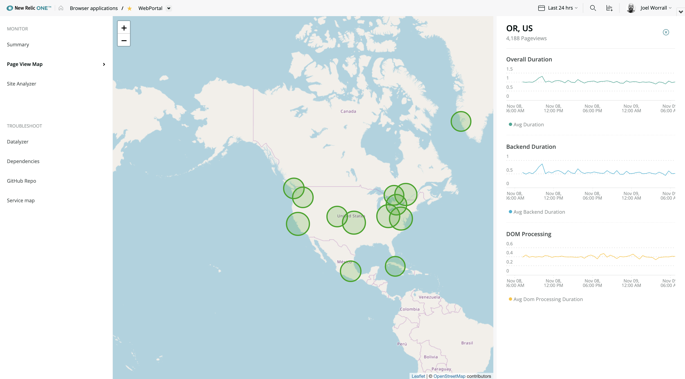

<Intro>

New Relic has powerful and flexible tools for building custom apps and populating them with data. This guide shows you how to build a custom app and populate it with page view data using New Relic's Query Language (NRQL - pronounced 'nurkle'). Then you make your data interactive. And last, if you have a little more time and want to install a third-party React library, you can display the page view data you collect on a map of the world.

In this guide, you build an app to display page view data in two ways:

- In a table
- On a map

Please review the **Before you begin** section to make sure you have everything you need and don't get stuck halfway through.



</Intro>

## Before you begin

In order to get the most out of this guide, you must have:

- A New Relic developer account, API key, and the command-line tool. If you don't have these yet, see the steps in [Setting up your development environment](/build-apps/set-up-dev-env)
- New Relic Browser page view data to populate the app. Without this data, you won't be able to complete this guide.
  <br />

To add your data to a world map in the second half of the guide:

- npm, which you'll use during this section of the guide to install [Leaflet](https://www.npmjs.com/package/leaflet), a third-party JavaScript React library used to build interactive maps. If you're new to React and npm, you can go here to [install Node.js and npm](https://nodejs.org/en/download/).

## New Relic terminology

The following are some terms used in this guide:

- New Relic application: The finished product where data is rendered in New Relic One. This might look like a series of interactive charts or a map of the world.
- Nerdpack: New Relic's standard collection of JavaScript, JSON, CSS, and other files that control the functionality and look of your application. For more information, see [Nerdpack file structure](/explore-docs/nerdpack-file-structure).
- Launcher: The button on New Relic One that launches your application.
- Nerdlets: New Relic React components used to build your application. The three default files are `index.js`, `nr1.json`, and `styles.scss`, but you can customize and add your own.

## Build a custom app with a table chart

<Steps>

<Step>

## Query your browser data

Use Query builder to write a NRQL query to see your page view data, as follows.

1. On New Relic One, select **Query your data** (in the top right corner). That puts you in **NRQL** mode. You'll use NRQL to test your query before dropping the data into your table.

2. Copy and paste this query into a clear query field, and then select **Run**. 
```sql
FROM PageView SELECT count(*), average(duration) WHERE appName = 'WebPortal' FACET countryCode, regionCode SINCE 1 week ago LIMIT 1000
```

If you have PageView data, this query shows a week of average page views broken down by country and limited to a thousand items. The table will be full width and use the "chart" class defined in the CSS.

If you don't have any results at this point, ensure your query doesn't have any errors. If your query is correct, you might not have the [Browser agent](https://docs.newrelic.com/docs/browser/new-relic-browser/installation/install-new-relic-browser-agent) installed.

</Step>

<Step>

## Create and serve a new Nerdpack

To get started, create a new Nerdpack, and serve it up to New Relic from your local development environment:

1. Create a new Nerdpack for this app:

```
nr1 create --type nerdpack --name pageviews-app
```

2. Serve the project up to New Relic:

```
cd pageviews-app && nr1 nerdpack:serve
```

</Step>

<Step>

## Review your app files and view your app locally

1. Navigate to your `pageviews-app` to see how it's structured. 
It contains a launcher folder, where you can customize the description and icon that will be displayed on the app's launcher in New Relic One. It also contains `nerdlets`, which each contain three default files: `index.js`, `nr1.json`, and `styles.scss`. You'll edit some of these files as part of this guide. For more information, see [Nerdpack file structure](/explore-docs/nerdpack-file-structure).

2. Now in your browser, open `https://one.newrelic.com/?nerdpacks=local`, and then click **Apps** to see the `pageview-apps` Nerdpack that you served up. 

When you select the launcher, you see a `Hello` message.

</Step>

<Step>

## Hard code your account ID

For the purposes of this exercise and for your convenience, hard code your account ID. In the `pageview-app-nerdlet` directory, in the `index.js` file, add this code between the `import` and `export` lines. ([Read about finding your account ID here](https://docs.newrelic.com/docs/accounts/install-new-relic/account-setup/account-id)).

```jsx
const accountId = [Replace with your account ID];
```

</Step>

<Step>

### Import the `TableChart` component

To show your data in a table chart, import the [`TableChart` component](/client-side-sdk/index.html#charts/TableChart) from New Relic One. To do so, in `index.js`, add this code under `import React`.

```jsx
import { TableChart } from 'nr1';
```

</Step>

<Step>

### Add a table with a single row

To add a table with a single row, in the `index.js` file, replace this line:

```jsx
return <h1>Hello, pageview-app-nerdlet Nerdlet!</h1>;
```

with this `export` code:

```jsx
export default class PageViewApp extends React.Component {
  render() {
    return (
      <div className="container">
        <div className="row"></div>
      </div>
    );
  }
}
```

</Step>

<Step>

### Customize the look of your table (optional)

You can use standard CSS to customize the look of your components.

In the `styles.scss` file, add this CSS.
Feel free to customize this CSS to your taste.

```css
.container {
  width: 100%;
  height: 99vh;
  display: flex;
  flex-direction: column;
  .row {
    margin: 10px;
    display: flex;
    flex-direction: row;
  }
  .chart {
    height: 250px;
  }
}
```

</Step>

<Step>

### Get your data into that table

Now that you've got a table, you can drop a `TableChart` populated with data from the NRQL query you wrote at the very beginning of this guide.

Put this code into the `row` div.

```jsx
<TableChart
  accountId={accountId}
  query={`FROM PageView SELECT count(*), average(duration) WHERE appName = 'WebPortal' SINCE 1 week ago LIMIT 1000`}
  fullWidth
  className="chart"
/>
```

Go to New Relic One and click your app to see your data in the table. (You might need to serve your app to New Relic again.)

Congratulations! You made your app! Continue on to make it interactive and show your data on a map.

</Step>

</Steps>

## Make your app interactive with a text field

Once you confirm that data is getting to New Relic from your app, you can start customizing it and making it interactive. To do this, you add a text field to filter your data. Later, you use a third-party library called `Leaflet` to show that data on a world map.

<Steps>

<Step>

### Import the `TextField` component

Like you did with the `TableChart` component, you need to import a [`TextField` component](/client-side-sdk/index.html#components/TextField) from New Relic One.

```jsx
import { TextField } from 'nr1';
```

</Step>

<Step>

### Add a row for your text field

To add a text field filter above the table, put this code above the `TableChart` div.
The text field will have a default value of "US".

```jsx
<div className="row">
  <TextField
    placeholder="US"
    onChange={(event) => {
      this.setState({ countryCode: event.target.value });
    }}
  />
</div>
```

</Step>

<Step>

### Build the text field object

Above the `render()` function, add a `constructor` to build the text field object.

```jsx
constructor(props) {
  super(props);
  this.state = {
    countryCode: null
  }
}
```

Then, add a `constructor` to your `render()` function. Above `return`, add:

```jsx
const { countryCode } = this.state;
```

Now add `countryCode` to your table chart query.

```jsx
<TableChart
  accountId={accountId}
  query={`FROM PageView SELECT count(*), average(duration) WHERE appName = 'WebPortal' ${
    countryCode ? ` WHERE countryCode like '%${countryCode}%' ` : ''
  } FACET countryCode, regionCode SINCE 1 week ago LIMIT 1000`}
  fullWidth
  className="chart"
/>
```

Reload your app to try out the text field.

</Step>

</Steps>

## Get your data on a map

To create the map, you use npm to install `Leaflet`.

<Steps>

<Step>

### Install `Leaflet`

In your terminal, type:

```
npm install --save leaflet react-leaflet
```

In your nerdlets `styles.scss` file, import the `Leaflet` CSS:

```css
@import `~leaflet/dist/leaflet.css`;
```

While you're in `styles.scss`, fix the width and height of your map:

```css
.containerMap {
  width: 100%;
  z-index: 0;
  height: 70vh;
}
```

</Step>

<Step>

### Add a webpack config file for `Leaflet`

Add a webpack configuration file `.extended-webpackrc.js` to the top-level folder in your nerdpack. This supports your use of map tiling information data from `Leaflet`.

```jsx
module.exports = {
  module: {
    rules: [
      {
        test: /\.(png|jpe?g|gif)$/,
        use: [
          {
            loader: 'file-loader',
            options: {},
          },
          {
            loader: 'url-loader',
            options: { limit: 25000 },
          },
        ],
      },
    ],
  },
};
```

</Step>

<Step>

### Import modules from `Leaflet`

In `index.js`, import modules from `Leaflet`.

```jsx
import { Map, CircleMarker, TileLayer } from 'react-leaflet';
```

</Step>

<Step>

### Import additional modules from New Relic One

You need several more modules from New Relic One to make the `Leaflet` map work well. Import them with this code:

```jsx
import { NerdGraphQuery, Spinner, Button, BlockText } from 'nr1';
```

`NerdGraphQuery` lets you make multiple NRQL queries at once and is what will populate the map with data. `Spinner` adds a loading spinner. `Button` gives you button components. `BlockText` give you block text components.

</Step>

<Step>

### Get data for the map

Using latitude and longitude with country codes, you can put New Relic data on a map.

```jsx
mapData() {
  const { countryCode } = this.state;
  const query = `{
    actor {
      account(id: 1606862) {
        mapData: nrql(query: "SELECT count(*) as x, average(duration) as y, sum(asnLatitude)/count(*) as lat, sum(asnLongitude)/count(*) as lng FROM PageView FACET regionCode, countryCode WHERE appName = 'WebPortal' ${countryCode ? ` WHERE countryCode like '%${countryCode}%' ` : ''} LIMIT 1000 ") {
          results
          nrql
        }
      }
    }
  }`;
  return query;
};
```

</Step>

<Step>

### Customize the map marker colors

Above the `mapData` function, add this code to customize the map marker colors.

```jsx
getMarkerColor(measure, apdexTarget = 1.7) {
  if (measure <= apdexTarget) {
    return '#11A600';
  } else if (measure >= apdexTarget && measure <= apdexTarget * 4) {
    return '#FFD966';
  } else {
    return '#BF0016';
  }
};
```

Feel free to change the HTML color code values to your taste. In this example, `#11A600` is green, `#FFD966` is sort of yellow, and `#BF0016` is red.

</Step>

<Step>

### Set your map's default center point

Set a default center point for your map using latitude and longitude.

```jsx
const defaultMapCenter = [10.5731, -7.5898];
```

</Step>

<Step>

### Add a row for your map

Between the text field row and the table chart row, insert a new row for the map content using `NerdGraphQuery`.

```jsx
<div className="row">
  <NerdGraphQuery query={this.mapData()}>
    {({ loading, error, data }) => {
      if (loading) {
        return <Spinner fillContainer />;
      }
      if (error) {
        return 'Error';
      }
      const { results } = data.actor.account.mapData;
      console.debug(results);
      return 'Hello';
    }}
  </NerdGraphQuery>
</div>
```

Reload your application in New Relic One to test that it works.

</Step>

<Step>

### Replace "Hello" with the Leaflet code

Replace `return "Hello";` with:

```jsx
return (
  <Map className="containerMap" center={defaultMapCenter} zoom={2} zoomControl>
    <TileLayer
      attribution='&amp;copy <a href="http://osm.org/copyright">OpenStreetMap</a> contributors'
      url="https://{s}.tile.openstreetmap.org/{z}/{x}/{y}.png"
    />
    {results.map((pt, i) => {
      const center = [pt.lat, pt.lng];
      return (
        <CircleMarker
          key={`circle-${i}`}
          center={center}
          color={this.getMarkerColor(pt.y)}
          radius={Math.log(pt.x) * 3}
          onClick={() => {
            alert(JSON.stringify(pt));
          }}
        />
      );
    })}
  </Map>
);
```

</Step>

This code creates a world map centered on the latitude and longitude you chose using `OpenStreetMap` data and your marker colors.

Reload your app to see the pageview data on the map!

</Steps>
