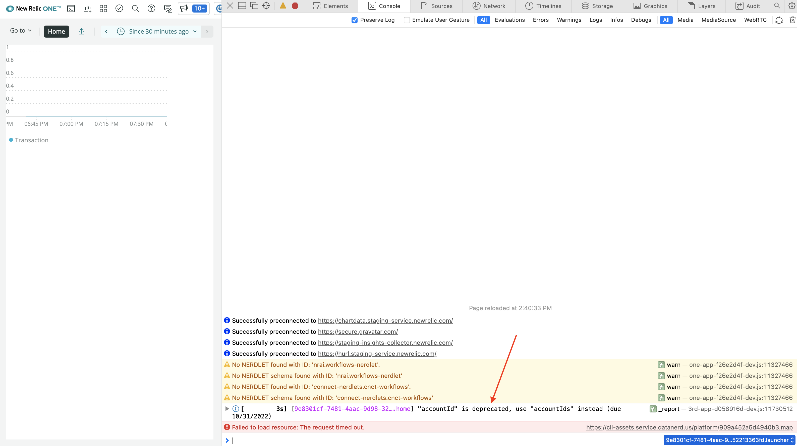
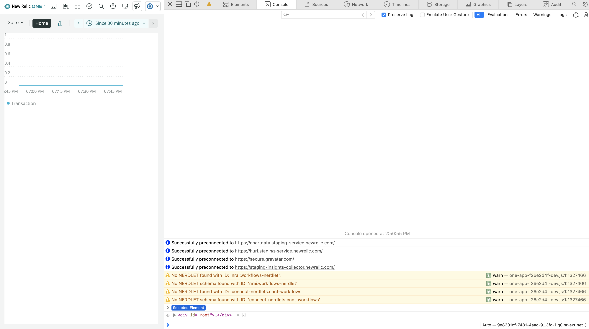

We frequently update the New Relic One SDK. These updates include new features, improvements to existing features, and the deprecation, or removal, of existing features. When we remove a feature, you, as a developer of New Relic Nerdpacks, need to know because if you don't update your code, it will eventually stop working.

In this guide, you learn:

- How to know if and when you'll be affected by deprecations
- How to see the code you need to change
- Where to go for help if you need it

## Know when we're deprecating features

When we deprecate features in the New Relic One SDK, we notify you on a predictable schedule so you know what changes will affect your Nerdpack well before they actually do.

Here's how and when we notify you:

- Six months before we deprecate a feature or functionality, you see a console **log**
- Four months before we deprecate a feature or functionality, you see a console **warning**
- Two months before we deprecate a feature or functionality, you see a console **error**
- One month before we deprecate a feature or functionality, you see a console **error**

Once you see a notification that we're deprecating a feature that your Nerdpack uses, you need to test your code in a local environment to see specific instructions on how to deal with the changes.

## Identify and address deprecations

When you hear that we're deprecating a feature your Nerdpack uses, you need to identify what feature is impacted and update the relevant code so your app or custom visualization continues to work as you expect.

<Steps>

<Step>

If you already have a local copy of your Nerdpack's repository, make sure you have the latest code.

<>

```bash
cd <PATH_TO_YOUR_REPOSITORY>
git pull
```

<Callout variant="important">

Make sure you replace `<PATH_TO_YOUR_REPOSITORY>` with the real path.

</Callout>

</>

If not, clone your repository.

<>

```bash
git clone <YOUR_REPO_URL>
```

<Callout variant="important">

Make sure you replace `<YOUR_REPO_URL>` with your reposority's actual url.

</Callout>

</>

</Step>

<Step>

If you already have the New Relic One CLI, make sure you have the latest version.

<>

```bash
nr1 update
```

</>

Otherwise, [install it](https://one.newrelic.com/launcher/developer-center.launcher?pane=eyJuZXJkbGV0SWQiOiJkZXZlbG9wZXItY2VudGVyLmhvbWUifQ==) so you can test your Nerdpack locally.

</Step>

<Step>

Serve your Nerdpack locally:

<>

```bash
nr1 nerdpack:serve
```

</>

</Step>

<Step>

Navigate to your app launcher or custom visualization from the short url at the bottom of your `serve` output:

<>

```bash
[output] {purple}Launchers:
[output]  ⁎  {green}launcher {blue}https://onenr.io/0A1bcDEfgHi
```

</>

</Step>

<Step>

Open your browser's developer console and check for deprecation logs, warnings, and errors:



This message tells you not only the code that's affected by the deprecation, but also the due date for updating it.

</Step>

<Step>

Update your code:

<>

```js lineHighlight=3
return <NrqlQuery
	pollInterval={NrqlQuery.AUTO_POLL_INTERVAL}
	accountIds={[12345678]}
	query="SELECT count(*) FROM Transaction TIMESERIES"
>
	{({ data }) => {
	return <LineChart data={data} />;
	}}
</NrqlQuery>;
```

</>

In this example, the `accountId` property for `NrqlQuery` is changing to `accountIds`. For your actual Nerdpack, the deprecation message will tell you what you need to change.

While still serving your application, your Nerdpack updates automatically in the browser when you save your file.

</Step>

<Step>

Check your console again:



When you fix your code, your console no longer logs a deprecation message.

</Step>

<Step>

Commit your code and push it to your remote repository:

<>

```bash
git commit -am "fix: deprecated code"
git push origin
```

</>

</Step>

<Step>

[Publish your updated Nerdpack](/build-apps/publish-deploy/publish/) to the New Relic app catalog.

</Step>

</Steps>

We strive to write clear messages so you know when and how you need to change your code to address deprecated features. However, it may still be valuable for you to reach out to our community channels if you need further assistance.

## Get help from the New Relic community

Our global support team doesn't officially support Nerdpacks. That said, if you still need help, or want to report an unclear deprecation message, you can:

- Post in the [Explorers Hub](https://discuss.newrelic.com)
- Post in [GitHub Discussions](https://github.com/newrelic/opensource-website/discussions/897)
- Ask your New Relic account manager or technical support engineer for help, if you have one

Once you've cleared all the deprecation messages from your Nerdpack and you've published it to the catalog, you can rest easy, knowing your code won't be impacted by this round of deprecations.