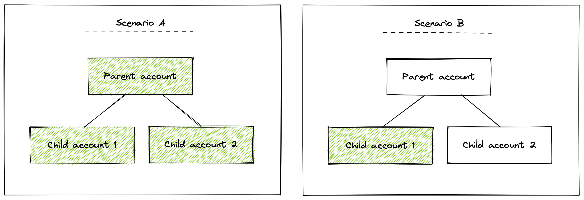

<Intro>

Understand the requirements for managing and using Nerdpacks in New Relic One.

</Intro>

## Capabilities at a glance

Your ability to manage and use Nerdpacks is affected by your New Relic user's:

- User model (original or New Relic One model)
- User type
- Assigned roles

Whether you're on the [original user model](https://docs.newrelic.com/docs/accounts/original-accounts-billing/original-users-roles/users-roles-original-user-model/) or the [New Relic One user model](https://docs.newrelic.com/docs/accounts/accounts-billing/new-relic-one-user-management/new-relic-one-user-model-understand-user-structure/), review the tables below for a summary of your Nerdpack capabilities.

### Original user model

If you're on our [original user model](https://docs.newrelic.com/docs/accounts/original-accounts-billing/original-users-roles/overview-user-models), here's how you can interact with Nerdpacks:

| | Basic user | Core or full platform user without Nerdpack Manager add-on role | Core or full platform user with Nerdpack Manager add-on role | Owner/Admin user |
|:--|:-:|:-:|:-:|:-:|
| Serve Nerdpacks | yes | yes | yes | yes |
| Publish Nerdpacks | no | no | yes | yes |
| Subscribe to Nerdpacks | no | no | yes | yes |
| Tag Nerdpacks | no | no | yes | yes |
| Use Nerdlets or visualizations created by your accounts | no | yes | yes | yes |
| Use Nerdlets created by New Relic | no* | yes | yes | yes |
| Use visualizations created by New Relic | no | yes | yes | yes |

_* There are a few Nerdlets that basic users are allowed to use. See [Basic users](#basic-users) for more information._

### New Relic One user model

If you're on our [New Relic One user model](https://docs.newrelic.com/docs/accounts/original-accounts-billing/original-users-roles/overview-user-models), here's how you can interact with Nerdpacks:

| | Basic user | Core or full platform user |
|---|---|---|
| Serve Nerdpacks | yes | yes |
| Publish Nerdpacks | no | yes |
| Subscribe to Nerdpacks | no | yes |
| Tag Nerdpacks | no | yes |
| Use Nerdlets or visualizations created by your accounts | no | yes |
| Use Nerdlets created by New Relic | no* | yes |
| Use visualizations created by New Relic | no | yes |

_* There are a few Nerdlets that basic users are allowed to use. See [Basic users](#basic-users-1) for more information._

## Nerdpack permissions: Original user model

Learn the differences between how basic users, full users, core users, and admins on our [original user model](https://docs.newrelic.com/docs/accounts/original-accounts-billing/original-users-roles/users-roles-original-user-model/) can use and manage Nerdpacks.

### Basic users

If you're a basic user on our original user model, you're limited in your Nerdpack capabilities. You can only create and serve Nerdpacks locally. To publish, tag, subscribe to, and use your Nerdpacks, an admin must upgrade you to a full user.

<Callout variant="tip">

If you're a basic user, you generally can't use any Nerdpacks. However, there are some Nerdlets that New Relic maintains that you can use. These are rare and there is currently no way for you to distinguish them in our web interface. And even if you can use a Nerdlet in a Nerdpack, you're never able to use custom visualizations. For this, you must be upgraded to a core or full platform user.

</Callout>

### Core users and full platform users

If you're a core or full platform user on our original user model, you either have the **Nerdpack Manager** add-on role, or you don't.

The **Nerdpack Manager** role is required to publish, subscribe to, and tag Nerdpacks. So if you don't have the **Nerdpack Manager** role, you can only create and serve Nerdpacks locally and use Nerdpacks that your accounts have already been subscribed to.

To publish, tag, or subscribe to a Nerdpack, an admin must upgrade you to a core user or full platform user or grant you the **Nerdpack Manager** add-on role.

### Owner/Admin users

If you're an owner or admin user, you can perform any of the Nerdpack capabilities. You can create, serve, publish, tag, subscribe to, and use any and all Nerdpack items, both Nerdlets and visualizations. This includes Nerdpacks built by New Relic or by one of your accounts.

## Nerdpack permissions: New Relic One user model

Learn the differences between how basic users, full platform users, and core users on our [New Relic One user model](https://docs.newrelic.com/docs/accounts/original-accounts-billing/original-users-roles/overview-user-models) can use and manage Nerdpacks.

### Basic users

If you're a basic user on our New Relic One user model, you're limited in your Nerdpack capabilities. You can only create and serve Nerdpacks locally. To publish, tag, subscribe to, and use your Nerdpacks, an admin must upgrade you to a full platform user or core user.

<Callout variant="tip">

If you're a basic user, you generally can't use any Nerdpacks. However, there are some Nerdlets that New Relic maintains that you can use. These are rare and there is currently no way for you to distinguish them in our web interface. And even if you can use a Nerdlet in a Nerdpack, you're never able to use custom visualizations. For this, you must be upgraded to a full platform user or a core user.

</Callout>

### Core users and full platform users

If you're a core user or a full platform user on the New Relic One user model, you either have the **Nerdpacks "modify"** privilege, or you don't.

The **Nerdpacks "modify"** privilege is required to publish, subscribe to, and tag Nerdpacks. So if you don't have the **Nerdpacks "modify"** privilege, you can only create and serve Nerdpacks locally and use Nerdpacks that your accounts have already been subscribed to.

To publish, tag, or subscribe to your Nerdpack, an admin must grant you the **Nerdpacks "modify"** capability.

<Callout variant="tip">

The **Nerdpacks "modify"** capability is included in both the **User** and **Admin** groups, the only groups available by default. So in most cases, you'll have the ability to manage Nerdpacks as a full platform user or a core user. However, if you're a full platform user or a core user assigned to a custom group that doesn't include the **Nerdpacks "modify"** privilege, you won't be able to manage Nerdpacks.

</Callout>

## Parent/child account capabilities

Some New Relic organizations have [parent/child account structures](https://docs.newrelic.com/docs/accounts/original-accounts-billing/original-users-roles/parent-child-account-structure). For these organizations, child accounts report data back up to their parent accounts. This organizational hierarchy affects Nerdpack capabilities.

In general, the flow of control moves downstream:

In this example scenario **A**, the master account publishes a Nerdpack. This means that all three accounts, **Master**, **Account 1**, and **Account 2**, can subscribe to it. If you subscribe the master account to the Nerdpack, then users of all three accounts can use it. If you subscribe **Account 1** to it, only **Account 1** users can use it, because neither **Master** nor **Account 2** is downstream in the hierarchy.

In scenario **B**, the child account, **Account 1**, publishes a Nerdpack, so you can't use or subscribe to the Nerdpack from **Master** or **Account 2**.
